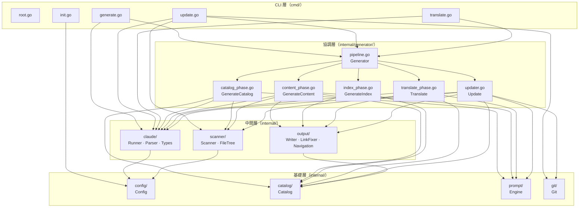
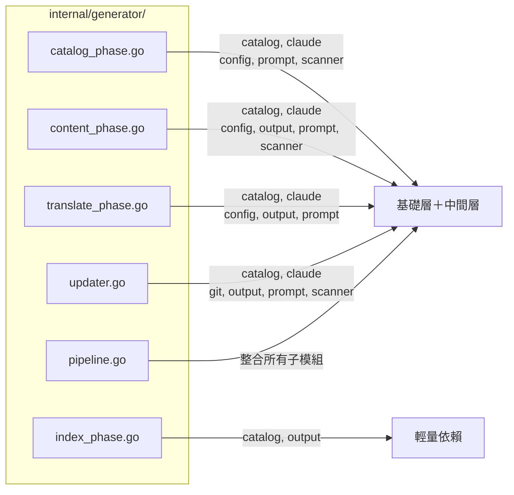
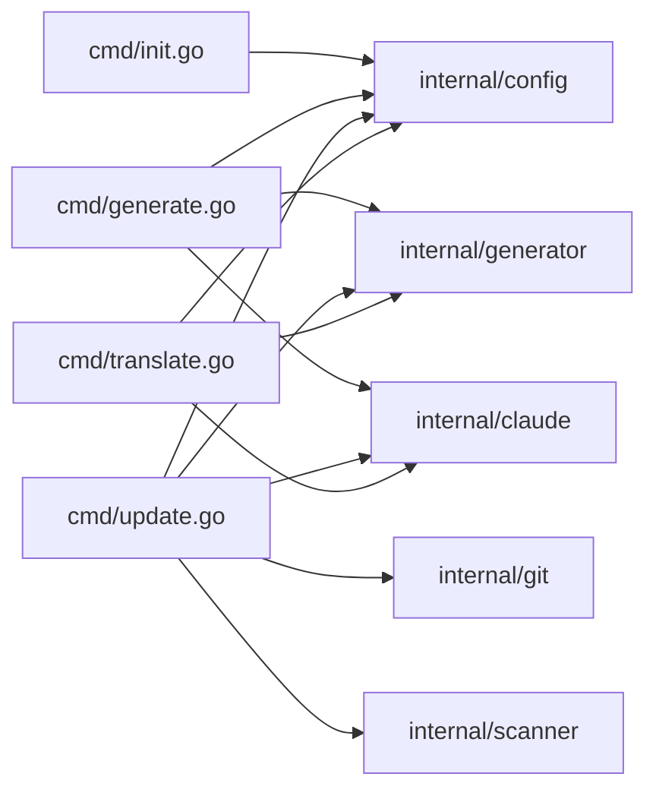
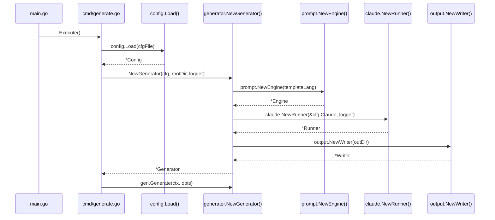

# 模組依賴關係

selfmd 採用清晰的分層架構，各模組間的依賴關係呈現單向流動，從基礎層向上至協調層與 CLI 層，避免循環依賴。

## 概述

selfmd 的模組依賴關係可分為四個明確的層次：

1. **基礎層**（Foundation）：不依賴任何專案內部套件，僅使用標準函式庫或第三方套件
2. **中間層**（Middleware）：僅依賴基礎層模組
3. **協調層**（Orchestration）：`generator` 套件，依賴所有中間層與基礎層模組，負責整合各階段
4. **CLI 層**（Entry Points）：`cmd` 套件，依賴協調層與部分基礎層模組，提供使用者介面

此設計確保模組間**無循環依賴**，低層模組對高層模組一無所知，測試與替換各模組的成本極低。

### 關鍵術語

| 術語 | 說明 |
|------|------|
| 基礎層 | 零內部依賴的純函式套件 |
| 協調層 | 整合多個模組、執行完整工作流程的套件 |
| 依賴注入 | `Generator` struct 在建構時接收 `Runner`、`Engine`、`Writer` 實體 |

---

## 架構

### 整體依賴層次圖



> 來源：`cmd/generate.go#L1-L14`、`cmd/update.go#L1-L18`、`internal/generator/pipeline.go#L1-L16`

---

## 各層詳細說明

### 基礎層（Foundation Layer）

基礎層模組彼此獨立，不相互依賴，可單獨測試與使用。

#### `internal/config`

**職責**：讀取、驗證、序列化 `selfmd.yaml` 設定檔，並提供 `DefaultConfig()`。

- **內部依賴**：無
- **外部依賴**：`gopkg.in/yaml.v3`
- **被依賴於**：`claude`、`scanner`、`generator`（所有階段）、`cmd`

```go
type Config struct {
    Project ProjectConfig `yaml:"project"`
    Targets TargetsConfig `yaml:"targets"`
    Output  OutputConfig  `yaml:"output"`
    Claude  ClaudeConfig  `yaml:"claude"`
    Git     GitConfig     `yaml:"git"`
}
```

> 來源：`internal/config/config.go#L11-L17`

#### `internal/catalog`

**職責**：定義文件目錄的資料模型（`Catalog`、`CatalogItem`、`FlatItem`），並提供 JSON 序列化與扁平化方法。

- **內部依賴**：無
- **外部依賴**：標準函式庫（`encoding/json`）
- **被依賴於**：`output`、`generator`（所有階段）

```go
type Catalog struct {
    Items []CatalogItem `json:"items"`
}

type FlatItem struct {
    Title       string
    Path        string // dot-notation, e.g., "core-modules.authentication"
    DirPath     string // filesystem path, e.g., "core-modules/authentication"
    Depth       int
    ParentPath  string
    HasChildren bool
}
```

> 來源：`internal/catalog/catalog.go#L10-L31`

#### `internal/prompt`

**職責**：管理 Prompt 模板（`templates/zh-TW/*.tmpl`、`templates/en-US/*.tmpl`），提供各階段所需的渲染方法。

- **內部依賴**：無
- **外部依賴**：標準函式庫（`text/template`、`embed`）
- **被依賴於**：`generator`（所有使用 Claude 的階段）

```go
type Engine struct {
    templates       *template.Template // 語言專屬模板
    sharedTemplates *template.Template // 共用模板（translate.tmpl）
}
```

> 來源：`internal/prompt/engine.go#L13-L17`

#### `internal/git`

**職責**：封裝 Git CLI 操作（取得 commit、diff、過濾變更檔案），不解析業務邏輯。

- **內部依賴**：無
- **外部依賴**：`github.com/bmatcuk/doublestar/v4`、標準函式庫（`os/exec`）
- **被依賴於**：`generator/updater`、`generator/pipeline`、`cmd/update`

```go
type ChangedFile struct {
    Status string // "M", "A", "D", "R"
    Path   string
}
```

> 來源：`internal/git/git.go#L47-L51`

---

### 中間層（Middleware Layer）

中間層模組依賴基礎層，但彼此之間**不互相依賴**。

#### `internal/claude`

**職責**：封裝 Claude CLI 子行程的呼叫（`Runner`），解析 JSON 輸出（`Parser`），並定義資料型別（`Types`）。

- **內部依賴**：`internal/config`（讀取 `ClaudeConfig`）
- **外部依賴**：標準函式庫（`os/exec`、`encoding/json`、`regexp`）

```go
type Runner struct {
    config *config.ClaudeConfig
    logger *slog.Logger
}
```

> 來源：`internal/claude/runner.go#L16-L19`

`claude` 套件包含三個檔案，各有明確分工：

| 檔案 | 職責 |
|------|------|
| `runner.go` | 執行 `claude` CLI 子行程，支援重試 |
| `parser.go` | 解析 JSON 回應、擷取 `<document>` 標籤、擷取 JSON 區塊 |
| `types.go` | 定義 `RunOptions`、`RunResult`、`CLIResponse` |

#### `internal/scanner`

**職責**：掃描專案目錄，依據 `Config.Targets` 過濾檔案，建構 `FileNode` 樹狀結構，讀取 README 與入口檔案。

- **內部依賴**：`internal/config`（存取 `Targets.Include` / `Targets.Exclude`）
- **外部依賴**：`github.com/bmatcuk/doublestar/v4`

```go
type ScanResult struct {
    RootDir            string
    Tree               *FileNode
    FileList           []string
    TotalFiles         int
    TotalDirs          int
    ReadmeContent      string
    EntryPointContents map[string]string
}
```

> 來源：`internal/scanner/filetree.go#L18-L27`

#### `internal/output`

**職責**：將文件寫入磁碟（`Writer`），修復相對路徑連結（`LinkFixer`），產生導航頁面（`navigation.go`），以及靜態瀏覽器（`viewer.go`）。

- **內部依賴**：`internal/catalog`（存取 `FlatItem`、`Catalog`）
- **外部依賴**：標準函式庫（`os`、`path/filepath`、`regexp`）

```go
type Writer struct {
    BaseDir string // absolute path to .doc-build/
}

type LinkFixer struct {
    allItems  []catalog.FlatItem
    dirPaths  map[string]bool
    pathIndex map[string]string
}
```

> 來源：`internal/output/writer.go#L26-L28`、`internal/output/linkfixer.go#L12-L16`

---

### 協調層（Orchestration Layer）

`internal/generator` 是整個系統的核心協調層，負責將所有中間層與基礎層模組整合為完整的工作流程。

#### `Generator` struct 與依賴注入

```go
type Generator struct {
    Config  *config.Config
    Runner  *claude.Runner
    Engine  *prompt.Engine
    Writer  *output.Writer
    Logger  *slog.Logger
    RootDir string

    TotalCost   float64
    TotalPages  int
    FailedPages int
}
```

> 來源：`internal/generator/pipeline.go#L19-L31`

`NewGenerator` 建構時統一初始化所有依賴：

```go
func NewGenerator(cfg *config.Config, rootDir string, logger *slog.Logger) (*Generator, error) {
    templateLang := cfg.Output.GetEffectiveTemplateLang()
    engine, err := prompt.NewEngine(templateLang)
    // ...
    runner := claude.NewRunner(&cfg.Claude, logger)
    writer := output.NewWriter(absOutDir)
    return &Generator{
        Config:  cfg,
        Runner:  runner,
        Engine:  engine,
        Writer:  writer,
        Logger:  logger,
        RootDir: rootDir,
    }, nil
}
```

> 來源：`internal/generator/pipeline.go#L34-L58`

#### generator 各子檔案的依賴範圍



---

### CLI 層（Entry Points Layer）

`cmd` 套件的各指令直接依賴協調層，並視需求直接呼叫部分中間層（如 `claude.CheckAvailable()`）。



> 來源：`cmd/generate.go#L1-L14`、`cmd/update.go#L1-L18`、`cmd/translate.go#L1-L17`

---

## 依賴矩陣

下表列出各模組所依賴的其他**內部**模組（✓ 表示直接依賴）：

| 模組 | config | catalog | prompt | git | scanner | claude | output | generator |
|------|:------:|:-------:|:------:|:---:|:-------:|:------:|:------:|:---------:|
| `config` | — | | | | | | | |
| `catalog` | | — | | | | | | |
| `prompt` | | | — | | | | | |
| `git` | | | | — | | | | |
| `scanner` | ✓ | | | | — | | | |
| `claude` | ✓ | | | | | — | | |
| `output` | | ✓ | | | | | — | |
| `generator` | ✓ | ✓ | ✓ | ✓ | ✓ | ✓ | ✓ | — |
| `cmd` | ✓ | | | ✓ | ✓ | ✓ | | ✓ |

---

## 核心流程：依賴初始化順序



---

## 外部依賴彙整

selfmd 使用以下第三方套件：

| 套件 | 版本 | 使用模組 | 用途 |
|------|------|---------|------|
| `github.com/spf13/cobra` | — | `cmd/` | CLI 指令框架 |
| `gopkg.in/yaml.v3` | — | `internal/config` | YAML 設定檔解析 |
| `github.com/bmatcuk/doublestar/v4` | — | `internal/scanner`, `internal/git` | Glob 模式匹配（`**` 雙星號） |
| `golang.org/x/sync/errgroup` | — | `internal/generator` | 並行任務錯誤群組管理 |

---

## 相關連結

- [整體流程與四階段管線](../pipeline/index.md) — 各模組如何在四階段中協作
- [文件產生管線](../../core-modules/generator/index.md) — Generator 協調層的詳細說明
- [專案掃描器](../../core-modules/scanner/index.md) — `internal/scanner` 模組說明
- [Claude CLI 執行器](../../core-modules/claude-runner/index.md) — `internal/claude` 模組說明
- [Prompt 模板引擎](../../core-modules/prompt-engine/index.md) — `internal/prompt` 模組說明
- [輸出寫入與連結修復](../../core-modules/output-writer/index.md) — `internal/output` 模組說明
- [設定說明](../../configuration/index.md) — `selfmd.yaml` 設定結構總覽

---

## 參考檔案

| 檔案路徑 | 說明 |
|----------|------|
| `cmd/root.go` | CLI 根指令，全域 flag 定義 |
| `cmd/generate.go` | `selfmd generate` 指令實作，依賴 `generator`、`claude`、`config` |
| `cmd/init.go` | `selfmd init` 指令實作，依賴 `config` |
| `cmd/update.go` | `selfmd update` 指令實作，依賴 `generator`、`git`、`scanner`、`claude`、`config` |
| `cmd/translate.go` | `selfmd translate` 指令實作，依賴 `generator`、`claude`、`config` |
| `internal/config/config.go` | `Config` 結構定義、預設值、載入與驗證邏輯 |
| `internal/catalog/catalog.go` | `Catalog`、`CatalogItem`、`FlatItem` 資料模型與操作方法 |
| `internal/prompt/engine.go` | `Engine` 模板引擎，`CatalogPromptData`、`ContentPromptData` 等資料型別 |
| `internal/git/git.go` | Git CLI 封裝：取得 commit、diff、過濾檔案 |
| `internal/scanner/scanner.go` | 目錄遍歷與 glob 過濾邏輯 |
| `internal/scanner/filetree.go` | `ScanResult`、`FileNode` 定義與樹狀渲染 |
| `internal/claude/runner.go` | `Runner` struct，執行 Claude CLI 子行程與重試邏輯 |
| `internal/claude/parser.go` | JSON 解析、`<document>` 標籤擷取、樣板清理 |
| `internal/claude/types.go` | `RunOptions`、`RunResult`、`CLIResponse` 型別定義 |
| `internal/output/writer.go` | `Writer` 寫入文件頁面、目錄 JSON、commit 記錄 |
| `internal/output/linkfixer.go` | `LinkFixer` 修復 Markdown 相對路徑連結 |
| `internal/output/navigation.go` | 產生 `index.md`、`_sidebar.md`、分類索引頁 |
| `internal/generator/pipeline.go` | `Generator` struct 定義、`NewGenerator`、`Generate` 主流程 |
| `internal/generator/catalog_phase.go` | 第二階段：呼叫 Claude 產生目錄 |
| `internal/generator/content_phase.go` | 第三階段：並行產生內容頁面 |
| `internal/generator/index_phase.go` | 第四階段：產生索引與導航 |
| `internal/generator/translate_phase.go` | 翻譯流程：並行翻譯所有頁面至目標語言 |
| `internal/generator/updater.go` | 增量更新流程：比對 git diff 並選擇性重新產生 |