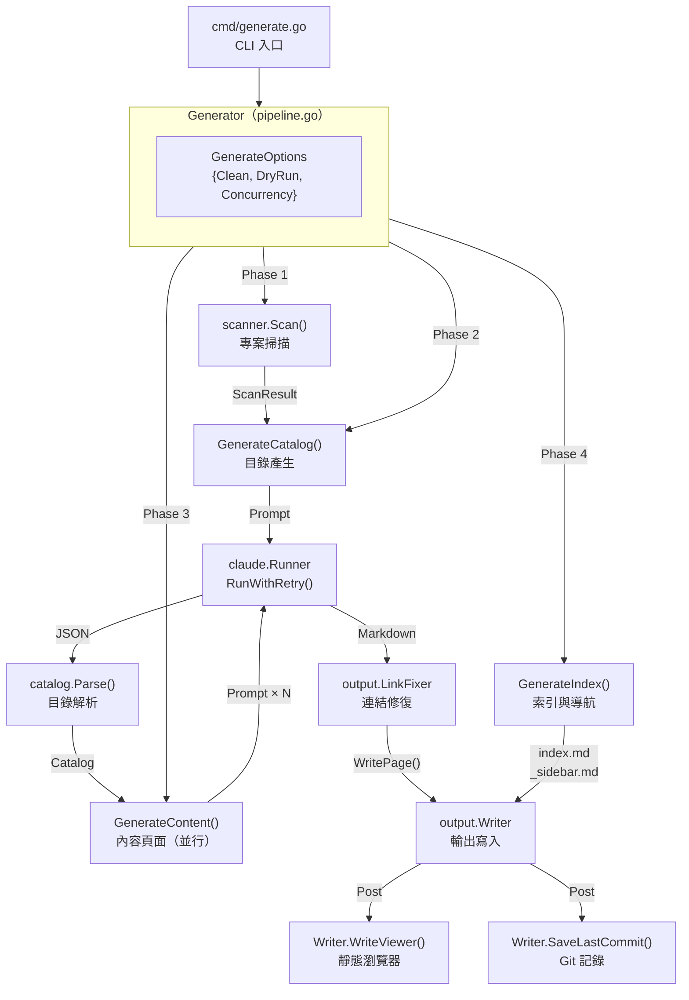
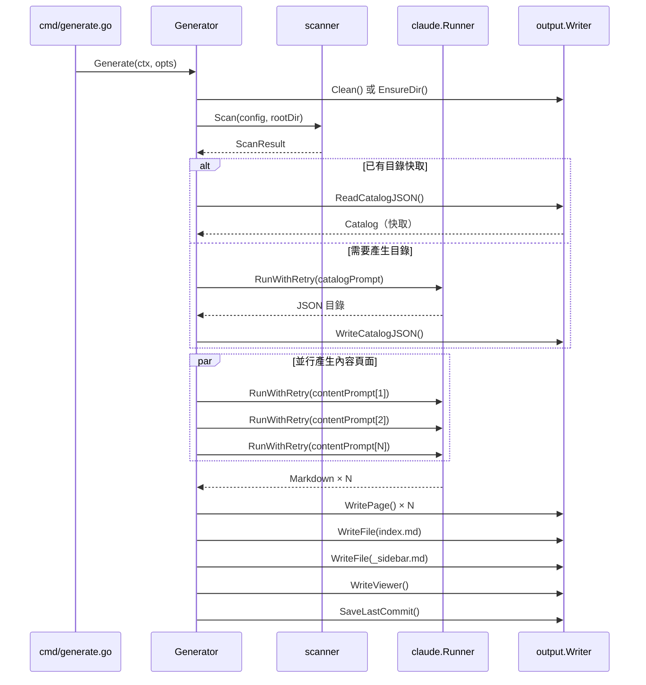
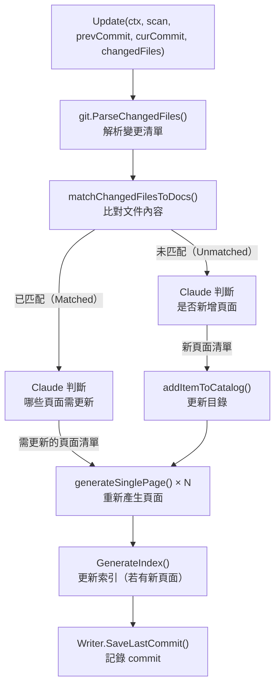

# 整體流程與四階段管線

`selfmd generate` 指令透過 `Generator` 協調器執行四個有序階段，將原始碼轉換為完整的 Markdown 文件站台。每個階段職責分明，互相串接，最終輸出可瀏覽的靜態文件。

## 概述

`Generator`（位於 `internal/generator/pipeline.go`）是整個系統的核心協調器。它持有所有子系統的參照——掃描器、Claude 執行器、Prompt 引擎、輸出寫入器——並按順序驅動以下四個階段：

| 階段 | 編號 | 職責 |
|------|------|------|
| 掃描（Scan） | 1/4 | 遍歷專案目錄，建立檔案樹 |
| 目錄產生（Catalog） | 2/4 | 呼叫 Claude 規劃文件架構 |
| 內容產生（Content） | 3/4 | 並行產生每一頁文件 |
| 索引與導航（Index） | 4/4 | 產生首頁、側欄、分類索引 |

執行完四個階段後，系統還會額外進行靜態瀏覽器產生與 Git commit 記錄存檔，作為後處理步驟。

## 架構



## Generator 結構

`Generator` 結構體集中管理所有子系統的生命週期，並累計執行統計資料：

```go
type Generator struct {
    Config  *config.Config
    Runner  *claude.Runner
    Engine  *prompt.Engine
    Writer  *output.Writer
    Logger  *slog.Logger
    RootDir string // 目標專案根目錄

    // 統計
    TotalCost   float64
    TotalPages  int
    FailedPages int
}
```

> 來源：internal/generator/pipeline.go#L19-L31

`NewGenerator` 初始化時會根據設定決定 Prompt 模板語言、建立 Claude Runner 與 Writer：

```go
func NewGenerator(cfg *config.Config, rootDir string, logger *slog.Logger) (*Generator, error) {
    templateLang := cfg.Output.GetEffectiveTemplateLang()
    engine, err := prompt.NewEngine(templateLang)
    if err != nil {
        return nil, err
    }

    runner := claude.NewRunner(&cfg.Claude, logger)

    absOutDir := cfg.Output.Dir
    if absOutDir == "" {
        absOutDir = ".doc-build"
    }

    writer := output.NewWriter(absOutDir)
    // ...
}
```

> 來源：internal/generator/pipeline.go#L34-L58

## 四個執行階段詳解

### 準備步驟（Phase 0）

在四個主要階段之前，系統先處理輸出目錄：若 `--clean` 旗標為真，則清除並重建輸出目錄；否則僅確保目錄存在。

```go
// Phase 0: Setup
clean := opts.Clean || g.Config.Output.CleanBeforeGenerate
if clean {
    fmt.Println("[0/4] 清除輸出目錄...")
    if !opts.DryRun {
        if err := g.Writer.Clean(); err != nil {
            return err
        }
    }
} else {
    if err := g.Writer.EnsureDir(); err != nil {
        return err
    }
}
```

> 來源：internal/generator/pipeline.go#L71-L84

---

### 階段一：掃描（Scan）

呼叫 `scanner.Scan()` 遍歷整個專案目錄。掃描器依照設定檔中的 include/exclude glob 規則過濾檔案，並讀取 README 與入口點檔案內容：

```go
// Phase 1: Scan
fmt.Println("[1/4] 掃描專案結構...")
scan, err := scanner.Scan(g.Config, g.RootDir)
if err != nil {
    return fmt.Errorf("掃描專案失敗: %w", err)
}
fmt.Printf("      找到 %d 個檔案，分布於 %d 個目錄\n", scan.TotalFiles, scan.TotalDirs)
```

> 來源：internal/generator/pipeline.go#L86-L93

掃描結果 `ScanResult` 包含：
- `Tree`：檔案樹結構（用於 Prompt 中的 `FileTree`）
- `FileList`：所有符合規則的檔案清單
- `ReadmeContent`：專案 README 內容
- `EntryPointContents`：設定的入口點檔案內容

若開啟 `--dry-run` 模式，系統在此階段後印出檔案樹並結束，不實際呼叫 Claude。

---

### 階段二：目錄產生（Catalog）

`GenerateCatalog()` 建構 Prompt，將檔案樹、README、入口點等資訊傳給 Claude，由 Claude 設計整份文件的架構：

```go
func (g *Generator) GenerateCatalog(ctx context.Context, scan *scanner.ScanResult) (*catalog.Catalog, error) {
    langName := config.GetLangNativeName(g.Config.Output.Language)
    data := prompt.CatalogPromptData{
        RepositoryName:       g.Config.Project.Name,
        ProjectType:          g.Config.Project.Type,
        Language:             g.Config.Output.Language,
        LanguageName:         langName,
        KeyFiles:             scan.KeyFiles(),
        EntryPoints:          scan.EntryPointsFormatted(),
        FileTree:             scanner.RenderTree(scan.Tree, 4),
        ReadmeContent:        scan.ReadmeContent,
    }

    rendered, err := g.Engine.RenderCatalog(data)
    // ...
    result, err := g.Runner.RunWithRetry(ctx, claude.RunOptions{
        Prompt:  rendered,
        WorkDir: g.RootDir,
    })
    // ...
    jsonStr, err := claude.ExtractJSONBlock(result.Content)
    return catalog.Parse(jsonStr)
}
```

> 來源：internal/generator/catalog_phase.go#L15-L61

**目錄快取機制**：若非全新產生（`--no-clean` 模式），系統會嘗試讀取 `.doc-build/_catalog.json`。若成功解析，則複用已存在的目錄，跳過 Claude 呼叫以節省費用：

```go
if !clean {
    catJSON, readErr := g.Writer.ReadCatalogJSON()
    if readErr == nil {
        cat, err = catalog.Parse(catJSON)
    }
    if cat != nil {
        // 載入已存目錄，跳過 Claude 呼叫
    }
}
```

> 來源：internal/generator/pipeline.go#L102-L113

---

### 階段三：內容頁面產生（Content）

`GenerateContent()` 對目錄中所有葉節點頁面發起並行的 Claude 呼叫。並行度由設定檔 `claude.max_concurrent` 或 `--concurrency` 旗標控制，透過 semaphore channel 限流：

```go
func (g *Generator) GenerateContent(ctx context.Context, scan *scanner.ScanResult, cat *catalog.Catalog, concurrency int, skipExisting bool) error {
    items := cat.Flatten()
    total := len(items)

    // 建立連結表與連結修復器，供所有頁面共用
    catalogTable := cat.BuildLinkTable()
    linkFixer := output.NewLinkFixer(cat)

    var done atomic.Int32
    var failed atomic.Int32
    var skipped atomic.Int32

    eg, ctx := errgroup.WithContext(ctx)
    sem := make(chan struct{}, concurrency)

    for _, item := range items {
        item := item
        eg.Go(func() error {
            if skipExisting && g.Writer.PageExists(item) {
                skipped.Add(1)
                // 跳過已存在的頁面
                return nil
            }
            sem <- struct{}{}
            defer func() { <-sem }()
            // 呼叫 generateSinglePage()
            err := g.generateSinglePage(ctx, scan, item, catalogTable, linkFixer, "")
            // ...
        })
    }
    return eg.Wait()
}
```

> 來源：internal/generator/content_phase.go#L21-L87

每頁的產生流程（`generateSinglePage`）包含：
1. 建構 `ContentPromptData`（含目錄路徑、頁面標題、連結表）
2. 呼叫 `Runner.RunWithRetry()` 取得 Claude 回應
3. 從 `<document>` 標籤擷取 Markdown 內容
4. 驗證內容有效性（必須以 `#` 開頭）
5. 呼叫 `linkFixer.FixLinks()` 修復相對連結
6. 呼叫 `Writer.WritePage()` 寫入檔案

若產生失敗，系統寫入佔位頁面（placeholder），但不中止其他頁面的產生。

---

### 階段四：索引與導航產生（Index）

`GenerateIndex()` 不呼叫 Claude，而是根據目錄結構直接產生三種導航檔案：

```go
func (g *Generator) GenerateIndex(_ context.Context, cat *catalog.Catalog) error {
    lang := g.Config.Output.Language

    // 產生主首頁
    indexContent := output.GenerateIndex(g.Config.Project.Name, g.Config.Project.Description, cat, lang)
    if err := g.Writer.WriteFile("index.md", indexContent); err != nil {
        return err
    }

    // 產生側欄
    sidebarContent := output.GenerateSidebar(g.Config.Project.Name, cat, lang)
    if err := g.Writer.WriteFile("_sidebar.md", sidebarContent); err != nil {
        return err
    }

    // 為有子項目的節點產生分類索引
    items := cat.Flatten()
    for _, item := range items {
        if !item.HasChildren {
            continue
        }
        // ...產生分類首頁
    }
    return nil
}
```

> 來源：internal/generator/index_phase.go#L11-L55

產生的檔案：
- `index.md`：文件站台首頁
- `_sidebar.md`：側邊欄導航
- `{分類}/index.md`：每個有子頁面的分類首頁

---

### 後處理步驟

完成四個階段後，`Generate()` 額外執行兩項後處理：

```go
// 產生靜態瀏覽器（HTML/JS/CSS + _data.js bundle）
docMeta := g.buildDocMeta()
if err := g.Writer.WriteViewer(g.Config.Project.Name, docMeta); err != nil {
    // 失敗不中止流程
}

// 若為 Git 儲存庫，儲存當前 commit hash 供增量更新使用
if git.IsGitRepo(g.RootDir) {
    if commit, err := git.GetCurrentCommit(g.RootDir); err == nil {
        g.Writer.SaveLastCommit(commit)
    }
}
```

> 來源：internal/generator/pipeline.go#L146-L164

## 核心流程

### 完整產生流程（Generate）



### 增量更新流程（Update）

`Update()`（位於 `updater.go`）採用不同策略，適用於 `selfmd update` 指令：



## 使用範例

`GenerateOptions` 可控制管線執行模式：

```go
opts := generator.GenerateOptions{
    Clean:       clean,       // 是否清除輸出目錄
    DryRun:      dryRun,      // 只掃描，不呼叫 Claude
    Concurrency: concurrencyNum, // 並行度（0 = 使用設定值）
}

return gen.Generate(ctx, opts)
```

> 來源：cmd/generate.go#L89-L95

並行度的優先順序為：CLI `--concurrency` 旗標 > `selfmd.yaml` 中 `claude.max_concurrent` 設定。

```go
// Phase 3: Generate Content
concurrency := g.Config.Claude.MaxConcurrent
if opts.Concurrency > 0 {
    concurrency = opts.Concurrency
}
fmt.Printf("[3/4] 產生內容頁面（並行度：%d）...\n", concurrency)
```

> 來源：internal/generator/pipeline.go#L130-L134

## 費用追蹤

每次 Claude 呼叫的費用會累計到 `Generator.TotalCost`，並在執行完成後於終端輸出摘要：

```
========================================
文件產生完成！
  輸出目錄：.doc-build
  頁面數量：42 成功
  總耗時：3m20s
  總費用：$0.1234 USD
========================================
```

> 來源：internal/generator/pipeline.go#L166-L179

## 相關連結

- [系統架構](../index.md)
- [模組依賴關係](../module-dependencies/index.md)
- [文件產生管線（核心模組）](../../core-modules/generator/index.md)
- [目錄產生階段](../../core-modules/generator/catalog-phase/index.md)
- [內容頁面產生階段](../../core-modules/generator/content-phase/index.md)
- [索引與導航產生階段](../../core-modules/generator/index-phase/index.md)
- [翻譯階段](../../core-modules/generator/translate-phase/index.md)
- [增量更新](../../core-modules/incremental-update/index.md)
- [selfmd generate 指令](../../cli/cmd-generate/index.md)

## 參考檔案

| 檔案路徑 | 說明 |
|----------|------|
| `internal/generator/pipeline.go` | `Generator` 結構定義、`Generate()` 主流程協調器 |
| `internal/generator/catalog_phase.go` | 階段二：目錄產生邏輯、Claude Prompt 建構 |
| `internal/generator/content_phase.go` | 階段三：並行內容頁面產生、`generateSinglePage()` |
| `internal/generator/index_phase.go` | 階段四：索引與側欄導航產生 |
| `internal/generator/translate_phase.go` | 翻譯管線（`Translate()`）與多語言支援 |
| `internal/generator/updater.go` | 增量更新流程（`Update()`）、Git 變更比對邏輯 |
| `internal/scanner/scanner.go` | 專案掃描器、`Scan()` 函式 |
| `internal/catalog/catalog.go` | `Catalog`、`FlatItem` 結構定義與操作 |
| `internal/claude/runner.go` | Claude CLI 執行器、`RunWithRetry()` |
| `internal/output/writer.go` | 輸出寫入器、檔案管理、catalog JSON 持久化 |
| `internal/git/git.go` | Git 整合工具、變更檔案解析 |
| `cmd/generate.go` | `selfmd generate` CLI 入口點 |