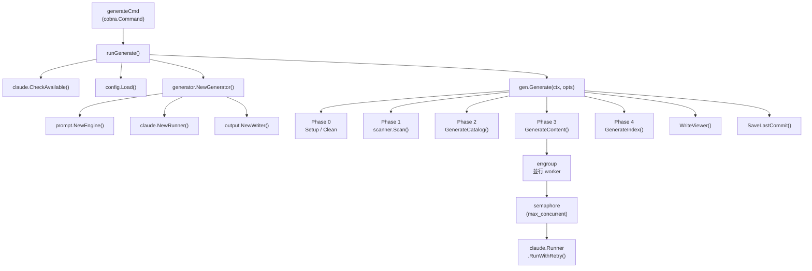
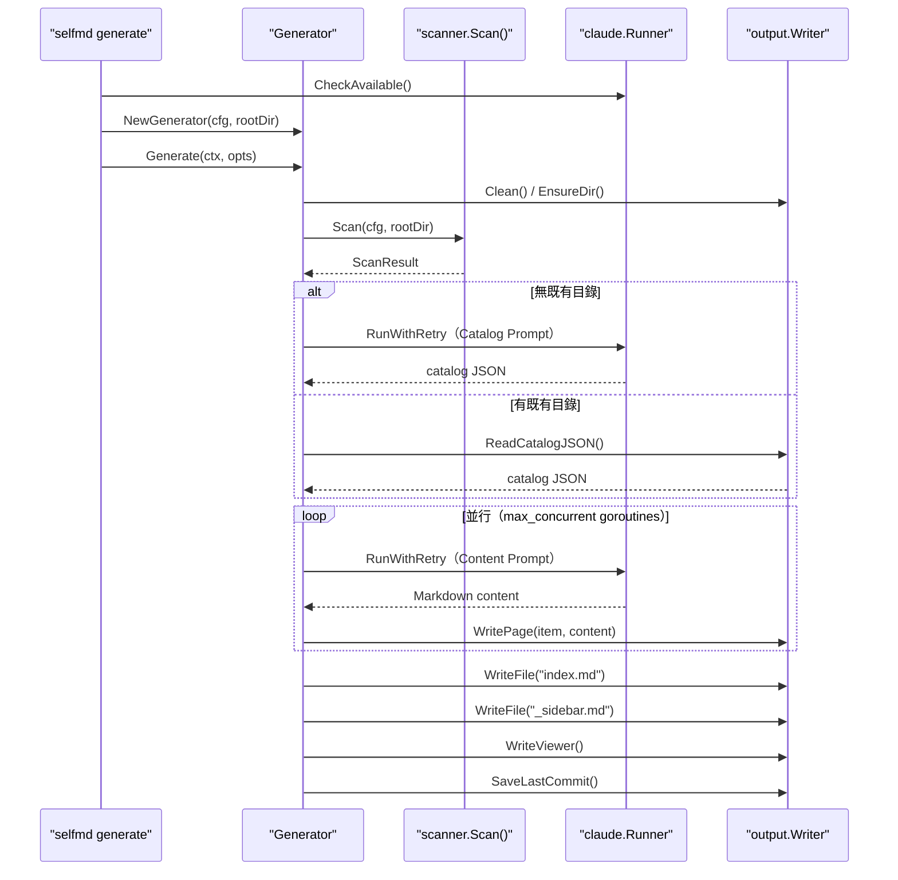

# selfmd generate

執行完整的四階段文件產生流程，掃描專案原始碼並透過 Claude CLI 自動產生結構化的 Wiki 風格技術文件。

## 概述

`selfmd generate` 是 selfmd 的核心指令，負責從零開始（或增量地）產生完整的專案技術文件。執行時，指令會依序完成以下工作：

1. 驗證 Claude CLI 環境是否就緒
2. 載入 `selfmd.yaml` 設定檔
3. 掃描專案目錄結構與原始碼
4. 呼叫 Claude AI 產生文件目錄（Catalog）
5. 以並行方式為每個目錄項目產生內容頁面
6. 產生導航索引與靜態文件瀏覽器

**增量產生**：若輸出目錄中已存在有效頁面，且未使用 `--clean` 旗標，系統會自動跳過這些頁面，僅產生缺失或失敗的部分，大幅節省 API 費用與執行時間。

## 用法

```sh
selfmd generate [flags]
```

> 來源：`cmd/generate.go#L23-L32`

## 旗標（Flags）

| 旗標 | 型別 | 預設值 | 說明 |
|------|------|--------|------|
| `--clean` | bool | `false` | 強制清除輸出目錄後重新產生所有頁面 |
| `--no-clean` | bool | `false` | 覆蓋設定檔的 `clean_before_generate`，保留現有頁面 |
| `--dry-run` | bool | `false` | 僅掃描並顯示檔案樹，不呼叫 Claude 也不寫入任何檔案 |
| `--concurrency` | int | `0` | 覆蓋設定檔的 `claude.max_concurrent` 並行度設定 |
| `-c, --config` | string | `selfmd.yaml` | 設定檔路徑（全域旗標，繼承自 rootCmd） |
| `-v, --verbose` | bool | `false` | 顯示 Debug 層級的詳細日誌（全域旗標） |
| `-q, --quiet` | bool | `false` | 僅顯示錯誤訊息（全域旗標） |

### `--clean` 與 `--no-clean` 的優先順序

最終的 clean 行為由以下規則決定（優先順序由高至低）：

```
--no-clean flag → clean = false（強制保留）
--clean flag    → clean = true（強制清除）
config 設定     → output.clean_before_generate 的值
```

> 來源：`cmd/generate.go#L80-L87`

## 架構



## 四階段產生流程

### 階段 0：初始化設定

根據 `clean` 選項決定輸出目錄的處理方式：

```go
if clean {
    fmt.Println("[0/4] 清除輸出目錄...")
    if !opts.DryRun {
        if err := g.Writer.Clean(); err != nil {
            return err
        }
    }
} else {
    if err := g.Writer.EnsureDir(); err != nil {
        return err
    }
}
```

> 來源：`internal/generator/pipeline.go#L72-L84`

`Writer.Clean()` 會呼叫 `os.RemoveAll()` 刪除整個輸出目錄後重建，`EnsureDir()` 則以 `os.MkdirAll()` 確保目錄存在。

---

### 階段 1：掃描專案結構

```go
scan, err := scanner.Scan(g.Config, g.RootDir)
```

> 來源：`internal/generator/pipeline.go#L88-L92`

掃描器遞迴走訪專案目錄，依據設定檔中的 `targets.include` 與 `targets.exclude` glob 模式篩選檔案，同時讀取 `README.md` 與設定的進入點（entry points）內容。

**Dry Run 行為**：若指定 `--dry-run`，掃描完成後僅顯示檔案樹（深度 3 層）並結束，不執行後續任何 Claude 呼叫：

```go
if opts.DryRun {
    fmt.Println("\n[Dry Run] 檔案樹：")
    fmt.Println(scanner.RenderTree(scan.Tree, 3))
    fmt.Println("[Dry Run] 將不會執行 Claude 呼叫。")
    return nil
}
```

> 來源：`internal/generator/pipeline.go#L94-L99`

---

### 階段 2：產生文件目錄（Catalog）

目錄是文件結構的骨架，定義了所有頁面的標題、路徑與層級關係。

```go
// 優先嘗試重用既有目錄（非 clean 模式）
if !clean {
    catJSON, readErr := g.Writer.ReadCatalogJSON()
    if readErr == nil {
        cat, err = catalog.Parse(catJSON)
    }
    // ...
}
// 若無既有目錄，呼叫 Claude 產生
if cat == nil {
    cat, err = g.GenerateCatalog(ctx, scan)
    // 儲存為 _catalog.json 供下次使用
    g.Writer.WriteCatalogJSON(cat)
}
```

> 來源：`internal/generator/pipeline.go#L102-L127`

`GenerateCatalog()` 將掃描結果組裝為 prompt 後呼叫 Claude CLI，從回應中擷取 JSON 格式的目錄結構：

```go
result, err := g.Runner.RunWithRetry(ctx, claude.RunOptions{
    Prompt:  rendered,
    WorkDir: g.RootDir,
})
// ...
jsonStr, err := claude.ExtractJSONBlock(result.Content)
cat, err := catalog.Parse(jsonStr)
```

> 來源：`internal/generator/catalog_phase.go#L37-L58`

---

### 階段 3：並行產生內容頁面

這是最耗時的階段，系統以並行方式為每個目錄項目呼叫 Claude 產生完整的 Markdown 文件：

```go
eg, ctx := errgroup.WithContext(ctx)
sem := make(chan struct{}, concurrency)

for _, item := range items {
    item := item
    eg.Go(func() error {
        // 跳過已存在的頁面（非 clean 模式）
        if skipExisting && g.Writer.PageExists(item) {
            skipped.Add(1)
            return nil
        }
        sem <- struct{}{}
        defer func() { <-sem }()
        // ...呼叫 Claude 產生頁面...
    })
}
```

> 來源：`internal/generator/content_phase.go#L36-L73`

**並行度控制**：使用 channel 作為 semaphore，限制同時執行的 Claude 呼叫數量。預設值來自設定檔的 `claude.max_concurrent`（預設 `3`），可用 `--concurrency` 旗標覆蓋。

**失敗容錯**：單一頁面產生失敗不會中止整體流程。失敗時會寫入佔位頁面（placeholder），提示使用者重新執行：

```go
func (g *Generator) writePlaceholder(item catalog.FlatItem, genErr error) {
    content := fmt.Sprintf("# %s\n\n> 此頁面產生失敗，請重新執行 `selfmd generate`。\n>\n> 錯誤：%v\n", item.Title, genErr)
    g.Writer.WritePage(item, content)
}
```

> 來源：`internal/generator/content_phase.go#L159-L164`

**格式驗證與重試**：每個頁面最多嘗試 2 次，若 Claude 回應缺少 `<document>` 標籤或不是以 `#` 開頭的有效 Markdown，會自動重試：

```go
content, extractErr := claude.ExtractDocumentTag(result.Content)
// ...
if content == "" || !strings.HasPrefix(content, "#") {
    // 重試
}
```

> 來源：`internal/generator/content_phase.go#L126-L146`

---

### 階段 4：產生導航與索引

```go
func (g *Generator) GenerateIndex(_ context.Context, cat *catalog.Catalog) error {
    // 產生 index.md（文件首頁）
    output.GenerateIndex(...)
    g.Writer.WriteFile("index.md", indexContent)

    // 產生 _sidebar.md（側邊欄導航）
    output.GenerateSidebar(...)
    g.Writer.WriteFile("_sidebar.md", sidebarContent)

    // 為有子項目的分類產生索引頁
    for _, item := range items {
        if item.HasChildren { ... }
    }
}
```

> 來源：`internal/generator/index_phase.go#L11-L55`

---

### 後置處理

階段 4 完成後，`Generate()` 還會執行：

1. **產生靜態瀏覽器**：呼叫 `Writer.WriteViewer()` 產生 `index.html` 與相關資源，支援直接在瀏覽器開啟瀏覽文件。
2. **記錄 Git commit**：若當前目錄為 Git 倉庫，儲存目前的 commit hash 至 `_last_commit`，供 `selfmd update` 的增量更新使用。

```go
if git.IsGitRepo(g.RootDir) {
    if commit, err := git.GetCurrentCommit(g.RootDir); err == nil {
        g.Writer.SaveLastCommit(commit)
    }
}
```

> 來源：`internal/generator/pipeline.go#L158-L164`

## 核心流程



## 輸出結構

成功執行後，`--output.dir`（預設 `.doc-build/`）目錄下會產生以下檔案：

```
.doc-build/
├── index.html          # 靜態文件瀏覽器入口
├── index.md            # 文件首頁（Markdown）
├── _sidebar.md         # 側邊欄導航
├── _catalog.json       # 目錄結構快取（供增量更新使用）
├── _last_commit        # Git commit hash 記錄
├── <section>/
│   └── <subsection>/
│       └── index.md   # 各章節文件頁面
└── <lang>/             # 翻譯語言目錄（若有次要語言）
    ├── index.md
    └── ...
```

## 使用範例

### 基本用法

```sh
# 標準產生流程（增量，跳過已存在頁面）
selfmd generate

# 強制重新產生所有頁面
selfmd generate --clean

# 預覽模式：只顯示掃描結果，不呼叫 Claude
selfmd generate --dry-run
```

### 調整並行度

```sh
# 提高並行度加快產生速度（注意 Claude API 限速）
selfmd generate --concurrency 5

# 降低並行度減少 API 請求速率
selfmd generate --concurrency 1
```

### 使用自訂設定檔

```sh
selfmd generate --config ./configs/my-project.yaml
```

### 搭配日誌旗標

```sh
# 顯示詳細 Debug 日誌（含每次 Claude 呼叫的詳細資訊）
selfmd generate --verbose

# 靜默模式（僅顯示錯誤）
selfmd generate --quiet
```

## 執行輸出範例

成功執行時，終端機會顯示以下進度輸出：

```
[0/4] 清除輸出目錄...
[1/4] 掃描專案結構...
      找到 42 個檔案，分布於 12 個目錄
[2/4] 產生文件目錄...
      呼叫 Claude 產生目錄... 完成（8.3s，$0.0025）
      目錄：6 個章節，18 個項目
[3/4] 產生內容頁面（並行度：3）...
      [1/18] 概述（overview）... 完成（12.5s，$0.0041）
      [2/18] 快速開始（getting-started）... 完成（10.2s，$0.0038）
      ...
[4/4] 產生導航與索引...
產生文件瀏覽器...
      完成，開啟 .doc-build/index.html 即可瀏覽

========================================
文件產生完成！
  輸出目錄：.doc-build
  頁面數量：18 成功
  總耗時：3m 24s
  總費用：$0.0842 USD
========================================
```

## 前置條件

執行 `selfmd generate` 前，必須滿足以下條件：

1. **Claude CLI 已安裝**：系統 PATH 中存在 `claude` 指令（由 `claude.CheckAvailable()` 驗證）
2. **設定檔存在**：工作目錄中存在 `selfmd.yaml`（或以 `--config` 指定其他路徑）
3. **已執行 `selfmd init`**：初始化產生設定檔

## 相關連結

- [CLI 指令參考](../index.md)
- [selfmd init](../cmd-init/index.md) — 初始化設定檔
- [selfmd update](../cmd-update/index.md) — 增量更新（僅更新變更頁面）
- [selfmd translate](../cmd-translate/index.md) — 翻譯文件至其他語言
- [整體流程與四階段管線](../../architecture/pipeline/index.md) — 深入了解管線架構
- [文件產生管線](../../core-modules/generator/index.md) — Generator 模組詳解
- [Claude CLI 執行器](../../core-modules/claude-runner/index.md) — Runner 模組詳解
- [專案掃描器](../../core-modules/scanner/index.md) — Scanner 模組詳解
- [設定說明](../../configuration/index.md) — selfmd.yaml 完整設定參考

## 參考檔案

| 檔案路徑 | 說明 |
|----------|------|
| `cmd/generate.go` | generate 指令定義、旗標宣告、`runGenerate()` 進入點 |
| `cmd/root.go` | rootCmd 定義，全域旗標（`--config`、`--verbose`、`--quiet`） |
| `internal/generator/pipeline.go` | `Generator` 結構定義、`NewGenerator()`、`Generate()` 主流程 |
| `internal/generator/catalog_phase.go` | `GenerateCatalog()` 實作：組裝 prompt 並呼叫 Claude 產生目錄 |
| `internal/generator/content_phase.go` | `GenerateContent()` 實作：並行產生頁面、重試邏輯、佔位頁面 |
| `internal/generator/index_phase.go` | `GenerateIndex()` 實作：產生 `index.md`、`_sidebar.md` 及分類索引 |
| `internal/generator/translate_phase.go` | `Translate()` 實作（翻譯管線，由 `selfmd translate` 呼叫） |
| `internal/config/config.go` | `Config` 結構定義、`Load()`、`DefaultConfig()`、驗證邏輯 |
| `internal/scanner/scanner.go` | `Scan()` 實作：目錄走訪、include/exclude 過濾、README 讀取 |
| `internal/claude/runner.go` | `Runner.Run()`、`RunWithRetry()`、`CheckAvailable()` |
| `internal/output/writer.go` | `Writer` 結構：`WritePage()`、`Clean()`、`WriteCatalogJSON()` 等 |