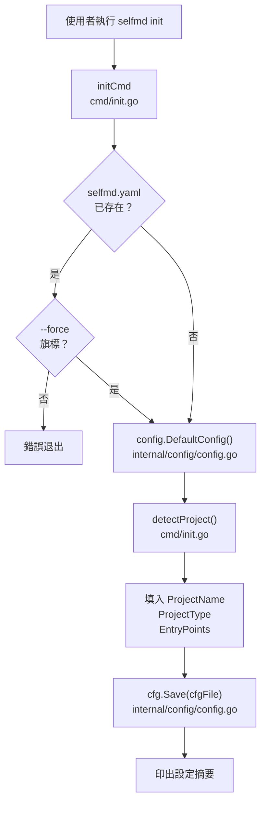
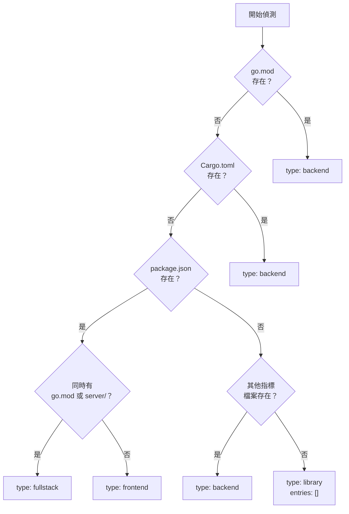
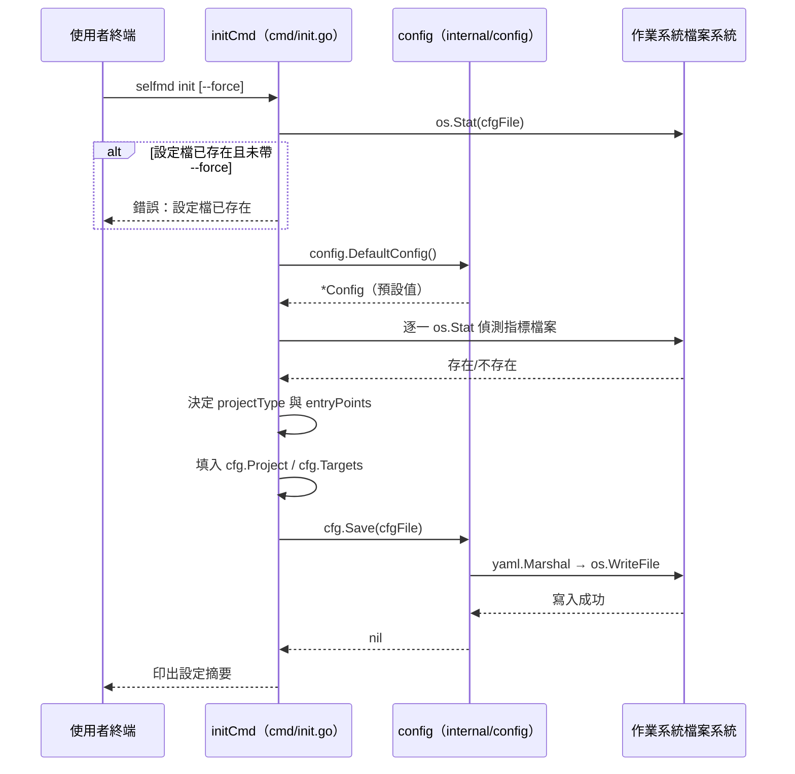

# selfmd init

初始化指令，掃描當前目錄並自動偵測專案類型，產生 `selfmd.yaml` 設定檔。

## 概述

`selfmd init` 是使用 selfmd 的第一步。執行後，它會：

1. 檢查當前目錄是否已有設定檔（預設為 `selfmd.yaml`）
2. 呼叫 `detectProject()` 自動辨識專案類型（如 Go、Rust、Node.js、Python 等）
3. 根據偵測結果與預設值，透過 `config.DefaultConfig()` 建立完整設定
4. 將設定序列化為 YAML 並寫入磁碟

產生的 `selfmd.yaml` 是後續所有 selfmd 指令的執行基礎，使用者可在初始化後依需求手動調整。

---

## 架構



---

## 旗標與參數

| 旗標 | 類型 | 預設值 | 說明 |
|------|------|--------|------|
| `--force` | bool | `false` | 強制覆蓋已存在的設定檔 |
| `--config` / `-c` | string | `selfmd.yaml` | 指定設定檔路徑（繼承自根指令） |

`--config` 旗標由根指令 `rootCmd` 定義，所有子指令皆可使用：

```go
rootCmd.PersistentFlags().StringVarP(&cfgFile, "config", "c", "selfmd.yaml", "設定檔路徑")
```

> 來源：cmd/root.go#L31

---

## 專案類型自動偵測

`detectProject()` 函式依序掃描當前目錄中的特定檔案，藉此推斷專案類型與入口點：

```go
func detectProject() (projectType string, entryPoints []string) {
	checks := []struct {
		file       string
		pType      string
		entries    []string
	}{
		{"go.mod", "backend", []string{"main.go", "cmd/root.go"}},
		{"Cargo.toml", "backend", []string{"src/main.rs", "src/lib.rs"}},
		{"package.json", "frontend", []string{"src/index.ts", "src/index.js", "src/main.ts", "src/App.tsx"}},
		{"pom.xml", "backend", []string{"src/main/java"}},
		{"build.gradle", "backend", []string{"src/main/java"}},
		{"requirements.txt", "backend", []string{"main.py", "app.py", "src/main.py"}},
		{"pyproject.toml", "backend", []string{"src/main.py", "main.py"}},
		{"composer.json", "backend", []string{"public/index.php", "src/Kernel.php"}},
		{"Gemfile", "backend", []string{"config/application.rb", "app/"}},
	}
	// ...
}
```

> 來源：cmd/init.go#L60-L76

### 偵測邏輯

1. **依序檢查**：依上表順序逐一偵測，命中第一個符合的即停止
2. **入口點過濾**：候選入口點清單中只保留實際存在的檔案
3. **Fullstack 判斷**：若偵測到 `package.json`（frontend），再額外確認 `go.mod` 或 `server/` 目錄是否存在，若有則改標記為 `fullstack`
4. **預設類型**：若所有規則均不符合，回傳 `"library"` 與空入口點



---

## 預設設定值

`config.DefaultConfig()` 回傳的預設值如下：

```go
func DefaultConfig() *Config {
	return &Config{
		Project: ProjectConfig{
			Name: filepath.Base(mustGetwd()),
			Type: "backend",
		},
		Targets: TargetsConfig{
			Include: []string{"src/**", "pkg/**", "cmd/**", "internal/**", "lib/**", "app/**"},
			Exclude: []string{
				"vendor/**", "node_modules/**", ".git/**", ".doc-build/**",
				"**/*.pb.go", "**/generated/**", "dist/**", "build/**",
			},
			EntryPoints: []string{},
		},
		Output: OutputConfig{
			Dir:                 ".doc-build",
			Language:            "zh-TW",
			SecondaryLanguages:  []string{},
			CleanBeforeGenerate: false,
		},
		Claude: ClaudeConfig{
			Model:          "sonnet",
			MaxConcurrent:  3,
			TimeoutSeconds: 300,
			MaxRetries:     2,
			AllowedTools:   []string{"Read", "Glob", "Grep"},
			ExtraArgs:      []string{},
		},
		Git: GitConfig{
			Enabled:    true,
			BaseBranch: "main",
		},
	}
}
```

> 來源：internal/config/config.go#L96-L129

`init` 指令在預設值基礎上，以偵測結果覆寫以下三個欄位：

| 欄位 | 覆寫來源 |
|------|----------|
| `project.name` | `filepath.Base(mustCwd())` — 當前目錄名稱 |
| `project.type` | `detectProject()` 偵測結果 |
| `targets.entry_points` | `detectProject()` 偵測到的實際入口點 |

---

## 核心流程



---

## 輸出摘要說明

指令執行成功後，終端會印出以下資訊：

```
已建立設定檔：selfmd.yaml
  專案名稱：my-project
  專案類型：backend
  輸出目錄：.doc-build
  文件語言：zh-TW
  入口檔案：main.go, cmd/root.go

請根據專案需求編輯設定檔後，執行 selfmd generate 產生文件。
```

> 來源：cmd/init.go#L43-L56

---

## 使用範例

### 基本初始化

```bash
selfmd init
```

在當前目錄產生 `selfmd.yaml`。若偵測到 `go.mod` 與 `cmd/root.go`，設定檔將包含：

```yaml
project:
  name: my-project
  type: backend
targets:
  entry_points:
    - cmd/root.go
```

### 強制覆蓋既有設定檔

```bash
selfmd init --force
```

> 來源：cmd/init.go#L28-L30

### 指定自訂設定檔路徑

```bash
selfmd init --config config/selfmd.yaml
```

---

## 注意事項

- `selfmd init` 不會覆寫 `targets.include` 與 `targets.exclude`，這兩個欄位維持預設值，需使用者視需求手動調整
- 若專案同時符合多個偵測條件（如同時有 `go.mod` 與 `package.json`），僅最先命中的規則生效
- 產生的 `selfmd.yaml` 使用 YAML v3 格式序列化

---

## 相關連結

- [初始化設定](../../getting-started/init/index.md)
- [selfmd.yaml 結構總覽](../../configuration/config-overview/index.md)
- [專案與掃描目標設定](../../configuration/project-targets/index.md)
- [selfmd generate](../cmd-generate/index.md)
- [CLI 指令參考](../index.md)

---

## 參考檔案

| 檔案路徑 | 說明 |
|----------|------|
| `cmd/init.go` | `init` 指令實作、`detectProject()` 偵測邏輯 |
| `cmd/root.go` | 根指令定義，含 `--config`、`--verbose`、`--quiet` 全域旗標 |
| `internal/config/config.go` | `Config` 結構定義、`DefaultConfig()`、`Save()`、`Load()` 實作 |