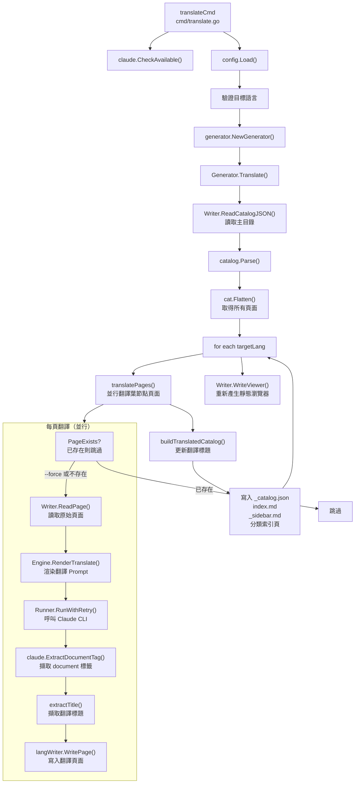
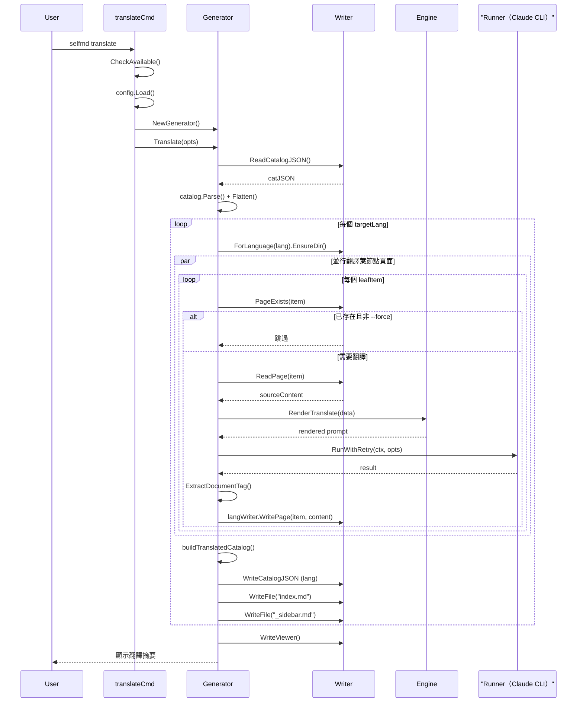

# selfmd translate

將主要語言的已產生文件，透過 Claude CLI 翻譯成設定檔中定義的次要語言，並儲存至對應的語言子目錄。

## 概述

`selfmd translate` 指令讀取已由 `selfmd generate` 產生的主要語言文件，逐頁呼叫 Claude CLI 進行翻譯，並將翻譯結果寫入 `.doc-build/{語言代碼}/` 子目錄。

此指令的核心前提是：**主要語言文件必須已存在**。翻譯流程不會重新掃描原始碼，而是直接以現有的 Markdown 頁面作為翻譯來源。

關鍵特性：

- **增量翻譯**：預設自動跳過已存在的翻譯頁面，只翻譯尚未翻譯的內容
- **多目標語言**：單次執行可同時翻譯至多個次要語言
- **並行翻譯**：使用 semaphore 並行模式加速翻譯，並行度可透過設定或參數控制
- **目錄同步**：翻譯完成後自動建立各語言版本的目錄（`_catalog.json`）、首頁（`index.md`）及側欄（`_sidebar.md`）
- **費用追蹤**：翻譯完成後顯示每頁耗時與總 API 費用

翻譯所使用的 Prompt 模板（`translate.tmpl`）為**語言無關的共用模板**，與主要語言的內容生成模板分開維護。

## 架構



## 指令語法

```
selfmd translate [flags]
```

### 旗標（Flags）

| 旗標 | 類型 | 預設值 | 說明 |
|------|------|--------|------|
| `--lang` | `[]string` | `nil`（所有次要語言） | 限定只翻譯指定的語言代碼，可重複或逗號分隔 |
| `--force` | `bool` | `false` | 強制重新翻譯已存在的翻譯檔案 |
| `--concurrency` | `int` | `0`（使用設定值） | 並行翻譯工作數，覆蓋 `claude.max_concurrent` |
| `-c, --config` | `string` | `selfmd.yaml` | 設定檔路徑（繼承自 root） |
| `-v, --verbose` | `bool` | `false` | 顯示詳細 debug 輸出 |
| `-q, --quiet` | `bool` | `false` | 僅顯示錯誤訊息 |

> 來源：`cmd/translate.go#L33-L37`

### 使用範例

```bash
# 翻譯所有設定的次要語言
selfmd translate

# 只翻譯英文版本
selfmd translate --lang en-US

# 翻譯多個語言
selfmd translate --lang en-US,ja-JP

# 強制重新翻譯（即使已存在）
selfmd translate --force

# 提高並行度加速翻譯
selfmd translate --concurrency 5
```

## 前置條件

執行 `selfmd translate` 前，必須滿足以下條件：

1. **已安裝 Claude CLI**：系統 `PATH` 中必須可找到 `claude` 執行檔
2. **已產生主要語言文件**：`.doc-build/_catalog.json` 及各頁面 `index.md` 必須存在
3. **設定檔含 `secondary_languages`**：`selfmd.yaml` 中的 `output.secondary_languages` 不可為空

若未滿足條件三，指令將直接回報錯誤並終止：

```go
if len(cfg.Output.SecondaryLanguages) == 0 {
    return fmt.Errorf("設定檔中未定義 secondary_languages，無法翻譯")
}
```

> 來源：`cmd/translate.go#L50-L52`

## 核心流程

### 翻譯管線序列圖



### 增量翻譯邏輯

`translatePages()` 函式在翻譯每頁前，先透過 `Writer.PageExists()` 檢查翻譯檔是否存在且有效內容。判定「需要翻譯」的條件：

- 檔案不存在
- 檔案內容為空
- 檔案內容包含 `"此頁面產生失敗"` 字串
- 使用者指定了 `--force` 旗標

```go
if !opts.Force && langWriter.PageExists(item) {
    skipped.Add(1)
    // 嘗試從已有翻譯擷取標題
    if content, err := langWriter.ReadPage(item); err == nil {
        if title := extractTitle(content); title != "" {
            titlesMu.Lock()
            translatedTitles[item.Path] = title
            titlesMu.Unlock()
        }
    }
    fmt.Printf("      [跳過] %s（已存在）\n", item.Title)
    return nil
}
```

> 來源：`internal/generator/translate_phase.go#L156-L169`

### 翻譯目錄同步

翻譯完成後，系統會以翻譯後的標題重建目錄結構，讓各語言版本的導航都能正確顯示本地語言標題：

```go
func buildTranslatedCatalog(original *catalog.Catalog, translatedTitles map[string]string) *catalog.Catalog {
    translated := &catalog.Catalog{
        Items: translateCatalogItems(original.Items, translatedTitles, ""),
    }
    return translated
}
```

> 來源：`internal/generator/translate_phase.go#L277-L282`

## 翻譯 Prompt 模板

翻譯使用的是位於 `internal/prompt/templates/translate.tmpl` 的**共用模板**（非語言特定），由 `Engine.RenderTranslate()` 渲染。翻譯規則由模板硬編碼：

| 規則 | 說明 |
|------|------|
| 保留 Markdown 格式 | 標題、連結、程式碼區塊、表格、Mermaid 圖表 |
| 不翻譯程式碼識別符 | 變數名稱、檔案路徑、程式碼區塊維持原文 |
| 翻譯章節標題 | 使用自然的目標語言翻譯 |
| 保留相對連結路徑 | 只翻譯連結顯示文字，路徑不變 |
| 保留來源標註 | `> Source: path/to/file#L10-L25` 格式不變 |

`TranslatePromptData` 結構提供以下資料給模板：

```go
type TranslatePromptData struct {
    SourceLanguage     string // 例如 "zh-TW"
    SourceLanguageName string // 例如 "繁體中文"
    TargetLanguage     string // 例如 "en-US"
    TargetLanguageName string // 例如 "English"
    SourceContent      string // 要翻譯的完整 Markdown 內容
}
```

> 來源：`internal/prompt/engine.go#L97-L104`

## 語言設定

次要語言在 `selfmd.yaml` 的 `output.secondary_languages` 欄位設定：

```yaml
output:
  language: zh-TW              # 主要語言（翻譯來源）
  secondary_languages:         # 翻譯目標語言列表
    - en-US
    - ja-JP
```

系統目前內建以下語言的原生名稱顯示：

| 語言代碼 | 原生名稱 |
|---------|---------|
| `zh-TW` | 繁體中文 |
| `zh-CN` | 简体中文 |
| `en-US` | English |
| `ja-JP` | 日本語 |
| `ko-KR` | 한국어 |
| `fr-FR` | Français |
| `de-DE` | Deutsch |
| `es-ES` | Español |
| `pt-BR` | Português |
| `th-TH` | ไทย |
| `vi-VN` | Tiếng Việt |

> 來源：`internal/config/config.go#L39-L51`

## 輸出結構

翻譯完成後，各語言版本的文件放置於 `.doc-build/{語言代碼}/` 子目錄，結構與主要語言版本相同：

```
.doc-build/
├── （主要語言，例如 zh-TW）
│   ├── _catalog.json
│   ├── index.md
│   ├── _sidebar.md
│   └── section/page/index.md
├── en-US/
│   ├── _catalog.json
│   ├── index.md
│   ├── _sidebar.md
│   └── section/page/index.md
└── ja-JP/
    ├── _catalog.json
    ├── index.md
    └── ...
```

翻譯完成後，靜態瀏覽器（`index.html`）也會重新產生，以納入所有語言的切換資訊。

## 執行輸出範例

```
翻譯源語言：繁體中文（zh-TW）
目標語言：en-US, ja-JP
頁面數量：42

========== 翻譯至 English（en-US）==========
      [1/42] 概述...  完成（12.3s，$0.0042）
      [2/42] 快速開始... 完成（9.8s，$0.0038）
      [跳過] 安裝與建置（已存在）
      ...
      翻譯結果：40 成功，0 失敗，2 跳過

========== 翻譯至 日本語（ja-JP）==========
      ...

重新產生文件瀏覽器...
      完成

========================================
翻譯完成！
  總耗時：8m32s
  總費用：$0.3241 USD
========================================
```

## 相關連結

- [CLI 指令參考](../index.md)
- [selfmd generate](../cmd-generate/index.md)
- [selfmd update](../cmd-update/index.md)
- [輸出與多語言設定](../../configuration/output-language/index.md)
- [翻譯階段](../../core-modules/generator/translate-phase/index.md)
- [翻譯工作流程](../../i18n/translation-workflow/index.md)
- [支援的語言與模板](../../i18n/supported-languages/index.md)
- [Claude CLI 整合設定](../../configuration/claude-config/index.md)

## 參考檔案

| 檔案路徑 | 說明 |
|----------|------|
| `cmd/translate.go` | `translate` 指令定義、旗標解析與執行入口 |
| `cmd/root.go` | 根指令與全域旗標定義 |
| `internal/generator/translate_phase.go` | `Translate()`、`translatePages()`、`buildTranslatedCatalog()` 核心翻譯邏輯 |
| `internal/generator/pipeline.go` | `Generator` 結構定義與 `NewGenerator()` |
| `internal/prompt/engine.go` | `TranslatePromptData` 結構與 `RenderTranslate()` 方法 |
| `internal/prompt/templates/translate.tmpl` | 翻譯 Prompt 共用模板 |
| `internal/config/config.go` | `OutputConfig`（`SecondaryLanguages`）、`KnownLanguages`、`GetLangNativeName()` |
| `internal/output/writer.go` | `Writer`、`ForLanguage()`、`PageExists()`、`ReadPage()` |
| `internal/claude/runner.go` | `Runner.RunWithRetry()` 與 `CheckAvailable()` |