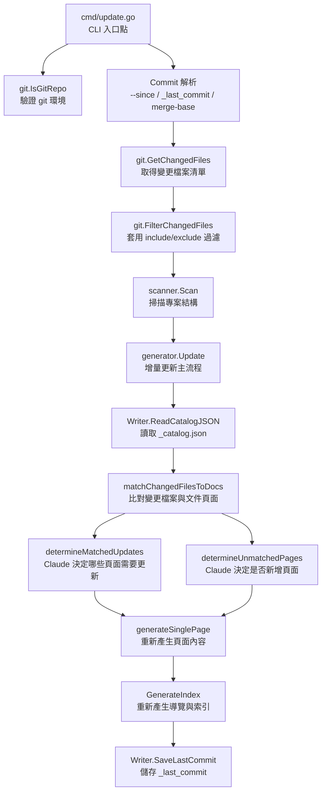
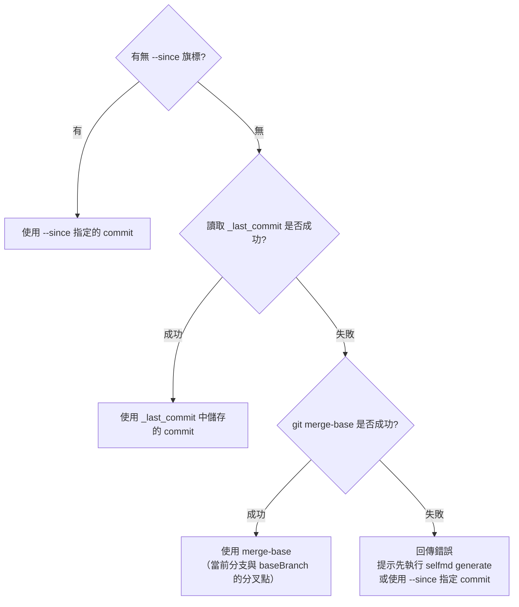

# selfmd update

`selfmd update` 指令分析 git 變更歷史，以增量方式更新受影響的文件頁面，無需重新產生所有文件。

## 概述

`selfmd update` 是 selfmd 的增量更新模式。與每次全量重新產生的 `selfmd generate` 不同，`update` 指令透過比對 git commit 之間的差異，只重新產生受變更影響的文件頁面，大幅節省時間與 API 費用。

**使用前提：**
- 必須已執行過 `selfmd generate`，`.doc-build/` 目錄中存在初始文件
- 專案必須是 git 儲存庫
- Claude CLI 必須可用

**核心概念：**
- **比較範圍（Comparison Range）**：兩個 commit 之間的差異，即 `previousCommit..currentCommit`
- **匹配（Matching）**：已變更的原始碼檔案路徑是否出現在現有文件頁面內容中
- **葉節點升級（Leaf Promotion）**：當新增頁面需要成為現有頁面的子頁面時，舊的葉節點會自動升級為父節點

## 架構



## 指令語法

```bash
selfmd update [flags]
```

**可用旗標：**

| 旗標 | 類型 | 說明 |
|------|------|------|
| `--since <commit>` | string | 指定比較基準 commit（預設自動偵測） |
| `--config <path>` | string | 指定設定檔路徑（全域旗標，繼承自 root） |
| `--verbose` | bool | 顯示詳細的除錯日誌（全域旗標，繼承自 root） |

> 來源：`cmd/update.go#L19-L31`

## Commit 解析邏輯

`selfmd update` 在執行前需要確定「從哪個 commit 開始比較」。系統依照以下優先順序解析基準 commit：



`_last_commit` 檔案由每次 `generate` 或 `update` 完成後自動寫入，存放於 `.doc-build/_last_commit`。

```go
// Determine comparison commit
previousCommit := sinceCommit
if previousCommit == "" {
    // Try reading saved commit from last generate/update
    saved, readErr := gen.Writer.ReadLastCommit()
    if readErr == nil && saved != "" {
        previousCommit = saved
    } else {
        // Fallback to merge-base
        base, err := git.GetMergeBase(rootDir, cfg.Git.BaseBranch)
        if err != nil {
            return fmt.Errorf("無法取得基準 commit: %w\n提示：先執行 selfmd generate 或使用 --since 指定 commit", err)
        }
        previousCommit = base
    }
}
```

> 來源：`cmd/update.go#L68-L82`

## 四階段更新流程

`generator.Update()` 方法依序執行以下四個階段：

### [1/4] 搜尋受影響的文件頁面

`matchChangedFilesToDocs` 對每個已變更的原始碼檔案，掃描所有現有文件頁面的內容，尋找包含該檔案路徑的頁面。

```go
// For each changed file, find which pages reference it
for _, f := range files {
    var matchedPages []catalog.FlatItem
    for _, item := range items {
        content, ok := pageContents[item.Path]
        if !ok {
            continue
        }
        if strings.Contains(content, f.Path) {
            matchedPages = append(matchedPages, item)
        }
    }
    // ...
}
```

> 來源：`internal/generator/updater.go#L191-L211`

此步驟將變更檔案分為兩類：
- **matched**（已匹配）：在現有文件中找到引用的檔案
- **unmatched**（未匹配）：沒有任何現有文件引用的新檔案

### [2/4] Claude 判斷需更新的現有頁面

針對已匹配的檔案，呼叫 Claude CLI 評估每個相關文件頁面是否確實受到影響，並返回需要重新產生的頁面清單。

Claude 的判斷結果以 JSON 格式返回，包含 `catalogPath`、`title`、`reason` 三個欄位：

```go
type UpdateMatchedResult struct {
    CatalogPath string `json:"catalogPath"`
    Title       string `json:"title"`
    Reason      string `json:"reason"`
}
```

> 來源：`internal/generator/updater.go#L18-L22`

### [3/4] Claude 判斷是否新增頁面

針對未匹配的檔案（即現有文件中沒有引用的新檔案），呼叫 Claude CLI 評估是否應為這些檔案新增文件頁面。

```go
type UpdateUnmatchedResult struct {
    CatalogPath string `json:"catalogPath"`
    Title       string `json:"title"`
    Reason      string `json:"reason"`
}
```

> 來源：`internal/generator/updater.go#L24-L29`

若 Claude 決定需要新增頁面，系統會呼叫 `addItemToCatalog` 將新頁面插入現有目錄樹，並觸發葉節點升級機制（見下方說明）。

### [4/4] 重新產生頁面內容

對所有需要更新的頁面（已匹配需更新的 + 新增的），呼叫與 `selfmd generate` 相同的 `generateSinglePage` 流程重新產生內容。產生時會將現有頁面內容作為上下文傳入，讓 Claude 在更新時保留原有結構。

```go
// Read existing content to pass as context for regeneration
existing, _ := g.Writer.ReadPage(item)
err := g.generateSinglePage(ctx, scan, item, catalogTable, linkFixer, existing)
```

> 來源：`internal/generator/updater.go#L141-L142`

## 葉節點升級機制

當 Claude 決定在現有頁面的路徑下新增子頁面時（例如在 `core-modules.scanner` 下新增 `core-modules.scanner.advanced`），原本的葉節點（`core-modules.scanner`）需要升級為父節點。

系統會自動：
1. 將原葉節點的現有內容搬移到新建的 `overview` 子頁面（如 `core-modules.scanner.overview`）
2. 將原葉節點標記為父節點
3. 在父節點下建立新請求的子頁面

```go
// A leaf node was promoted to a parent.
// Move the original content to the new "overview" child.
origItem := catalog.FlatItem{
    Path:    promoted.OriginalPath,
    DirPath: catalogPathToDir(promoted.OriginalPath),
}
overviewItem := catalog.FlatItem{
    Title:   promoted.OriginalTitle,
    Path:    promoted.OverviewPath,
    DirPath: catalogPathToDir(promoted.OverviewPath),
}
if content, err := g.Writer.ReadPage(origItem); err == nil && content != "" {
    if err := g.Writer.WritePage(overviewItem, content); err != nil {
        // ...
    }
}
```

> 來源：`internal/generator/updater.go#L99-L116`

## 變更檔案過濾

系統使用與 `selfmd generate` 相同的 include/exclude 規則過濾 git 差異輸出，確保只有符合設定目標的檔案變更才會觸發文件更新。

```go
changedFiles = git.FilterChangedFiles(changedFiles, cfg.Targets.Include, cfg.Targets.Exclude)
```

> 來源：`cmd/update.go#L94`

`FilterChangedFiles` 支援 doublestar glob 語法（`**/*.go`），並正確處理 git rename 格式（`R100\told\tnew`），使用目標路徑進行匹配。

```go
// git diff --name-status format: "M\tpath/to/file" or "R100\told\tnew"
parts := strings.SplitN(line, "\t", 3)
// For renames, check the destination path (last element)
filePath := parts[len(parts)-1]
```

> 來源：`internal/git/git.go#L83-L91`

## 輸出檔案

每次 `update` 完成後，系統會更新以下持久化檔案：

| 檔案 | 說明 |
|------|------|
| `.doc-build/_last_commit` | 記錄本次更新的 HEAD commit hash，供下次 update 使用 |
| `.doc-build/_catalog.json` | 若有新增頁面，更新文件目錄結構 |
| `.doc-build/<path>/index.md` | 被更新或新建的文件頁面 |

## 使用範例

```bash
# 基本用法：與上次 generate/update 相比，更新有變更的文件
selfmd update

# 指定與特定 commit 比較
selfmd update --since a1b2c3d

# 開啟詳細日誌模式
selfmd update --verbose

# 指定設定檔
selfmd update --config ./selfmd.yaml
```

典型的執行輸出：

```
比較範圍：a1b2c3d..e4f5g6h
變更檔案：
M       internal/scanner/scanner.go
A       internal/scanner/filetree.go

[1/4] 搜尋受影響的文件頁面...
      2 個變更檔案已匹配到現有文件，0 個未匹配
[2/4] 呼叫 Claude 判斷需要更新的頁面...
      → 專案掃描器：scanner.go 的公開 API 有變更，需要更新
       完成（1 個頁面需要更新）
[3/4] 所有變更檔案均已有對應文件，跳過
[4/4] 重新產生 1 個頁面...
      [1/1] 專案掃描器（core-modules.scanner）... 完成

更新完成！總費用：$0.0023 USD
```

## 前置需求錯誤處理

| 條件 | 錯誤訊息 |
|------|---------|
| Claude CLI 不可用 | 由 `claude.CheckAvailable()` 回傳錯誤 |
| 非 git 倉庫 | `當前目錄不是 git 倉庫，無法執行增量更新` |
| 無法解析基準 commit | `無法取得基準 commit: ...` 並提示先執行 `selfmd generate` |
| 未執行過 generate | `讀取現有目錄失敗（請先執行 selfmd generate）` |

## 相關連結

- [CLI 指令參考](../index.md)
- [selfmd generate](../cmd-generate/index.md)
- [Git 整合與增量更新](../../git-integration/index.md)
- [Git Diff 變更偵測](../../git-integration/change-detection/index.md)
- [受影響頁面判斷邏輯](../../git-integration/affected-pages/index.md)
- [增量更新（核心模組）](../../core-modules/incremental-update/index.md)
- [文件目錄管理](../../core-modules/catalog/index.md)
- [Git 整合設定](../../configuration/git-config/index.md)

## 參考檔案

| 檔案路徑 | 說明 |
|----------|------|
| `cmd/update.go` | `selfmd update` CLI 指令定義、旗標宣告、前置驗證、commit 解析邏輯 |
| `internal/generator/updater.go` | 增量更新主流程 `Update()`、匹配邏輯、Claude 判斷呼叫、葉節點升級機制 |
| `internal/git/git.go` | git 操作封裝：`IsGitRepo`、`GetChangedFiles`、`ParseChangedFiles`、`FilterChangedFiles` |
| `internal/output/writer.go` | `SaveLastCommit`、`ReadLastCommit`、`ReadCatalogJSON`、`WriteCatalogJSON` |
| `internal/generator/pipeline.go` | `Generator` 結構定義、`NewGenerator` 建構函式 |
| `internal/catalog/catalog.go` | `Catalog`、`FlatItem`、`BuildLinkTable`、`Flatten` 等目錄操作 |
| `internal/prompt/engine.go` | `UpdateMatchedPromptData`、`UpdateUnmatchedPromptData`、`RenderUpdateMatched`、`RenderUpdateUnmatched` |