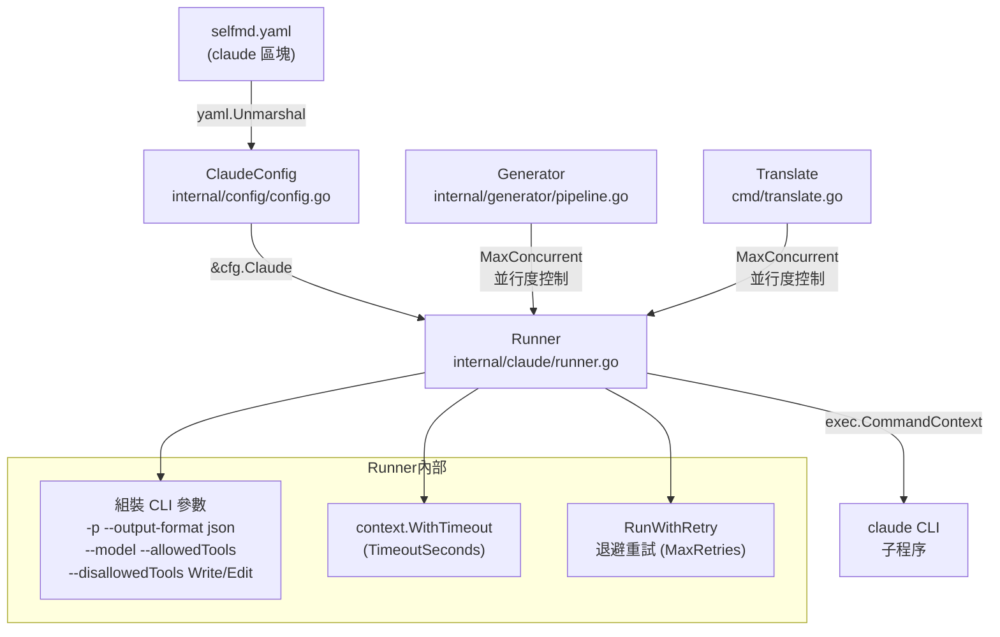
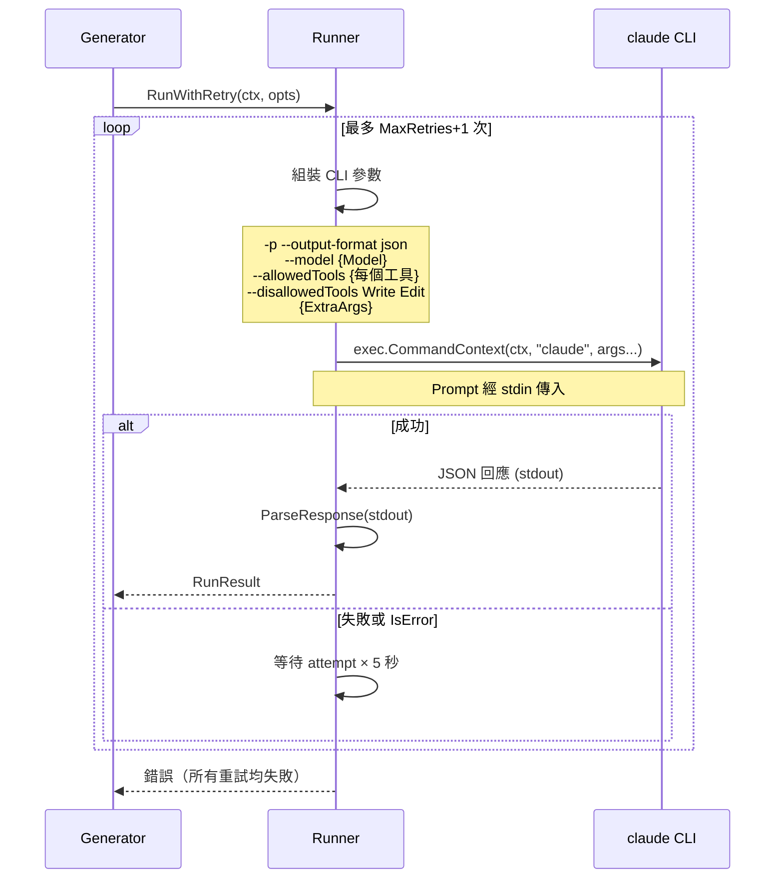

# Claude CLI 整合設定

控制 selfmd 如何呼叫 Claude CLI 子程序，包含模型選擇、並行度、逾時、重試與工具存取權限。

## 概述

`claude` 設定區塊定義了 selfmd 與 Claude CLI（`claude` 指令）互動的所有行為參數。selfmd 在文件產生管線的每個階段——目錄產生、內容頁面產生、翻譯——都會以子程序（subprocess）方式呼叫 Claude CLI，這些呼叫的行為均由此設定控制。

**核心職責：**
- 指定要使用的 Claude 模型版本
- 限制單次執行的並行 Claude 子程序數量，避免超出 API 速率限制
- 設定每次呼叫的最長等待時間（逾時）
- 控制失敗後的自動重試次數與退避間隔
- 限縮 Claude 可存取的工具，確保文件分析的安全邊界
- 注入自訂的額外 CLI 參數

## 設定結構

`selfmd.yaml` 中的 `claude` 區塊對應至 `ClaudeConfig` 結構：

```go
type ClaudeConfig struct {
    Model          string   `yaml:"model"`
    MaxConcurrent  int      `yaml:"max_concurrent"`
    TimeoutSeconds int      `yaml:"timeout_seconds"`
    MaxRetries     int      `yaml:"max_retries"`
    AllowedTools   []string `yaml:"allowed_tools"`
    ExtraArgs      []string `yaml:"extra_args"`
}
```

> 來源：internal/config/config.go#L82-L89

### 完整預設值

```go
Claude: ClaudeConfig{
    Model:          "sonnet",
    MaxConcurrent:  3,
    TimeoutSeconds: 300,
    MaxRetries:     2,
    AllowedTools:   []string{"Read", "Glob", "Grep"},
    ExtraArgs:      []string{},
},
```

> 來源：internal/config/config.go#L116-L123

## 欄位說明

### `model`

**型別：** `string`　**預設值：** `"sonnet"`

指定要使用的 Claude 模型。此值直接傳遞給 `claude --model` 旗標。若留空，則不傳遞 `--model` 旗標，由 Claude CLI 使用其自身預設值。

```yaml
claude:
  model: sonnet       # 使用 Claude Sonnet（較快、較省費用）
  # model: opus       # 使用 Claude Opus（較強、較貴）
```

### `max_concurrent`

**型別：** `int`　**預設值：** `3`　**最小值：** `1`

設定同時執行的 Claude CLI 子程序上限。此值控制「內容頁面產生」與「翻譯」兩個階段的並行工作數量。

- 設定過高可能觸發 Anthropic API 速率限制（Rate Limit）
- `selfmd generate --concurrency` 旗標可在執行期暫時覆寫此值
- 驗證邏輯保證此值不低於 `1`

### `timeout_seconds`

**型別：** `int`　**預設值：** `300`　**最小值：** `30`

每次 Claude CLI 呼叫的逾時秒數。超過此時間後，Runner 會取消子程序並回報逾時錯誤。

- 若文件量龐大或 Prompt 複雜，建議適度調高
- 驗證邏輯保證此值不低於 `30` 秒

### `max_retries`

**型別：** `int`　**預設值：** `2`　**最小值：** `0`

當 Claude CLI 呼叫失敗時，自動重試的最大次數。重試間隔採退避策略：第 N 次重試前等待 `N × 5` 秒。

- 設為 `0` 表示不重試
- 驗證邏輯保證此值不低於 `0`

### `allowed_tools`

**型別：** `[]string`　**預設值：** `["Read", "Glob", "Grep"]`

指定 Claude 在分析原始碼時可使用的工具清單。對應 `claude --allowedTools` 旗標，每個工具傳遞一次。

**注意：** 無論此設定為何，`Write` 與 `Edit` 工具一律被封鎖（傳遞 `--disallowedTools Write --disallowedTools Edit`），防止 Claude 直接修改原始碼。

```yaml
claude:
  allowed_tools:
    - Read    # 讀取檔案內容
    - Glob    # 依模式搜尋檔案
    - Grep    # 在檔案中搜尋文字
```

### `extra_args`

**型別：** `[]string`　**預設值：** `[]`

注入到每次 `claude` 指令的額外 CLI 參數，附加在自動產生的參數之後。可用於傳遞 selfmd 未直接支援的 Claude CLI 旗標。

```yaml
claude:
  extra_args:
    - "--verbose"
```

## 架構



## 核心流程

### Runner 呼叫流程



### 逾時處理

```go
timeout := opts.Timeout
if timeout == 0 {
    timeout = time.Duration(r.config.TimeoutSeconds) * time.Second
}

ctx, cancel := context.WithTimeout(ctx, timeout)
defer cancel()
```

> 來源：internal/claude/runner.go#L61-L67

### 重試退避邏輯

```go
for attempt := 0; attempt <= maxRetries; attempt++ {
    if attempt > 0 {
        backoff := time.Duration(attempt) * 5 * time.Second
        r.logger.Info("重試中", "attempt", attempt+1, "backoff", backoff)
        select {
        case <-ctx.Done():
            return nil, ctx.Err()
        case <-time.After(backoff):
        }
    }
    // ...
}
```

> 來源：internal/claude/runner.go#L117-L127

## 使用範例

### `selfmd.yaml` 完整 `claude` 區塊

```yaml
claude:
  model: sonnet
  max_concurrent: 3
  timeout_seconds: 300
  max_retries: 2
  allowed_tools:
    - Read
    - Glob
    - Grep
  extra_args: []
```

### 高吞吐量設定（大型專案）

```yaml
claude:
  model: sonnet
  max_concurrent: 5      # 提高並行度
  timeout_seconds: 600   # 延長逾時至 10 分鐘
  max_retries: 3
  allowed_tools:
    - Read
    - Glob
    - Grep
```

### 驗證邏輯

```go
func (c *Config) validate() error {
    if c.Claude.MaxConcurrent < 1 {
        c.Claude.MaxConcurrent = 1
    }
    if c.Claude.TimeoutSeconds < 30 {
        c.Claude.TimeoutSeconds = 30
    }
    if c.Claude.MaxRetries < 0 {
        c.Claude.MaxRetries = 0
    }
    return nil
}
```

> 來源：internal/config/config.go#L157-L174

## 工具限制設計

selfmd 在工具存取上採用「白名單 + 強制黑名單」的雙重策略：

| 機制 | 設定來源 | 說明 |
|------|----------|------|
| `--allowedTools` | `allowed_tools` 欄位 | 允許 Claude 使用的工具（唯讀分析工具） |
| `--disallowedTools Write` | 硬編碼於 Runner | 無論設定為何，一律封鎖寫入 |
| `--disallowedTools Edit` | 硬編碼於 Runner | 無論設定為何，一律封鎖編輯 |

此設計確保 Claude 只能「讀取」原始碼用於文件分析，無法修改任何檔案。相關實作：

```go
// Explicitly block Write/Edit to prevent content from being lost in denied tool calls
args = append(args, "--disallowedTools", "Write", "--disallowedTools", "Edit")
```

> 來源：internal/claude/runner.go#L55-L56

## 相關連結

- [設定說明](../index.md)
- [selfmd.yaml 結構總覽](../config-overview/index.md)
- [輸出與多語言設定](../output-language/index.md)
- [Git 整合設定](../git-config/index.md)
- [Claude CLI 執行器](../../core-modules/claude-runner/index.md)
- [文件產生管線](../../core-modules/generator/index.md)
- [翻譯階段](../../core-modules/generator/translate-phase/index.md)

## 參考檔案

| 檔案路徑 | 說明 |
|----------|------|
| `internal/config/config.go` | `ClaudeConfig` 結構定義、預設值與驗證邏輯 |
| `internal/claude/runner.go` | `Runner` 實作，負責組裝 CLI 參數與執行子程序 |
| `internal/claude/types.go` | `RunOptions`、`RunResult`、`CLIResponse` 型別定義 |
| `internal/claude/parser.go` | Claude CLI JSON 回應解析邏輯 |
| `internal/generator/pipeline.go` | `MaxConcurrent` 用於控制內容產生並行度 |
| `cmd/translate.go` | `MaxConcurrent` 用於控制翻譯並行度 |