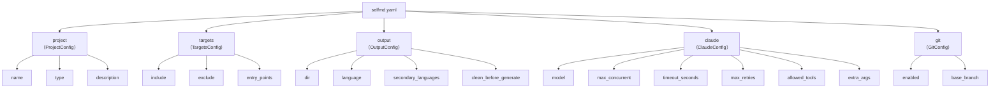
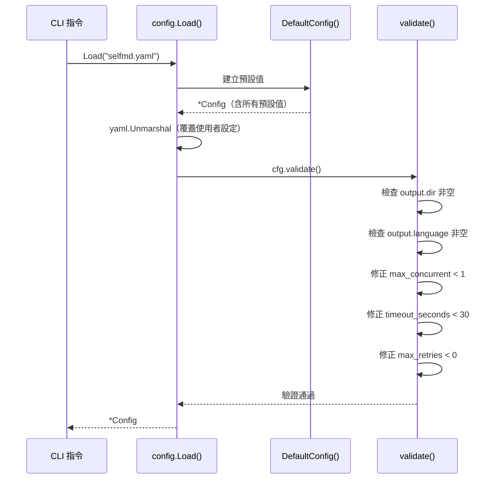

# selfmd.yaml 結構總覽

`selfmd.yaml` 是 selfmd 的核心設定檔，包含五個頂層區段，控制從專案掃描到 Claude CLI 呼叫的所有行為。

## 概述

`selfmd.yaml` 採用 YAML 格式，由 `internal/config/config.go` 定義的 `Config` 結構解析。執行任何 selfmd 指令前，系統會先載入並驗證此設定檔。

設定檔的五個頂層區段各自負責不同的功能面向：

| 區段 | Go 型別 | 功能說明 |
|------|---------|---------|
| `project` | `ProjectConfig` | 專案基本資訊（名稱、類型、描述） |
| `targets` | `TargetsConfig` | 掃描目標路徑（包含、排除、入口點） |
| `output` | `OutputConfig` | 輸出目錄與多語言設定 |
| `claude` | `ClaudeConfig` | Claude CLI 執行參數 |
| `git` | `GitConfig` | Git 整合與增量更新設定 |

執行 `selfmd init` 時，系統會自動偵測專案類型並套用預設值，產生完整的 `selfmd.yaml` 範本。設定檔路徑預設為 `selfmd.yaml`，可透過 `--config` 旗標覆蓋。

## 架構



## 完整結構說明

### `project` — 專案基本資訊

```yaml
project:
  name: myproject         # 專案名稱，用於文件標題與瀏覽器頁籤
  type: backend           # 專案類型：backend / frontend / fullstack / library
  description: ""         # 專案描述（可選）
```

> 來源：`internal/config/config.go#L19-L23`

`type` 欄位影響 Claude 產生文件時的上下文描述，`selfmd init` 會自動偵測（根據 `go.mod`、`package.json` 等標誌性檔案）。

---

### `targets` — 掃描目標設定

```yaml
targets:
  include:
    - src/**
    - pkg/**
    - cmd/**
    - internal/**
    - lib/**
    - app/**
  exclude:
    - vendor/**
    - node_modules/**
    - .git/**
    - .doc-build/**
    - "**/*.pb.go"
    - "**/generated/**"
    - dist/**
    - build/**
  entry_points:
    - main.go
    - cmd/root.go
```

> 來源：`internal/config/config.go#L25-L29`，預設值：`internal/config/config.go#L102-L109`

- `include`：以 glob 模式指定要掃描的目錄，支援 `**` 萬用字元
- `exclude`：排除自動產生的程式碼、依賴套件、建置產物等雜訊路徑
- `entry_points`：標記核心入口檔案，引導 Claude 優先理解專案架構

---

### `output` — 輸出與語言設定

```yaml
output:
  dir: .doc-build               # 文件輸出目錄
  language: zh-TW               # 主要文件語言（master lang）
  secondary_languages:          # 次要語言列表（翻譯用）
    - en-US
  clean_before_generate: false  # 每次產生前是否清除輸出目錄
```

> 來源：`internal/config/config.go#L31-L36`

**語言代碼**：`language` 與 `secondary_languages` 使用 BCP 47 格式。系統內建支援下列語言代碼：

| 代碼 | 語言名稱 |
|------|---------|
| `zh-TW` | 繁體中文 |
| `zh-CN` | 简体中文 |
| `en-US` | English |
| `ja-JP` | 日本語 |
| `ko-KR` | 한국어 |
| `fr-FR` | Français |
| `de-DE` | Deutsch |
| `es-ES` | Español |
| `pt-BR` | Português |
| `th-TH` | ไทย |
| `vi-VN` | Tiếng Việt |

> 來源：`internal/config/config.go#L39-L51`

`clean_before_generate` 可被 CLI 旗標 `--clean` 或 `--no-clean` 覆蓋。

---

### `claude` — Claude CLI 整合設定

```yaml
claude:
  model: sonnet           # Claude 模型識別符
  max_concurrent: 3       # 最大並行請求數
  timeout_seconds: 300    # 單次請求逾時（秒），最小值 30
  max_retries: 2          # 失敗重試次數，最小值 0
  allowed_tools:          # 允許 Claude 使用的工具清單
    - Read
    - Glob
    - Grep
  extra_args: []          # 傳遞給 claude CLI 的額外旗標
```

> 來源：`internal/config/config.go#L82-L89`，預設值：`internal/config/config.go#L116-L123`

`max_concurrent` 控制同時呼叫 Claude CLI 的數量，可透過 `selfmd generate --concurrency <N>` 在執行時覆蓋。

---

### `git` — Git 整合設定

```yaml
git:
  enabled: true           # 是否啟用 Git 整合（增量更新）
  base_branch: main       # 比對差異用的基準分支
```

> 來源：`internal/config/config.go#L91-L94`

啟用 Git 整合後，`selfmd update` 指令會比對 `base_branch` 與目前工作樹的差異，僅重新產生受影響的文件頁面。

## 載入與驗證流程



`Load()` 採用「預設值優先，使用者覆蓋」的策略：先建立完整的預設 `Config`，再以 YAML 內容覆蓋指定欄位。未填寫的欄位自動沿用預設值。

```go
func Load(path string) (*Config, error) {
    data, err := os.ReadFile(path)
    if err != nil {
        return nil, fmt.Errorf("無法讀取設定檔 %s: %w", path, err)
    }

    cfg := DefaultConfig()
    if err := yaml.Unmarshal(data, cfg); err != nil {
        return nil, fmt.Errorf("設定檔格式錯誤: %w", err)
    }

    if err := cfg.validate(); err != nil {
        return nil, err
    }

    return cfg, nil
}
```

> 來源：`internal/config/config.go#L131-L147`

## Prompt 模板語言選擇邏輯

`output.language` 不只控制文件輸出語言，也影響 Prompt 模板的選擇。目前內建模板僅支援 `zh-TW` 與 `en-US`；其他語言代碼會回退到 `en-US` 模板，並在 Prompt 中插入明確的語言輸出指示。

```go
// GetEffectiveTemplateLang returns which template folder to load.
func (o *OutputConfig) GetEffectiveTemplateLang() string {
    for _, lang := range SupportedTemplateLangs {
        if o.Language == lang {
            return o.Language
        }
    }
    return "en-US"
}

// NeedsLanguageOverride returns true when the template language differs from Language.
func (o *OutputConfig) NeedsLanguageOverride() bool {
    return o.GetEffectiveTemplateLang() != o.Language
}
```

> 來源：`internal/config/config.go#L58-L71`

## 相關連結

- [設定說明](../index.md) — 設定章節總覽
- [專案與掃描目標設定](../project-targets/index.md) — `project` 與 `targets` 區段詳解
- [輸出與多語言設定](../output-language/index.md) — `output` 區段與語言機制
- [Claude CLI 整合設定](../claude-config/index.md) — `claude` 區段詳解
- [Git 整合設定](../git-config/index.md) — `git` 區段詳解
- [selfmd init](../../cli/cmd-init/index.md) — 自動產生設定檔的指令
- [多語言支援](../../i18n/index.md) — 語言代碼與翻譯工作流程

## 參考檔案

| 檔案路徑 | 說明 |
|----------|------|
| `internal/config/config.go` | `Config` 結構定義、預設值、載入與驗證邏輯 |
| `cmd/init.go` | `selfmd init` 實作，包含專案類型自動偵測與設定檔產生 |
| `cmd/root.go` | 根指令定義，包含 `--config` 旗標宣告 |
| `cmd/generate.go` | `selfmd generate` 實作，展示設定檔如何傳遞至 Generator |
| `internal/generator/pipeline.go` | Generator 如何使用 Config 各欄位驅動文件產生流程 |