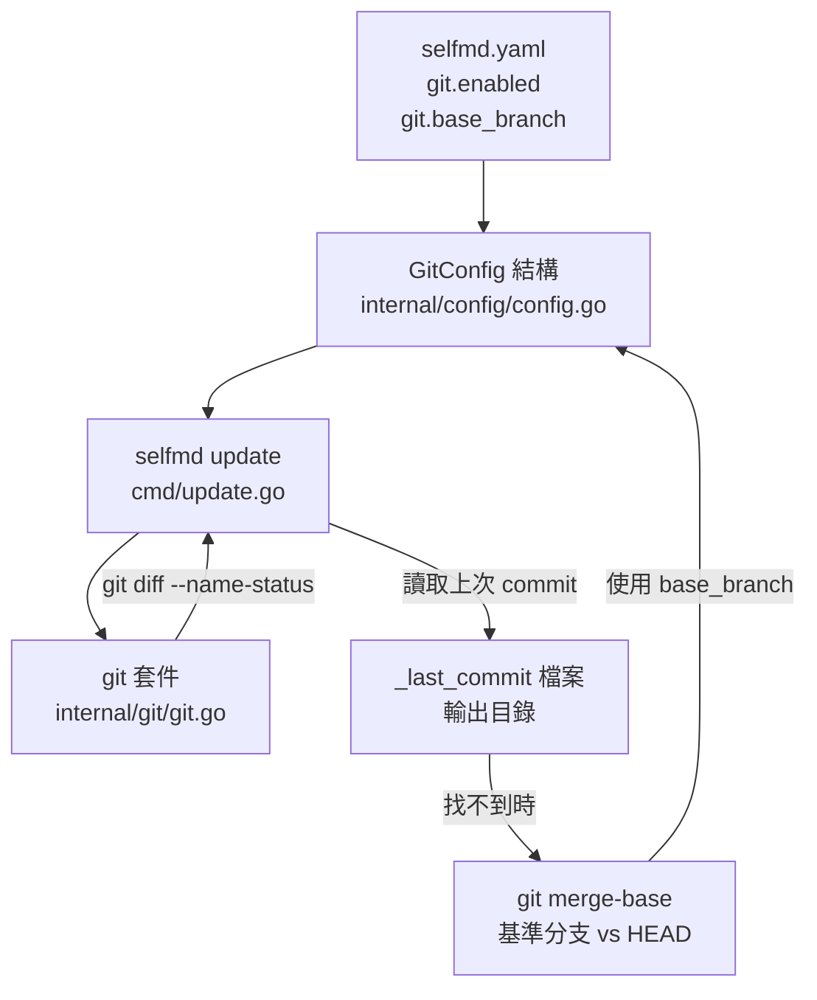
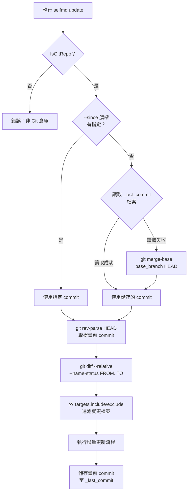

# Git 整合設定

設定 selfmd 如何利用 Git 歷史追蹤原始碼變更，以實現增量文件更新功能。

## 概述

selfmd 的 Git 整合設定位於 `selfmd.yaml` 的 `git` 區塊。此設定決定了 `selfmd update` 指令在執行增量更新時，如何比較 Git commit 以偵測受影響的原始碼檔案。

Git 整合的核心概念：

- **基準分支（Base Branch）**：作為比較起點的分支。當系統找不到上次執行記錄時，會以此分支與 `HEAD` 的 merge-base 作為比較起點。
- **啟用狀態（Enabled）**：控制是否啟用 Git diff 功能，目前此欄位由系統讀取，`selfmd update` 指令本身已強制要求當前目錄為 Git 倉庫。
- **Commit 記錄持久化**：每次執行 `generate` 或 `update` 後，系統會將當前的 commit hash 儲存至輸出目錄的 `_last_commit` 檔案，供下次增量更新使用。

## 架構



## 設定欄位說明

`GitConfig` 結構定義於 `internal/config/config.go`：

```go
type GitConfig struct {
	Enabled    bool   `yaml:"enabled"`
	BaseBranch string `yaml:"base_branch"`
}
```

> 來源：internal/config/config.go#L91-L94

### `git.enabled`

| 屬性 | 值 |
|------|-----|
| 類型 | `bool` |
| 預設值 | `true` |
| 必填 | 否 |

控制 Git 整合是否啟用。

### `git.base_branch`

| 屬性 | 值 |
|------|-----|
| 類型 | `string` |
| 預設值 | `"main"` |
| 必填 | 否 |

基準分支名稱。當系統找不到上次執行的 commit 記錄（`_last_commit` 檔案不存在）時，會以此分支為基準，使用 `git merge-base <base_branch> HEAD` 計算出比較起點。

## 預設值

`DefaultConfig()` 中 Git 設定的預設值：

```go
Git: GitConfig{
    Enabled:    true,
    BaseBranch: "main",
},
```

> 來源：internal/config/config.go#L124-L127

## selfmd.yaml 設定範例

```yaml
git:
  enabled: true
  base_branch: main
```

若你的主分支名稱為 `master`，請將 `base_branch` 改為：

```yaml
git:
  enabled: true
  base_branch: master
```

## 核心流程

以下為 `selfmd update` 指令如何使用 Git 設定決定比較範圍：



## 使用範例

### 基本增量更新

執行 `selfmd update` 時，系統會：

1. 從 `selfmd.yaml` 讀取 `git.base_branch`
2. 嘗試讀取上次儲存的 commit（`_last_commit` 檔案）
3. 若無記錄，則呼叫 `git merge-base` 以 `base_branch` 計算起點

```go
// cmd/update.go 中的比較起點決定邏輯
previousCommit := sinceCommit
if previousCommit == "" {
    saved, readErr := gen.Writer.ReadLastCommit()
    if readErr == nil && saved != "" {
        previousCommit = saved
    } else {
        base, err := git.GetMergeBase(rootDir, cfg.Git.BaseBranch)
        // ...
        previousCommit = base
    }
}
```

> 來源：cmd/update.go#L69-L86

### 使用 `--since` 旗標指定比較起點

你也可以直接指定比較起點的 commit hash，跳過自動偵測邏輯：

```bash
selfmd update --since abc1234
```

### `git diff` 輸出解析

`internal/git/git.go` 中的 `ParseChangedFiles` 函式負責解析 `git diff --name-status` 的輸出：

```go
// ChangedFile represents a single file from git diff --name-status output.
type ChangedFile struct {
	Status string // "M", "A", "D", "R"
	Path   string
}

// ParseChangedFiles parses git diff --name-status output into structured ChangedFile list.
func ParseChangedFiles(changedFiles string) []ChangedFile {
	var result []ChangedFile
	for _, line := range strings.Split(changedFiles, "\n") {
		line = strings.TrimSpace(line)
		if line == "" {
			continue
		}
		parts := strings.SplitN(line, "\t", 3)
		if len(parts) < 2 {
			continue
		}
		status := string(parts[0][0]) // "M", "A", "D", or "R" (R100 → R)
		path := parts[len(parts)-1]   // for renames, use destination path
		result = append(result, ChangedFile{Status: status, Path: path})
	}
	return result
}
```

> 來源：internal/git/git.go#L47-L70

### 變更檔案過濾

取得 Git diff 結果後，系統還會依據 `targets.include` 與 `targets.exclude` 設定進行過濾，排除不相關的檔案（如 `vendor/**`、`.git/**`）：

```go
changedFiles = git.FilterChangedFiles(changedFiles, cfg.Targets.Include, cfg.Targets.Exclude)
```

> 來源：cmd/update.go#L98

## 注意事項

- `selfmd update` 執行前需先確認當前目錄為 Git 倉庫，否則指令會直接回報錯誤
- 首次使用增量更新前，必須先執行 `selfmd generate` 建立初始文件，否則找不到 `_last_commit` 記錄時，會嘗試以 `base_branch` 計算 merge-base
- `git.enabled` 欄位目前在設定中存在，但 `selfmd update` 指令本身已強制要求 Git 環境，無論此值為何

## 相關連結

- [設定說明](../index.md)
- [selfmd.yaml 結構總覽](../config-overview/index.md)
- [Claude CLI 整合設定](../claude-config/index.md)
- [selfmd update](../../cli/cmd-update/index.md)
- [Git Diff 變更偵測](../../git-integration/change-detection/index.md)
- [受影響頁面判斷邏輯](../../git-integration/affected-pages/index.md)
- [增量更新](../../core-modules/incremental-update/index.md)

## 參考檔案

| 檔案路徑 | 說明 |
|----------|------|
| `internal/config/config.go` | `GitConfig` 結構定義、預設值與 `Config` 整體結構 |
| `internal/git/git.go` | Git 操作函式實作，包含 diff 解析、過濾與 commit 查詢 |
| `cmd/update.go` | `selfmd update` 指令實作，使用 Git 設定決定比較範圍 |
| `internal/generator/updater.go` | 增量更新邏輯，呼叫 Git 套件進行變更比對與文件重新產生 |
| `internal/output/writer.go` | `_last_commit` 檔案的讀寫實作 |