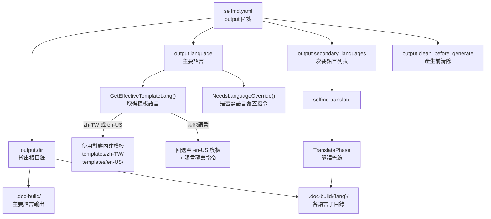
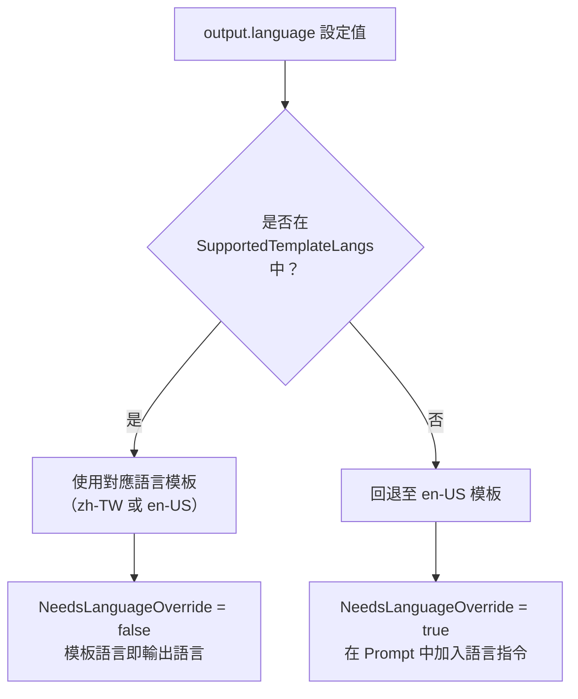

# 輸出與多語言設定

本頁說明 `selfmd.yaml` 中 `output` 區塊的所有欄位，以及 selfmd 如何支援主要語言文件產生與次要語言自動翻譯。

## 概述

`output` 區塊控制兩大類行為：

1. **輸出目錄設定**：指定文件產生到哪個路徑、是否在產生前清除舊檔案。
2. **多語言設定**：定義主要語言（master language）與次要語言（secondary languages）清單。主要語言決定文件的撰寫語言與 Prompt 模板的選取邏輯；次要語言則用於 `selfmd translate` 指令，將主要語言文件批次翻譯為指定語言。

selfmd 的多語言系統採用「先產生、再翻譯」的兩階段策略：先以主要語言完整產生所有技術文件，再透過 Claude 將每一頁翻譯為次要語言，翻譯結果儲存於 `.doc-build/{語言代碼}/` 子目錄中。

---

## 架構



---

## 設定欄位參考

`output` 區塊的完整結構定義如下：

```go
type OutputConfig struct {
    Dir                 string   `yaml:"dir"`
    Language            string   `yaml:"language"`
    SecondaryLanguages  []string `yaml:"secondary_languages"`
    CleanBeforeGenerate bool     `yaml:"clean_before_generate"`
}
```

> 來源：internal/config/config.go#L31-L36

### `output.dir`

| 項目 | 說明 |
|------|------|
| 類型 | `string` |
| 預設值 | `.doc-build` |
| 說明 | 所有文件的輸出根目錄。主要語言文件直接放置於此目錄，次要語言文件放置於 `{dir}/{lang}/` 子目錄。 |

### `output.language`

| 項目 | 說明 |
|------|------|
| 類型 | `string` |
| 預設值 | `zh-TW` |
| 驗證 | 不可為空字串 |
| 說明 | 主要語言代碼（BCP 47 格式）。決定 Claude Prompt 模板的選取語言，以及產生文件的輸出語言。 |

### `output.secondary_languages`

| 項目 | 說明 |
|------|------|
| 類型 | `[]string` |
| 預設值 | `[]`（空列表） |
| 說明 | 次要語言代碼列表。執行 `selfmd translate` 時，會逐一將主要語言文件翻譯為這些語言。若此欄位為空，`translate` 指令會回傳錯誤。 |

### `output.clean_before_generate`

| 項目 | 說明 |
|------|------|
| 類型 | `bool` |
| 預設值 | `false` |
| 說明 | 設為 `true` 時，每次執行 `selfmd generate` 前會先刪除並重建輸出目錄。等同於每次執行 `generate --clean`。 |

---

## 完整設定範例

以下為一個啟用多語言的典型設定：

```yaml
output:
  dir: .doc-build
  language: zh-TW
  secondary_languages:
    - en-US
    - ja-JP
  clean_before_generate: false
```

> 來源：internal/config/config.go#L110-L115（DefaultConfig 函式）

---

## 支援的語言代碼

selfmd 內建以下語言代碼與其對應的原生名稱。使用這些代碼時，語言名稱會自動顯示在文件導覽與翻譯流程的輸出中：

```go
var KnownLanguages = map[string]string{
    "zh-TW": "繁體中文",
    "zh-CN": "简体中文",
    "en-US": "English",
    "ja-JP": "日本語",
    "ko-KR": "한국어",
    "fr-FR": "Français",
    "de-DE": "Deutsch",
    "es-ES": "Español",
    "pt-BR": "Português",
    "th-TH": "ไทย",
    "vi-VN": "Tiếng Việt",
}
```

> 來源：internal/config/config.go#L39-L51

使用 `KnownLanguages` 以外的語言代碼（如 `it-IT`）仍可運作，但語言名稱將直接顯示為代碼本身（例如 `it-IT`）。

---

## Prompt 模板語言與語言覆蓋機制

selfmd 僅為以下兩種語言提供內建 Prompt 模板：

```go
var SupportedTemplateLangs = []string{"zh-TW", "en-US"}
```

> 來源：internal/config/config.go#L54

當 `output.language` 設為 `SupportedTemplateLangs` 以外的語言時，系統自動回退至 `en-US` 模板，並在 Prompt 中加入明確的語言覆蓋指令（language override），要求 Claude 以指定語言輸出文件。

此邏輯由以下兩個方法實作：

```go
// GetEffectiveTemplateLang returns which template folder to load.
// If Language has a built-in template set, returns it; otherwise falls back to "en-US".
func (o *OutputConfig) GetEffectiveTemplateLang() string {
    for _, lang := range SupportedTemplateLangs {
        if o.Language == lang {
            return o.Language
        }
    }
    return "en-US"
}

// NeedsLanguageOverride returns true when the template language differs from Language,
// meaning the prompt needs an explicit instruction to output in the configured language.
func (o *OutputConfig) NeedsLanguageOverride() bool {
    return o.GetEffectiveTemplateLang() != o.Language
}
```

> 來源：internal/config/config.go#L58-L71

### 模板語言選取邏輯



`Generator` 初始化時會呼叫 `GetEffectiveTemplateLang()` 來選取正確的模板資料夾：

```go
func NewGenerator(cfg *config.Config, rootDir string, logger *slog.Logger) (*Generator, error) {
    templateLang := cfg.Output.GetEffectiveTemplateLang()
    engine, err := prompt.NewEngine(templateLang)
    if err != nil {
        return nil, err
    }
    // ...
}
```

> 來源：internal/generator/pipeline.go#L34-L38

---

## 多語言輸出目錄結構

啟用次要語言後，輸出目錄結構如下：

```
.doc-build/                    ← 主要語言（output.language）
├── index.html                 ← 靜態瀏覽器
├── _catalog.json              ← 主要語言目錄資料
├── index.md
├── _sidebar.md
└── {章節}/
    └── {頁面}/
        └── index.md

.doc-build/en-US/              ← 次要語言（secondary_languages[0]）
├── _catalog.json
├── index.md
├── _sidebar.md
└── {章節}/
    └── {頁面}/
        └── index.md

.doc-build/ja-JP/              ← 次要語言（secondary_languages[1]）
└── ...
```

`Writer.ForLanguage()` 方法會建立一個指向語言子目錄的新 `Writer` 實體：

```go
// ForLanguage returns a new Writer that writes to a language-specific subdirectory.
func (w *Writer) ForLanguage(lang string) *Writer {
    return &Writer{
        BaseDir: filepath.Join(w.BaseDir, lang),
    }
}
```

> 來源：internal/output/writer.go#L139-L143

---

## 文件瀏覽器的語言中繼資料

執行 `selfmd generate` 或 `selfmd translate` 後，系統會產生 `DocMeta` 物件，記錄所有可用語言資訊供靜態文件瀏覽器使用：

```go
func (g *Generator) buildDocMeta() *output.DocMeta {
    meta := &output.DocMeta{
        DefaultLanguage: g.Config.Output.Language,
        AvailableLanguages: []output.LangInfo{
            {
                Code:       g.Config.Output.Language,
                NativeName: config.GetLangNativeName(g.Config.Output.Language),
                IsDefault:  true,
            },
        },
    }
    for _, lang := range g.Config.Output.SecondaryLanguages {
        meta.AvailableLanguages = append(meta.AvailableLanguages, output.LangInfo{
            Code:       lang,
            NativeName: config.GetLangNativeName(lang),
            IsDefault:  false,
        })
    }
    return meta
}
```

> 來源：internal/generator/pipeline.go#L184-L203

---

## 翻譯指令整合

`secondary_languages` 設定決定 `selfmd translate` 的翻譯目標。以下為 CLI 層的驗證邏輯：

```go
if len(cfg.Output.SecondaryLanguages) == 0 {
    return fmt.Errorf("設定檔中未定義 secondary_languages，無法翻譯")
}

// Determine target languages
targetLangs := cfg.Output.SecondaryLanguages
if len(translateLangs) > 0 {
    // Validate specified languages are in the config
    validLangs := make(map[string]bool)
    for _, l := range cfg.Output.SecondaryLanguages {
        validLangs[l] = true
    }
    for _, l := range translateLangs {
        if !validLangs[l] {
            return fmt.Errorf("語言 %s 不在 secondary_languages 列表中（可用：%s）", l, strings.Join(cfg.Output.SecondaryLanguages, ", "))
        }
    }
    targetLangs = translateLangs
}
```

> 來源：cmd/translate.go#L49-L67

透過 `--lang` 旗標可指定只翻譯部分語言，但指定的語言必須已在 `secondary_languages` 中定義，否則會回傳驗證錯誤。

---

## 導覽頁面的語言本地化

`output.md`、`index.md` 與 `_sidebar.md` 等導覽頁面的 UI 字串也支援多語言。目前內建 `zh-TW` 與 `en-US` 兩種 UI 字串集，其他語言自動回退至 `en-US`：

```go
var UIStrings = map[string]map[string]string{
    "zh-TW": {
        "techDocs":        "技術文件",
        "catalog":         "目錄",
        "home":            "首頁",
        "sectionContains": "本章節包含以下內容：",
        "autoGenerated":   "本文件由 [selfmd](https://github.com/monkenwu/selfmd) 自動產生",
    },
    "en-US": {
        "techDocs":        "Technical Documentation",
        "catalog":         "Table of Contents",
        "home":            "Home",
        "sectionContains": "This section contains the following:",
        "autoGenerated":   "This documentation was automatically generated by [selfmd](https://github.com/monkenwu/selfmd)",
    },
}
```

> 來源：internal/output/navigation.go#L12-L27

---

## 相關連結

- [selfmd.yaml 結構總覽](../config-overview/index.md)
- [專案與掃描目標設定](../project-targets/index.md)
- [Claude CLI 整合設定](../claude-config/index.md)
- [selfmd translate 指令](../../cli/cmd-translate/index.md)
- [支援的語言與模板](../../i18n/supported-languages/index.md)
- [翻譯工作流程](../../i18n/translation-workflow/index.md)
- [翻譯階段](../../core-modules/generator/translate-phase/index.md)
- [Prompt 模板引擎](../../core-modules/prompt-engine/index.md)

---

## 參考檔案

| 檔案路徑 | 說明 |
|----------|------|
| `internal/config/config.go` | `OutputConfig` 結構定義、`KnownLanguages`、`SupportedTemplateLangs`、`GetEffectiveTemplateLang()`、`NeedsLanguageOverride()`、`GetLangNativeName()` |
| `internal/generator/pipeline.go` | `Generator` 初始化（模板語言選取）、`buildDocMeta()`（多語言中繼資料） |
| `internal/generator/translate_phase.go` | 翻譯管線主邏輯、`translatePages()`、`buildTranslatedCatalog()` |
| `internal/output/writer.go` | `DocMeta`、`LangInfo` 定義、`ForLanguage()` 方法 |
| `internal/output/navigation.go` | `UIStrings` 多語言 UI 字串、`GenerateIndex()`、`GenerateSidebar()` |
| `internal/prompt/engine.go` | `TranslatePromptData` 定義、`RenderTranslate()` 方法 |
| `internal/prompt/templates/translate.tmpl` | 翻譯 Prompt 模板（共用，語言無關） |
| `cmd/translate.go` | `translate` 指令實作、`secondary_languages` 驗證邏輯 |
| `cmd/init.go` | `init` 指令實作（展示預設輸出設定） |