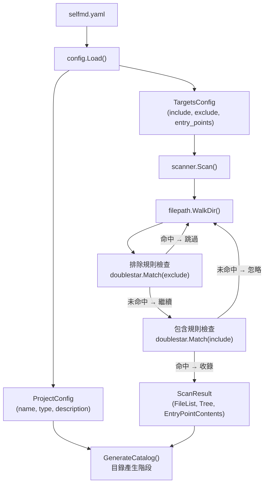
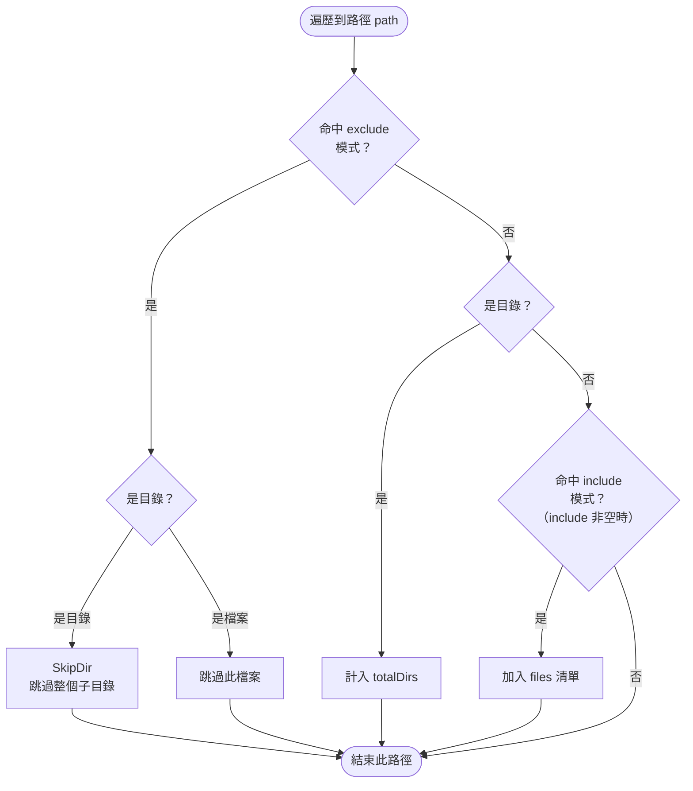

# 專案與掃描目標設定

`selfmd.yaml` 中的 `project` 與 `targets` 兩個頂層區段，定義了文件化對象的基本資訊與掃描範圍。這兩個設定區段是 selfmd 理解「要為哪個專案的哪些檔案」產生文件的核心依據。

## 概述

selfmd 在執行 `generate` 或 `update` 指令時，首先會讀取設定檔，再交由掃描器（Scanner）根據 `targets` 的 `include`、`exclude` 規則遍歷目錄，過濾出需要分析的原始碼檔案。`project` 區段則提供專案的名稱、類型等中繼資料，作為 Claude 產生文件時的重要上下文。

關鍵概念說明：
- **Glob 模式**（glob pattern）：使用 `**` 萬用字元匹配多層目錄的路徑匹配語法，底層由 `doublestar` 函式庫實作。
- **入口點**（entry points）：額外讀取並完整傳遞給 Claude 的特定檔案，通常為 `main.go`、`cmd/root.go` 等程式進入點。
- **排除優先**：exclude 規則的優先順序高於 include 規則，若一個路徑同時符合兩者，以排除為準。

`selfmd init` 指令會自動偵測專案類型並產生包含合理預設值的設定檔，使用者通常只需微調 `include`／`exclude` 即可。

## 架構



## `project` 區段

`project` 區段提供當前專案的基本描述資訊，這些資訊會直接注入 Claude 的 Prompt 中，幫助 AI 理解專案背景。

```yaml
project:
  name: selfmd
  type: backend
  description: ""
```

### 欄位說明

| 欄位 | 型別 | 必填 | 預設值 | 說明 |
|------|------|------|--------|------|
| `name` | string | 否 | 當前目錄名稱 | 專案名稱，顯示於文件標題與靜態瀏覽器 |
| `type` | string | 否 | `backend` | 專案類型，提示 Claude 文件架構風格 |
| `description` | string | 否 | 空字串 | 專案的附加說明（選填） |

### 可用的 `type` 值

`selfmd init` 的自動偵測邏輯會根據特定指標檔案決定專案類型：

```go
checks := []struct {
    file       string
    pType      string
    entries    []string
}{
    {"go.mod", "backend", []string{"main.go", "cmd/root.go"}},
    {"Cargo.toml", "backend", []string{"src/main.rs", "src/lib.rs"}},
    {"package.json", "frontend", []string{"src/index.ts", "src/index.js", "src/main.ts", "src/App.tsx"}},
    {"pom.xml", "backend", []string{"src/main/java"}},
    {"build.gradle", "backend", []string{"src/main/java"}},
    {"requirements.txt", "backend", []string{"main.py", "app.py", "src/main.py"}},
    {"pyproject.toml", "backend", []string{"src/main.py", "main.py"}},
    {"composer.json", "backend", []string{"public/index.php", "src/Kernel.php"}},
    {"Gemfile", "backend", []string{"config/application.rb", "app/"}},
}
```

> 來源：`cmd/init.go#L61-L75`

| `type` 值 | 意義 |
|-----------|------|
| `backend` | 後端服務、API、CLI 工具 |
| `frontend` | 前端應用程式（SPA、Web App） |
| `fullstack` | 同時包含前後端的全端專案 |
| `library` | 函式庫或無法偵測到指標檔案的專案 |

若同時存在 `package.json` 與 `go.mod`（或 `server/` 目錄），則自動判定為 `fullstack`。

## `targets` 區段

`targets` 區段控制掃描器要分析哪些檔案，是影響文件覆蓋範圍最關鍵的設定。

```yaml
targets:
  include:
    - src/**
    - pkg/**
    - cmd/**
    - internal/**
    - lib/**
    - app/**
  exclude:
    - vendor/**
    - node_modules/**
    - .git/**
    - .doc-build/**
    - "**/*.pb.go"
    - "**/generated/**"
    - dist/**
    - build/**
  entry_points:
    - main.go
    - cmd/root.go
```

### 欄位說明

| 欄位 | 型別 | 必填 | 預設值 | 說明 |
|------|------|------|--------|------|
| `include` | []string | 否 | 見下方 | 需要掃描的路徑模式（glob），空陣列代表包含所有檔案 |
| `exclude` | []string | 否 | 見下方 | 需要排除的路徑模式（glob），優先於 include |
| `entry_points` | []string | 否 | `[]` | 額外讀取並完整注入 Prompt 的重要檔案路徑 |

### 預設的 `include` 模式

```go
Include: []string{"src/**", "pkg/**", "cmd/**", "internal/**", "lib/**", "app/**"},
```

> 來源：`internal/config/config.go#L103`

### 預設的 `exclude` 模式

```go
Exclude: []string{
    "vendor/**", "node_modules/**", ".git/**", ".doc-build/**",
    "**/*.pb.go", "**/generated/**", "dist/**", "build/**",
},
```

> 來源：`internal/config/config.go#L104-L108`

## 掃描規則的執行順序

掃描器在遍歷目錄時，排除規則（exclude）的優先級高於包含規則（include）。當掃描到一個目錄且命中 exclude 規則時，會直接跳過整個子目錄樹（`filepath.SkipDir`），大幅提升效能。

```go
// check excludes
for _, pattern := range cfg.Targets.Exclude {
    matched, _ := doublestar.Match(pattern, rel)
    if matched {
        if d.IsDir() {
            return filepath.SkipDir
        }
        return nil
    }
}

// ...（目錄本身不做 include 過濾）

// check includes
if len(cfg.Targets.Include) > 0 {
    included := false
    for _, pattern := range cfg.Targets.Include {
        matched, _ := doublestar.Match(pattern, rel)
        if matched {
            included = true
            break
        }
    }
    if !included {
        return nil
    }
}
```

> 來源：`internal/scanner/scanner.go#L33-L61`

### 過濾流程



## 入口點（Entry Points）的作用

`entry_points` 中指定的檔案，會在掃描完成後被讀取，其完整內容會格式化後注入 Claude 的目錄產生 Prompt（`CatalogPromptData.EntryPoints`）。這讓 Claude 在理解專案結構時能直接閱讀最核心的程式碼邏輯。

```go
// read entry points
entryPointContents := make(map[string]string)
for _, ep := range cfg.Targets.EntryPoints {
    content := readFileIfExists(rootDir, ep)
    if content != "" {
        entryPointContents[ep] = content
    }
}
```

> 來源：`internal/scanner/scanner.go#L83-L91`

入口點檔案會被截斷至 10,000 字元以避免超出 context 限制，並以 Markdown 程式碼區塊格式傳遞：

```go
func (s *ScanResult) EntryPointsFormatted() string {
    if len(s.EntryPointContents) == 0 {
        return "(no entry points specified)"
    }

    var sb strings.Builder
    for path, content := range s.EntryPointContents {
        sb.WriteString("### " + path + "\n```\n")
        // truncate large files
        if len(content) > 10000 {
            content = content[:10000] + "\n... (truncated)"
        }
        sb.WriteString(content)
        sb.WriteString("\n```\n\n")
    }
    return sb.String()
}
```

> 來源：`internal/scanner/scanner.go#L143-L160`

## 常見設定範例

### Go 後端專案（預設）

```yaml
project:
  name: my-service
  type: backend

targets:
  include:
    - cmd/**
    - internal/**
    - pkg/**
  exclude:
    - vendor/**
    - .doc-build/**
    - "**/*.pb.go"
  entry_points:
    - main.go
    - cmd/root.go
```

### Node.js 前端專案

```yaml
project:
  name: my-frontend
  type: frontend

targets:
  include:
    - src/**
    - components/**
    - pages/**
  exclude:
    - node_modules/**
    - dist/**
    - "**/*.test.ts"
  entry_points:
    - src/main.ts
    - src/App.tsx
```

### 排除特定目錄與檔案類型

```yaml
targets:
  include:
    - src/**
  exclude:
    - src/vendor/**
    - "**/*.generated.go"
    - "**/testdata/**"
    - "**/*_test.go"
```

## 相關連結

- [selfmd.yaml 結構總覽](../config-overview/index.md)
- [輸出與多語言設定](../output-language/index.md)
- [Claude CLI 整合設定](../claude-config/index.md)
- [Git 整合設定](../git-config/index.md)
- [專案掃描器](../../core-modules/scanner/index.md)
- [selfmd init 指令](../../cli/cmd-init/index.md)

## 參考檔案

| 檔案路徑 | 說明 |
|----------|------|
| `internal/config/config.go` | `Config`、`ProjectConfig`、`TargetsConfig` 結構定義、預設值、載入與驗證邏輯 |
| `internal/scanner/scanner.go` | `Scan()` 實作：目錄遍歷、include/exclude 過濾、entry points 讀取 |
| `internal/scanner/filetree.go` | `ScanResult`、`FileNode` 結構定義；`BuildTree()`、`RenderTree()` 實作 |
| `cmd/init.go` | `init` 指令實作；`detectProject()` 自動偵測專案類型與入口點 |
| `internal/prompt/engine.go` | `CatalogPromptData` 結構，顯示 `ProjectType`、`EntryPoints`、`FileTree` 如何注入 Prompt |
| `internal/generator/catalog_phase.go` | 目錄產生階段，展示 `ProjectConfig` 與 `ScanResult` 如何組合成 Prompt |
| `internal/generator/pipeline.go` | 完整管線流程，顯示 `scanner.Scan()` 被呼叫的時機與上下文 |