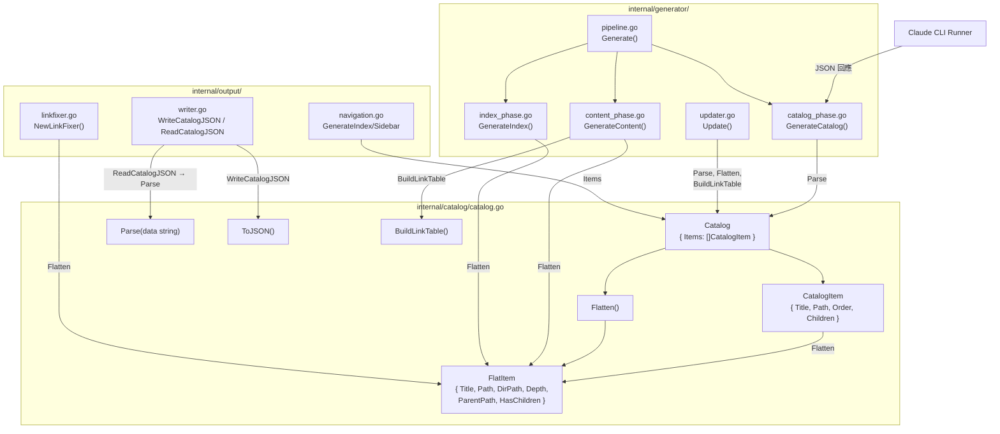
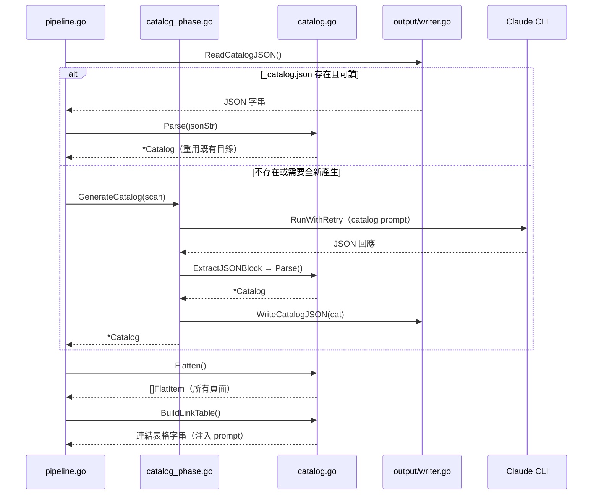
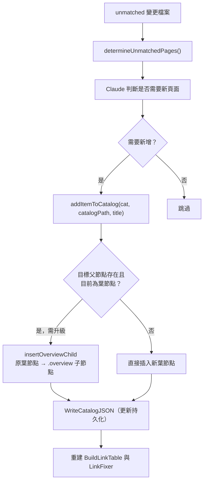

# 文件目錄管理

`catalog` 模組是 selfmd 的核心資料結構層，負責定義、解析、展平與序列化整份文件的樹狀目錄，並為下游的內容產生、導航輸出與增量更新提供統一的資料存取介面。

## 概述

文件目錄（Catalog）是 selfmd 整個產生流程的骨幹。它由 Claude 根據專案原始碼結構一次性產生，以 JSON 格式持久化儲存於輸出目錄中，並在後續所有階段（內容產生、導航輸出、增量更新）中被重複讀取與使用。

核心概念說明：

- **Catalog**：目錄的根節點，持有一組 `CatalogItem` 作為頂層章節
- **CatalogItem**：樹狀節點，可遞迴包含子節點，代表一個文件章節
- **FlatItem**：展平後的線性節點，包含深度優先遍歷所計算出的完整路徑資訊，供下游模組使用
- **dot-notation 路徑**：如 `core-modules.authentication`，作為目錄項目的唯一識別符
- **filesystem 路徑**：如 `core-modules/authentication`，對應實際的輸出目錄結構

目錄管理模組解決了「樹狀結構 → 線性可迭代清單 → 檔案系統目錄」的全程轉換問題，同時相容 Claude 回傳的兩種路徑格式（相對路徑 Format A 與含父層的完整路徑 Format B）。

## 架構



## 資料結構

### Catalog 與 CatalogItem

```go
// Catalog represents the documentation catalog structure.
type Catalog struct {
	Items []CatalogItem `json:"items"`
}

// CatalogItem represents a single item in the catalog tree.
type CatalogItem struct {
	Title    string        `json:"title"`
	Path     string        `json:"path"`
	Order    int           `json:"order"`
	Children []CatalogItem `json:"children"`
}
```

> 來源：`internal/catalog/catalog.go#L9-L20`

`CatalogItem.Path` 存放的是**相對於父節點的路徑片段**（如 `authentication`）或**完整的 filesystem 路徑**（如 `core-modules/authentication`），視 Claude 回傳的格式而定。`flattenItem` 函式會統一正規化為 dot-notation。

### FlatItem

```go
// FlatItem represents a flattened catalog item with computed paths.
type FlatItem struct {
	Title      string
	Path       string // dot-notation path, e.g., "core-modules.authentication"
	DirPath    string // filesystem path, e.g., "core-modules/authentication"
	Depth      int
	ParentPath string
	HasChildren bool
}
```

> 來源：`internal/catalog/catalog.go#L22-L30`

`FlatItem` 是下游模組的主要消費介面。`DirPath` 直接對應 `.doc-build/` 目錄下的子目錄結構。

## 核心方法

### Parse — 解析 JSON 目錄

```go
// Parse parses a JSON string into a Catalog.
func Parse(data string) (*Catalog, error) {
	var cat Catalog
	if err := json.Unmarshal([]byte(data), &cat); err != nil {
		return nil, fmt.Errorf("目錄 JSON 解析失敗: %w", err)
	}

	if len(cat.Items) == 0 {
		return nil, fmt.Errorf("目錄不可為空")
	}

	return &cat, nil
}
```

> 來源：`internal/catalog/catalog.go#L32-L44`

`Parse` 是目錄的入口，在兩個場景下被呼叫：
1. `GenerateCatalog()` 取得 Claude 回傳 JSON 後立即呼叫
2. `pipeline.go` 的 `Generate()` 嘗試載入既有的 `_catalog.json` 時呼叫

### Flatten — 深度優先展平

```go
// Flatten returns all catalog items in depth-first order.
func (c *Catalog) Flatten() []FlatItem {
	var items []FlatItem
	for _, item := range c.Items {
		flattenItem(&items, item, "", 0)
	}
	return items
}
```

> 來源：`internal/catalog/catalog.go#L46-L53`

`Flatten` 以深度優先順序（DFS）走訪整棵樹，輸出線性的 `[]FlatItem`。其核心邏輯由 `flattenItem` 遞迴實作，並相容兩種路徑格式：

```go
func flattenItem(items *[]FlatItem, item CatalogItem, parentPath string, depth int) {
	// Handle both formats:
	// Format A: child.Path = "introduction" (relative, needs parent prefix)
	// Format B: child.Path = "overview/introduction" (already includes parent)
	path := item.Path
	dirPath := strings.ReplaceAll(path, ".", "/")

	if parentPath != "" {
		parentDir := strings.ReplaceAll(parentPath, ".", "/")
		if !strings.HasPrefix(dirPath, parentDir+"/") {
			path = parentPath + "." + item.Path
			dirPath = strings.ReplaceAll(path, ".", "/")
		} else {
			path = strings.ReplaceAll(dirPath, "/", ".")
		}
	}
	// ...
}
```

> 來源：`internal/catalog/catalog.go#L55-L87`

### BuildLinkTable — 建立 Prompt 用連結表格

```go
// BuildLinkTable returns a formatted string showing all catalog items
// and their corresponding directory paths, for use in prompts.
func (c *Catalog) BuildLinkTable() string {
	items := c.Flatten()
	var sb strings.Builder
	for _, item := range items {
		indent := strings.Repeat("  ", item.Depth)
		sb.WriteString(fmt.Sprintf("%s- 「%s」 → %s/index.md\n", indent, item.Title, item.DirPath))
	}
	return sb.String()
}
```

> 來源：`internal/catalog/catalog.go#L103-L113`

此方法產生的字串會被嵌入至 content.tmpl prompt 中，讓 Claude 在撰寫各頁面的「相關連結」章節時，能正確引用其他頁面的路徑。

### ToJSON — 序列化為 JSON

```go
// ToJSON serializes the catalog to indented JSON.
func (c *Catalog) ToJSON() (string, error) {
	data, err := json.MarshalIndent(c, "", "  ")
	if err != nil {
		return "", err
	}
	return string(data), nil
}
```

> 來源：`internal/catalog/catalog.go#L89-L96`

`ToJSON` 配合 `output.Writer.WriteCatalogJSON()` 將目錄持久化至 `.doc-build/_catalog.json`，供後續的增量更新（`selfmd update`）重新讀取。

## 核心流程

### 目錄生命週期



### 增量更新中的目錄擴展

當 `selfmd update` 偵測到未被現有文件覆蓋的變更檔案時，會動態向目錄新增項目：



> 來源：`internal/generator/updater.go#L369-L430`

## 使用範例

### 在產生器中取得所有頁面

```go
// 在 content_phase.go 中，取得目錄的線性清單並並行產生每一頁
items := cat.Flatten()
catalogTable := cat.BuildLinkTable()
linkFixer := output.NewLinkFixer(cat)

for _, item := range items {
    // 每個 item 是 FlatItem，可直接用 item.DirPath 寫入檔案
    err := g.generateSinglePage(ctx, scan, item, catalogTable, linkFixer, "")
}
```

> 來源：`internal/generator/content_phase.go#L22-L55`

### WriteCatalogJSON 持久化目錄

```go
// 在 pipeline.go 中，目錄產生後立即持久化
if err := g.Writer.WriteCatalogJSON(cat); err != nil {
    g.Logger.Warn("保存目錄 JSON 失敗", "error", err)
}
```

> 來源：`internal/generator/pipeline.go#L124-L126`

### 讀取既有目錄（增量更新）

```go
// 在 updater.go 中，讀取上次產生的目錄
existingCatalogJSON, err := g.Writer.ReadCatalogJSON()
if err != nil {
    return fmt.Errorf("讀取現有目錄失敗（請先執行 selfmd generate）: %w", err)
}
cat, err := catalog.Parse(existingCatalogJSON)
```

> 來源：`internal/generator/updater.go#L33-L40`

### BuildLinkTable 輸出範例

`BuildLinkTable()` 產生的字串格式如下（以本專案的目錄為例）：

```
- 「概述」 → overview/index.md
  - 「專案介紹與功能特色」 → overview/introduction/index.md
  - 「技術棧與相依套件」 → overview/tech-stack/index.md
- 「核心模組」 → core-modules/index.md
  - 「文件目錄管理」 → core-modules/catalog/index.md
```

> 來源：`internal/catalog/catalog.go#L103-L113`

## 相關連結

- [文件產生管線](../generator/index.md) — 目錄在四階段管線中的完整使用流程
- [目錄產生階段](../generator/catalog-phase/index.md) — 呼叫 Claude 產生初始目錄的詳細實作
- [Prompt 模板引擎](../prompt-engine/index.md) — `CatalogPromptData` 與 `catalog.tmpl` 的渲染機制
- [Claude CLI 執行器](../claude-runner/index.md) — `RunWithRetry` 與 `ExtractJSONBlock` 的實作細節
- [增量更新](../incremental-update/index.md) — `addItemToCatalog` 的動態目錄擴展流程
- [輸出寫入與連結修復](../output-writer/index.md) — `WriteCatalogJSON`、`ReadCatalogJSON` 與 `LinkFixer` 的使用方式
- [整體流程與四階段管線](../../architecture/pipeline/index.md) — 目錄在整體架構中的角色

## 參考檔案

| 檔案路徑 | 說明 |
|----------|------|
| `internal/catalog/catalog.go` | `Catalog`、`CatalogItem`、`FlatItem` 結構定義，以及 `Parse`、`Flatten`、`ToJSON`、`BuildLinkTable` 等核心方法實作 |
| `internal/generator/catalog_phase.go` | `GenerateCatalog()`：呼叫 Claude 並使用 `catalog.Parse` 解析回應 |
| `internal/generator/pipeline.go` | 四階段管線主流程，包含目錄的快取讀取與持久化邏輯 |
| `internal/generator/content_phase.go` | `GenerateContent()`：使用 `cat.Flatten()` 與 `cat.BuildLinkTable()` 並行產生頁面 |
| `internal/generator/index_phase.go` | `GenerateIndex()`：使用 `cat.Flatten()` 產生分類索引頁 |
| `internal/generator/updater.go` | `Update()`、`addItemToCatalog()`：增量更新流程與動態目錄擴展 |
| `internal/output/writer.go` | `WriteCatalogJSON()`、`ReadCatalogJSON()`：目錄的 JSON 持久化讀寫 |
| `internal/output/navigation.go` | `GenerateIndex()`、`GenerateSidebar()`：使用 `cat.Items` 產生導航檔案 |
| `internal/prompt/engine.go` | `CatalogPromptData` 定義與 `RenderCatalog()` 渲染方法 |