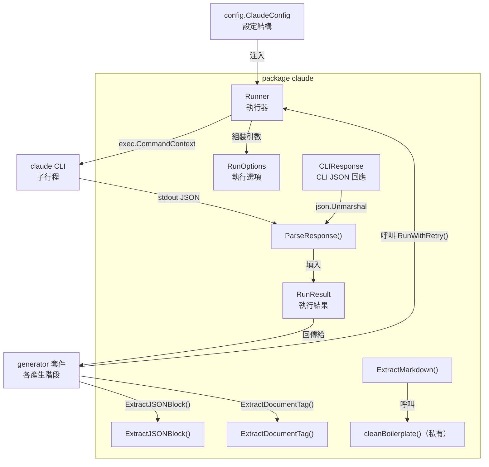
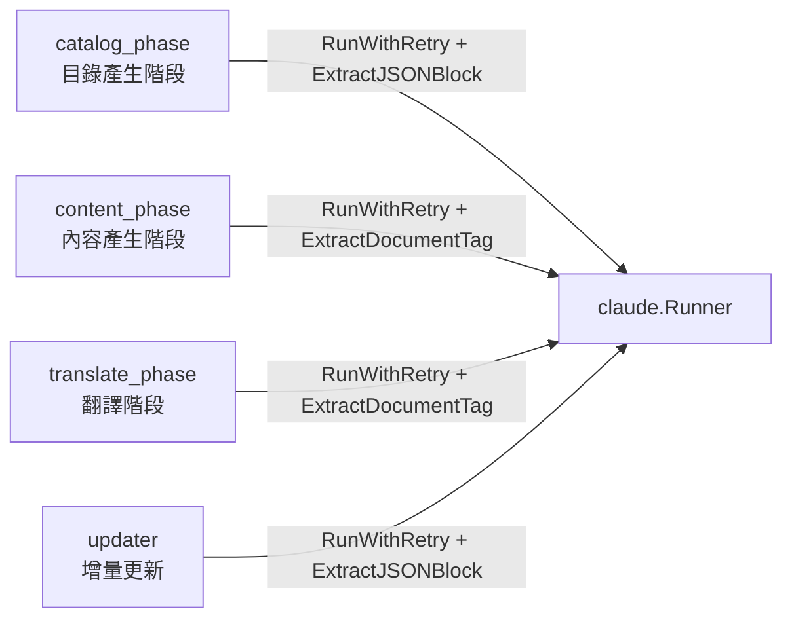

# Claude CLI 執行器

`claude` 套件封裝了對 Claude CLI 子行程的所有呼叫，提供統一的執行介面、重試邏輯、超時控制以及回應解析功能。

## 概述

Claude CLI 執行器（`internal/claude`）是 selfmd 與 AI 模型互動的唯一入口。它負責：

- **子行程管理**：透過 `os/exec` 啟動 `claude -p --output-format json` 子行程，並以 stdin 傳入 Prompt
- **參數組裝**：根據 `ClaudeConfig` 與每次呼叫的 `RunOptions` 動態組裝 CLI 引數
- **安全限制**：強制禁止 Claude 使用 `Write`、`Edit` 工具，防止子行程修改本地檔案
- **重試機制**：在呼叫失敗或 Claude 本身回報錯誤時，以線性退避（linear backoff）自動重試
- **回應解析**：將 JSON 格式的 CLI 輸出轉換為 Go 結構體，並提供多種輔助函式從 Claude 回應中擷取特定格式內容

整個產生管線（`internal/generator`）的所有階段皆共用同一個 `Runner` 實例，由 `Generator` 結構體持有並傳遞。

## 架構

### 模組結構



### 依賴關係



## 核心型別

### RunOptions — 執行選項

每次呼叫 Claude CLI 時傳入的參數集合：

```go
// RunOptions configures a single Claude CLI invocation.
type RunOptions struct {
	Prompt       string
	WorkDir      string        // CWD for the claude process
	AllowedTools []string      // tool restrictions
	Model        string        // model override
	Timeout      time.Duration // per-invocation timeout
	ExtraArgs    []string      // additional CLI arguments
}
```

> 來源：internal/claude/types.go#L6-L13

| 欄位 | 說明 |
|------|------|
| `Prompt` | 傳入 Claude stdin 的完整提示文字 |
| `WorkDir` | 子行程的工作目錄，用於 Claude 存取專案檔案 |
| `AllowedTools` | 覆蓋設定中的 `allowed_tools`，若為空則使用設定值 |
| `Model` | 覆蓋設定中的 `model`，若為空則使用設定值 |
| `Timeout` | 覆蓋設定中的 `timeout_seconds`，若為零則使用設定值 |
| `ExtraArgs` | 附加在設定 `extra_args` 之後的額外 CLI 引數 |

### RunResult — 執行結果

```go
// RunResult holds the parsed result from a Claude CLI invocation.
type RunResult struct {
	Content    string  // the text result from Claude
	IsError    bool    // whether Claude reported an error
	DurationMs int64   // execution time in milliseconds
	CostUSD    float64 // cost of this invocation
	SessionID  string  // Claude session ID
}
```

> 來源：internal/claude/types.go#L16-L23

### CLIResponse — CLI JSON 原始回應

對應 `claude -p --output-format json` 輸出的 JSON 結構：

```go
// CLIResponse represents the JSON response from `claude -p --output-format json`.
type CLIResponse struct {
	Type       string  `json:"type"`
	Subtype    string  `json:"subtype"`
	IsError    bool    `json:"is_error"`
	Result     string  `json:"result"`
	DurationMs int64   `json:"duration_ms"`
	TotalCost  float64 `json:"total_cost_usd"`
	SessionID  string  `json:"session_id"`
}
```

> 來源：internal/claude/types.go#L25-L33

## 執行方法

### Run() — 單次呼叫

`Run()` 執行一次 Claude CLI 呼叫，組裝引數、建立子行程、傳遞 Prompt、等待結果並解析回應：

```go
// Run executes a single Claude CLI invocation.
func (r *Runner) Run(ctx context.Context, opts RunOptions) (*RunResult, error) {
	// build command args
	args := []string{
		"-p",
		"--output-format", "json",
	}

	model := opts.Model
	if model == "" {
		model = r.config.Model
	}
	if model != "" {
		args = append(args, "--model", model)
	}

	// ...（工具清單組裝省略）

	// Explicitly block Write/Edit to prevent content from being lost in denied tool calls
	args = append(args, "--disallowedTools", "Write", "--disallowedTools", "Edit")

	// ...（超時、子行程建立省略）

	// pipe prompt via stdin
	cmd.Stdin = strings.NewReader(opts.Prompt)
```

> 來源：internal/claude/runner.go#L30-L75

**引數組裝優先順序：**

1. 固定引數：`-p`、`--output-format json`
2. Model：`opts.Model` > `config.Model`（均為空則不指定）
3. AllowedTools：`opts.AllowedTools` > `config.AllowedTools`
4. 強制禁用：`--disallowedTools Write --disallowedTools Edit`
5. 附加引數：`config.ExtraArgs` + `opts.ExtraArgs`

### RunWithRetry() — 帶重試呼叫

`RunWithRetry()` 在 `Run()` 基礎上加入線性退避重試。重試次數由 `config.MaxRetries` 控制，每次重試等待 `attempt * 5` 秒：

```go
// RunWithRetry executes a Claude CLI invocation with retry logic.
func (r *Runner) RunWithRetry(ctx context.Context, opts RunOptions) (*RunResult, error) {
	maxRetries := r.config.MaxRetries
	var lastErr error

	for attempt := 0; attempt <= maxRetries; attempt++ {
		if attempt > 0 {
			backoff := time.Duration(attempt) * 5 * time.Second
			r.logger.Info("重試中", "attempt", attempt+1, "backoff", backoff)
			select {
			case <-ctx.Done():
				return nil, ctx.Err()
			case <-time.After(backoff):
			}
		}

		result, err := r.Run(ctx, opts)
		if err == nil && !result.IsError {
			return result, nil
		}
		// ...
	}
	return nil, fmt.Errorf("所有 %d 次嘗試均失敗: %w", maxRetries+1, lastErr)
}
```

> 來源：internal/claude/runner.go#L113-L143

**失敗條件（任一滿足即觸發重試）：**
- `Run()` 回傳 `err != nil`（子行程錯誤、超時等）
- `result.IsError == true`（Claude 自身回報錯誤）

### CheckAvailable() — 環境檢查

```go
// CheckAvailable verifies that the claude CLI is installed and accessible.
func CheckAvailable() error {
	_, err := exec.LookPath("claude")
	if err != nil {
		return fmt.Errorf("找不到 claude CLI。請先安裝 Claude Code：https://docs.anthropic.com/en/docs/claude-code")
	}
	return nil
}
```

> 來源：internal/claude/runner.go#L146-L152

## 回應解析函式

`parser.go` 提供四個公開函式，供產生管線各階段從 Claude 回應中擷取所需格式的內容。

### ParseResponse() — 解析 CLI JSON

將 `claude -p --output-format json` 的原始 JSON 輸出轉換為 `RunResult`：

```go
func ParseResponse(data []byte) (*RunResult, error) {
	var resp CLIResponse
	if err := json.Unmarshal(data, &resp); err != nil {
		return nil, fmt.Errorf("JSON 解析失敗: %w", err)
	}

	return &RunResult{
		Content:    resp.Result,
		IsError:    resp.IsError,
		DurationMs: resp.DurationMs,
		CostUSD:    resp.TotalCost,
		SessionID:  resp.SessionID,
	}, nil
}
```

> 來源：internal/claude/parser.go#L11-L24

### ExtractJSONBlock() — 擷取 JSON 區塊

從 Claude 的 Markdown 回應中擷取第一個 JSON 物件，依序嘗試三種策略：

```go
func ExtractJSONBlock(text string) (string, error) {
	// try fenced code block first
	re := regexp.MustCompile("(?s)```json\\s*\n(.*?)```")
	// ...
	// try without language tag
	re = regexp.MustCompile("(?s)```\\s*\n(\\{.*?\\})\\s*```")
	// ...
	// try to find raw JSON object
	start := strings.Index(text, "{")
	// ...
}
```

> 來源：internal/claude/parser.go#L28-L61

**三階段擷取策略：**
1. ` ```json ... ``` ` 圍欄程式碼區塊
2. ` ``` ... ``` ` 不含語言標籤的圍欄區塊（內容為 JSON 物件）
3. 直接從原始文字中尋找 `{...}` 配對的 JSON 物件

**使用場景**：`catalog_phase`（目錄產生）與 `updater`（增量更新判斷）呼叫此函式解析 Claude 回傳的 JSON 結果。

### ExtractDocumentTag() — 擷取 `<document>` 標籤

從 Claude 回應中擷取 `<document>...