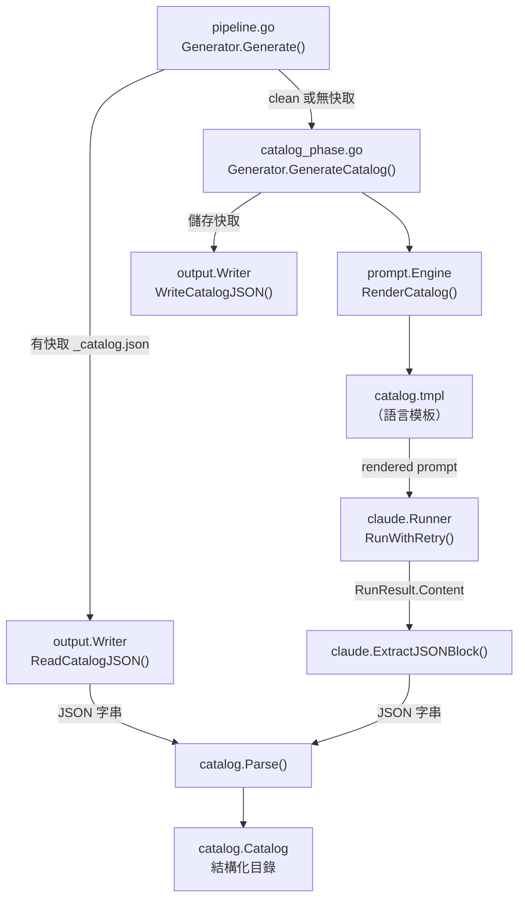
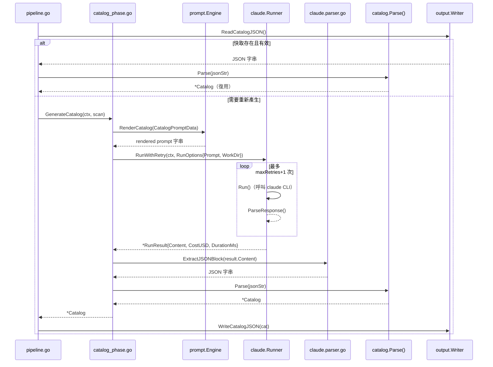

# 目錄產生階段

目錄產生階段（Catalog Phase）是整個文件產生管線的第二階段，負責透過 Claude CLI 分析專案結構，並自動生成結構化的文件目錄樹。

## 概述

在 selfmd 的四階段管線中，目錄產生階段（Pipeline 第 2 階段）扮演核心樞紐角色：它接收掃描器的專案結構資料，透過 Prompt 模板引擎組裝提示語，呼叫 Claude CLI 進行 AI 分析，最終輸出一份結構化的 `Catalog`（文件目錄）物件，供後續的內容頁面產生階段使用。

本階段的關鍵設計決策包括：

- **AI 驅動**：讓 Claude 理解程式碼語意，而非單純分析檔案結構，以產生更符合業務邏輯的文件目錄
- **快取復用**：若輸出目錄中已存在 `_catalog.json`，則直接載入跳過本階段，節省 API 費用
- **重試機制**：透過 `RunWithRetry` 應對 Claude CLI 的暫時性失敗
- **結構化輸出**：強制要求 Claude 輸出 JSON 格式，再解析為強型別的 `Catalog` 結構

## 架構



## 入口方法

`GenerateCatalog` 定義在 `internal/generator/catalog_phase.go`，是本階段唯一的公開方法：

```go
func (g *Generator) GenerateCatalog(ctx context.Context, scan *scanner.ScanResult) (*catalog.Catalog, error) {
	langName := config.GetLangNativeName(g.Config.Output.Language)
	data := prompt.CatalogPromptData{
		RepositoryName:       g.Config.Project.Name,
		ProjectType:          g.Config.Project.Type,
		Language:             g.Config.Output.Language,
		LanguageName:         langName,
		LanguageOverride:     g.Config.Output.NeedsLanguageOverride(),
		LanguageOverrideName: langName,
		KeyFiles:             scan.KeyFiles(),
		EntryPoints:          scan.EntryPointsFormatted(),
		FileTree:             scanner.RenderTree(scan.Tree, 4),
		ReadmeContent:        scan.ReadmeContent,
	}

	rendered, err := g.Engine.RenderCatalog(data)
	if err != nil {
		return nil, err
	}
	// ...
}
```

> 來源：internal/generator/catalog_phase.go#L16-L34

### CatalogPromptData 欄位說明

`prompt.CatalogPromptData` 結構集合了所有用於驅動 Claude 分析的上下文資料：

| 欄位 | 來源 | 說明 |
|------|------|------|
| `RepositoryName` | `config.Project.Name` | 專案名稱 |
| `ProjectType` | `config.Project.Type` | 專案類型（如 `go-cli`） |
| `Language` | `config.Output.Language` | 目標輸出語言代碼（如 `zh-TW`） |
| `LanguageName` | `GetLangNativeName()` | 語言的本地名稱（如「繁體中文」） |
| `LanguageOverride` | `Output.NeedsLanguageOverride()` | 模板語言與輸出語言是否不一致 |
| `KeyFiles` | `scan.KeyFiles()` | 重要檔案清單（main.go、go.mod 等） |
| `EntryPoints` | `scan.EntryPointsFormatted()` | 入口檔案的格式化內容 |
| `FileTree` | `scanner.RenderTree(scan.Tree, 4)` | 深度限制 4 層的檔案樹文字 |
| `ReadmeContent` | `scan.ReadmeContent` | README 內容（最多 50,000 字元） |

> 來源：internal/prompt/engine.go#L39-L51

## 快取復用機制

在 `pipeline.go` 的 `Generate()` 方法中，目錄產生具備智慧快取邏輯：

```go
var cat *catalog.Catalog
if !clean {
	// Try to reuse existing catalog
	catJSON, readErr := g.Writer.ReadCatalogJSON()
	if readErr == nil {
		cat, err = catalog.Parse(catJSON)
	}
	if cat != nil {
		items := cat.Flatten()
		fmt.Printf(ui.T("[2/4] 載入已存目錄（%d 個章節，%d 個項目）\n", ...), len(cat.Items), len(items))
	}
}
if cat == nil {
	fmt.Println(ui.T("[2/4] 產生文件目錄...", ...))
	cat, err = g.GenerateCatalog(ctx, scan)
	// ...
	if err := g.Writer.WriteCatalogJSON(cat); err != nil {
		g.Logger.Warn(...)
	}
}
```

> 來源：internal/generator/pipeline.go#L103-L128

快取以 `_catalog.json` 檔案儲存在輸出目錄（`.doc-build/`）下。以下情況會重新呼叫 Claude 產生目錄：

- 使用者指定 `--clean` 旗標
- 設定中 `output.clean_before_generate: true`
- `_catalog.json` 檔案不存在或無法讀取
- `_catalog.json` 解析失敗

## 核心流程



## Catalog 資料結構

Claude 必須以 JSON 格式輸出目錄，再由 `catalog.Parse()` 解析為強型別結構：

```go
// Catalog represents the documentation catalog structure.
type Catalog struct {
	Items []CatalogItem `json:"items"`
}

// CatalogItem represents a single item in the catalog tree.
type CatalogItem struct {
	Title    string        `json:"title"`
	Path     string        `json:"path"`
	Order    int           `json:"order"`
	Children []CatalogItem `json:"children"`
}
```

> 來源：internal/catalog/catalog.go#L9-L20

Claude 輸出的原始 JSON 範例格式：

```json
{
  "items": [
    {
      "title": "概述",
      "path": "overview",
      "order": 0,
      "children": [
        {
          "title": "專案介紹與功能特色",
          "path": "introduction",
          "order": 0,
          "children": []
        }
      ]
    }
  ]
}
```

## JSON 擷取邏輯

Claude 的回應可能包含 Markdown 格式的說明文字，`ExtractJSONBlock` 採三階段降級策略從中擷取 JSON：

```go
func ExtractJSONBlock(text string) (string, error) {
	// 策略 1：尋找 ```json ... ``` 圍欄程式碼區塊
	re := regexp.MustCompile("(?s)```json\\s*\n(.*?)```")
	matches := re.FindStringSubmatch(text)
	if len(matches) > 1 {
		return strings.TrimSpace(matches[1]), nil
	}

	// 策略 2：尋找無語言標籤的 ``` ... ``` 圍欄區塊
	re = regexp.MustCompile("(?s)```\\s*\n(\\{.*?\\})\\s*```")
	// ...

	// 策略 3：在純文字中尋找原始 JSON 物件（括號平衡掃描）
	start := strings.Index(text, "{")
	// ...
}
```

> 來源：internal/claude/parser.go#L26-L61

## 統計追蹤

每次成功呼叫 Claude 後，費用會累計到 `Generator.TotalCost`：

```go
g.TotalCost += result.CostUSD
fmt.Printf(ui.T(" 完成（%.1fs，$%.4f）\n", " Done (%.1fs, $%.4f)\n"),
    float64(result.DurationMs)/1000, result.CostUSD)
```

> 來源：internal/generator/catalog_phase.go#L47-L48

## Prompt 模板

目錄產生使用的 Prompt 模板位於 `internal/prompt/templates/<lang>/catalog.tmpl`，模板要求 Claude：

1. 使用工具（Glob、Read、Grep）實際探索專案原始碼
2. 依業務功能而非檔案結構設計目錄
3. 僅輸出一個 `\`\`\`json` 程式碼區塊，不附加任何說明文字

> 來源：internal/prompt/templates/zh-TW/catalog.tmpl#L1-L121

## 相關連結

- [文件產生管線](../index.md) — 了解本階段在四階段管線中的完整位置
- [內容頁面產生階段](../content-phase/index.md) — 接收本階段輸出 Catalog 的下一個階段
- [文件目錄管理](../../catalog/index.md) — `Catalog`、`CatalogItem`、`FlatItem` 資料結構詳解
- [Prompt 模板引擎](../../prompt-engine/index.md) — `Engine.RenderCatalog()` 與模板系統
- [Claude CLI 執行器](../../claude-runner/index.md) — `Runner.RunWithRetry()` 的重試機制詳解
- [專案掃描器](../../scanner/index.md) — 提供本階段輸入資料的 `ScanResult`
- [整體流程與四階段管線](../../../architecture/pipeline/index.md) — 系統架構總覽

## 參考檔案

| 檔案路徑 | 說明 |
|----------|------|
| `internal/generator/catalog_phase.go` | `GenerateCatalog()` 主要實作 |
| `internal/generator/pipeline.go` | 管線編排、快取復用邏輯與費用統計 |
| `internal/catalog/catalog.go` | `Catalog`、`CatalogItem`、`FlatItem` 資料結構與解析邏輯 |
| `internal/prompt/engine.go` | `CatalogPromptData` 定義與 `RenderCatalog()` |
| `internal/prompt/templates/zh-TW/catalog.tmpl` | 繁體中文目錄產生 Prompt 模板 |
| `internal/claude/runner.go` | `Runner.Run()` 與 `RunWithRetry()` 實作 |
| `internal/claude/types.go` | `RunOptions`、`RunResult`、`CLIResponse` 結構定義 |
| `internal/claude/parser.go` | `ExtractJSONBlock()` JSON 擷取邏輯 |
| `internal/scanner/scanner.go` | `ScanResult.KeyFiles()` 與 `EntryPointsFormatted()` |
| `internal/output/writer.go` | `WriteCatalogJSON()` 與 `ReadCatalogJSON()` 快取操作 |