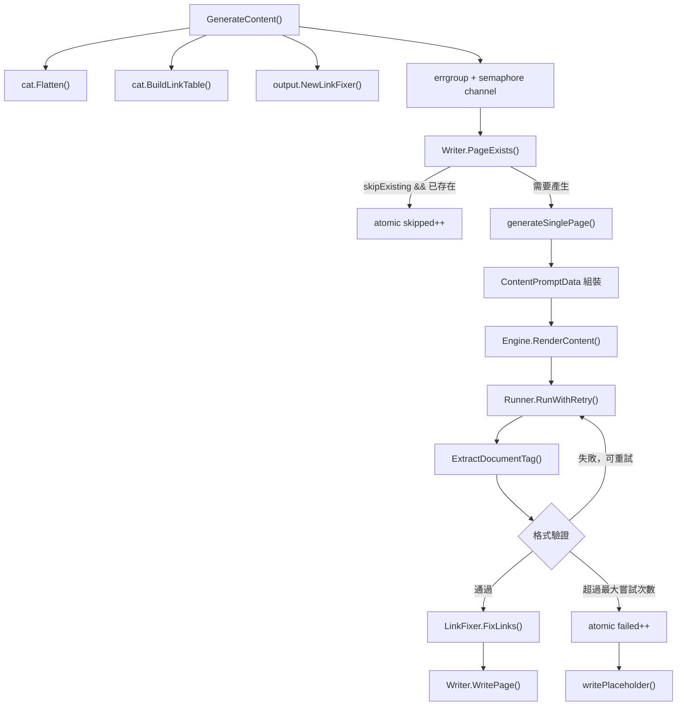
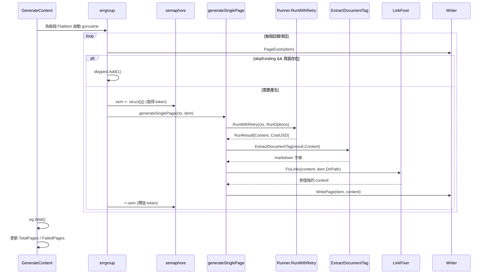

# 內容頁面產生階段

內容頁面產生階段（Phase 3）是 selfmd 四階段管線的核心，負責將目錄中的每個條目平行地轉換為完整的 Markdown 文件頁面。

## 概述

當目錄（Catalog）建立完畢後，內容產生階段接手，對目錄中每一個 `FlatItem`（扁平化目錄項目）呼叫 Claude CLI，要求其根據專案原始碼產生對應的說明文件。

此階段的主要職責包括：

- **並行控制**：透過 `errgroup` 與 semaphore 實現可設定的並行度，同時保護系統資源
- **跳過既有頁面**：非 clean 模式下，已存在且有效的頁面將被略過，節省 API 費用
- **重試與格式驗證**：確保 Claude 輸出符合格式要求（必須有 `<document>` 標籤且包含 Markdown 標題）
- **連結修復後處理**：產生後自動修復頁面內的相對路徑連結
- **失敗降級**：頁面產生失敗時寫入佔位頁面，不中斷整體流程

核心實作位於 `internal/generator/content_phase.go`，主要入口為 `Generator.GenerateContent()`。

## 架構



## 主要元件與資料結構

### Generator 結構體

`Generator` 是整個管線的協調者，在 `pipeline.go` 中定義：

```go
type Generator struct {
    Config  *config.Config
    Runner  *claude.Runner
    Engine  *prompt.Engine
    Writer  *output.Writer
    Logger  *slog.Logger
    RootDir string

    TotalCost   float64
    TotalPages  int
    FailedPages int
}
```

> 來源：internal/generator/pipeline.go#L19-L31

### ContentPromptData 資料模型

`generateSinglePage()` 為每個頁面組裝以下 prompt 資料結構：

```go
data := prompt.ContentPromptData{
    RepositoryName:       g.Config.Project.Name,
    Language:             g.Config.Output.Language,
    LanguageName:         langName,
    LanguageOverride:     g.Config.Output.NeedsLanguageOverride(),
    LanguageOverrideName: langName,
    CatalogPath:          item.Path,
    CatalogTitle:         item.Title,
    CatalogDirPath:       item.DirPath,
    ProjectDir:           g.RootDir,
    FileTree:             scanner.RenderTree(scan.Tree, 3),
    CatalogTable:         catalogTable,
    ExistingContent:      existingContent,
}
```

> 來源：internal/generator/content_phase.go#L91-L104

`ExistingContent` 在全新產生時為空字串；在增量更新場景（`updater.go`）中會填入既有頁面內容，供 Claude 進行修改而非全量重寫。

## 核心流程

### 並行產生流程



### 並行度控制

並行度以 semaphore channel 實作，大小由設定檔的 `claude.max_concurrent` 決定（可透過 CLI `--concurrency` 旗標覆蓋）：

```go
sem := make(chan struct{}, concurrency)

for _, item := range items {
    item := item
    eg.Go(func() error {
        // ...skipExisting 檢查...

        sem <- struct{}{}
        defer func() { <-sem }()

        // 執行 generateSinglePage
    })
}
```

> 來源：internal/generator/content_phase.go#L37-L73

### 格式驗證與重試機制

`generateSinglePage()` 內建最多 2 次嘗試（`maxAttempts = 2`），分別針對兩種格式錯誤情況重試：

```go
maxAttempts := 2
for attempt := 1; attempt <= maxAttempts; attempt++ {
    result, err := g.Runner.RunWithRetry(ctx, claude.RunOptions{...})

    // 嘗試從 <document> 標籤擷取內容
    content, extractErr := claude.ExtractDocumentTag(result.Content)
    if extractErr != nil {
        if attempt < maxAttempts {
            fmt.Printf(" 格式錯誤，重試中...\n      ")
            continue
        }
        return lastErr
    }

    // 驗證是否有有效的 Markdown 標題
    content = strings.TrimSpace(content)
    if content == "" || !strings.HasPrefix(content, "#") {
        if attempt < maxAttempts {
            fmt.Printf(" 內容無效，重試中...\n      ")
            continue
        }
        return lastErr
    }

    // 後處理並寫入
    content = linkFixer.FixLinks(content, item.DirPath)
    return g.Writer.WritePage(item, content)
}
```

> 來源：internal/generator/content_phase.go#L111-L156

**驗證條件：**
1. `claude.ExtractDocumentTag()` 必須能從回應中找到 `<document>...