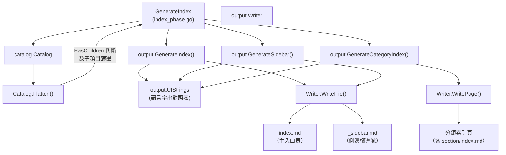
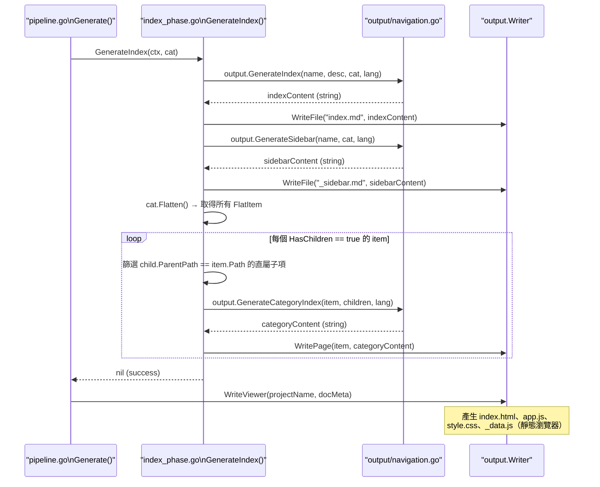

# 索引與導航產生階段

索引與導航產生階段（Index Phase）是整個文件產生管線的第四階段，負責根據已建立的目錄結構（`Catalog`），自動產生主索引頁、側邊欄導航檔及各分類的子頁索引，讓整份文件具備可瀏覽的導航骨架。

## 概述

在前三個階段（掃描、目錄產生、內容產生）完成後，所有文件內容已經寫入輸出目錄，但尚缺乏統一的入口與導航結構。索引與導航產生階段的核心職責是：

- **產生 `index.md`**：文件的主入口頁面，以樹狀目錄列出所有章節
- **產生 `_sidebar.md`**：供 Docsify 等靜態文件瀏覽器使用的側邊欄導航檔
- **產生各分類索引頁**：對所有「含子項目的父節點」產生獨立的分類索引頁（`<section>/index.md`），列出其直屬子項目的連結

此階段完全基於已建立的 `catalog.Catalog` 結構運作，不需呼叫 Claude CLI，屬於純粹的本地內容產生工作。多語言支援透過 `UIStrings` 字串映射表實現，目前支援 `zh-TW` 與 `en-US` 兩種介面語言。

## 架構



## 產出檔案說明

### 主索引頁 `index.md`

由 `output.GenerateIndex()` 產生，包含：

1. 一級標題：`{專案名稱} {techDocs 語言字串}`
2. 專案描述（若設定中有填寫）
3. 水平分隔線
4. 二級標題「目錄」（依語言）
5. 以縮排巢狀列表展示所有目錄項目，每項均為相對路徑連結

```go
func GenerateIndex(projectName, projectDesc string, cat *catalog.Catalog, lang string) string {
	ui := getUIStrings(lang)
	var sb strings.Builder

	sb.WriteString(fmt.Sprintf("# %s %s\n\n", projectName, ui["techDocs"]))

	if projectDesc != "" {
		sb.WriteString(projectDesc + "\n\n")
	}

	sb.WriteString("---\n\n")
	sb.WriteString(fmt.Sprintf("## %s\n\n", ui["catalog"]))

	for _, item := range cat.Items {
		writeIndexItem(&sb, item, "", 0)
	}

	sb.WriteString("\n---\n\n")
	sb.WriteString(fmt.Sprintf("*%s*\n", ui["autoGenerated"]))

	return sb.String()
}
```

> 來源：internal/output/navigation.go#L38-L59

每個目錄項目的連結由 `writeIndexItem` 遞迴建立，使用 `resolveDirPath` 函式處理 Format A（相對路徑）與 Format B（已含父路徑）兩種格式：

```go
func writeIndexItem(sb *strings.Builder, item catalog.CatalogItem, parentDir string, depth int) {
	indent := strings.Repeat("  ", depth)
	dirPath := resolveDirPath(item.Path, parentDir)

	link := fmt.Sprintf("./%s/index.md", dirPath)
	sb.WriteString(fmt.Sprintf("%s- [%s](%s)\n", indent, item.Title, link))

	for _, child := range item.Children {
		writeIndexItem(sb, child, dirPath, depth+1)
	}
}
```

> 來源：internal/output/navigation.go#L61-L71

---

### 側邊欄導航 `_sidebar.md`

由 `output.GenerateSidebar()` 產生，格式與主索引頁類似，但：

- 標題為純文字的專案名稱（無附加語言字串）
- 頂部固定插入一個「首頁」連結（指向 `./index.md`）

```go
func GenerateSidebar(projectName string, cat *catalog.Catalog, lang string) string {
	ui := getUIStrings(lang)
	var sb strings.Builder

	sb.WriteString(fmt.Sprintf("# %s\n\n", projectName))
	sb.WriteString(fmt.Sprintf("- [%s](./index.md)\n", ui["home"]))

	for _, item := range cat.Items {
		writeSidebarItem(&sb, item, "", 0)
	}

	return sb.String()
}
```

> 來源：internal/output/navigation.go#L74-L86

---

### 分類索引頁

對所有 `HasChildren == true` 的目錄項目，`GenerateIndex` 會額外產生對應的 `<DirPath>/index.md`，內容為列出其**直屬子項目**的連結列表。

子項目篩選邏輯在 `index_phase.go` 中實作：

```go
items := cat.Flatten()
for _, item := range items {
    if !item.HasChildren {
        continue
    }

    // find direct children
    var children []catalog.FlatItem
    for _, child := range items {
        if child.ParentPath == item.Path && child.Path != item.Path {
            children = append(children, child)
        }
    }

    if len(children) > 0 {
        categoryContent := output.GenerateCategoryIndex(item, children, lang)
        if err := g.Writer.WritePage(item, categoryContent); err != nil {
            g.Logger.Warn("寫入分類索引失敗", "path", item.Path, "error", err)
        }
    }
}
```

> 來源：internal/generator/index_phase.go#L32-L52

`output.GenerateCategoryIndex` 使用 `computeRelativePath`（基於 `filepath.Rel`）計算子項目的正確相對路徑：

```go
func GenerateCategoryIndex(item catalog.FlatItem, children []catalog.FlatItem, lang string) string {
	ui := getUIStrings(lang)
	var sb strings.Builder

	sb.WriteString(fmt.Sprintf("# %s\n\n", item.Title))
	sb.WriteString(ui["sectionContains"] + "\n\n")

	for _, child := range children {
		relPath := computeRelativePath(item.DirPath, child.DirPath)
		sb.WriteString(fmt.Sprintf("- [%s](%s/index.md)\n", child.Title, relPath))
	}

	return sb.String()
}
```

> 來源：internal/output/navigation.go#L101-L114

## 多語言字串對照

`navigation.go` 中定義了 `UIStrings` 映射表，以語言代碼為鍵：

```go
var UIStrings = map[string]map[string]string{
	"zh-TW": {
		"techDocs":        "技術文件",
		"catalog":         "目錄",
		"home":            "首頁",
		"sectionContains": "本章節包含以下內容：",
		"autoGenerated":   "本文件由 [selfmd](https://github.com/monkenwu/selfmd) 自動產生",
	},
	"en-US": {
		"techDocs":        "Technical Documentation",
		"catalog":         "Table of Contents",
		"home":            "Home",
		"sectionContains": "This section contains the following:",
		"autoGenerated":   "This documentation was automatically generated by [selfmd](https://github.com/monkenwu/selfmd)",
	},
}
```

> 來源：internal/output/navigation.go#L12-L27

`getUIStrings` 函式在找不到對應語言時，自動退回（fallback）至 `en-US`：

```go
func getUIStrings(lang string) map[string]string {
	if s, ok := UIStrings[lang]; ok {
		return s
	}
	return UIStrings["en-US"]
}
```

> 來源：internal/output/navigation.go#L30-L35

語言代碼取自 `g.Config.Output.Language`，在 `GenerateIndex` 入口處讀取：

```go
func (g *Generator) GenerateIndex(_ context.Context, cat *catalog.Catalog) error {
	lang := g.Config.Output.Language
	// ...
}
```

> 來源：internal/generator/index_phase.go#L11-L12

## 核心流程



## 路徑解析邏輯

### `resolveDirPath`

`navigation.go` 中的 `resolveDirPath` 處理目錄項目路徑的兩種格式：

- **Format A**：`item.Path` 為相對路徑（如 `"init"`），需要拼接父路徑 → 輸出 `"cli/init"`
- **Format B**：`item.Path` 已包含父路徑前綴（如 `"cli/init"`），直接使用

```go
func resolveDirPath(itemPath, parentDir string) string {
	if parentDir == "" {
		return itemPath
	}
	if strings.HasPrefix(itemPath, parentDir+"/") {
		return itemPath
	}
	return parentDir + "/" + itemPath
}
```

> 來源：internal/output/navigation.go#L118-L126

### `computeRelativePath`

分類索引頁中子項目的連結使用 `computeRelativePath` 計算相對路徑，底層依賴標準庫的 `filepath.Rel`：

```go
func computeRelativePath(fromDir, toDir string) string {
	rel, err := filepath.Rel(fromDir, toDir)
	if err != nil {
		return "./" + toDir
	}
	return filepath.ToSlash(rel)
}
```

> 來源：internal/output/navigation.go#L129-L135

## 在管線中的位置

`GenerateIndex` 由 `pipeline.go` 的 `Generate()` 方法在 **Phase 4** 呼叫，緊接在內容頁面產生（Phase 3）之後：

```go
// Phase 4: Generate Index & Navigation
fmt.Println("[4/4] 產生導航與索引...")
if err := g.GenerateIndex(ctx, cat); err != nil {
    return fmt.Errorf("產生索引失敗: %w", err)
}
```

> 來源：internal/generator/pipeline.go#L139-L143

`GenerateIndex` 完成後，管線繼續呼叫 `g.Writer.WriteViewer()` 產生靜態 HTML 瀏覽器（`index.html`、`app.js`、`style.css`、`_data.js`），此部分屬於 `output.Writer` 的職責，不在 `index_phase.go` 範圍內。

## 相關連結

- [文件產生管線](../index.md)
- [目錄產生階段](../catalog-phase/index.md)
- [內容頁面產生階段](../content-phase/index.md)
- [翻譯階段](../translate-phase/index.md)
- [文件目錄管理](../../catalog/index.md)
- [輸出寫入與連結修復](../../output-writer/index.md)
- [靜態文件瀏覽器](../../static-viewer/index.md)
- [多語言支援](../../../i18n/index.md)
- [整體流程與四階段管線](../../../architecture/pipeline/index.md)

## 參考檔案

| 檔案路徑 | 說明 |
|----------|------|
| `internal/generator/index_phase.go` | `GenerateIndex` 主函式，分類索引頁篩選邏輯 |
| `internal/generator/pipeline.go` | `Generator` 結構定義、管線流程、Phase 4 呼叫點 |
| `internal/output/navigation.go` | `GenerateIndex`、`GenerateSidebar`、`GenerateCategoryIndex` 及路徑解析輔助函式 |
| `internal/output/writer.go` | `Writer.WriteFile`、`Writer.WritePage`、`DocMeta`、`LangInfo` 結構 |
| `internal/output/viewer.go` | `WriteViewer`、`bundleData`，靜態瀏覽器資產產生 |
| `internal/catalog/catalog.go` | `Catalog`、`CatalogItem`、`FlatItem` 結構定義，`Flatten()` 方法 |