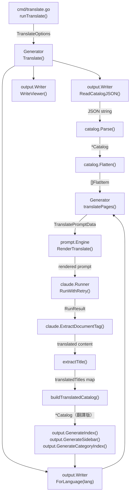
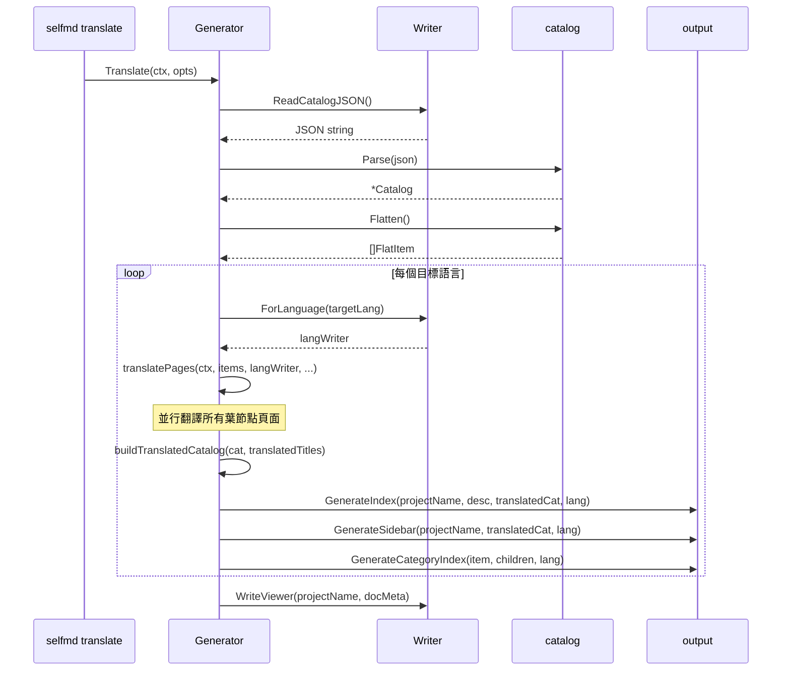

# 翻譯階段

翻譯階段負責將主要語言產生的文件，透過 Claude CLI 批次翻譯為 `selfmd.yaml` 設定中所定義的次要語言，並在對應的語言子目錄中產生完整的導航結構。

## 概述

翻譯階段是獨立於四階段文件產生管線之外的附加流程，由 `selfmd translate` 指令觸發。其核心設計原則是：

- **增量翻譯**：預設跳過已存在的翻譯頁面，只翻譯新增或缺少的頁面
- **並行處理**：使用 `errgroup` 與 semaphore（信號量）控制並行度，加速大型文件庫的翻譯
- **目錄重建**：翻譯完成後自動重建翻譯語言的文件目錄，保持標題與目錄結構的一致性
- **僅翻譯葉節點**：分類首頁（`HasChildren = true`）由系統自動產生，不需要 Claude 翻譯

翻譯階段的輸出放置於 `.doc-build/{語言代碼}/` 子目錄，與主要語言的輸出並行存放。

### 關鍵術語

| 術語 | 說明 |
|------|------|
| 主要語言（source language）| `output.language` 設定的語言，即原始文件的語言 |
| 次要語言（secondary languages）| `output.secondary_languages` 設定的目標翻譯語言列表 |
| 葉節點（leaf item）| 目錄中沒有子項目的終端頁面，即實際文件內容頁面 |
| `langWriter` | 指向語言子目錄的 `output.Writer`，透過 `ForLanguage()` 建立 |

## 架構



## 核心資料結構

### TranslateOptions

翻譯執行時的設定選項，由 CLI 指令傳入：

```go
type TranslateOptions struct {
    TargetLanguages []string
    Force           bool
    Concurrency     int
}
```

> 來源：internal/generator/translate_phase.go#L21-L25

### TranslatePromptData

傳遞給翻譯 Prompt 模板的資料：

```go
type TranslatePromptData struct {
    SourceLanguage     string // e.g., "zh-TW"
    SourceLanguageName string // e.g., "繁體中文"
    TargetLanguage     string // e.g., "en-US"
    TargetLanguageName string // e.g., "English"
    SourceContent      string // the full markdown content to translate
}
```

> 來源：internal/prompt/engine.go#L98-L104

## 核心流程

### Translate() — 主流程



### translatePages() — 並行翻譯

`translatePages()` 只處理葉節點頁面（`HasChildren == false`），使用 `errgroup` 與 semaphore 進行並行控制：

```go
eg, ctx := errgroup.WithContext(ctx)
sem := make(chan struct{}, opts.Concurrency)

for _, item := range leafItems {
    item := item
    eg.Go(func() error {
        // Skip if already translated and not forcing
        if !opts.Force && langWriter.PageExists(item) {
            skipped.Add(1)
            // ...
            return nil
        }

        sem <- struct{}{}
        defer func() { <-sem }()

        // Read source content
        sourceContent, err := g.Writer.ReadPage(item)
        // ...

        // Render translate prompt
        data := prompt.TranslatePromptData{ /* ... */ }
        rendered, err := g.Engine.RenderTranslate(data)

        // Call Claude
        result, err := g.Runner.RunWithRetry(ctx, claude.RunOptions{
            Prompt:  rendered,
            WorkDir: g.RootDir,
        })

        // Extract translated content
        content, err := claude.ExtractDocumentTag(result.Content)
        // ...

        // Write translated page
        langWriter.WritePage(item, content)
        return nil
    })
}
eg.Wait()
```

> 來源：internal/generator/translate_phase.go#L150-L249

### 翻譯跳過邏輯

當 `--force` 未指定時，若目標語言目錄中已存在對應的翻譯檔案，該頁面將被跳過。跳過時仍會嘗試從既有翻譯中提取標題，確保翻譯目錄的完整性：

```go
if !opts.Force && langWriter.PageExists(item) {
    skipped.Add(1)
    // Try to extract title from existing translation
    if content, err := langWriter.ReadPage(item); err == nil {
        if title := extractTitle(content); title != "" {
            titlesMu.Lock()
            translatedTitles[item.Path] = title
            titlesMu.Unlock()
        }
    }
    fmt.Printf("      [跳過] %s（已存在）\n", item.Title)
    return nil
}
```

> 來源：internal/generator/translate_phase.go#L157-L169

## 翻譯目錄重建

翻譯完成後，系統會用收集到的翻譯標題（`translatedTitles` map）重建翻譯語言的 `Catalog`，再用此目錄產生導航結構：

```go
// buildTranslatedCatalog creates a copy of the catalog with translated titles.
func buildTranslatedCatalog(original *catalog.Catalog, translatedTitles map[string]string) *catalog.Catalog {
    translated := &catalog.Catalog{
        Items: translateCatalogItems(original.Items, translatedTitles, ""),
    }
    return translated
}
```

> 來源：internal/generator/translate_phase.go#L276-L282

`translateCatalogItems()` 以遞迴方式走訪所有目錄項目，若某個 `dotPath`（如 `core-modules.scanner`）在 `translatedTitles` 中有對應的翻譯標題，則使用翻譯後的標題：

```go
// Use translated title if available
if translatedTitle, ok := titles[dotPath]; ok {
    result[i].Title = translatedTitle
}
```

> 來源：internal/generator/translate_phase.go#L298-L300

## 翻譯 Prompt 模板

翻譯使用共用模板（`templates/translate.tmpl`），不依賴語言特定的子資料夾，確保翻譯指令的語言無關性：

```
You are a professional technical documentation translator. Your task is to translate
the following documentation page from {{.SourceLanguageName}} ({{.SourceLanguage}})
to {{.TargetLanguageName}} ({{.TargetLanguage}}).

## Translation Rules
1. Preserve all Markdown formatting
2. Do not translate code — code identifiers, file paths remain as-is
3. Translate section headings
4. Preserve relative links — only translate display text
5. Preserve Mermaid diagrams — translate labels but keep syntax correct
6. Preserve source annotations
7. Natural translation — produce fluent {{.TargetLanguageName}}
8. Preserve reference file tables — translate headers but keep paths
```

> 來源：internal/prompt/templates/translate.tmpl#L1-L35

`Engine.RenderTranslate()` 使用 `renderShared()` 而非 `render()`，因此模板從共用的 `sharedTemplates` 而非語言特定的 `templates` 執行：

```go
func (e *Engine) RenderTranslate(data TranslatePromptData) (string, error) {
    return e.renderShared("translate.tmpl", data)
}
```

> 來源：internal/prompt/engine.go#L132-L134

## 輸出結構

翻譯完成後，每個次要語言的輸出放置於 `.doc-build/{lang}/`：

```
.doc-build/
├── index.md            # 主要語言首頁
├── _sidebar.md         # 主要語言側欄
├── _catalog.json       # 主要語言目錄 JSON
├── en-US/              # 次要語言目錄（例）
│   ├── index.md        # 翻譯後首頁
│   ├── _sidebar.md     # 翻譯後側欄
│   ├── _catalog.json   # 翻譯後目錄 JSON（含翻譯標題）
│   └── {section}/
│       └── {page}/
│           └── index.md   # 翻譯後的頁面
└── index.html          # 瀏覽器入口（含所有語言資料）
```

`ForLanguage()` 方法建立指向語言子目錄的 Writer：

```go
func (w *Writer) ForLanguage(lang string) *Writer {
    return &Writer{
        BaseDir: filepath.Join(w.BaseDir, lang),
    }
}
```

> 來源：internal/output/writer.go#L139-L143

## 導航元件的本地化

翻譯後產生的 `index.md`、`_sidebar.md` 與分類索引頁使用 `output.UIStrings` 提供的語言特定 UI 字串：

```go
var UIStrings = map[string]map[string]string{
    "zh-TW": {
        "techDocs":        "技術文件",
        "sectionContains": "本章節包含以下內容：",
        // ...
    },
    "en-US": {
        "techDocs":        "Technical Documentation",
        "sectionContains": "This section contains the following:",
        // ...
    },
}
```

> 來源：internal/output/navigation.go#L12-L27

## 標題提取輔助函式

`extractTitle()` 以正則表達式擷取 Markdown 文件的第一個 `#` 標題，用於收集翻譯後的頁面標題並重建翻譯目錄：

```go
func extractTitle(content string) string {
    re := regexp.MustCompile(`(?m)^#\s+(.+)$`)
    match := re.FindStringSubmatch(content)
    if len(match) >= 2 {
        return strings.TrimSpace(match[1])
    }
    return ""
}
```

> 來源：internal/generator/translate_phase.go#L267-L274

## CLI 使用範例

透過 `selfmd translate` 指令觸發翻譯階段：

```go
var translateCmd = &cobra.Command{
    Use:   "translate",
    Short: "將主要語言文件翻譯為次要語言",
    Long: `以已產生的主要語言文件為基準，翻譯為設定檔中定義的次要語言。
翻譯結果放置於 .doc-build/{語言代碼}/ 子目錄。`,
    RunE: runTranslate,
}
```

> 來源：cmd/translate.go#L24-L30

可用的旗標：

| 旗標 | 說明 |
|------|------|
| `--lang <code,...>` | 只翻譯指定語言（預設：所有次要語言） |
| `--force` | 強制重新翻譯已存在的檔案 |
| `--concurrency <n>` | 並行度（覆蓋設定檔中的 `max_concurrent`） |

**前置條件**：必須先執行 `selfmd generate` 產生主要語言文件，翻譯階段依賴 `.doc-build/_catalog.json` 與原始頁面內容。

## 相關連結

- [selfmd translate](../../../cli/cmd-translate/index.md)
- [文件產生管線](../index.md)
- [索引與導航產生階段](../index-phase/index.md)
- [多語言支援](../../../i18n/index.md)
- [翻譯工作流程](../../../i18n/translation-workflow/index.md)
- [支援的語言與模板](../../../i18n/supported-languages/index.md)
- [Prompt 模板引擎](../../prompt-engine/index.md)
- [Claude CLI 執行器](../../claude-runner/index.md)
- [輸出寫入與連結修復](../../output-writer/index.md)

## 參考檔案

| 檔案路徑 | 說明 |
|----------|------|
| `internal/generator/translate_phase.go` | 翻譯階段核心實作：`Translate()`、`translatePages()`、`buildTranslatedCatalog()`、`extractTitle()` |
| `internal/generator/pipeline.go` | `Generator` 結構定義與 `NewGenerator()`、`buildDocMeta()` |
| `internal/prompt/engine.go` | `TranslatePromptData` 結構、`RenderTranslate()` 方法 |
| `internal/prompt/templates/translate.tmpl` | 翻譯 Prompt 共用模板 |
| `internal/output/writer.go` | `Writer`、`ForLanguage()`、`PageExists()`、`ReadPage()`、`WritePage()` |
| `internal/output/navigation.go` | `UIStrings`、`GenerateIndex()`、`GenerateSidebar()`、`GenerateCategoryIndex()` |
| `internal/catalog/catalog.go` | `Catalog`、`FlatItem`、`Flatten()`、`CatalogItem` |
| `internal/config/config.go` | `OutputConfig`、`GetLangNativeName()`、`KnownLanguages` |
| `cmd/translate.go` | `translate` CLI 指令實作 |