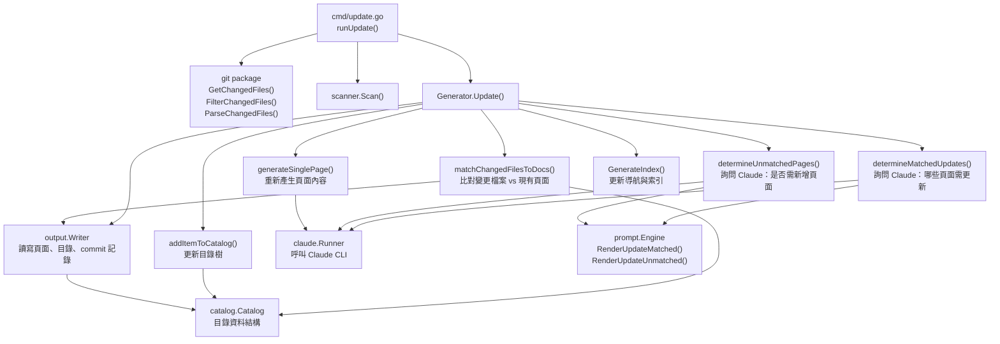
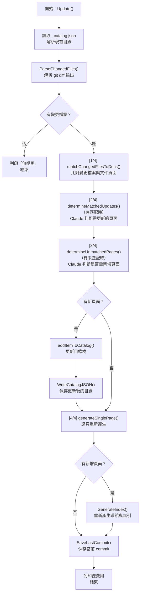
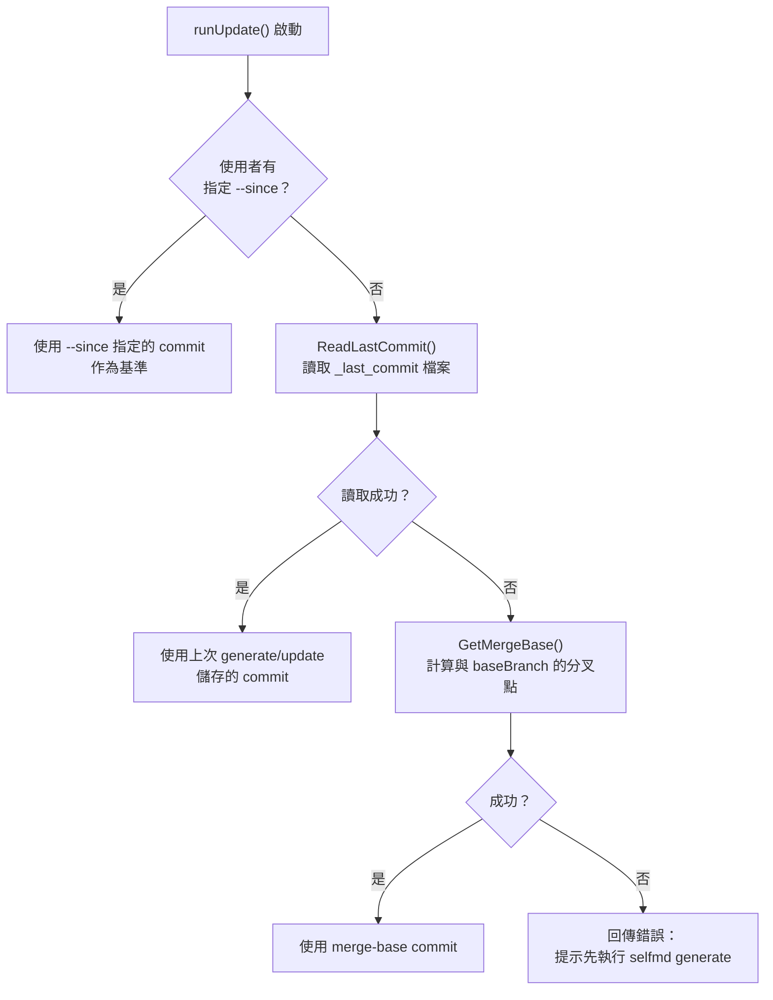

# 增量更新

增量更新（Incremental Update）模組讓 selfmd 能在 git 變更後，僅針對受影響的文件頁面進行重新產生，避免每次都執行耗時的完整 `generate` 流程，大幅節省時間與 API 費用。

## 概述

增量更新的核心思想是：**只更新需要更新的頁面**。當程式碼發生變更時，系統會：

1. 從 git diff 取得變更的原始碼檔案清單
2. 比對哪些現有文件頁面引用了這些變更檔案（稱為「匹配」）
3. 對於尚未有對應文件的新檔案，判斷是否需要新增頁面
4. 僅重新產生確實需要更新的頁面

系統透過在輸出目錄中持久化一個 `_last_commit` 檔案來追蹤上次更新的 commit，使得每次執行 `selfmd update` 都能精確計算需要重新產生的範圍。

**關鍵術語：**

| 術語 | 說明 |
|------|------|
| 匹配頁面（matched） | 內容中含有變更檔案路徑的既有文件頁面 |
| 未匹配檔案（unmatched） | 沒有任何文件頁面引用的變更檔案 |
| 葉節點升格（leaf promotion） | 當現有文件目錄的葉節點需要成為父節點時，自動將其原始內容移至 `overview` 子頁面 |
| 基準 commit（previousCommit） | 與當前 HEAD 進行 diff 比較的起點 commit |

## 架構



## 資料結構

### 核心型別

```go
// UpdateMatchedResult represents a page that Claude determined needs regeneration.
type UpdateMatchedResult struct {
	CatalogPath string `json:"catalogPath"`
	Title       string `json:"title"`
	Reason      string `json:"reason"`
}

// UpdateUnmatchedResult represents a new page that Claude determined should be created.
type UpdateUnmatchedResult struct {
	CatalogPath string `json:"catalogPath"`
	Title       string `json:"title"`
	Reason      string `json:"reason"`
}
```

> 來源：internal/generator/updater.go#L17-L29

```go
// matchResult holds the mapping between changed files and the doc pages that reference them.
type matchResult struct {
	// changedFile is the source file path that changed
	changedFile string
	// pages are the doc pages that reference this file
	pages []catalog.FlatItem
}
```

> 來源：internal/generator/updater.go#L168-L174

```go
// promotedLeaf records when a leaf node was promoted to a parent by adding an "overview" child.
type promotedLeaf struct {
	// OriginalPath is the dot-notation path of the original leaf (e.g. "core-modules.mcp-integration")
	OriginalPath string
	// OverviewPath is the dot-notation path of the new overview child (e.g. "core-modules.mcp-integration.overview")
	OverviewPath string
	// OriginalTitle is the title of the original leaf
	OriginalTitle string
}
```

> 來源：internal/generator/updater.go#L359-L367

### Prompt 資料結構

增量更新使用兩種 prompt 資料結構，分別對應「匹配頁面判斷」與「未匹配頁面判斷」兩個 Claude 呼叫：

```go
// UpdateMatchedPromptData holds data for deciding which existing pages need regeneration.
type UpdateMatchedPromptData struct {
	RepositoryName string
	Language       string
	ChangedFiles   string // list of changed source files
	AffectedPages  string // pages that reference these files (path + title + summary)
}

// UpdateUnmatchedPromptData holds data for deciding whether new pages are needed.
type UpdateUnmatchedPromptData struct {
	RepositoryName  string
	Language        string
	UnmatchedFiles  string // changed files not referenced in any existing doc
	ExistingCatalog string // existing catalog JSON
	CatalogTable    string // formatted link table of all pages
}
```

> 來源：internal/prompt/engine.go#L80-L95

## 核心流程

### Update() 的四個步驟



### 匹配邏輯

`matchChangedFilesToDocs()` 採用**字串搜尋**策略：先一次性讀入所有文件頁面的內容，再逐一檢查每個變更檔案的路徑是否出現在任何頁面的文字中。

```go
// For each changed file, find which pages reference it
for _, f := range files {
    var matchedPages []catalog.FlatItem
    for _, item := range items {
        content, ok := pageContents[item.Path]
        if !ok {
            continue
        }
        if strings.Contains(content, f.Path) {
            matchedPages = append(matchedPages, item)
        }
    }
    // ...
}
```

> 來源：internal/generator/updater.go#L191-L213

### 葉節點升格（Leaf Promotion）

當 Claude 決定在現有葉節點下新增子頁面時（例如在 `core-modules.scanner` 下新增 `core-modules.scanner.advanced`），系統會自動將原葉節點升格為父節點，並將其原始內容搬移至 `overview` 子頁面：

```go
if len(item.Children) == 0 {
    // This is a leaf node that needs to become a parent.
    // Add an "overview" child to preserve the original content.
    (*children)[i].Children = append((*children)[i].Children, catalog.CatalogItem{
        Title: item.Title,
        Path:  "overview",
        Order: 0,
    })
    *promoted = &promotedLeaf{
        OriginalPath:  currentDotPath,
        OverviewPath:  currentDotPath + ".overview",
        OriginalTitle: item.Title,
    }
}
```

> 來源：internal/generator/updater.go#L402-L414

## Commit 追蹤機制

增量更新依賴一個「基準 commit」（previousCommit）來計算 git diff 範圍。系統的優先順序如下：



> 來源：cmd/update.go#L67-L81

每次成功的 `update` 執行後，系統會將當前 HEAD commit 儲存至 `_last_commit` 檔案，供下次增量更新使用：

```go
// Save current commit for next incremental update
if err := g.Writer.SaveLastCommit(currentCommit); err != nil {
    g.Logger.Warn("保存 commit 記錄失敗", "error", err)
}
```

> 來源：internal/generator/updater.go#L159-L162

`_last_commit` 同樣在 `generate` 完成後也會寫入，確保初次執行後即可立即使用 `update`：

```go
// Save current commit for incremental updates
if git.IsGitRepo(g.RootDir) {
    if commit, err := git.GetCurrentCommit(g.RootDir); err == nil {
        if err := g.Writer.SaveLastCommit(commit); err != nil {
            g.Logger.Warn("保存 commit 記錄失敗", "error", err)
        }
    }
}
```

> 來源：internal/generator/pipeline.go#L157-L164

## 使用範例

### 基本增量更新

```bash
# 自動偵測上次 generate/update 後的所有變更
selfmd update
```

### 指定基準 Commit

```bash
# 與指定的 commit 比較
selfmd update --since abc1234

# 與某個 tag 或分支比較
selfmd update --since v1.0.0
selfmd update --since main
```

> 來源：cmd/update.go#L19-L31

### CLI 命令定義

```go
var updateCmd = &cobra.Command{
    Use:   "update",
    Short: "基於 git 變更增量更新文件",
    Long: `分析 git 變更並增量更新受影響的文件頁面。
需要先執行過 selfmd generate 產生初始文件。`,
    RunE: runUpdate,
}

func init() {
    updateCmd.Flags().StringVar(&sinceCommit, "since", "", "與指定 commit 比較（預設為上次 generate/update 的 commit）")
    rootCmd.AddCommand(updateCmd)
}
```

> 來源：cmd/update.go#L21-L32

### 執行輸出範例

系統在執行時會顯示四個步驟的進度：

```
比較範圍：abc12345..def67890
變更檔案：
M   internal/scanner/scanner.go
A   internal/scanner/filetree.go

[1/4] 搜尋受影響的文件頁面...
      2 個變更檔案已匹配到現有文件，0 個未匹配
[2/4] 呼叫 Claude 判斷需要更新的頁面...
      → 專案掃描器：scanner.go 的核心邏輯已變更
      完成（1 個頁面需要更新）
[3/4] 所有變更檔案均已有對應文件，跳過
[4/4] 重新產生 1 個頁面...
      [1/1] 專案掃描器（core-modules.scanner）... 完成（12.3s，$0.0024）

更新完成！總費用：$0.0024 USD
```

## 前置條件

執行 `selfmd update` 需要滿足以下條件：

1. **必須為 git 倉庫**：系統會在啟動時檢查 `git.IsGitRepo(rootDir)`，若非 git 倉庫則立即回傳錯誤
2. **必須已執行過 `selfmd generate`**：系統需要讀取 `_catalog.json` 以了解現有文件結構；若目錄不存在，會提示先執行 `generate`
3. **Claude CLI 必須可用**：與 `generate` 相同，需要 Claude CLI 正常運作

```go
if !git.IsGitRepo(rootDir) {
    return fmt.Errorf("當前目錄不是 git 倉庫，無法執行增量更新")
}
```

> 來源：cmd/update.go#L49-L51

## 相關連結

- [Git Diff 變更偵測](../../git-integration/change-detection/index.md)
- [受影響頁面判斷邏輯](../../git-integration/affected-pages/index.md)
- [文件目錄管理](../catalog/index.md)
- [文件產生管線](../generator/index.md)
- [內容頁面產生階段](../generator/content-phase/index.md)
- [Prompt 模板引擎](../prompt-engine/index.md)
- [selfmd update 指令](../../cli/cmd-update/index.md)

## 參考檔案

| 檔案路徑 | 說明 |
|----------|------|
| `internal/generator/updater.go` | 增量更新核心邏輯：`Update()`、`matchChangedFilesToDocs()`、`determineMatchedUpdates()`、`determineUnmatchedPages()`、`addItemToCatalog()` |
| `internal/generator/pipeline.go` | `Generator` 結構定義、`Generate()` 完整管線（包含 commit 保存） |
| `internal/generator/content_phase.go` | `generateSinglePage()` 實作，被 updater 重用以重新產生頁面 |
| `internal/git/git.go` | Git 操作封裝：`GetChangedFiles()`、`FilterChangedFiles()`、`ParseChangedFiles()`、`GetCurrentCommit()` |
| `internal/catalog/catalog.go` | `Catalog`、`CatalogItem`、`FlatItem` 資料結構與 `Flatten()` 方法 |
| `internal/output/writer.go` | `ReadPage()`、`WritePage()`、`SaveLastCommit()`、`ReadLastCommit()`、`WriteCatalogJSON()` |
| `internal/prompt/engine.go` | `UpdateMatchedPromptData`、`UpdateUnmatchedPromptData` 資料結構與 `RenderUpdateMatched()`、`RenderUpdateUnmatched()` |
| `cmd/update.go` | `selfmd update` 指令定義與 `runUpdate()` 執行邏輯 |