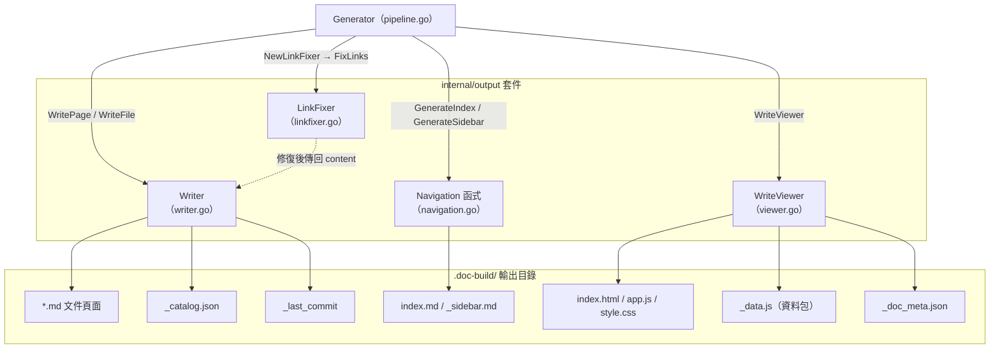
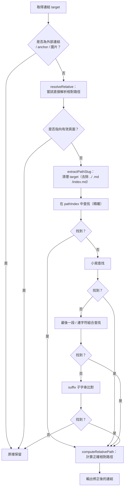
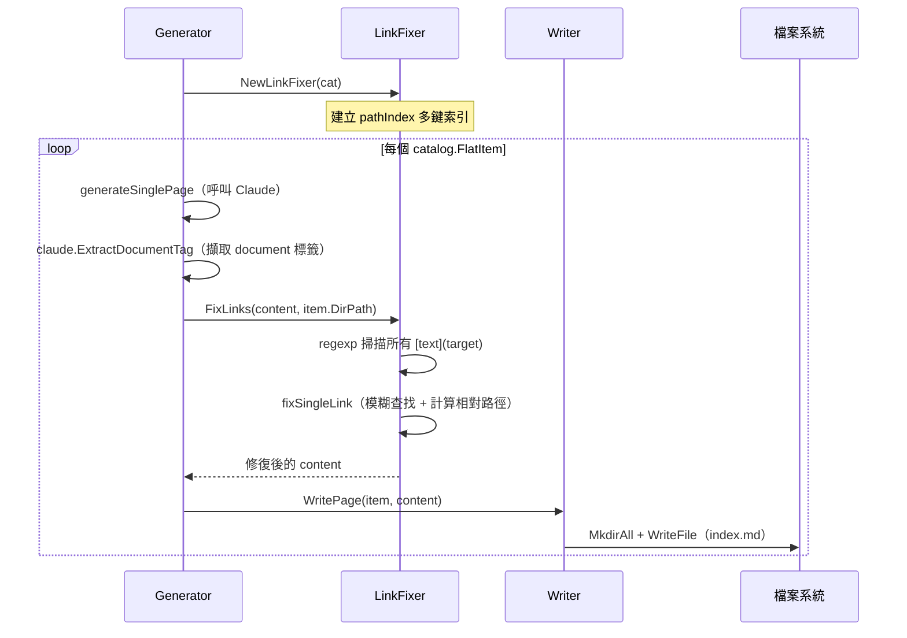
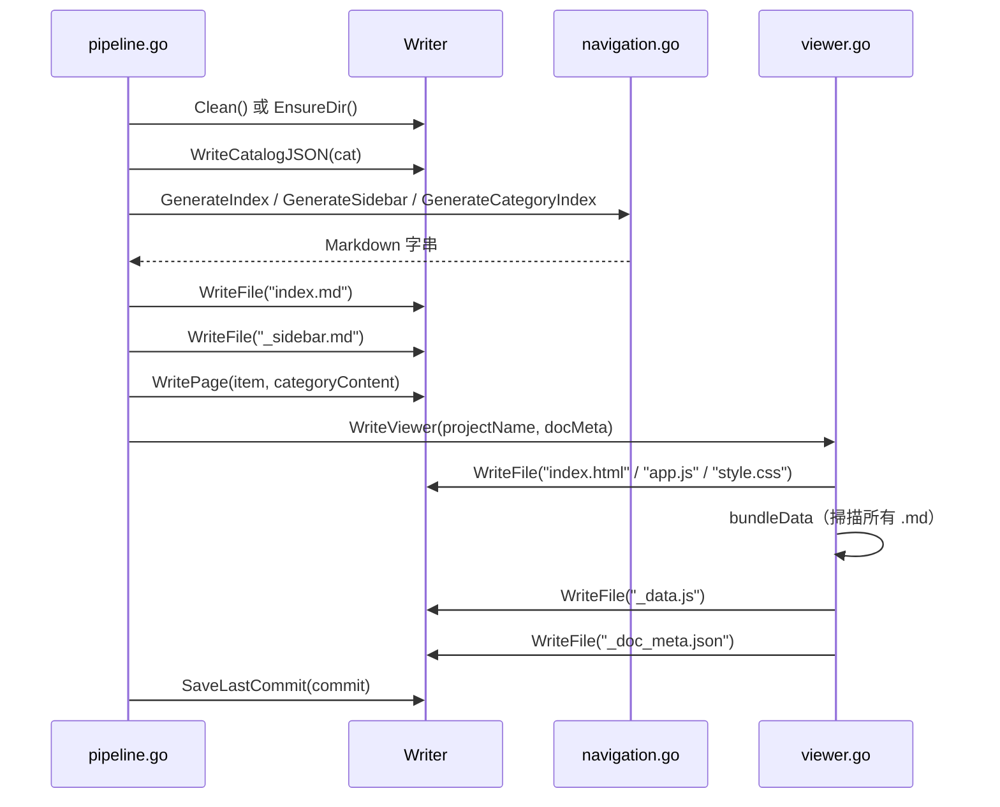

# 輸出寫入與連結修復

`internal/output` 套件負責將已產生的 Markdown 文件寫入磁碟、修復文件內的相對連結、產生導航結構，以及打包靜態瀏覽器資源。

## 概述

完成 Claude CLI 的內容產生後，系統需要將結果持久化到 `.doc-build/` 輸出目錄，並確保頁面之間的內部連結是有效且可跳轉的。`output` 套件由四個相互配合的元件組成：

| 元件 | 檔案 | 職責 |
|------|------|------|
| `Writer` | `writer.go` | 低階檔案 I/O，統一管理所有寫入操作 |
| `LinkFixer` | `linkfixer.go` | 偵測並修復破損的相對連結 |
| Navigation 函式 | `navigation.go` | 產生 `index.md`、`_sidebar.md` 及分類索引頁 |
| `WriteViewer` | `viewer.go` | 打包靜態 HTML/JS/CSS 及 `_data.js` 資料包 |

在管線中，`output` 套件在第三階段（內容頁面產生）與第四階段（導航與靜態瀏覽器產生）均被呼叫。

## 架構



## Writer — 檔案寫入器

`Writer` 是所有磁碟操作的統一入口，持有輸出目錄的絕對路徑 `BaseDir`（預設為 `.doc-build/`）。

### 結構定義

```go
// Writer handles writing documentation files to the output directory.
type Writer struct {
	BaseDir string // absolute path to .doc-build/
}

// NewWriter creates a new output writer.
func NewWriter(baseDir string) *Writer {
	return &Writer{BaseDir: baseDir}
}
```

> 來源：internal/output/writer.go#L26-L33

### 核心方法

#### 目錄與生命週期

```go
// Clean removes the output directory and recreates it.
func (w *Writer) Clean() error {
	if err := os.RemoveAll(w.BaseDir); err != nil {
		return fmt.Errorf("清除輸出目錄失敗: %w", err)
	}
	return os.MkdirAll(w.BaseDir, 0755)
}

// EnsureDir ensures the output directory exists.
func (w *Writer) EnsureDir() error {
	return os.MkdirAll(w.BaseDir, 0755)
}
```

> 來源：internal/output/writer.go#L36-L46

#### 頁面寫入與讀取

```go
// WritePage writes a documentation page for a catalog item.
func (w *Writer) WritePage(item catalog.FlatItem, content string) error {
	dir := filepath.Join(w.BaseDir, item.DirPath)
	if err := os.MkdirAll(dir, 0755); err != nil {
		return fmt.Errorf("建立目錄 %s 失敗: %w", dir, err)
	}

	path := filepath.Join(dir, "index.md")
	if err := os.WriteFile(path, []byte(content), 0644); err != nil {
		return fmt.Errorf("寫入 %s 失敗: %w", path, err)
	}
	return nil
}
```

> 來源：internal/output/writer.go#L48-L60

`WritePage` 接受 `catalog.FlatItem`（目錄項目的扁平化結構），自動在對應的 `DirPath` 下建立 `index.md`。

#### 頁面存在性驗證

```go
// PageExists checks if a documentation page exists and has valid content.
func (w *Writer) PageExists(item catalog.FlatItem) bool {
	path := filepath.Join(w.BaseDir, item.DirPath, "index.md")
	data, err := os.ReadFile(path)
	if err != nil {
		return false
	}
	content := strings.TrimSpace(string(data))
	if content == "" {
		return false
	}
	if strings.Contains(content, "此頁面產生失敗") {
		return false
	}
	return true
}
```

> 來源：internal/output/writer.go#L95-L111

`PageExists` 不只檢查檔案是否存在，還會排除空白頁面與失敗佔位頁（含有「此頁面產生失敗」標記），確保增量更新時能正確判斷哪些頁面需要重新產生。

#### 多語言支援

```go
// ForLanguage returns a new Writer that writes to a language-specific subdirectory.
func (w *Writer) ForLanguage(lang string) *Writer {
	return &Writer{
		BaseDir: filepath.Join(w.BaseDir, lang),
	}
}
```

> 來源：internal/output/writer.go#L138-L143

多語系的翻譯內容會寫入 `.doc-build/{lang}/` 子目錄，`ForLanguage` 建立指向該子目錄的 `Writer` 實例。

#### 持久化輔助檔案

| 方法 | 檔案 | 用途 |
|------|------|------|
| `WriteCatalogJSON` | `_catalog.json` | 保存目錄結構，供增量更新重複使用 |
| `ReadCatalogJSON` | `_catalog.json` | 讀回目錄結構 |
| `SaveLastCommit` | `_last_commit` | 保存 Git commit hash |
| `ReadLastCommit` | `_last_commit` | 讀取上次 commit，用於 diff 計算 |

## LinkFixer — 連結修復器

`LinkFixer` 在內容寫入磁碟前對 Markdown 中的所有內部連結進行驗證與修復，處理 Claude 產生的連結格式不正確（如 dot-notation、缺少路徑段等）的問題。

### 初始化

```go
// LinkFixer validates and fixes relative links in generated markdown content.
type LinkFixer struct {
	allItems  []catalog.FlatItem
	dirPaths  map[string]bool   // set of all valid dirPaths
	pathIndex map[string]string // various lookup keys → dirPath
}

// NewLinkFixer creates a link fixer from a catalog.
func NewLinkFixer(cat *catalog.Catalog) *LinkFixer {
	items := cat.Flatten()
	dirPaths := make(map[string]bool)
	pathIndex := make(map[string]string)

	for _, item := range items {
		dirPaths[item.DirPath] = true

		// index by multiple keys for fuzzy matching
		pathIndex[item.DirPath] = item.DirPath
		pathIndex[item.Path] = item.DirPath                          // dot-notation
		pathIndex[strings.ReplaceAll(item.Path, ".", "/")] = item.DirPath // explicit slash conversion

		// index by last segment (e.g., "scanner" → "core-modules/scanner")
		parts := strings.Split(item.DirPath, "/")
		lastSeg := parts[len(parts)-1]
		if _, exists := pathIndex[lastSeg]; !exists {
			pathIndex[lastSeg] = item.DirPath
		}
	}

	return &LinkFixer{
		allItems:  items,
		dirPaths:  dirPaths,
		pathIndex: pathIndex,
	}
}
```

> 來源：internal/output/linkfixer.go#L11-L48

`pathIndex` 建立多種鍵值索引，讓後續的模糊查找更有彈性：
- `dirPath`（如 `core-modules/scanner`）
- `dot-notation path`（如 `core-modules.scanner`）
- 最後一個路徑段（如 `scanner`）
- 小寫版本

### 連結修復流程

```go
// FixLinks scans markdown content for relative links and fixes broken ones.
func (lf *LinkFixer) FixLinks(content string, currentDirPath string) string {
	// match markdown links: [text](target)
	linkRe := regexp.MustCompile(`\[([^\]]+)\]\(([^)]+)\)`)

	return linkRe.ReplaceAllStringFunc(content, func(match string) string {
		// ...skip external links, anchors, images...
		fixed := lf.fixSingleLink(target, currentDirPath)
		if fixed != "" && fixed != target {
			return "[" + text + "](" + fixed + ")"
		}
		return match
	})
}
```

> 來源：internal/output/linkfixer.go#L50-L82

修復策略依序為：



### 相對路徑計算

```go
// computeRelativePath computes the relative path from one catalog item to another.
func (lf *LinkFixer) computeRelativePath(fromDirPath, toDirPath string) string {
	rel, err := filepath.Rel(fromDirPath, toDirPath)
	if err != nil {
		return ""
	}
	rel = filepath.ToSlash(rel)
	return rel + "/index.md"
}
```

> 來源：internal/output/linkfixer.go#L174-L182

所有修復後的連結均統一為 `{相對路徑}/index.md` 格式。

## Navigation — 導航產生

`navigation.go` 提供三個純函式，產生文件的導航結構，不依賴任何外部狀態。

### 多語言 UI 字串

```go
var UIStrings = map[string]map[string]string{
	"zh-TW": {
		"techDocs":        "技術文件",
		"catalog":         "目錄",
		"home":            "首頁",
		"sectionContains": "本章節包含以下內容：",
		"autoGenerated":   "本文件由 [selfmd](https://github.com/monkenwu/selfmd) 自動產生",
	},
	"en-US": {
		"techDocs":        "Technical Documentation",
		// ...
	},
}
```

> 來源：internal/output/navigation.go#L12-L27

### 三個導航產生函式

| 函式 | 產生目標 | 說明 |
|------|---------|------|
| `GenerateIndex` | `index.md` | 主頁，列出完整目錄並附上連結 |
| `GenerateSidebar` | `_sidebar.md` | 側邊欄導航，供靜態瀏覽器使用 |
| `GenerateCategoryIndex` | 各父節點的 `index.md` | 列出子章節的分類索引頁 |

```go
// GenerateIndex generates the main index.md landing page.
func GenerateIndex(projectName, projectDesc string, cat *catalog.Catalog, lang string) string {
	ui := getUIStrings(lang)
	var sb strings.Builder
	sb.WriteString(fmt.Sprintf("# %s %s\n\n", projectName, ui["techDocs"]))
	// ...
	for _, item := range cat.Items {
		writeIndexItem(&sb, item, "", 0)
	}
	// ...
}
```

> 來源：internal/output/navigation.go#L37-L59

## WriteViewer — 靜態瀏覽器打包

`viewer.go` 利用 Go 的 `//go:embed` 指令將靜態瀏覽器資源直接嵌入二進位檔案，並在產生時寫出，無需外部網路資源。

### 嵌入式資源

```go
//go:embed viewer/index.html
var viewerHTML string

//go:embed viewer/app.js
var viewerJS string

//go:embed viewer/style.css
var viewerCSS string
```

> 來源：internal/output/viewer.go#L12-L19

### 資料打包（`_data.js`）

```go
// bundleData walks the output directory, collects all .md files and _catalog.json,
// and writes them as a single _data.js file for client-side rendering.
func (w *Writer) bundleData(projectName string, docMeta *DocMeta) error {
	// ...
	// Build data object
	data := map[string]interface{}{
		"catalog": catalogObj,
		"pages":   pages,
	}
	// ...
	content := "window.DOC_DATA = " + string(jsonBytes) + ";\n"
	return w.WriteFile("_data.js", content)
}
```

> 來源：internal/output/viewer.go#L61-L193

`_data.js` 將所有 Markdown 頁面內容和目錄結構序列化為 JSON，以 `window.DOC_DATA` 全域變數注入，讓瀏覽器端的 `app.js` 可在不啟動伺服器的情況下渲染文件。

多語言模式下，次要語言（Secondary Language）的頁面也會被收集並放入 `data["languages"][langCode]`：

```go
languages := make(map[string]interface{})
for _, lang := range docMeta.AvailableLanguages {
    if lang.IsDefault {
        continue
    }
    // Read lang-specific catalog and pages from .doc-build/{lang}/
    langEntry["catalog"] = catObj
    langEntry["pages"] = langPages
    languages[lang.Code] = langEntry
}
```

> 來源：internal/output/viewer.go#L135-L185

### DocMeta — 語言元資料

```go
// DocMeta holds metadata about the documentation build, including language info.
type DocMeta struct {
	DefaultLanguage    string     `json:"default_language"`
	AvailableLanguages []LangInfo `json:"available_languages"`
}

// LangInfo describes a single available language.
type LangInfo struct {
	Code       string `json:"code"`
	NativeName string `json:"native_name"`
	IsDefault  bool   `json:"is_default"`
}
```

> 來源：internal/output/writer.go#L12-L23

## 核心流程

### 內容頁面寫入序列



### 完整管線中的角色



## 使用範例

### Writer 初始化（來自 Generator）

```go
absOutDir := cfg.Output.Dir
if absOutDir == "" {
    absOutDir = ".doc-build"
}

writer := output.NewWriter(absOutDir)
```

> 來源：internal/generator/pipeline.go#L43-L48

### 在內容產生階段使用 LinkFixer

```go
// Build the link fixer once for all pages
linkFixer := output.NewLinkFixer(cat)

// ...（並行產生每個頁面後）

// Post-process: fix broken links
content = linkFixer.FixLinks(content, item.DirPath)

return g.Writer.WritePage(item, content)
```

> 來源：internal/generator/content_phase.go#L29-L153

### 多語言 Writer

```go
// ForLanguage returns a new Writer that writes to a language-specific subdirectory.
func (w *Writer) ForLanguage(lang string) *Writer {
    return &Writer{
        BaseDir: filepath.Join(w.BaseDir, lang),
    }
}
```

> 來源：internal/output/writer.go#L138-L143

翻譯階段呼叫 `w.ForLanguage("en-US")` 即可取得指向 `.doc-build/en-US/` 的 Writer，翻譯後的頁面寫入後也會被 `bundleData` 收集進 `_data.js`。

## 相關連結

- [文件產生管線](../generator/index.md) — 管線如何呼叫 `Writer` 與 `LinkFixer`
- [內容頁面產生階段](../generator/content-phase/index.md) — `LinkFixer.FixLinks` 的使用時機
- [索引與導航產生階段](../generator/index-phase/index.md) — Navigation 函式的呼叫方
- [靜態文件瀏覽器](../static-viewer/index.md) — `_data.js` 的消費端
- [文件目錄管理](../catalog/index.md) — `catalog.FlatItem` 與 `catalog.Catalog` 的定義
- [增量更新](../incremental-update/index.md) — `PageExists`、`ReadLastCommit` 的使用情境
- [翻譯階段](../generator/translate-phase/index.md) — `ForLanguage` 的使用情境

## 參考檔案

| 檔案路徑 | 說明 |
|----------|------|
| `internal/output/writer.go` | `Writer` 結構定義、頁面寫入、持久化輔助方法、`DocMeta` 定義 |
| `internal/output/linkfixer.go` | `LinkFixer` 結構、多鍵索引建立、連結掃描與修復邏輯 |
| `internal/output/navigation.go` | `GenerateIndex`、`GenerateSidebar`、`GenerateCategoryIndex` 及多語言 UI 字串 |
| `internal/output/viewer.go` | `WriteViewer`、`bundleData`、嵌入式靜態資源寫出 |
| `internal/catalog/catalog.go` | `Catalog`、`CatalogItem`、`FlatItem` 定義與 `Flatten` 方法 |
| `internal/generator/pipeline.go` | `Generator` 結構、四階段管線主流程、`buildDocMeta` |
| `internal/generator/content_phase.go` | `GenerateContent`、`generateSinglePage`、`LinkFixer` 使用方式 |
| `internal/generator/index_phase.go` | `GenerateIndex` 呼叫 Navigation 函式的實作 |