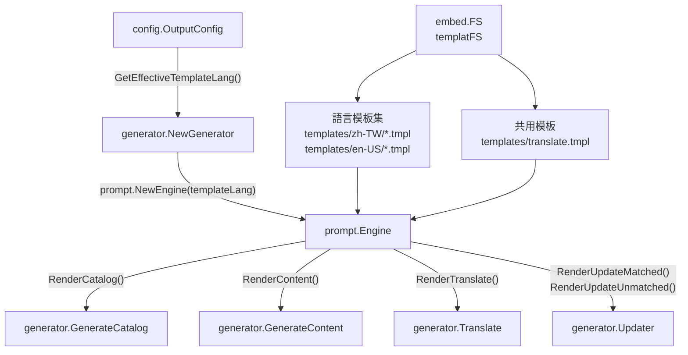
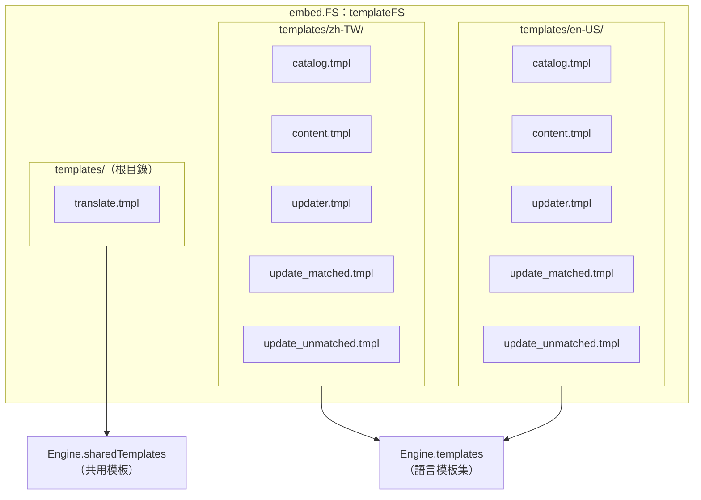
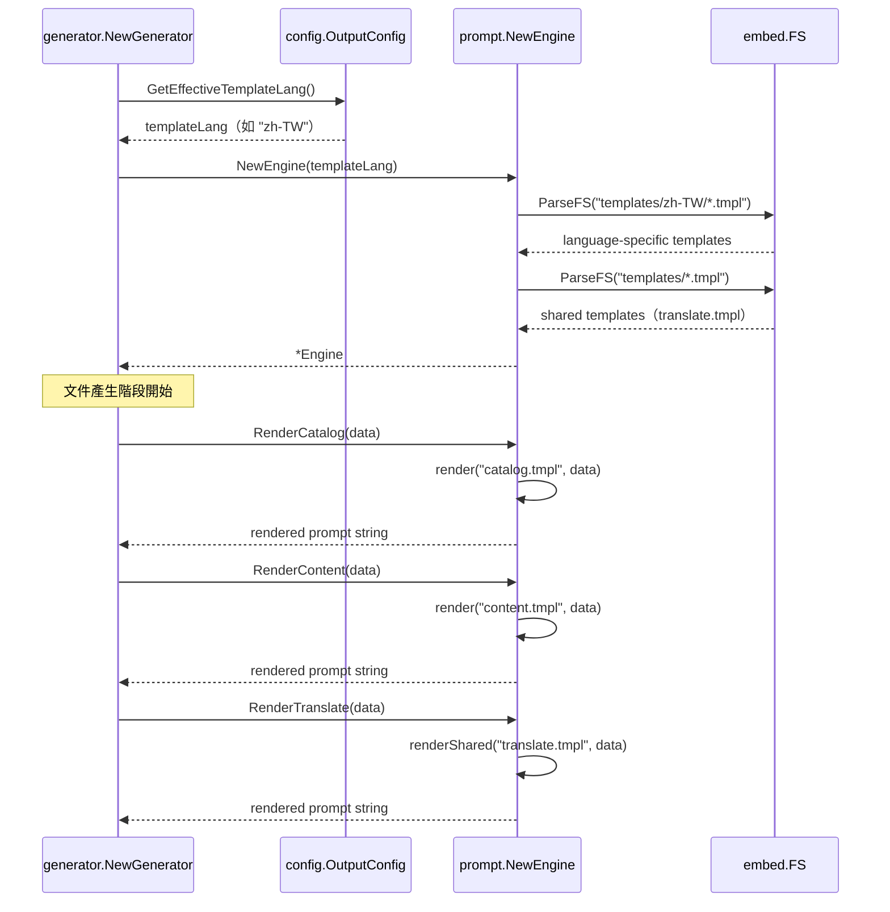
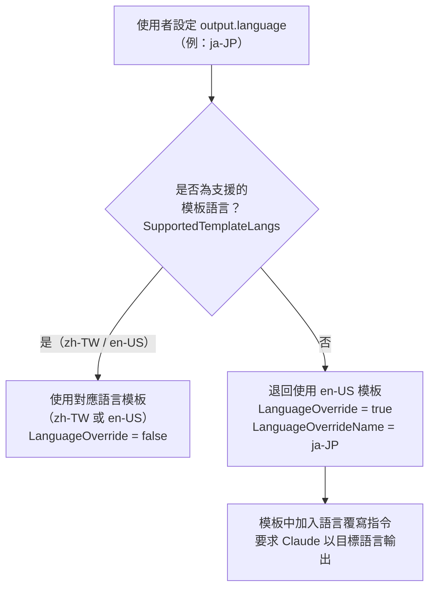

# Prompt 模板引擎

`prompt.Engine` 是 selfmd 的 Prompt 模板引擎，負責將結構化資料與預定義模板結合，產生傳遞給 Claude CLI 的完整提示詞（Prompt）。

## 概述

Prompt 模板引擎位於 `internal/prompt/` 套件，核心職責有三：

1. **模板載入**：使用 Go 的 `embed.FS` 機制，在編譯時將 `templates/` 目錄下的所有 `.tmpl` 檔案嵌入二進位檔，確保部署時無需額外的模板檔案。
2. **語言路由**：根據 `OutputConfig.GetEffectiveTemplateLang()` 決定載入哪一個語言子資料夾（`zh-TW` 或 `en-US`）的模板集。共用模板（`translate.tmpl`）則獨立管理，不隸屬於任何語言子資料夾。
3. **資料渲染**：提供六個高階渲染方法，每個方法對應文件產生管線的一個特定階段，接受強型別的資料結構（Data Struct）並回傳渲染後的字串。

在整體架構中，`Engine` 是 `Generator` 的核心依賴之一，與 `claude.Runner` 協作：`Engine` 負責「把資料轉成 Prompt 文字」，`Runner` 負責「把 Prompt 文字送給 Claude 並取得回應」。

### 關鍵術語

- **模板語言（Template Language）**：決定使用哪個語言資料夾下的 `.tmpl` 檔案，目前支援 `zh-TW` 與 `en-US`。
- **語言覆寫（Language Override）**：當使用者設定的輸出語言沒有對應模板時（例如 `ja-JP`），引擎會退回使用英文模板（`en-US`），並在 Prompt 中加入明確指令，要求 Claude 以目標語言輸出。
- **共用模板（Shared Template）**：`translate.tmpl` 不依賴特定語言，可翻譯任意語言組合，因此獨立於語言子資料夾外載入。

## 架構

### 元件依賴關係



### 模板檔案組織



## 核心資料結構

`Engine` 中定義了六個對應不同渲染場景的資料結構（Data Struct）：

### CatalogPromptData

用於**目錄產生階段**，提供專案的完整掃描結果讓 Claude 分析並設計文件目錄。

```go
type CatalogPromptData struct {
	RepositoryName       string
	ProjectType          string
	Language             string
	LanguageName         string // native display name (e.g., "繁體中文")
	LanguageOverride     bool   // true when template lang != output lang
	LanguageOverrideName string // native name of the desired output language
	KeyFiles             string
	EntryPoints          string
	FileTree             string
	ReadmeContent        string
}
```

> 來源：internal/prompt/engine.go#L40-L51

### ContentPromptData

用於**內容頁面產生階段**，指定要撰寫的頁面在目錄中的位置、可連結的頁面清單，以及更新情境下的現有內容。

```go
type ContentPromptData struct {
	RepositoryName       string
	Language             string
	LanguageName         string
	LanguageOverride     bool
	LanguageOverrideName string
	CatalogPath          string
	CatalogTitle         string
	CatalogDirPath       string // filesystem dir path of THIS item, e.g., "configuration/claude-config"
	ProjectDir           string
	FileTree             string
	CatalogTable         string // formatted table of all catalog items with their dir paths
	ExistingContent      string // existing page content for update context (empty for new pages)
}
```

> 來源：internal/prompt/engine.go#L54-L67

### UpdateMatchedPromptData 與 UpdateUnmatchedPromptData

用於**增量更新階段**，分別處理「判斷哪些現有頁面需要重新產生」與「判斷是否需要新增頁面」兩個子任務。

```go
type UpdateMatchedPromptData struct {
	RepositoryName string
	Language       string
	ChangedFiles   string // list of changed source files
	AffectedPages  string // pages that reference these files (path + title + summary)
}

type UpdateUnmatchedPromptData struct {
	RepositoryName  string
	Language        string
	UnmatchedFiles  string // changed files not referenced in any existing doc
	ExistingCatalog string // existing catalog JSON
	CatalogTable    string // formatted link table of all pages
}
```

> 來源：internal/prompt/engine.go#L81-L95

### TranslatePromptData

用於**翻譯階段**，指定來源語言、目標語言，以及要翻譯的完整 Markdown 內容。

```go
type TranslatePromptData struct {
	SourceLanguage     string // e.g., "zh-TW"
	SourceLanguageName string // e.g., "繁體中文"
	TargetLanguage     string // e.g., "en-US"
	TargetLanguageName string // e.g., "English"
	SourceContent      string // the full markdown content to translate
}
```

> 來源：internal/prompt/engine.go#L98-L104

## 模板語言選擇邏輯

引擎的語言選擇由 `config.OutputConfig` 中的兩個方法控制：

```go
// SupportedTemplateLangs lists language codes that have built-in prompt template folders.
var SupportedTemplateLangs = []string{"zh-TW", "en-US"}

// GetEffectiveTemplateLang returns which template folder to load.
// If Language has a built-in template set, returns it; otherwise falls back to "en-US".
func (o *OutputConfig) GetEffectiveTemplateLang() string {
	for _, lang := range SupportedTemplateLangs {
		if o.Language == lang {
			return o.Language
		}
	}
	return "en-US"
}

// NeedsLanguageOverride returns true when the template language differs from Language,
// meaning the prompt needs an explicit instruction to output in the configured language.
func (o *OutputConfig) NeedsLanguageOverride() bool {
	return o.GetEffectiveTemplateLang() != o.Language
}
```

> 來源：internal/config/config.go#L53-L71

當 `LanguageOverride` 為 `true` 時，模板會在 Prompt 中加入明確的語言指令，要求 Claude 以指定語言輸出，即使模板本身是英文撰寫的。

## 核心流程

### Engine 初始化與渲染流程



### 語言覆寫決策流程



## 使用範例

### 初始化 Engine

```go
// NewGenerator creates a new Generator.
func NewGenerator(cfg *config.Config, rootDir string, logger *slog.Logger) (*Generator, error) {
	templateLang := cfg.Output.GetEffectiveTemplateLang()
	engine, err := prompt.NewEngine(templateLang)
	if err != nil {
		return nil, err
	}
	// ...
	return &Generator{
		// ...
		Engine: engine,
	}, nil
}
```

> 來源：internal/generator/pipeline.go#L35-L59

### 渲染目錄 Prompt

```go
func (g *Generator) GenerateCatalog(ctx context.Context, scan *scanner.ScanResult) (*catalog.Catalog, error) {
	langName := config.GetLangNativeName(g.Config.Output.Language)
	data := prompt.CatalogPromptData{
		RepositoryName:       g.Config.Project.Name,
		ProjectType:          g.Config.Project.Type,
		Language:             g.Config.Output.Language,
		LanguageName:         langName,
		LanguageOverride:     g.Config.Output.NeedsLanguageOverride(),
		LanguageOverrideName: langName,
		KeyFiles:             scan.KeyFiles(),
		EntryPoints:          scan.EntryPointsFormatted(),
		FileTree:             scanner.RenderTree(scan.Tree, 4),
		ReadmeContent:        scan.ReadmeContent,
	}

	rendered, err := g.Engine.RenderCatalog(data)
	if err != nil {
		return nil, err
	}
	// rendered 為完整的 Prompt 字串，傳遞給 claude.Runner
}
```

> 來源：internal/generator/catalog_phase.go#L16-L62

### 渲染翻譯 Prompt

```go
rendered, err := g.Engine.RenderTranslate(data)
```

> 來源：internal/generator/translate_phase.go#L195

## 相關連結

- [文件產生管線](../generator/index.md) — `Engine` 在四階段管線中的使用方式
- [目錄產生階段](../generator/catalog-phase/index.md) — 使用 `RenderCatalog` 的詳細流程
- [內容頁面產生階段](../generator/content-phase/index.md) — 使用 `RenderContent` 的詳細流程
- [翻譯階段](../generator/translate-phase/index.md) — 使用 `RenderTranslate` 的詳細流程
- [增量更新](../incremental-update/index.md) — 使用 `RenderUpdateMatched`、`RenderUpdateUnmatched` 的情境
- [Claude CLI 執行器](../claude-runner/index.md) — 接收 `Engine` 渲染結果的下游元件
- [多語言支援](../../i18n/index.md) — 語言覆寫機制的使用者端設定

## 參考檔案

| 檔案路徑 | 說明 |
|----------|------|
| `internal/prompt/engine.go` | `Engine` 結構、資料型別定義與渲染方法 |
| `internal/prompt/templates/zh-TW/catalog.tmpl` | 繁體中文目錄產生 Prompt 模板 |
| `internal/prompt/templates/zh-TW/content.tmpl` | 繁體中文內容頁面產生 Prompt 模板 |
| `internal/prompt/templates/zh-TW/updater.tmpl` | 繁體中文增量更新（legacy）Prompt 模板 |
| `internal/prompt/templates/zh-TW/update_matched.tmpl` | 繁體中文：判斷現有頁面是否需重新產生的 Prompt 模板 |
| `internal/prompt/templates/zh-TW/update_unmatched.tmpl` | 繁體中文：判斷是否需新增頁面的 Prompt 模板 |
| `internal/prompt/templates/translate.tmpl` | 共用翻譯 Prompt 模板（語言無關） |
| `internal/prompt/templates/en-US/catalog.tmpl` | 英文目錄產生 Prompt 模板 |
| `internal/config/config.go` | `OutputConfig.GetEffectiveTemplateLang()`、`NeedsLanguageOverride()` 與 `SupportedTemplateLangs` 定義 |
| `internal/generator/pipeline.go` | `Generator` 結構定義與 `NewGenerator` 初始化邏輯 |
| `internal/generator/catalog_phase.go` | `GenerateCatalog`：使用 `RenderCatalog` 的範例 |