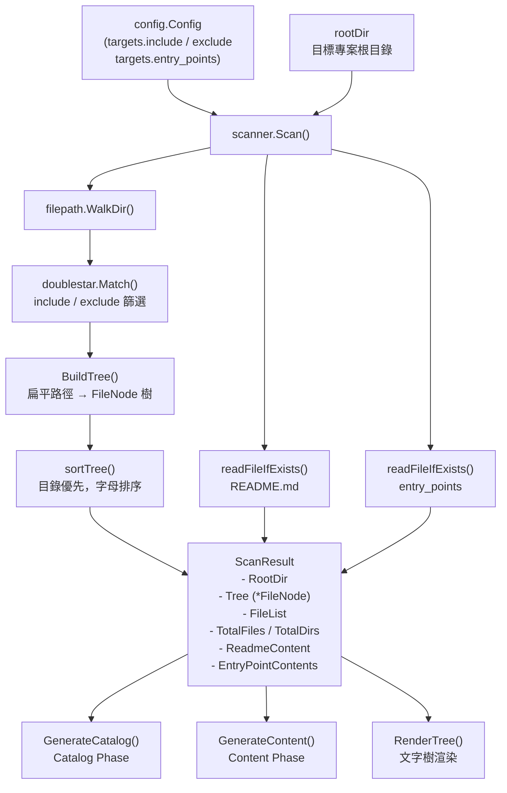
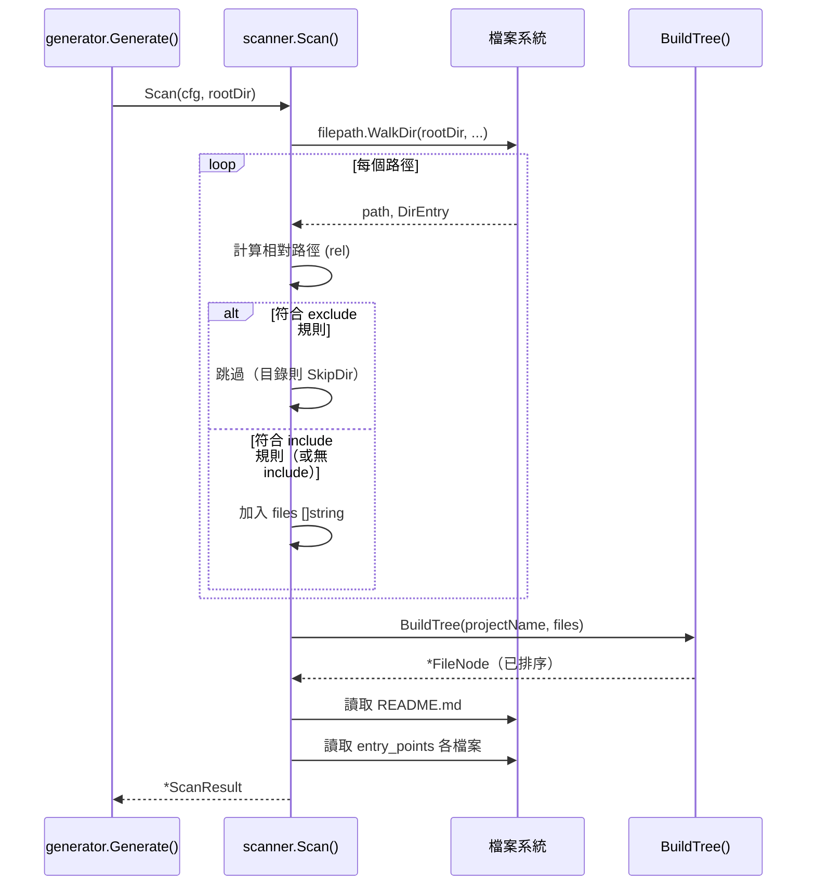

# 專案掃描器

專案掃描器（`scanner` 套件）負責遍歷目標專案的目錄結構，收集檔案清單、建構樹狀結構、讀取 README 與進入點（entry points）檔案，並將結果封裝為 `ScanResult`，供後續的文件產生管線使用。

## 概述

在 selfmd 的四階段管線中，掃描器是第一個執行的核心模組（Phase 1）。它的職責是：

- **收集符合條件的檔案**：依照 `selfmd.yaml` 中 `targets.include` 與 `targets.exclude` 的 glob 規則，過濾出需要文件化的原始碼檔案
- **建構檔案樹（File Tree）**：將扁平的檔案路徑清單轉換為層次化的 `FileNode` 樹狀結構，供後續渲染為可讀的目錄格式
- **讀取關鍵上下文**：自動讀取 `README.md` 及設定檔中指定的進入點檔案，作為 Claude 產生目錄時的背景資料

掃描結果（`ScanResult`）是整個管線的起點：Catalog Phase 和 Content Phase 都依賴它提供的檔案樹、KEY files 清單與進入點內容。

### 核心概念

| 術語 | 說明 |
|------|------|
| `ScanResult` | 掃描完成後的完整結果物件，包含樹狀結構、檔案清單、README 等資訊 |
| `FileNode` | 代表檔案樹中的單一節點，可以是目錄或檔案 |
| `BuildTree` | 將扁平路徑清單轉換為 `FileNode` 樹的函式 |
| `RenderTree` | 將 `FileNode` 樹渲染為類 UNIX `tree` 指令格式的文字，用於注入 Prompt |
| Entry Points | 設定中指定的重要檔案（如 `main.go`），其內容會被完整讀入供 Claude 參考 |

## 架構



## 資料結構

### FileNode

`FileNode` 是檔案樹的基本單元，代表一個目錄或檔案：

```go
type FileNode struct {
    Name     string
    Path     string // relative path from project root
    IsDir    bool
    Children []*FileNode
}
```

> 來源：`internal/scanner/filetree.go#L11-L16`

### ScanResult

`ScanResult` 封裝了一次完整掃描的所有輸出：

```go
type ScanResult struct {
    RootDir            string
    Tree               *FileNode
    FileList           []string
    TotalFiles         int
    TotalDirs          int
    ReadmeContent      string
    EntryPointContents map[string]string
}
```

> 來源：`internal/scanner/filetree.go#L19-L27`

## 核心流程

### Scan 掃描主流程



### 檔案過濾邏輯

掃描時採用「先排除、後包含」的雙層過濾策略：

1. **排除（Exclude）優先**：若路徑符合任一 `exclude` glob pattern，目錄直接呼叫 `filepath.SkipDir` 跳過整個子樹，檔案則略過
2. **包含（Include）過濾**：若設定了 `include` 清單，只有符合至少一個 pattern 的檔案才會被收入結果

```go
// check excludes
for _, pattern := range cfg.Targets.Exclude {
    matched, _ := doublestar.Match(pattern, rel)
    if matched {
        if d.IsDir() {
            return filepath.SkipDir
        }
        return nil
    }
}

// check includes
if len(cfg.Targets.Include) > 0 {
    included := false
    for _, pattern := range cfg.Targets.Include {
        matched, _ := doublestar.Match(pattern, rel)
        if matched {
            included = true
            break
        }
    }
    if !included {
        return nil
    }
}
```

> 來源：`internal/scanner/scanner.go#L33-L61`

Glob 匹配使用 `doublestar` 套件，支援 `**` 通配符（如 `vendor/**`、`internal/**`）。

### BuildTree 樹狀結構建構

`BuildTree` 接受扁平的相對路徑清單，逐步建構 `FileNode` 樹：

```go
func BuildTree(rootName string, paths []string) *FileNode {
    root := &FileNode{
        Name:  rootName,
        Path:  "",
        IsDir: true,
    }

    for _, p := range paths {
        parts := strings.Split(filepath.ToSlash(p), "/")
        current := root
        for i, part := range parts {
            isLast := i == len(parts)-1
            child := findChild(current, part)
            if child == nil {
                child = &FileNode{
                    Name:  part,
                    Path:  strings.Join(parts[:i+1], "/"),
                    IsDir: !isLast,
                }
                current.Children = append(current.Children, child)
            }
            if !isLast {
                child.IsDir = true
            }
            current = child
        }
    }

    sortTree(root)
    return root
}
```

> 來源：`internal/scanner/filetree.go#L30-L60`

建構完成後，`sortTree` 對每層節點進行排序：**目錄節點優先，相同類型則按字母順序**。

### RenderTree 樹狀文字渲染

`RenderTree` 將 `FileNode` 樹轉換為類似 UNIX `tree` 指令輸出的文字格式，注入至 Claude Prompt 中：

```go
func RenderTree(node *FileNode, maxDepth int) string {
    var sb strings.Builder
    sb.WriteString(node.Name + "/\n")
    renderChildren(&sb, node, "", maxDepth, 0)
    return sb.String()
}
```

> 來源：`internal/scanner/filetree.go#L87-L92`

渲染時具備兩項保護機制：
- `maxDepth`：限制最大展開深度（Catalog Phase 用 4 層，Content Phase 用 3 層）
- 每層最多渲染 30 個子節點，超過時顯示 `... (N more items)`

## 輔助方法

### KeyFiles()

掃描結果提供 `KeyFiles()` 方法，從 `FileList` 中篩選出知名的重要檔案（如 `main.go`、`Dockerfile`、`go.mod` 等），以逗號分隔回傳，作為 Catalog Prompt 的補充資訊：

```go
func (s *ScanResult) KeyFiles() string {
    notable := []string{}
    patterns := []string{
        "main.go", "main.py", "main.rs", "main.ts", "main.js",
        "index.ts", "index.js", "app.go", "app.py", "app.ts",
        "Makefile", "Dockerfile", "docker-compose.yml", "compose.yaml",
        "package.json", "go.mod", "Cargo.toml", "pom.xml",
        "README.md", "CHANGELOG.md",
    }
    // ...
    if len(notable) > 20 {
        notable = notable[:20]
    }
    return strings.Join(notable, ", ")
}
```

> 來源：`internal/scanner/scanner.go#L117-L141`

### EntryPointsFormatted()

將設定中指定的進入點檔案內容格式化為 Markdown 程式碼區塊，每個進入點限制最多 10,000 字元，超過則截斷：

```go
func (s *ScanResult) EntryPointsFormatted() string {
    if len(s.EntryPointContents) == 0 {
        return "(no entry points specified)"
    }

    var sb strings.Builder
    for path, content := range s.EntryPointContents {
        sb.WriteString("### " + path + "\n```\n")
        if len(content) > 10000 {
            content = content[:10000] + "\n... (truncated)"
        }
        sb.WriteString(content)
        sb.WriteString("\n```\n\n")
    }
    return sb.String()
}
```

> 來源：`internal/scanner/scanner.go#L144-L160`

### readFileIfExists()

私有輔助函式，讀取檔案內容並在超過 50,000 字元時自動截斷：

```go
func readFileIfExists(rootDir, relPath string) string {
    data, err := os.ReadFile(filepath.Join(rootDir, relPath))
    if err != nil {
        return ""
    }
    content := string(data)
    if len(content) > 50000 {
        content = content[:50000] + "\n... (truncated)"
    }
    return content
}
```

> 來源：`internal/scanner/scanner.go#L103-L114`

## 使用範例

### 在管線中呼叫掃描器

以下是 `generator.Generate()` 中呼叫掃描器的實際程式碼：

```go
// Phase 1: Scan
fmt.Println(ui.T("[1/4] 掃描專案結構...", "[1/4] Scanning project structure..."))
scan, err := scanner.Scan(g.Config, g.RootDir)
if err != nil {
    return fmt.Errorf(ui.T("掃描專案失敗: %w", "failed to scan project: %w"), err)
}
fmt.Printf(ui.T("      找到 %d 個檔案，分布於 %d 個目錄\n", "      Found %d files in %d directories\n"), scan.TotalFiles, scan.TotalDirs)
```

> 來源：`internal/generator/pipeline.go#L88-L94`

### 掃描結果用於 Catalog Phase

```go
data := prompt.CatalogPromptData{
    // ...
    KeyFiles:      scan.KeyFiles(),
    EntryPoints:   scan.EntryPointsFormatted(),
    FileTree:      scanner.RenderTree(scan.Tree, 4),
    ReadmeContent: scan.ReadmeContent,
}
```

> 來源：`internal/generator/catalog_phase.go#L18-L29`

### 掃描結果用於 Content Phase

```go
data := prompt.ContentPromptData{
    // ...
    FileTree: scanner.RenderTree(scan.Tree, 3),
}
```

> 來源：`internal/generator/content_phase.go#L102-L103`

## 相關連結

- [文件產生管線](../generator/index.md) — 掃描器在四階段管線中的位置與呼叫時機
- [目錄產生階段](../generator/catalog-phase/index.md) — 直接消費 `ScanResult` 的第一個下游階段
- [內容頁面產生階段](../generator/content-phase/index.md) — 使用 `RenderTree` 注入檔案樹至 Prompt
- [專案與掃描目標設定](../../configuration/project-targets/index.md) — `include`、`exclude`、`entry_points` 的設定方式
- [核心模組](../index.md) — 回到核心模組總覽

## 參考檔案

| 檔案路徑 | 說明 |
|----------|------|
| `internal/scanner/scanner.go` | `Scan()` 主函式、`KeyFiles()`、`EntryPointsFormatted()`、`readFileIfExists()` |
| `internal/scanner/filetree.go` | `FileNode`、`ScanResult` 資料結構定義；`BuildTree()`、`RenderTree()`、`sortTree()` |
| `internal/generator/pipeline.go` | 管線主流程，展示掃描器的呼叫時機與結果使用 |
| `internal/generator/catalog_phase.go` | Catalog Phase 中對 `ScanResult` 各方法的消費方式 |
| `internal/generator/content_phase.go` | Content Phase 中 `RenderTree` 的使用方式 |
| `internal/config/config.go` | `TargetsConfig` 結構定義（`Include`、`Exclude`、`EntryPoints`） |