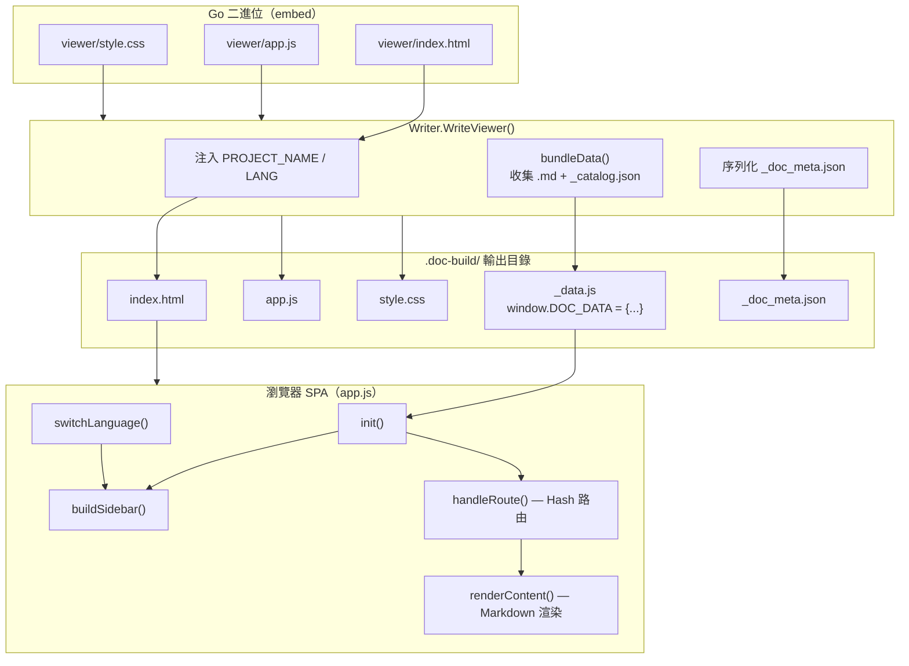
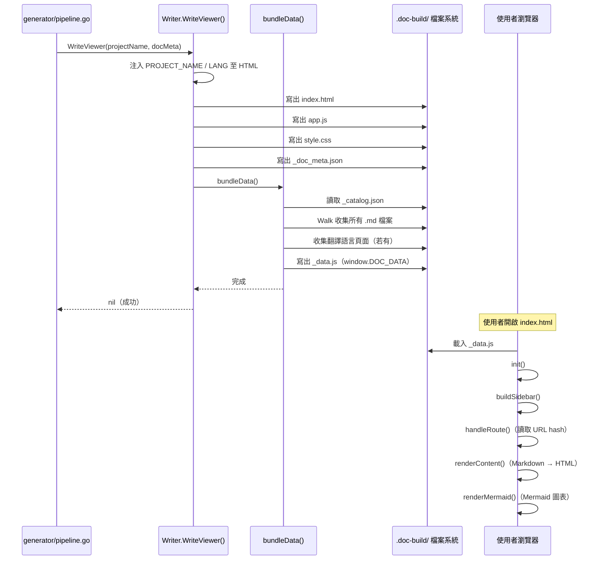

# 靜態文件瀏覽器

靜態文件瀏覽器是 selfmd 的最終輸出介面，以零依賴的單頁應用程式（SPA）形式呈現，僅需開啟 `index.html` 即可瀏覽所有文件，無須任何伺服器或網路服務。

## 概述

selfmd 在每次文件產生完成後，會自動在 `.doc-build/` 目錄下建立一組靜態網頁檔案。使用者只需在瀏覽器中開啟 `.doc-build/index.html`，便可透過側邊欄導覽、即時 Markdown 渲染與 Mermaid 圖表檢視所有產生的文件。

靜態瀏覽器的核心設計原則如下：

- **無伺服器（Serverless）**：所有 Markdown 內容與目錄結構預先打包成 `_data.js`，以 JavaScript 全域變數形式注入，不依賴任何後端 API
- **二進位嵌入（Binary Embed）**：HTML、JavaScript、CSS 三個靜態資產以 Go `//go:embed` 指令編譯進 selfmd 執行檔，發佈時無需附帶額外檔案
- **單一入口點**：`index.html` 為唯一入口，使用 URL hash（`#path/to/page.md`）實現客戶端路由
- **多語言支援**：若文件有翻譯版本，側邊欄頂部會顯示語言切換器，切換時動態替換頁面內容與目錄

瀏覽器涉及的輸出檔案：

| 檔案 | 說明 |
|------|------|
| `index.html` | HTML 外殼，含專案名稱與語言代碼注入 |
| `app.js` | 前端 SPA 邏輯（路由、渲染、互動） |
| `style.css` | 版面配置與視覺樣式 |
| `_data.js` | 打包所有 Markdown 內容與目錄的資料包 |
| `_doc_meta.json` | 語言元資料（可選） |

## 架構



> 來源：`internal/output/viewer.go`、`internal/output/viewer/app.js`

## 靜態資產嵌入機制

三個靜態資產檔案透過 Go `embed` 套件在編譯時期直接嵌入執行檔，不需要在執行環境中存在對應的檔案路徑。

```go
//go:embed viewer/index.html
var viewerHTML string

//go:embed viewer/app.js
var viewerJS string

//go:embed viewer/style.css
var viewerCSS string
```

> 來源：`internal/output/viewer.go#L12-L19`

`WriteViewer` 在寫出 `index.html` 前，會對模板進行字串替換，將專案名稱（`{{PROJECT_NAME}}`）與語言代碼（`{{LANG}}`）注入 HTML：

```go
func (w *Writer) WriteViewer(projectName string, docMeta *DocMeta) error {
    html := strings.ReplaceAll(viewerHTML, "{{PROJECT_NAME}}", projectName)
    lang := "zh-TW"
    if docMeta != nil {
        lang = docMeta.DefaultLanguage
    }
    html = strings.ReplaceAll(html, "{{LANG}}", lang)

    if err := w.WriteFile("index.html", html); err != nil {
        return fmt.Errorf("寫入 index.html 失敗: %w", err)
    }
    // ...
}
```

> 來源：`internal/output/viewer.go#L23-L43`

## 資料打包機制（bundleData）

`bundleData` 函式負責掃描 `.doc-build/` 目錄，將所有 Markdown 頁面與目錄結構打包成單一 `_data.js` 檔案。

### 打包流程

1. 讀取 `_catalog.json` 作為目錄結構
2. 使用 `filepath.Walk` 遍歷輸出目錄，收集所有 `.md` 檔案（排除 `_` 開頭的特殊檔案）
3. 若有多語言設定，跳過語言子目錄（`en-US/`、`ja-JP/` 等）中的主語言頁面
4. 若有翻譯語言，另行收集各語言子目錄的目錄與頁面
5. 將所有資料序列化為 JSON，寫入 `_data.js`

```go
func (w *Writer) bundleData(projectName string, docMeta *DocMeta) error {
    // Read catalog
    catalogPath := filepath.Join(w.BaseDir, "_catalog.json")
    catalogBytes, err := os.ReadFile(catalogPath)
    // ...

    // Collect all master-language .md files (skip language subdirectories)
    pages := make(map[string]string)
    // ...
    err = filepath.Walk(w.BaseDir, func(path string, info os.FileInfo, err error) error {
        // Skip files starting with _
        if strings.HasPrefix(filepath.Base(relPath), "_") {
            return nil
        }
        // Skip files inside language subdirectories
        topDir := strings.SplitN(relPath, "/", 2)[0]
        if langDirs[topDir] {
            return nil
        }
        // ...
    })
    // ...
    content := "window.DOC_DATA = " + string(jsonBytes) + ";\n"
    return w.WriteFile("_data.js", content)
}
```

> 來源：`internal/output/viewer.go#L61-L193`

### `_data.js` 資料結構

最終產生的 `window.DOC_DATA` 全域物件結構如下：

```javascript
window.DOC_DATA = {
  "catalog": { /* _catalog.json 的內容 */ },
  "pages": {
    "overview/index.md": "# 概述\n...",
    "core-modules/scanner/index.md": "# 掃描器\n..."
    // 所有主語言 .md 檔案
  },
  "meta": {
    "default_language": "zh-TW",
    "available_languages": [
      { "code": "zh-TW", "native_name": "繁體中文", "is_default": true },
      { "code": "en-US", "native_name": "English", "is_default": false }
    ]
  },
  "languages": {
    "en-US": {
      "catalog": { /* 英文目錄 */ },
      "pages": { "overview/index.md": "# Overview\n..." }
    }
  }
};
```

> 來源：`internal/output/viewer.go#L126-L192`

## 前端應用程式（app.js）

`app.js` 是一個以原生 JavaScript（ES5 相容）撰寫的 SPA，使用立即呼叫函式（IIFE）封裝，不依賴任何前端框架。

### 模組功能一覽

| 函式群組 | 主要函式 | 說明 |
|---------|---------|------|
| 初始化 | `init()` | 載入資料、設定 Marked、初始化路由 |
| 目錄建立 | `buildSidebar()` / `renderSidebarSection()` | 從 catalog 遞迴建立可折疊側邊欄 |
| 路由 | `handleRoute()` / `loadPage()` | 基於 URL hash 的客戶端路由 |
| 內容渲染 | `renderContent()` / `fixLinks()` | Markdown 渲染與相對路徑轉換 |
| Mermaid | `renderMermaid()` | 偵測 mermaid 程式碼區塊並呼叫 `mermaid.run()` |
| 語言切換 | `buildLangSwitcher()` / `switchLanguage()` | 多語言 `<select>` 元件與資料切換 |
| 工具列 | `buildPageToolbar()` | 每頁頂部的「複製路徑」與「下載 Markdown」按鈕 |
| 全螢幕 | `enterMindmapFullscreen()` / `exitMindmapFullscreen()` | Mermaid 圖表的全螢幕縮放平移功能 |
| 行動端 | `setupMobileMenu()` | 漢堡選單與側邊欄覆蓋層 |

### 路由機制

路由以 URL hash 實作：`location.hash` 的值即為頁面的相對路徑（如 `#core-modules/scanner/index.md`）。頁面切換時呼叫 `loadPage(path)`，從 `window.DOC_DATA.pages` 取出 Markdown 字串並渲染。

```javascript
function handleRoute() {
    var path = location.hash.slice(1) || "index.md";
    loadPage(path);
}

function loadPage(path) {
    var md = pages[path];
    if (!md) {
        document.getElementById("article").innerHTML =
            "<h1>頁面未找到</h1><p>找不到 <code>" + escapeHtml(path) + "</code></p>";
        return;
    }
    renderContent(md, path);
    updateActiveLink(path);
    updateTitle(path);
    document.getElementById("content").scrollTop = 0;
    document.getElementById("sidebar").classList.remove("open");
}
```

> 來源：`internal/output/viewer/app.js#L172-L196`

### 相對路徑修正

Markdown 中的相對連結（如 `../other-section/index.md`）在 SPA 中需轉換為 hash 連結（`#other-section/index.md`）。`fixLinks()` 在渲染後遍歷所有 `<a>` 元素執行此轉換：

```javascript
function fixLinks(container, currentPath) {
    var baseDir = currentPath.replace(/[^/]*$/, "");
    var links = container.querySelectorAll("a[href]");
    for (var i = 0; i < links.length; i++) {
        var href = links[i].getAttribute("href");
        if (href.indexOf("://") !== -1 || href.charAt(0) === "#" || href.indexOf("mailto:") === 0) continue;
        var resolved = resolvePath(baseDir, href);
        links[i].setAttribute("href", "#" + resolved);
    }
}
```

> 來源：`internal/output/viewer/app.js#L280-L293`

### Mermaid 圖表全螢幕功能

每個 Mermaid 圖表旁都有全螢幕按鈕（`⛶`），點擊後進入全螢幕模式，支援滾輪縮放（0.8× 至 2.0×）與滑鼠拖曳平移：

```javascript
function onMmWheel(e) {
    e.preventDefault();
    var delta = e.deltaY > 0 ? 0.95 : 1.05;
    var newScale = mmState.scale * delta;
    if (newScale < 0.8) newScale = 0.8;
    if (newScale > 2.0) newScale = 2.0;
    mmState.scale = newScale;
    applyMmTransform();
}
```

> 來源：`internal/output/viewer/app.js#L526-L534`

## 視覺樣式（style.css）

`style.css` 使用 CSS 自訂屬性（CSS Variables）定義設計系統，以深色主題側邊欄搭配淺色主內容區呈現：

```css
:root {
    --sidebar-width: 280px;
    --sidebar-bg: #1a1b26;
    --sidebar-text: #a9b1d6;
    --sidebar-active-bg: rgba(122, 162, 247, 0.12);
    --sidebar-active-text: #7aa2f7;
    --content-bg: #ffffff;
    --text-color: #2e3440;
    /* ... */
}
```

> 來源：`internal/output/viewer/style.css#L1-L19`

響應式設計以 `@media (max-width: 860px)` 斷點為基準，在窄螢幕上隱藏側邊欄並顯示漢堡選單：

```css
@media (max-width: 860px) {
    #menu-toggle { display: block; }
    #sidebar {
        position: fixed;
        transform: translateX(-100%);
        transition: transform 0.25s ease;
    }
    #sidebar.open { transform: translateX(0); }
}
```

> 來源：`internal/output/viewer/style.css#L521-L551`

## 核心流程



## 外部函式庫依賴

瀏覽器端透過 CDN 載入三個第三方函式庫，均從 `index.html` 中的 `<script>` 標籤引入：

```html
<script src="https://cdn.jsdelivr.net/npm/marked/marked.min.js"></script>
<script src="https://cdn.jsdelivr.net/npm/highlight.js@11/highlight.min.js"></script>
<script src="https://cdn.jsdelivr.net/npm/mermaid/dist/mermaid.min.js"></script>
```

> 來源：`internal/output/viewer/index.html#L26-L28`

| 函式庫 | 用途 |
|--------|------|
| [marked](https://marked.js.org/) | Markdown 轉 HTML 渲染（GFM 支援） |
| [highlight.js](https://highlightjs.org/) | 程式碼語法高亮 |
| [mermaid](https://mermaid.js.org/) | Mermaid 圖表渲染（流程圖、序列圖等） |

> **注意**：由於依賴 CDN，在離線環境下瀏覽器仍可顯示文字內容，但程式碼高亮與 Mermaid 圖表需要網路連線才能正確渲染。

## 觸發時機

`WriteViewer` 在以下兩個時機被呼叫：

1. **`selfmd generate` 完成**：管線第四階段（索引與導航）完成後，立即呼叫 `WriteViewer`
2. **`selfmd translate` 完成**：翻譯完成後，重新打包含多語言資料的 `_data.js`

```go
// 在 pipeline.go 中（generate 完成後）
if err := g.Writer.WriteViewer(g.Config.Project.Name, docMeta); err != nil {
    g.Logger.Warn("產生瀏覽器失敗", "error", err)
} else {
    fmt.Println("      完成，開啟 .doc-build/index.html 即可瀏覽")
}
```

> 來源：`internal/generator/pipeline.go#L149-L155`

## 相關連結

- [輸出寫入與連結修復](../output-writer/index.md) — `Writer` 結構與 `WriteFile` 等基礎寫入函式
- [文件產生管線](../generator/index.md) — 觸發 `WriteViewer` 的四階段管線說明
- [索引與導航產生階段](../generator/index-phase/index.md) — 管線第四階段，WriteViewer 在此之後呼叫
- [翻譯階段](../generator/translate-phase/index.md) — translate 完成後重新呼叫 WriteViewer
- [多語言支援](../../i18n/index.md) — 語言切換器與多語言資料打包機制
- [輸出結構說明](../../overview/output-structure/index.md) — `.doc-build/` 目錄下所有輸出檔案說明

## 參考檔案

| 檔案路徑 | 說明 |
|----------|------|
| `internal/output/viewer.go` | `WriteViewer()`、`bundleData()`、Go embed 嵌入宣告 |
| `internal/output/viewer/index.html` | HTML 外殼模板，含 `{{PROJECT_NAME}}` 與 `{{LANG}}` 佔位符 |
| `internal/output/viewer/app.js` | 前端 SPA 完整邏輯（路由、渲染、語言切換、Mermaid 全螢幕） |
| `internal/output/viewer/style.css` | CSS 樣式，含 CSS 變數、響應式設計、列印模式 |
| `internal/output/writer.go` | `Writer` 結構定義與 `WriteFile` 等基礎寫入函式 |
| `internal/output/navigation.go` | `GenerateIndex`、`GenerateSidebar` 等導航頁面產生函式 |
| `internal/generator/pipeline.go` | 呼叫 `WriteViewer` 的管線主流程 |
| `internal/generator/translate_phase.go` | 翻譯完成後重新呼叫 `WriteViewer` |