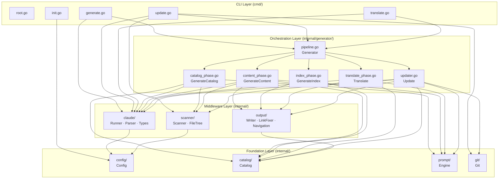
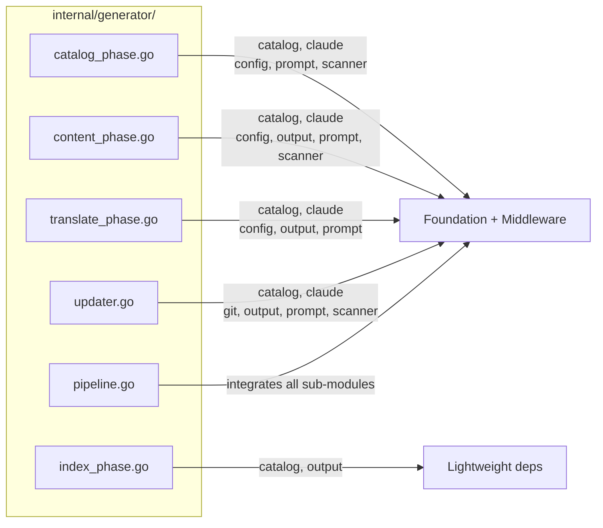
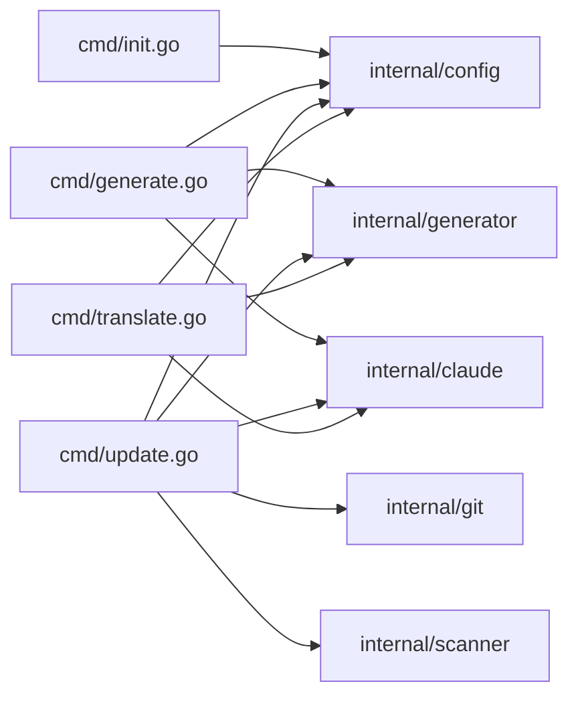
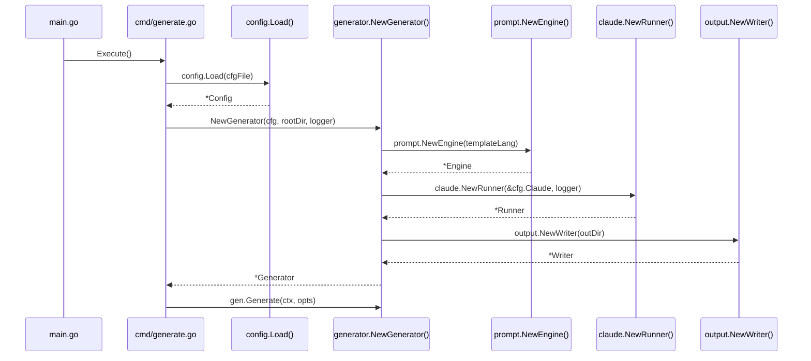

# Module Dependency Graph

selfmd follows a clear layered architecture where dependencies flow in a single direction — from the foundation layer upward to the orchestration and CLI layers — eliminating circular dependencies.

## Overview

selfmd's module dependencies are organized into four distinct layers:

1. **Foundation Layer**: No internal project dependencies; uses only the standard library or third-party packages
2. **Middleware Layer**: Depends only on Foundation layer modules
3. **Orchestration Layer**: The `generator` package, which depends on all Middleware and Foundation modules and is responsible for integrating all phases
4. **CLI Layer** (Entry Points): The `cmd` package, which depends on the Orchestration layer and select Foundation modules to provide the user interface

This design guarantees **no circular dependencies** — lower-layer modules have no knowledge of higher-layer modules, making each module cheap to test and replace.

### Key Terms

| Term | Description |
|------|-------------|
| Foundation Layer | Pure-function packages with zero internal dependencies |
| Orchestration Layer | Packages that integrate multiple modules and execute a complete workflow |
| Dependency Injection | The `Generator` struct receives `Runner`, `Engine`, and `Writer` instances at construction time |

---

## Architecture

### Overall Dependency Layer Diagram



> Source: `cmd/generate.go#L1-L14`, `cmd/update.go#L1-L18`, `internal/generator/pipeline.go#L1-L16`

---

## Layer Details

### Foundation Layer

Foundation layer modules are independent of one another and can be tested and used in isolation.

#### `internal/config`

**Responsibility**: Reads, validates, and serializes the `selfmd.yaml` configuration file, and provides `DefaultConfig()`.

- **Internal dependencies**: None
- **External dependencies**: `gopkg.in/yaml.v3`
- **Depended on by**: `claude`, `scanner`, `generator` (all phases), `cmd`

```go
type Config struct {
    Project ProjectConfig `yaml:"project"`
    Targets TargetsConfig `yaml:"targets"`
    Output  OutputConfig  `yaml:"output"`
    Claude  ClaudeConfig  `yaml:"claude"`
    Git     GitConfig     `yaml:"git"`
}
```

> Source: `internal/config/config.go#L11-L17`

#### `internal/catalog`

**Responsibility**: Defines the data model for the documentation catalog (`Catalog`, `CatalogItem`, `FlatItem`) and provides JSON serialization and flattening methods.

- **Internal dependencies**: None
- **External dependencies**: Standard library (`encoding/json`)
- **Depended on by**: `output`, `generator` (all phases)

```go
type Catalog struct {
    Items []CatalogItem `json:"items"`
}

type FlatItem struct {
    Title       string
    Path        string // dot-notation, e.g., "core-modules.authentication"
    DirPath     string // filesystem path, e.g., "core-modules/authentication"
    Depth       int
    ParentPath  string
    HasChildren bool
}
```

> Source: `internal/catalog/catalog.go#L10-L31`

#### `internal/prompt`

**Responsibility**: Manages prompt templates (`templates/zh-TW/*.tmpl`, `templates/en-US/*.tmpl`) and provides rendering methods for each pipeline phase.

- **Internal dependencies**: None
- **External dependencies**: Standard library (`text/template`, `embed`)
- **Depended on by**: `generator` (all phases that use Claude)

```go
type Engine struct {
    templates       *template.Template // language-specific templates
    sharedTemplates *template.Template // shared templates (translate.tmpl)
}
```

> Source: `internal/prompt/engine.go#L13-L17`

#### `internal/git`

**Responsibility**: Wraps Git CLI operations (retrieving commits, diffs, filtering changed files) without parsing business logic.

- **Internal dependencies**: None
- **External dependencies**: `github.com/bmatcuk/doublestar/v4`, standard library (`os/exec`)
- **Depended on by**: `generator/updater`, `generator/pipeline`, `cmd/update`

```go
type ChangedFile struct {
    Status string // "M", "A", "D", "R"
    Path   string
}
```

> Source: `internal/git/git.go#L47-L51`

---

### Middleware Layer

Middleware layer modules depend on the Foundation layer but **do not depend on each other**.

#### `internal/claude`

**Responsibility**: Wraps Claude CLI subprocess invocation (`Runner`), parses JSON output (`Parser`), and defines data types (`Types`).

- **Internal dependencies**: `internal/config` (reads `ClaudeConfig`)
- **External dependencies**: Standard library (`os/exec`, `encoding/json`, `regexp`)

```go
type Runner struct {
    config *config.ClaudeConfig
    logger *slog.Logger
}
```

> Source: `internal/claude/runner.go#L16-L19`

The `claude` package contains three files, each with a clear responsibility:

| File | Responsibility |
|------|----------------|
| `runner.go` | Executes the `claude` CLI subprocess with retry support |
| `parser.go` | Parses JSON responses, extracts `<document>` tags, extracts JSON blocks |
| `types.go` | Defines `RunOptions`, `RunResult`, `CLIResponse` |

#### `internal/scanner`

**Responsibility**: Scans the project directory, filters files according to `Config.Targets`, builds the `FileNode` tree structure, and reads README and entry point files.

- **Internal dependencies**: `internal/config` (accesses `Targets.Include` / `Targets.Exclude`)
- **External dependencies**: `github.com/bmatcuk/doublestar/v4`

```go
type ScanResult struct {
    RootDir            string
    Tree               *FileNode
    FileList           []string
    TotalFiles         int
    TotalDirs          int
    ReadmeContent      string
    EntryPointContents map[string]string
}
```

> Source: `internal/scanner/filetree.go#L18-L27`

#### `internal/output`

**Responsibility**: Writes documentation to disk (`Writer`), fixes relative path links (`LinkFixer`), generates navigation pages (`navigation.go`), and provides a static browser (`viewer.go`).

- **Internal dependencies**: `internal/catalog` (accesses `FlatItem`, `Catalog`)
- **External dependencies**: Standard library (`os`, `path/filepath`, `regexp`)

```go
type Writer struct {
    BaseDir string // absolute path to .doc-build/
}

type LinkFixer struct {
    allItems  []catalog.FlatItem
    dirPaths  map[string]bool
    pathIndex map[string]string
}
```

> Source: `internal/output/writer.go#L26-L28`, `internal/output/linkfixer.go#L12-L16`

---

### Orchestration Layer

`internal/generator` is the central orchestration layer of the entire system, responsible for integrating all Middleware and Foundation modules into a complete workflow.

#### `Generator` Struct and Dependency Injection

```go
type Generator struct {
    Config  *config.Config
    Runner  *claude.Runner
    Engine  *prompt.Engine
    Writer  *output.Writer
    Logger  *slog.Logger
    RootDir string

    TotalCost   float64
    TotalPages  int
    FailedPages int
}
```

> Source: `internal/generator/pipeline.go#L19-L31`

`NewGenerator` initializes all dependencies at construction time:

```go
func NewGenerator(cfg *config.Config, rootDir string, logger *slog.Logger) (*Generator, error) {
    templateLang := cfg.Output.GetEffectiveTemplateLang()
    engine, err := prompt.NewEngine(templateLang)
    // ...
    runner := claude.NewRunner(&cfg.Claude, logger)
    writer := output.NewWriter(absOutDir)
    return &Generator{
        Config:  cfg,
        Runner:  runner,
        Engine:  engine,
        Writer:  writer,
        Logger:  logger,
        RootDir: rootDir,
    }, nil
}
```

> Source: `internal/generator/pipeline.go#L34-L58`

#### Dependency Scope of Each Generator Sub-file



---

### CLI Layer (Entry Points Layer)

Each command in the `cmd` package depends directly on the Orchestration layer and, where needed, calls select Middleware modules directly (e.g., `claude.CheckAvailable()`).



> Source: `cmd/generate.go#L1-L14`, `cmd/update.go#L1-L18`, `cmd/translate.go#L1-L17`

---

## Dependency Matrix

The table below lists the **internal** modules each module directly depends on (✓ indicates a direct dependency):

| Module | config | catalog | prompt | git | scanner | claude | output | generator |
|--------|:------:|:-------:|:------:|:---:|:-------:|:------:|:------:|:---------:|
| `config` | — | | | | | | | |
| `catalog` | | — | | | | | | |
| `prompt` | | | — | | | | | |
| `git` | | | | — | | | | |
| `scanner` | ✓ | | | | — | | | |
| `claude` | ✓ | | | | | — | | |
| `output` | | ✓ | | | | | — | |
| `generator` | ✓ | ✓ | ✓ | ✓ | ✓ | ✓ | ✓ | — |
| `cmd` | ✓ | | | ✓ | ✓ | ✓ | | ✓ |

---

## Core Flow: Dependency Initialization Order



---

## External Dependencies Summary

selfmd uses the following third-party packages:

| Package | Version | Used By | Purpose |
|---------|---------|---------|---------|
| `github.com/spf13/cobra` | — | `cmd/` | CLI command framework |
| `gopkg.in/yaml.v3` | — | `internal/config` | YAML configuration file parsing |
| `github.com/bmatcuk/doublestar/v4` | — | `internal/scanner`, `internal/git` | Glob pattern matching (`**` double-star) |
| `golang.org/x/sync/errgroup` | — | `internal/generator` | Parallel task error group management |

---

## Related Links

- [Overall Flow and Four-Phase Pipeline](../pipeline/index.md) — How modules collaborate across the four phases
- [Documentation Generation Pipeline](../../core-modules/generator/index.md) — Detailed description of the Generator orchestration layer
- [Project Scanner](../../core-modules/scanner/index.md) — `internal/scanner` module documentation
- [Claude CLI Runner](../../core-modules/claude-runner/index.md) — `internal/claude` module documentation
- [Prompt Template Engine](../../core-modules/prompt-engine/index.md) — `internal/prompt` module documentation
- [Output Writer and Link Fixer](../../core-modules/output-writer/index.md) — `internal/output` module documentation
- [Configuration Reference](../../configuration/index.md) — Overview of the `selfmd.yaml` configuration structure

---

## Reference Files

| File Path | Description |
|-----------|-------------|
| `cmd/root.go` | CLI root command; global flag definitions |
| `cmd/generate.go` | `selfmd generate` command implementation; depends on `generator`, `claude`, `config` |
| `cmd/init.go` | `selfmd init` command implementation; depends on `config` |
| `cmd/update.go` | `selfmd update` command implementation; depends on `generator`, `git`, `scanner`, `claude`, `config` |
| `cmd/translate.go` | `selfmd translate` command implementation; depends on `generator`, `claude`, `config` |
| `internal/config/config.go` | `Config` struct definition, defaults, loading and validation logic |
| `internal/catalog/catalog.go` | `Catalog`, `CatalogItem`, `FlatItem` data models and operation methods |
| `internal/prompt/engine.go` | `Engine` template engine; `CatalogPromptData`, `ContentPromptData`, and other data types |
| `internal/git/git.go` | Git CLI wrapper: retrieving commits, diffs, and filtering files |
| `internal/scanner/scanner.go` | Directory traversal and glob filtering logic |
| `internal/scanner/filetree.go` | `ScanResult`, `FileNode` definitions and tree rendering |
| `internal/claude/runner.go` | `Runner` struct; executes Claude CLI subprocess with retry logic |
| `internal/claude/parser.go` | JSON parsing, `<document>` tag extraction, template cleanup |
| `internal/claude/types.go` | `RunOptions`, `RunResult`, `CLIResponse` type definitions |
| `internal/output/writer.go` | `Writer` writes documentation pages, catalog JSON, and commit records |
| `internal/output/linkfixer.go` | `LinkFixer` repairs Markdown relative path links |
| `internal/output/navigation.go` | Generates `index.md`, `_sidebar.md`, and category index pages |
| `internal/generator/pipeline.go` | `Generator` struct definition, `NewGenerator`, `Generate` main flow |
| `internal/generator/catalog_phase.go` | Phase 2: calls Claude to generate the catalog |
| `internal/generator/content_phase.go` | Phase 3: generates content pages in parallel |
| `internal/generator/index_phase.go` | Phase 4: generates indexes and navigation |
| `internal/generator/translate_phase.go` | Translation flow: translates all pages to the target language in parallel |
| `internal/generator/updater.go` | Incremental update flow: compares git diff and selectively regenerates pages |