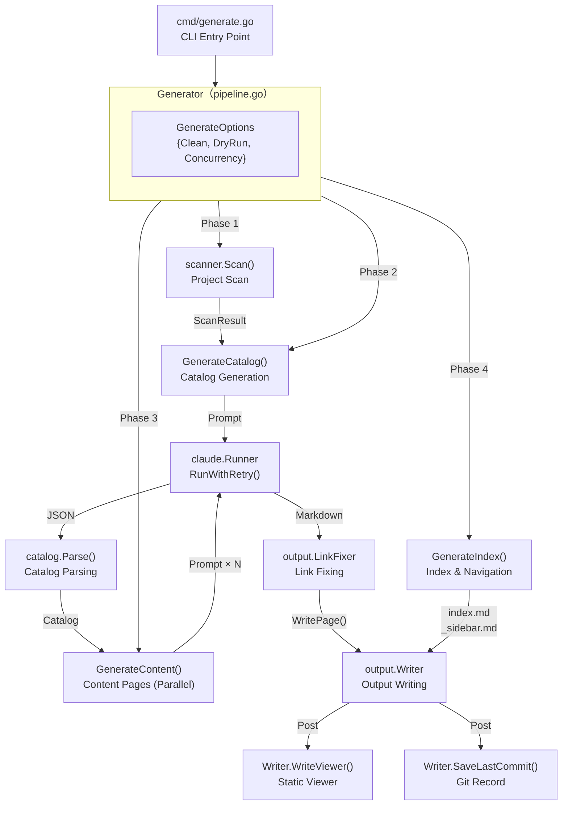
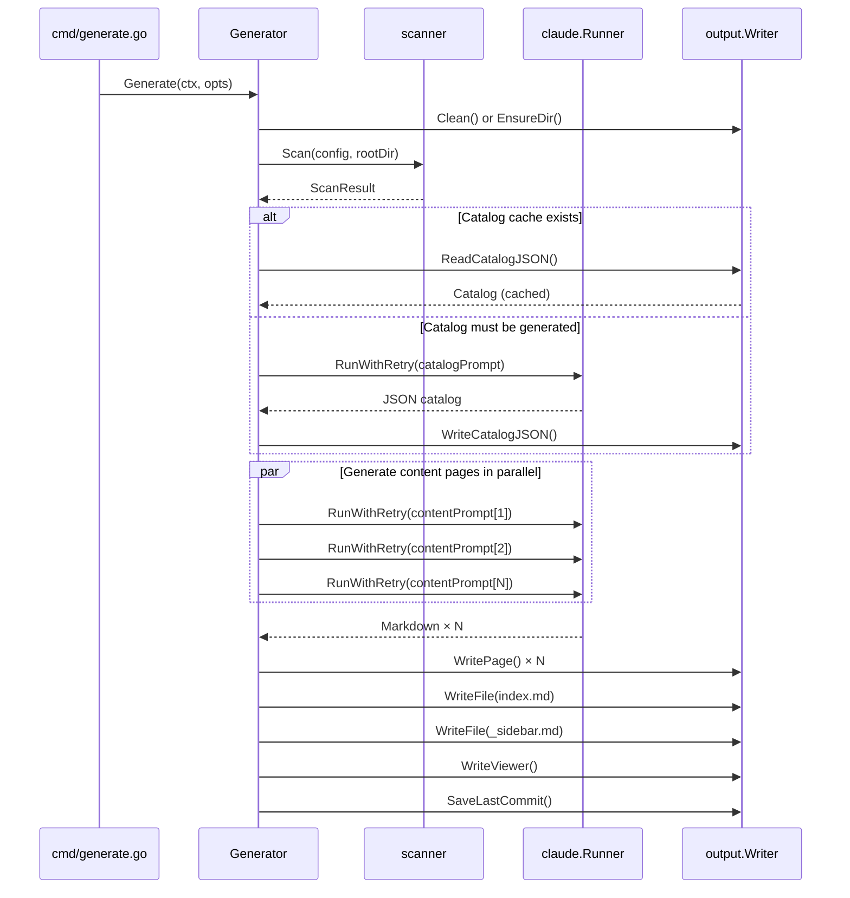
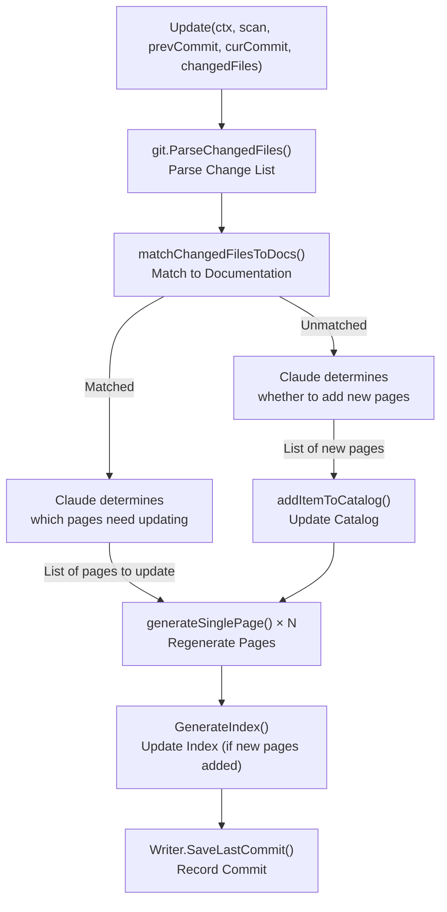

# Overall Flow and Four-Phase Pipeline

The `selfmd generate` command runs four ordered phases through the `Generator` orchestrator, transforming source code into a complete Markdown documentation site. Each phase has a clear responsibility and feeds into the next, ultimately producing a browsable static documentation output.

## Overview

`Generator` (located in `internal/generator/pipeline.go`) is the central orchestrator of the entire system. It holds references to all subsystems — scanner, Claude runner, prompt engine, output writer — and drives the following four phases in sequence:

| Phase | Number | Responsibility |
|-------|--------|---------------|
| Scan | 1/4 | Traverse the project directory and build the file tree |
| Catalog | 2/4 | Call Claude to plan the documentation structure |
| Content | 3/4 | Generate each documentation page in parallel |
| Index & Navigation | 4/4 | Generate the home page, sidebar, and category indexes |

After the four phases complete, the system performs additional post-processing steps: static viewer generation and Git commit history archiving.

## Architecture



## Generator Structure

The `Generator` struct centrally manages the lifecycle of all subsystems and accumulates runtime statistics:

```go
type Generator struct {
    Config  *config.Config
    Runner  *claude.Runner
    Engine  *prompt.Engine
    Writer  *output.Writer
    Logger  *slog.Logger
    RootDir string // Target project root directory

    // Statistics
    TotalCost   float64
    TotalPages  int
    FailedPages int
}
```

> Source: internal/generator/pipeline.go#L19-L31

`NewGenerator` determines the prompt template language based on configuration, and initializes the Claude Runner and Writer:

```go
func NewGenerator(cfg *config.Config, rootDir string, logger *slog.Logger) (*Generator, error) {
    templateLang := cfg.Output.GetEffectiveTemplateLang()
    engine, err := prompt.NewEngine(templateLang)
    if err != nil {
        return nil, err
    }

    runner := claude.NewRunner(&cfg.Claude, logger)

    absOutDir := cfg.Output.Dir
    if absOutDir == "" {
        absOutDir = ".doc-build"
    }

    writer := output.NewWriter(absOutDir)
    // ...
}
```

> Source: internal/generator/pipeline.go#L34-L58

## Four Phases in Detail

### Setup Step (Phase 0)

Before the four main phases, the system prepares the output directory: if the `--clean` flag is set, the output directory is cleared and recreated; otherwise, the system simply ensures the directory exists.

```go
// Phase 0: Setup
clean := opts.Clean || g.Config.Output.CleanBeforeGenerate
if clean {
    fmt.Println("[0/4] Cleaning output directory...")
    if !opts.DryRun {
        if err := g.Writer.Clean(); err != nil {
            return err
        }
    }
} else {
    if err := g.Writer.EnsureDir(); err != nil {
        return err
    }
}
```

> Source: internal/generator/pipeline.go#L71-L84

---

### Phase 1: Scan

Calls `scanner.Scan()` to traverse the entire project directory. The scanner filters files according to include/exclude glob rules from the configuration file, and reads the content of README and entry point files:

```go
// Phase 1: Scan
fmt.Println("[1/4] Scanning project structure...")
scan, err := scanner.Scan(g.Config, g.RootDir)
if err != nil {
    return fmt.Errorf("failed to scan project: %w", err)
}
fmt.Printf("      Found %d files across %d directories\n", scan.TotalFiles, scan.TotalDirs)
```

> Source: internal/generator/pipeline.go#L86-L93

The `ScanResult` contains:
- `Tree`: File tree structure (used as `FileTree` in prompts)
- `FileList`: List of all files matching the rules
- `ReadmeContent`: Project README content
- `EntryPointContents`: Content of configured entry point files

If `--dry-run` mode is enabled, the system prints the file tree and exits after this phase without calling Claude.

---

### Phase 2: Catalog Generation

`GenerateCatalog()` constructs a prompt with the file tree, README, entry points, and other information, then sends it to Claude to design the overall documentation structure:

```go
func (g *Generator) GenerateCatalog(ctx context.Context, scan *scanner.ScanResult) (*catalog.Catalog, error) {
    langName := config.GetLangNativeName(g.Config.Output.Language)
    data := prompt.CatalogPromptData{
        RepositoryName:       g.Config.Project.Name,
        ProjectType:          g.Config.Project.Type,
        Language:             g.Config.Output.Language,
        LanguageName:         langName,
        KeyFiles:             scan.KeyFiles(),
        EntryPoints:          scan.EntryPointsFormatted(),
        FileTree:             scanner.RenderTree(scan.Tree, 4),
        ReadmeContent:        scan.ReadmeContent,
    }

    rendered, err := g.Engine.RenderCatalog(data)
    // ...
    result, err := g.Runner.RunWithRetry(ctx, claude.RunOptions{
        Prompt:  rendered,
        WorkDir: g.RootDir,
    })
    // ...
    jsonStr, err := claude.ExtractJSONBlock(result.Content)
    return catalog.Parse(jsonStr)
}
```

> Source: internal/generator/catalog_phase.go#L15-L61

**Catalog caching**: When not doing a full regeneration (`--no-clean` mode), the system tries to read `.doc-build/_catalog.json`. If parsing succeeds, the existing catalog is reused and the Claude call is skipped to save cost:

```go
if !clean {
    catJSON, readErr := g.Writer.ReadCatalogJSON()
    if readErr == nil {
        cat, err = catalog.Parse(catJSON)
    }
    if cat != nil {
        // Loaded existing catalog, skipping Claude call
    }
}
```

> Source: internal/generator/pipeline.go#L102-L113

---

### Phase 3: Content Page Generation

`GenerateContent()` issues parallel Claude calls for all leaf-node pages in the catalog. Concurrency is controlled by the `claude.max_concurrent` configuration setting or the `--concurrency` flag, enforced via a semaphore channel:

```go
func (g *Generator) GenerateContent(ctx context.Context, scan *scanner.ScanResult, cat *catalog.Catalog, concurrency int, skipExisting bool) error {
    items := cat.Flatten()
    total := len(items)

    // Build link table and link fixer, shared across all pages
    catalogTable := cat.BuildLinkTable()
    linkFixer := output.NewLinkFixer(cat)

    var done atomic.Int32
    var failed atomic.Int32
    var skipped atomic.Int32

    eg, ctx := errgroup.WithContext(ctx)
    sem := make(chan struct{}, concurrency)

    for _, item := range items {
        item := item
        eg.Go(func() error {
            if skipExisting && g.Writer.PageExists(item) {
                skipped.Add(1)
                // Skip existing pages
                return nil
            }
            sem <- struct{}{}
            defer func() { <-sem }()
            // Call generateSinglePage()
            err := g.generateSinglePage(ctx, scan, item, catalogTable, linkFixer, "")
            // ...
        })
    }
    return eg.Wait()
}
```

> Source: internal/generator/content_phase.go#L21-L87

The per-page generation flow (`generateSinglePage`) includes:
1. Build `ContentPromptData` (with catalog path, page title, link table)
2. Call `Runner.RunWithRetry()` to get the Claude response
3. Extract Markdown content from `<document>` tags
4. Validate content (must begin with `#`)
5. Call `linkFixer.FixLinks()` to fix relative links
6. Call `Writer.WritePage()` to write the file

If generation fails, the system writes a placeholder page but does not abort generation of other pages.

---

### Phase 4: Index & Navigation Generation

`GenerateIndex()` does not call Claude — it generates three navigation files directly from the catalog structure:

```go
func (g *Generator) GenerateIndex(_ context.Context, cat *catalog.Catalog) error {
    lang := g.Config.Output.Language

    // Generate main home page
    indexContent := output.GenerateIndex(g.Config.Project.Name, g.Config.Project.Description, cat, lang)
    if err := g.Writer.WriteFile("index.md", indexContent); err != nil {
        return err
    }

    // Generate sidebar
    sidebarContent := output.GenerateSidebar(g.Config.Project.Name, cat, lang)
    if err := g.Writer.WriteFile("_sidebar.md", sidebarContent); err != nil {
        return err
    }

    // Generate category indexes for nodes with children
    items := cat.Flatten()
    for _, item := range items {
        if !item.HasChildren {
            continue
        }
        // ...generate category home page
    }
    return nil
}
```

> Source: internal/generator/index_phase.go#L11-L55

Generated files:
- `index.md`: Documentation site home page
- `_sidebar.md`: Sidebar navigation
- `{category}/index.md`: Category home page for each node with child pages

---

### Post-Processing Steps

After the four phases complete, `Generate()` performs two additional post-processing operations:

```go
// Generate static viewer (HTML/JS/CSS + _data.js bundle)
docMeta := g.buildDocMeta()
if err := g.Writer.WriteViewer(g.Config.Project.Name, docMeta); err != nil {
    // Failure does not abort the flow
}

// If this is a Git repository, save the current commit hash for incremental updates
if git.IsGitRepo(g.RootDir) {
    if commit, err := git.GetCurrentCommit(g.RootDir); err == nil {
        g.Writer.SaveLastCommit(commit)
    }
}
```

> Source: internal/generator/pipeline.go#L146-L164

## Core Flows

### Full Generation Flow (Generate)



### Incremental Update Flow (Update)

`Update()` (located in `updater.go`) uses a different strategy, used by the `selfmd update` command:



## Usage Example

`GenerateOptions` controls the pipeline execution mode:

```go
opts := generator.GenerateOptions{
    Clean:       clean,       // Whether to clean the output directory
    DryRun:      dryRun,      // Scan only, do not call Claude
    Concurrency: concurrencyNum, // Concurrency level (0 = use config value)
}

return gen.Generate(ctx, opts)
```

> Source: cmd/generate.go#L89-L95

Concurrency priority order: CLI `--concurrency` flag > `claude.max_concurrent` setting in `selfmd.yaml`.

```go
// Phase 3: Generate Content
concurrency := g.Config.Claude.MaxConcurrent
if opts.Concurrency > 0 {
    concurrency = opts.Concurrency
}
fmt.Printf("[3/4] Generating content pages (concurrency: %d)...\n", concurrency)
```

> Source: internal/generator/pipeline.go#L130-L134

## Cost Tracking

The cost of each Claude call is accumulated in `Generator.TotalCost` and printed as a summary in the terminal after execution:

```
========================================
Documentation generation complete!
  Output directory: .doc-build
  Pages: 42 succeeded
  Total time: 3m20s
  Total cost: $0.1234 USD
========================================
```

> Source: internal/generator/pipeline.go#L166-L179

## Related Links

- [System Architecture](../index.md)
- [Module Dependencies](../module-dependencies/index.md)
- [Documentation Generation Pipeline (Core Module)](../../core-modules/generator/index.md)
- [Catalog Generation Phase](../../core-modules/generator/catalog-phase/index.md)
- [Content Page Generation Phase](../../core-modules/generator/content-phase/index.md)
- [Index & Navigation Generation Phase](../../core-modules/generator/index-phase/index.md)
- [Translation Phase](../../core-modules/generator/translate-phase/index.md)
- [Incremental Update](../../core-modules/incremental-update/index.md)
- [selfmd generate Command](../../cli/cmd-generate/index.md)

## Reference Files

| File Path | Description |
|-----------|-------------|
| `internal/generator/pipeline.go` | `Generator` struct definition, `Generate()` main flow orchestrator |
| `internal/generator/catalog_phase.go` | Phase 2: Catalog generation logic, Claude prompt construction |
| `internal/generator/content_phase.go` | Phase 3: Parallel content page generation, `generateSinglePage()` |
| `internal/generator/index_phase.go` | Phase 4: Index and sidebar navigation generation |
| `internal/generator/translate_phase.go` | Translation pipeline (`Translate()`) and multi-language support |
| `internal/generator/updater.go` | Incremental update flow (`Update()`), Git change diff logic |
| `internal/scanner/scanner.go` | Project scanner, `Scan()` function |
| `internal/catalog/catalog.go` | `Catalog`, `FlatItem` struct definitions and operations |
| `internal/claude/runner.go` | Claude CLI runner, `RunWithRetry()` |
| `internal/output/writer.go` | Output writer, file management, catalog JSON persistence |
| `internal/git/git.go` | Git integration utilities, changed file parsing |
| `cmd/generate.go` | `selfmd generate` CLI entry point |