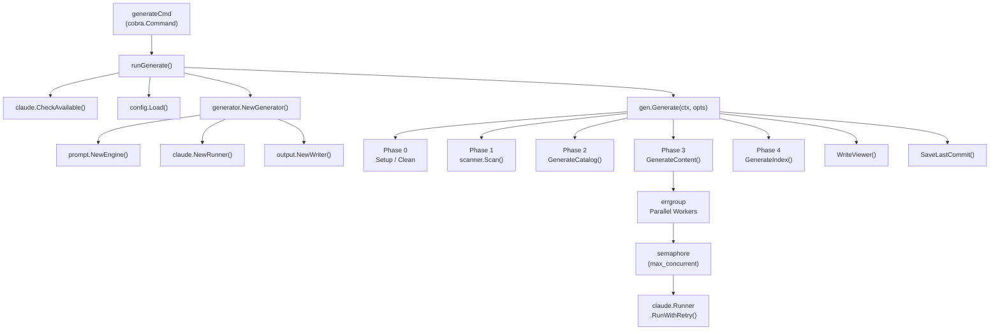
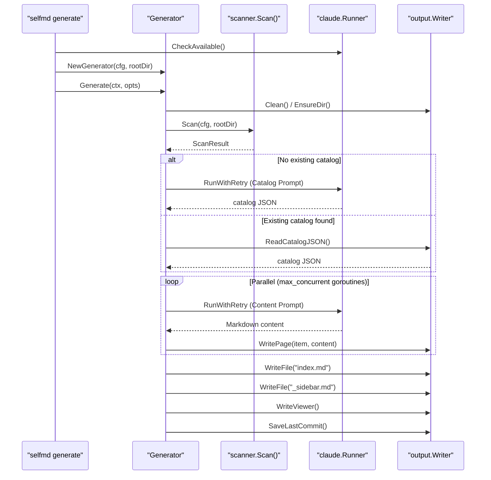

# selfmd generate

Executes the complete four-phase documentation generation pipeline, scanning project source code and automatically generating structured, Wiki-style technical documentation via the Claude CLI.

## Overview

`selfmd generate` is selfmd's core command, responsible for generating complete project documentation from scratch (or incrementally). When executed, the command performs the following steps in order:

1. Validates that the Claude CLI environment is ready
2. Loads the `selfmd.yaml` configuration file
3. Scans the project directory structure and source code
4. Calls Claude AI to generate the documentation catalog
5. Generates content pages for each catalog item in parallel
6. Generates the navigation index and static documentation browser

**Incremental generation**: If valid pages already exist in the output directory and the `--clean` flag is not used, the system automatically skips those pages and only generates missing or failed ones, significantly reducing API costs and execution time.

## Usage

```sh
selfmd generate [flags]
```

> Source: `cmd/generate.go#L23-L32`

## Flags

| Flag | Type | Default | Description |
|------|------|---------|-------------|
| `--clean` | bool | `false` | Forces the output directory to be cleared before regenerating all pages |
| `--no-clean` | bool | `false` | Overrides the config's `clean_before_generate` setting, preserving existing pages |
| `--dry-run` | bool | `false` | Scans and displays the file tree only, without calling Claude or writing any files |
| `--concurrency` | int | `0` | Overrides the config's `claude.max_concurrent` concurrency setting |
| `-c, --config` | string | `selfmd.yaml` | Path to the configuration file (global flag, inherited from rootCmd) |
| `-v, --verbose` | bool | `false` | Shows Debug-level detailed logs (global flag) |
| `-q, --quiet` | bool | `false` | Shows error messages only (global flag) |

### Priority Order for `--clean` and `--no-clean`

The final clean behavior is determined by the following rules (highest to lowest priority):

```
--no-clean flag → clean = false (force preserve)
--clean flag    → clean = true (force clean)
config setting  → value of output.clean_before_generate
```

> Source: `cmd/generate.go#L80-L87`

## Architecture



## Four-Phase Generation Pipeline

### Phase 0: Initialization and Setup

Determines how to handle the output directory based on the `clean` option:

```go
if clean {
    fmt.Println("[0/4] Cleaning output directory...")
    if !opts.DryRun {
        if err := g.Writer.Clean(); err != nil {
            return err
        }
    }
} else {
    if err := g.Writer.EnsureDir(); err != nil {
        return err
    }
}
```

> Source: `internal/generator/pipeline.go#L72-L84`

`Writer.Clean()` calls `os.RemoveAll()` to delete the entire output directory and recreate it, while `EnsureDir()` uses `os.MkdirAll()` to ensure the directory exists.

---

### Phase 1: Scan Project Structure

```go
scan, err := scanner.Scan(g.Config, g.RootDir)
```

> Source: `internal/generator/pipeline.go#L88-L92`

The scanner recursively traverses the project directory, filtering files based on the `targets.include` and `targets.exclude` glob patterns defined in the configuration file, while also reading `README.md` and the configured entry point contents.

**Dry Run behavior**: If `--dry-run` is specified, after scanning the file tree is displayed (up to 3 levels deep) and execution stops — no subsequent Claude calls are made:

```go
if opts.DryRun {
    fmt.Println("\n[Dry Run] File tree:")
    fmt.Println(scanner.RenderTree(scan.Tree, 3))
    fmt.Println("[Dry Run] No Claude calls will be made.")
    return nil
}
```

> Source: `internal/generator/pipeline.go#L94-L99`

---

### Phase 2: Generate Documentation Catalog

The catalog is the skeleton of the documentation structure, defining the titles, paths, and hierarchical relationships of all pages.

```go
// First attempt to reuse an existing catalog (non-clean mode)
if !clean {
    catJSON, readErr := g.Writer.ReadCatalogJSON()
    if readErr == nil {
        cat, err = catalog.Parse(catJSON)
    }
    // ...
}
// If no existing catalog, call Claude to generate one
if cat == nil {
    cat, err = g.GenerateCatalog(ctx, scan)
    // Save as _catalog.json for future reuse
    g.Writer.WriteCatalogJSON(cat)
}
```

> Source: `internal/generator/pipeline.go#L102-L127`

`GenerateCatalog()` assembles the scan results into a prompt, calls the Claude CLI, and extracts the JSON-formatted catalog structure from the response:

```go
result, err := g.Runner.RunWithRetry(ctx, claude.RunOptions{
    Prompt:  rendered,
    WorkDir: g.RootDir,
})
// ...
jsonStr, err := claude.ExtractJSONBlock(result.Content)
cat, err := catalog.Parse(jsonStr)
```

> Source: `internal/generator/catalog_phase.go#L37-L58`

---

### Phase 3: Generate Content Pages in Parallel

This is the most time-consuming phase. The system calls Claude in parallel for each catalog item to generate complete Markdown documentation:

```go
eg, ctx := errgroup.WithContext(ctx)
sem := make(chan struct{}, concurrency)

for _, item := range items {
    item := item
    eg.Go(func() error {
        // Skip existing pages (non-clean mode)
        if skipExisting && g.Writer.PageExists(item) {
            skipped.Add(1)
            return nil
        }
        sem <- struct{}{}
        defer func() { <-sem }()
        // ...call Claude to generate page...
    })
}
```

> Source: `internal/generator/content_phase.go#L36-L73`

**Concurrency control**: Uses a channel as a semaphore to limit the number of simultaneous Claude calls. The default value comes from the config's `claude.max_concurrent` (default `3`), and can be overridden with the `--concurrency` flag.

**Fault tolerance**: A single page generation failure does not abort the entire process. On failure, a placeholder page is written prompting the user to re-run:

```go
func (g *Generator) writePlaceholder(item catalog.FlatItem, genErr error) {
    content := fmt.Sprintf("# %s\n\n> This page failed to generate. Please re-run `selfmd generate`.\n>\n> Error: %v\n", item.Title, genErr)
    g.Writer.WritePage(item, content)
}
```

> Source: `internal/generator/content_phase.go#L159-L164`

**Format validation and retry**: Each page is attempted up to 2 times. If the Claude response is missing a `<document>` tag or is not valid Markdown starting with `#`, it retries automatically:

```go
content, extractErr := claude.ExtractDocumentTag(result.Content)
// ...
if content == "" || !strings.HasPrefix(content, "#") {
    // retry
}
```

> Source: `internal/generator/content_phase.go#L126-L146`

---

### Phase 4: Generate Navigation and Index

```go
func (g *Generator) GenerateIndex(_ context.Context, cat *catalog.Catalog) error {
    // Generate index.md (documentation home page)
    output.GenerateIndex(...)
    g.Writer.WriteFile("index.md", indexContent)

    // Generate _sidebar.md (sidebar navigation)
    output.GenerateSidebar(...)
    g.Writer.WriteFile("_sidebar.md", sidebarContent)

    // Generate index pages for categories with children
    for _, item := range items {
        if item.HasChildren { ... }
    }
}
```

> Source: `internal/generator/index_phase.go#L11-L55`

---

### Post-processing

After Phase 4 completes, `Generate()` also performs:

1. **Generate static browser**: Calls `Writer.WriteViewer()` to generate `index.html` and related assets, enabling documentation to be browsed directly in a web browser.
2. **Record Git commit**: If the current directory is a Git repository, saves the current commit hash to `_last_commit` for use by `selfmd update`'s incremental update feature.

```go
if git.IsGitRepo(g.RootDir) {
    if commit, err := git.GetCurrentCommit(g.RootDir); err == nil {
        g.Writer.SaveLastCommit(commit)
    }
}
```

> Source: `internal/generator/pipeline.go#L158-L164`

## Core Flow



## Output Structure

After successful execution, the following files are generated under the `--output.dir` directory (default `.doc-build/`):

```
.doc-build/
├── index.html          # Static documentation browser entry point
├── index.md            # Documentation home page (Markdown)
├── _sidebar.md         # Sidebar navigation
├── _catalog.json       # Catalog structure cache (used for incremental updates)
├── _last_commit        # Git commit hash record
├── <section>/
│   └── <subsection>/
│       └── index.md   # Documentation pages per section
└── <lang>/             # Translation language directory (if secondary languages are configured)
    ├── index.md
    └── ...
```

## Usage Examples

### Basic Usage

```sh
# Standard generation (incremental, skips existing pages)
selfmd generate

# Force regenerate all pages
selfmd generate --clean

# Preview mode: show scan results only, no Claude calls
selfmd generate --dry-run
```

### Adjusting Concurrency

```sh
# Increase concurrency for faster generation (watch out for Claude API rate limits)
selfmd generate --concurrency 5

# Decrease concurrency to reduce API request rate
selfmd generate --concurrency 1
```

### Using a Custom Configuration File

```sh
selfmd generate --config ./configs/my-project.yaml
```

### Using Log Flags

```sh
# Show detailed Debug logs (including details for each Claude call)
selfmd generate --verbose

# Silent mode (errors only)
selfmd generate --quiet
```

## Example Terminal Output

On successful execution, the terminal displays the following progress output:

```
[0/4] Cleaning output directory...
[1/4] Scanning project structure...
      Found 42 files across 12 directories
[2/4] Generating documentation catalog...
      Calling Claude to generate catalog... done (8.3s, $0.0025)
      Catalog: 6 sections, 18 items
[3/4] Generating content pages (concurrency: 3)...
      [1/18] Overview... done (12.5s, $0.0041)
      [2/18] Getting Started... done (10.2s, $0.0038)
      ...
[4/4] Generating navigation and index...
Generating documentation browser...
      Done. Open .doc-build/index.html to browse.

========================================
Documentation generation complete!
  Output directory: .doc-build
  Pages: 18 succeeded
  Total time: 3m 24s
  Total cost: $0.0842 USD
========================================
```

## Prerequisites

Before running `selfmd generate`, the following conditions must be met:

1. **Claude CLI installed**: The `claude` command must be available in the system PATH (verified by `claude.CheckAvailable()`)
2. **Configuration file exists**: `selfmd.yaml` must exist in the working directory (or another path specified with `--config`)
3. **`selfmd init` has been run**: Initialization must have generated the configuration file

## Related Links

- [CLI Command Reference](../index.md)
- [selfmd init](../cmd-init/index.md) — Initialize the configuration file
- [selfmd update](../cmd-update/index.md) — Incremental update (only updates changed pages)
- [selfmd translate](../cmd-translate/index.md) — Translate documentation to other languages
- [Overall Flow and Four-Phase Pipeline](../../architecture/pipeline/index.md) — Deep dive into pipeline architecture
- [Documentation Generation Pipeline](../../core-modules/generator/index.md) — Generator module details
- [Claude CLI Runner](../../core-modules/claude-runner/index.md) — Runner module details
- [Project Scanner](../../core-modules/scanner/index.md) — Scanner module details
- [Configuration Reference](../../configuration/index.md) — Complete selfmd.yaml configuration reference

## Reference Files

| File Path | Description |
|-----------|-------------|
| `cmd/generate.go` | generate command definition, flag declarations, `runGenerate()` entry point |
| `cmd/root.go` | rootCmd definition, global flags (`--config`, `--verbose`, `--quiet`) |
| `internal/generator/pipeline.go` | `Generator` struct definition, `NewGenerator()`, `Generate()` main flow |
| `internal/generator/catalog_phase.go` | `GenerateCatalog()` implementation: assembles prompt and calls Claude to generate catalog |
| `internal/generator/content_phase.go` | `GenerateContent()` implementation: parallel page generation, retry logic, placeholder pages |
| `internal/generator/index_phase.go` | `GenerateIndex()` implementation: generates `index.md`, `_sidebar.md`, and category indexes |
| `internal/generator/translate_phase.go` | `Translate()` implementation (translation pipeline, called by `selfmd translate`) |
| `internal/config/config.go` | `Config` struct definition, `Load()`, `DefaultConfig()`, validation logic |
| `internal/scanner/scanner.go` | `Scan()` implementation: directory traversal, include/exclude filtering, README reading |
| `internal/claude/runner.go` | `Runner.Run()`, `RunWithRetry()`, `CheckAvailable()` |
| `internal/output/writer.go` | `Writer` struct: `WritePage()`, `Clean()`, `WriteCatalogJSON()`, etc. |