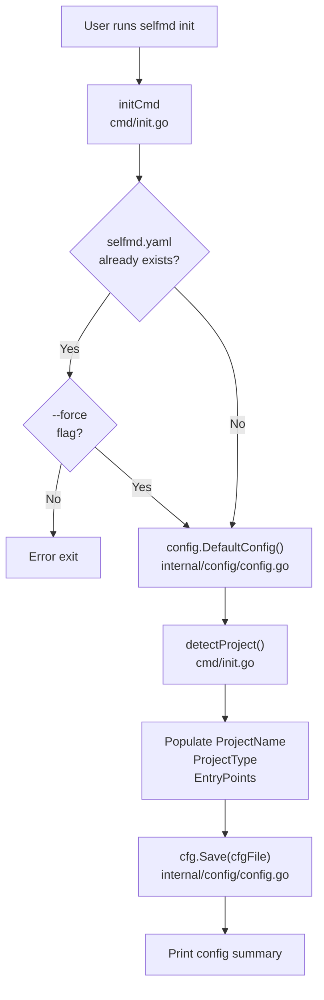
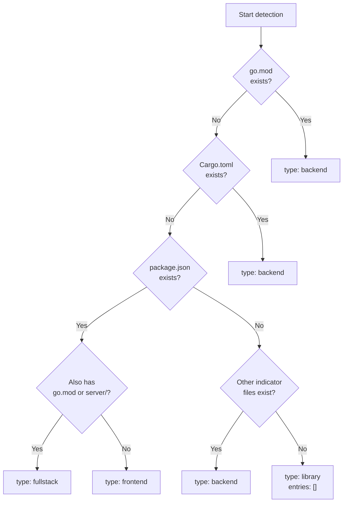
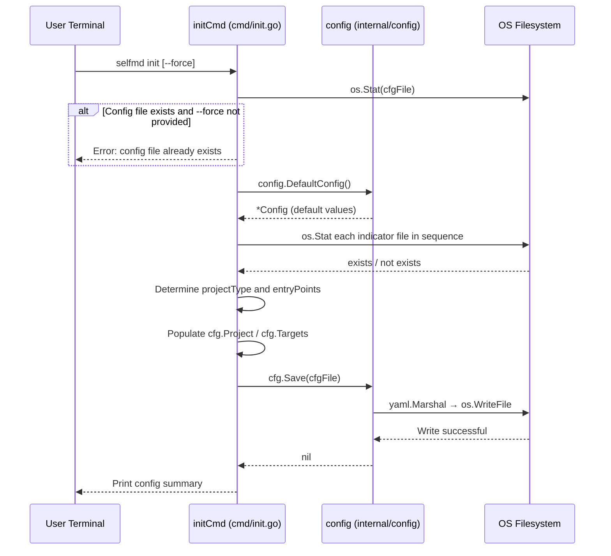

# selfmd init

The initialization command that scans the current directory, auto-detects the project type, and generates a `selfmd.yaml` configuration file.

## Overview

`selfmd init` is the first step in using selfmd. When executed, it:

1. Checks whether a configuration file already exists in the current directory (default: `selfmd.yaml`)
2. Calls `detectProject()` to automatically identify the project type (e.g., Go, Rust, Node.js, Python, etc.)
3. Builds a complete configuration via `config.DefaultConfig()` based on detection results and default values
4. Serializes the configuration to YAML and writes it to disk

The generated `selfmd.yaml` serves as the foundation for all subsequent selfmd commands. Users can manually adjust it after initialization as needed.

---

## Architecture



---

## Flags and Parameters

| Flag | Type | Default | Description |
|------|------|---------|-------------|
| `--force` | bool | `false` | Force overwrite an existing configuration file |
| `--config` / `-c` | string | `selfmd.yaml` | Specify the configuration file path (inherited from root command) |

The `--config` flag is defined on the root command `rootCmd` and is available to all subcommands:

```go
rootCmd.PersistentFlags().StringVarP(&cfgFile, "config", "c", "selfmd.yaml", "設定檔路徑")
```

> Source: cmd/root.go#L31

---

## Automatic Project Type Detection

The `detectProject()` function scans the current directory for specific files in order to infer the project type and entry points:

```go
func detectProject() (projectType string, entryPoints []string) {
	checks := []struct {
		file       string
		pType      string
		entries    []string
	}{
		{"go.mod", "backend", []string{"main.go", "cmd/root.go"}},
		{"Cargo.toml", "backend", []string{"src/main.rs", "src/lib.rs"}},
		{"package.json", "frontend", []string{"src/index.ts", "src/index.js", "src/main.ts", "src/App.tsx"}},
		{"pom.xml", "backend", []string{"src/main/java"}},
		{"build.gradle", "backend", []string{"src/main/java"}},
		{"requirements.txt", "backend", []string{"main.py", "app.py", "src/main.py"}},
		{"pyproject.toml", "backend", []string{"src/main.py", "main.py"}},
		{"composer.json", "backend", []string{"public/index.php", "src/Kernel.php"}},
		{"Gemfile", "backend", []string{"config/application.rb", "app/"}},
	}
	// ...
}
```

> Source: cmd/init.go#L60-L76

### Detection Logic

1. **Sequential checks**: Indicators are checked in the order shown above; detection stops at the first match
2. **Entry point filtering**: Only files that actually exist are kept from the candidate entry point list
3. **Fullstack determination**: If `package.json` (frontend) is detected, the function additionally checks whether `go.mod` or a `server/` directory exists — if so, the type is changed to `fullstack`
4. **Default type**: If no rules match, returns `"library"` with an empty entry point list



---

## Default Configuration Values

`config.DefaultConfig()` returns the following defaults:

```go
func DefaultConfig() *Config {
	return &Config{
		Project: ProjectConfig{
			Name: filepath.Base(mustGetwd()),
			Type: "backend",
		},
		Targets: TargetsConfig{
			Include: []string{"src/**", "pkg/**", "cmd/**", "internal/**", "lib/**", "app/**"},
			Exclude: []string{
				"vendor/**", "node_modules/**", ".git/**", ".doc-build/**",
				"**/*.pb.go", "**/generated/**", "dist/**", "build/**",
			},
			EntryPoints: []string{},
		},
		Output: OutputConfig{
			Dir:                 ".doc-build",
			Language:            "zh-TW",
			SecondaryLanguages:  []string{},
			CleanBeforeGenerate: false,
		},
		Claude: ClaudeConfig{
			Model:          "sonnet",
			MaxConcurrent:  3,
			TimeoutSeconds: 300,
			MaxRetries:     2,
			AllowedTools:   []string{"Read", "Glob", "Grep"},
			ExtraArgs:      []string{},
		},
		Git: GitConfig{
			Enabled:    true,
			BaseBranch: "main",
		},
	}
}
```

> Source: internal/config/config.go#L96-L129

The `init` command overrides the following three fields on top of the defaults using detection results:

| Field | Override Source |
|-------|----------------|
| `project.name` | `filepath.Base(mustCwd())` — current directory name |
| `project.type` | Result from `detectProject()` |
| `targets.entry_points` | Actual entry points detected by `detectProject()` |

---

## Core Flow



---

## Output Summary

After successful execution, the terminal prints the following:

```
Config file created: selfmd.yaml
  Project name: my-project
  Project type: backend
  Output dir:   .doc-build
  Doc language: zh-TW
  Entry files:  main.go, cmd/root.go

Edit the config file to suit your project needs, then run selfmd generate to produce documentation.
```

> Source: cmd/init.go#L43-L56

---

## Usage Examples

### Basic Initialization

```bash
selfmd init
```

Generates `selfmd.yaml` in the current directory. If `go.mod` and `cmd/root.go` are detected, the configuration file will contain:

```yaml
project:
  name: my-project
  type: backend
targets:
  entry_points:
    - cmd/root.go
```

### Force Overwrite an Existing Config File

```bash
selfmd init --force
```

> Source: cmd/init.go#L28-L30

### Specify a Custom Config File Path

```bash
selfmd init --config config/selfmd.yaml
```

---

## Notes

- `selfmd init` does not overwrite `targets.include` or `targets.exclude` — these fields retain their default values and must be adjusted manually as needed
- If a project matches multiple detection conditions (e.g., both `go.mod` and `package.json` are present), only the first matching rule takes effect
- The generated `selfmd.yaml` is serialized in YAML v3 format

---

## Related Links

- [Initialization Setup](../../getting-started/init/index.md)
- [selfmd.yaml Structure Overview](../../configuration/config-overview/index.md)
- [Project and Scan Target Configuration](../../configuration/project-targets/index.md)
- [selfmd generate](../cmd-generate/index.md)
- [CLI Command Reference](../index.md)

---

## Reference Files

| File Path | Description |
|-----------|-------------|
| `cmd/init.go` | `init` command implementation and `detectProject()` detection logic |
| `cmd/root.go` | Root command definition, including `--config`, `--verbose`, and `--quiet` global flags |
| `internal/config/config.go` | `Config` struct definition, `DefaultConfig()`, `Save()`, and `Load()` implementations |