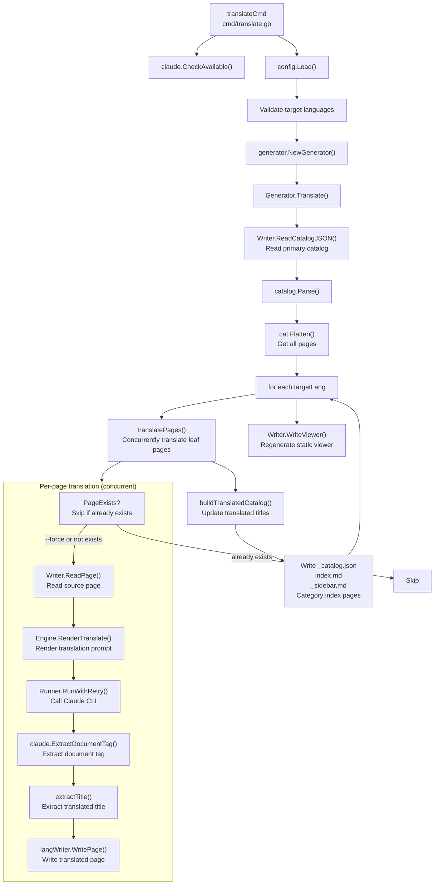
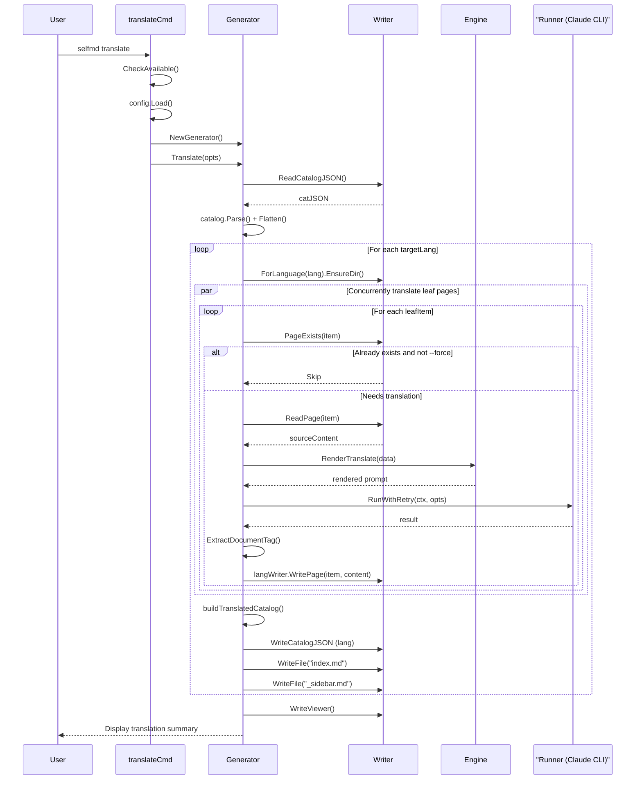

# selfmd translate

Translates documentation generated in the primary language into secondary languages defined in the configuration file via Claude CLI, and saves the results to the corresponding language subdirectories.

## Overview

The `selfmd translate` command reads primary-language documentation already produced by `selfmd generate`, calls Claude CLI page by page for translation, and writes the translated output to `.doc-build/{language-code}/` subdirectories.

The core premise of this command is: **primary-language documentation must already exist**. The translation process does not re-scan the source code — it uses existing Markdown pages directly as the translation source.

Key features:

- **Incremental translation**: Automatically skips already-translated pages by default, only translating content that hasn't been translated yet
- **Multiple target languages**: A single run can translate to multiple secondary languages simultaneously
- **Concurrent translation**: Uses semaphore-based concurrency to speed up translation; concurrency level is controllable via configuration or flags
- **Catalog sync**: After translation, automatically creates a catalog (`_catalog.json`), homepage (`index.md`), and sidebar (`_sidebar.md`) for each language version
- **Cost tracking**: Displays per-page duration and total API cost after translation completes

The prompt template used for translation (`translate.tmpl`) is a **language-agnostic shared template**, maintained separately from the primary-language content generation templates.

## Architecture



## Command Syntax

```
selfmd translate [flags]
```

### Flags

| Flag | Type | Default | Description |
|------|------|---------|-------------|
| `--lang` | `[]string` | `nil` (all secondary languages) | Restrict translation to specified language codes; can be repeated or comma-separated |
| `--force` | `bool` | `false` | Force re-translation of already-translated files |
| `--concurrency` | `int` | `0` (use config value) | Number of concurrent translation workers, overrides `claude.max_concurrent` |
| `-c, --config` | `string` | `selfmd.yaml` | Config file path (inherited from root) |
| `-v, --verbose` | `bool` | `false` | Show verbose debug output |
| `-q, --quiet` | `bool` | `false` | Show errors only |

> Source: `cmd/translate.go#L33-L37`

### Usage Examples

```bash
# Translate all configured secondary languages
selfmd translate

# Translate to English only
selfmd translate --lang en-US

# Translate to multiple languages
selfmd translate --lang en-US,ja-JP

# Force re-translation (even if already exists)
selfmd translate --force

# Increase concurrency to speed up translation
selfmd translate --concurrency 5
```

## Prerequisites

Before running `selfmd translate`, the following conditions must be met:

1. **Claude CLI is installed**: The `claude` executable must be found in the system `PATH`
2. **Primary-language documentation has been generated**: `.doc-build/_catalog.json` and each page's `index.md` must exist
3. **Config file contains `secondary_languages`**: `output.secondary_languages` in `selfmd.yaml` must not be empty

If condition 3 is not met, the command will report an error and exit immediately:

```go
if len(cfg.Output.SecondaryLanguages) == 0 {
    return fmt.Errorf("設定檔中未定義 secondary_languages，無法翻譯")
}
```

> Source: `cmd/translate.go#L50-L52`

## Core Process

### Translation Pipeline Sequence Diagram



### Incremental Translation Logic

The `translatePages()` function checks whether the translated file exists and has valid content via `Writer.PageExists()` before translating each page. Conditions that determine a page "needs translation":

- File does not exist
- File content is empty
- File content contains the string `"此頁面產生失敗"`
- The user specified the `--force` flag

```go
if !opts.Force && langWriter.PageExists(item) {
    skipped.Add(1)
    // Attempt to extract title from existing translation
    if content, err := langWriter.ReadPage(item); err == nil {
        if title := extractTitle(content); title != "" {
            titlesMu.Lock()
            translatedTitles[item.Path] = title
            titlesMu.Unlock()
        }
    }
    fmt.Printf("      [跳過] %s（已存在）\n", item.Title)
    return nil
}
```

> Source: `internal/generator/translate_phase.go#L156-L169`

### Translation Catalog Sync

After translation completes, the system rebuilds the catalog structure using translated titles so that navigation in each language version correctly displays titles in the local language:

```go
func buildTranslatedCatalog(original *catalog.Catalog, translatedTitles map[string]string) *catalog.Catalog {
    translated := &catalog.Catalog{
        Items: translateCatalogItems(original.Items, translatedTitles, ""),
    }
    return translated
}
```

> Source: `internal/generator/translate_phase.go#L277-L282`

## Translation Prompt Template

Translation uses the **shared template** at `internal/prompt/templates/translate.tmpl` (not language-specific), rendered by `Engine.RenderTranslate()`. The translation rules are hardcoded in the template:

| Rule | Description |
|------|-------------|
| Preserve Markdown formatting | Headings, links, code blocks, tables, Mermaid diagrams |
| Do not translate code identifiers | Variable names, file paths, and code blocks remain as-is |
| Translate section headings | Use natural translations in the target language |
| Preserve relative link paths | Only translate link display text; paths remain unchanged |
| Preserve source annotations | `> Source: path/to/file#L10-L25` format stays unchanged |

The `TranslatePromptData` struct provides the following data to the template:

```go
type TranslatePromptData struct {
    SourceLanguage     string // e.g. "zh-TW"
    SourceLanguageName string // e.g. "繁體中文"
    TargetLanguage     string // e.g. "en-US"
    TargetLanguageName string // e.g. "English"
    SourceContent      string // Full Markdown content to translate
}
```

> Source: `internal/prompt/engine.go#L97-L104`

## Language Configuration

Secondary languages are configured in the `output.secondary_languages` field of `selfmd.yaml`:

```yaml
output:
  language: zh-TW              # Primary language (translation source)
  secondary_languages:         # List of target languages for translation
    - en-US
    - ja-JP
```

The system currently has built-in native name display for the following languages:

| Language Code | Native Name |
|--------------|-------------|
| `zh-TW` | 繁體中文 |
| `zh-CN` | 简体中文 |
| `en-US` | English |
| `ja-JP` | 日本語 |
| `ko-KR` | 한국어 |
| `fr-FR` | Français |
| `de-DE` | Deutsch |
| `es-ES` | Español |
| `pt-BR` | Português |
| `th-TH` | ไทย |
| `vi-VN` | Tiếng Việt |

> Source: `internal/config/config.go#L39-L51`

## Output Structure

After translation, each language version's documentation is placed in the `.doc-build/{language-code}/` subdirectory, with the same structure as the primary language version:

```
.doc-build/
├── (primary language, e.g. zh-TW)
│   ├── _catalog.json
│   ├── index.md
│   ├── _sidebar.md
│   └── section/page/index.md
├── en-US/
│   ├── _catalog.json
│   ├── index.md
│   ├── _sidebar.md
│   └── section/page/index.md
└── ja-JP/
    ├── _catalog.json
    ├── index.md
    └── ...
```

After translation completes, the static viewer (`index.html`) is also regenerated to include language-switching information for all languages.

## Sample Output

```
Translation source language: 繁體中文 (zh-TW)
Target languages: en-US, ja-JP
Page count: 42

========== Translating to English (en-US) ==========
      [1/42] Overview...  Done (12.3s, $0.0042)
      [2/42] Quick Start... Done (9.8s, $0.0038)
      [Skipped] Installation & Build (already exists)
      ...
      Translation result: 40 succeeded, 0 failed, 2 skipped

========== Translating to 日本語 (ja-JP) ==========
      ...

Regenerating documentation viewer...
      Done

========================================
Translation complete!
  Total duration: 8m32s
  Total cost: $0.3241 USD
========================================
```

## Related Links

- [CLI Command Reference](../index.md)
- [selfmd generate](../cmd-generate/index.md)
- [selfmd update](../cmd-update/index.md)
- [Output & Multilingual Configuration](../../configuration/output-language/index.md)
- [Translation Phase](../../core-modules/generator/translate-phase/index.md)
- [Translation Workflow](../../i18n/translation-workflow/index.md)
- [Supported Languages & Templates](../../i18n/supported-languages/index.md)
- [Claude CLI Integration Configuration](../../configuration/claude-config/index.md)

## Reference Files

| File Path | Description |
|-----------|-------------|
| `cmd/translate.go` | `translate` command definition, flag parsing, and execution entry point |
| `cmd/root.go` | Root command and global flag definitions |
| `internal/generator/translate_phase.go` | Core translation logic: `Translate()`, `translatePages()`, `buildTranslatedCatalog()` |
| `internal/generator/pipeline.go` | `Generator` struct definition and `NewGenerator()` |
| `internal/prompt/engine.go` | `TranslatePromptData` struct and `RenderTranslate()` method |
| `internal/prompt/templates/translate.tmpl` | Shared translation prompt template |
| `internal/config/config.go` | `OutputConfig` (`SecondaryLanguages`), `KnownLanguages`, `GetLangNativeName()` |
| `internal/output/writer.go` | `Writer`, `ForLanguage()`, `PageExists()`, `ReadPage()` |
| `internal/claude/runner.go` | `Runner.RunWithRetry()` and `CheckAvailable()` |