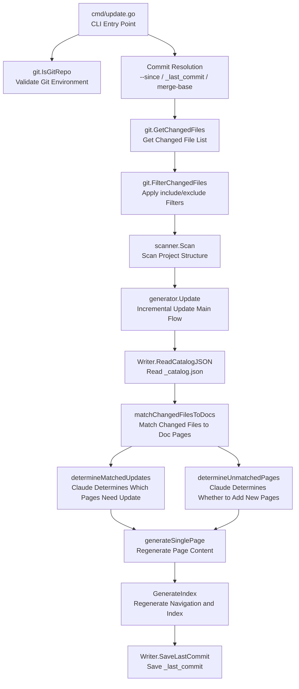
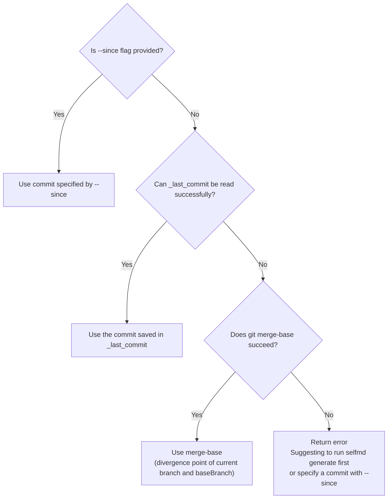

# selfmd update

The `selfmd update` command analyzes git change history to incrementally update affected documentation pages, without regenerating all documentation from scratch.

## Overview

`selfmd update` is selfmd's incremental update mode. Unlike `selfmd generate`, which performs a full regeneration each time, the `update` command compares the differences between git commits and only regenerates documentation pages affected by changes — significantly saving time and API costs.

**Prerequisites:**
- `selfmd generate` must have been run previously, with initial documentation present in the `.doc-build/` directory
- The project must be a git repository
- Claude CLI must be available

**Core Concepts:**
- **Comparison Range**: The diff between two commits, i.e. `previousCommit..currentCommit`
- **Matching**: Whether a changed source file path appears in the content of an existing documentation page
- **Leaf Promotion**: When a new page needs to become a child of an existing page, the old leaf node is automatically promoted to a parent node

## Architecture



## Command Syntax

```bash
selfmd update [flags]
```

**Available Flags:**

| Flag | Type | Description |
|------|------|-------------|
| `--since <commit>` | string | Specify the base commit for comparison (auto-detected by default) |
| `--config <path>` | string | Specify config file path (global flag, inherited from root) |
| `--verbose` | bool | Show detailed debug logs (global flag, inherited from root) |

> Source: `cmd/update.go#L19-L31`

## Commit Resolution Logic

Before running, `selfmd update` needs to determine "which commit to start comparing from." The system resolves the base commit using the following priority order:



The `_last_commit` file is automatically written after each `generate` or `update` completes, stored at `.doc-build/_last_commit`.

```go
// Determine comparison commit
previousCommit := sinceCommit
if previousCommit == "" {
    // Try reading saved commit from last generate/update
    saved, readErr := gen.Writer.ReadLastCommit()
    if readErr == nil && saved != "" {
        previousCommit = saved
    } else {
        // Fallback to merge-base
        base, err := git.GetMergeBase(rootDir, cfg.Git.BaseBranch)
        if err != nil {
            return fmt.Errorf("無法取得基準 commit: %w\n提示：先執行 selfmd generate 或使用 --since 指定 commit", err)
        }
        previousCommit = base
    }
}
```

> Source: `cmd/update.go#L68-L82`

## Four-Phase Update Flow

The `generator.Update()` method executes the following four phases in order:

### [1/4] Find Affected Documentation Pages

`matchChangedFilesToDocs` scans the content of all existing documentation pages for each changed source file, looking for pages that contain a reference to that file's path.

```go
// For each changed file, find which pages reference it
for _, f := range files {
    var matchedPages []catalog.FlatItem
    for _, item := range items {
        content, ok := pageContents[item.Path]
        if !ok {
            continue
        }
        if strings.Contains(content, f.Path) {
            matchedPages = append(matchedPages, item)
        }
    }
    // ...
}
```

> Source: `internal/generator/updater.go#L191-L211`

This step categorizes changed files into two groups:
- **matched**: Files that are referenced in existing documentation
- **unmatched**: New files that are not referenced in any existing documentation

### [2/4] Claude Determines Which Existing Pages Need Updating

For matched files, Claude CLI is called to evaluate whether each related documentation page is genuinely affected, and returns a list of pages that need to be regenerated.

Claude's decision is returned in JSON format, containing three fields: `catalogPath`, `title`, and `reason`:

```go
type UpdateMatchedResult struct {
    CatalogPath string `json:"catalogPath"`
    Title       string `json:"title"`
    Reason      string `json:"reason"`
}
```

> Source: `internal/generator/updater.go#L18-L22`

### [3/4] Claude Determines Whether to Add New Pages

For unmatched files (new files not referenced in any existing documentation), Claude CLI is called to evaluate whether documentation pages should be added for these files.

```go
type UpdateUnmatchedResult struct {
    CatalogPath string `json:"catalogPath"`
    Title       string `json:"title"`
    Reason      string `json:"reason"`
}
```

> Source: `internal/generator/updater.go#L24-L29`

If Claude decides new pages need to be added, the system calls `addItemToCatalog` to insert the new pages into the existing catalog tree, and triggers the leaf promotion mechanism (described below).

### [4/4] Regenerate Page Content

For all pages that need updating (matched pages requiring updates + newly added pages), the same `generateSinglePage` flow used by `selfmd generate` is called to regenerate content. The existing page content is passed as context during generation, allowing Claude to preserve the original structure when updating.

```go
// Read existing content to pass as context for regeneration
existing, _ := g.Writer.ReadPage(item)
err := g.generateSinglePage(ctx, scan, item, catalogTable, linkFixer, existing)
```

> Source: `internal/generator/updater.go#L141-L142`

## Leaf Promotion Mechanism

When Claude decides to add a child page under an existing page's path (for example, adding `core-modules.scanner.advanced` under `core-modules.scanner`), the original leaf node (`core-modules.scanner`) needs to be promoted to a parent node.

The system automatically:
1. Moves the original leaf node's existing content to a newly created `overview` child page (e.g. `core-modules.scanner.overview`)
2. Marks the original leaf node as a parent node
3. Creates the newly requested child page under the parent node

```go
// A leaf node was promoted to a parent.
// Move the original content to the new "overview" child.
origItem := catalog.FlatItem{
    Path:    promoted.OriginalPath,
    DirPath: catalogPathToDir(promoted.OriginalPath),
}
overviewItem := catalog.FlatItem{
    Title:   promoted.OriginalTitle,
    Path:    promoted.OverviewPath,
    DirPath: catalogPathToDir(promoted.OverviewPath),
}
if content, err := g.Writer.ReadPage(origItem); err == nil && content != "" {
    if err := g.Writer.WritePage(overviewItem, content); err != nil {
        // ...
    }
}
```

> Source: `internal/generator/updater.go#L99-L116`

## Changed File Filtering

The system uses the same include/exclude rules as `selfmd generate` to filter git diff output, ensuring that only file changes matching the configured targets trigger documentation updates.

```go
changedFiles = git.FilterChangedFiles(changedFiles, cfg.Targets.Include, cfg.Targets.Exclude)
```

> Source: `cmd/update.go#L94`

`FilterChangedFiles` supports doublestar glob syntax (`**/*.go`) and correctly handles git rename format (`R100\told\tnew`), using the destination path for matching.

```go
// git diff --name-status format: "M\tpath/to/file" or "R100\told\tnew"
parts := strings.SplitN(line, "\t", 3)
// For renames, check the destination path (last element)
filePath := parts[len(parts)-1]
```

> Source: `internal/git/git.go#L83-L91`

## Output Files

After each `update` completes, the system updates the following persistent files:

| File | Description |
|------|-------------|
| `.doc-build/_last_commit` | Records the HEAD commit hash of this update run, used by the next update |
| `.doc-build/_catalog.json` | Updated documentation catalog structure if new pages were added |
| `.doc-build/<path>/index.md` | Documentation pages that were updated or newly created |

## Usage Examples

```bash
# Basic usage: update documentation changed since the last generate/update
selfmd update

# Compare against a specific commit
selfmd update --since a1b2c3d

# Enable verbose logging
selfmd update --verbose

# Specify a config file
selfmd update --config ./selfmd.yaml
```

Typical output:

```
Comparison range: a1b2c3d..e4f5g6h
Changed files:
M       internal/scanner/scanner.go
A       internal/scanner/filetree.go

[1/4] Finding affected documentation pages...
      2 changed files matched to existing docs, 0 unmatched
[2/4] Calling Claude to determine pages that need updating...
      → Project Scanner: public API in scanner.go has changed, update required
      Done (1 page needs updating)
[3/4] All changed files already have corresponding documentation, skipping
[4/4] Regenerating 1 page...
      [1/1] Project Scanner (core-modules.scanner)... Done

Update complete! Total cost: $0.0023 USD
```

## Prerequisite Error Handling

| Condition | Error Message |
|-----------|---------------|
| Claude CLI not available | Error returned by `claude.CheckAvailable()` |
| Not a git repository | `Current directory is not a git repository, cannot perform incremental update` |
| Cannot resolve base commit | `Failed to get base commit: ...` with suggestion to run `selfmd generate` first |
| `generate` has never been run | `Failed to read existing catalog (please run selfmd generate first)` |

## Related Links

- [CLI Command Reference](../index.md)
- [selfmd generate](../cmd-generate/index.md)
- [Git Integration and Incremental Updates](../../git-integration/index.md)
- [Git Diff Change Detection](../../git-integration/change-detection/index.md)
- [Affected Page Determination Logic](../../git-integration/affected-pages/index.md)
- [Incremental Update (Core Module)](../../core-modules/incremental-update/index.md)
- [Documentation Catalog Management](../../core-modules/catalog/index.md)
- [Git Integration Configuration](../../configuration/git-config/index.md)

## Reference Files

| File Path | Description |
|-----------|-------------|
| `cmd/update.go` | `selfmd update` CLI command definition, flag declarations, prerequisite validation, commit resolution logic |
| `internal/generator/updater.go` | Incremental update main flow `Update()`, matching logic, Claude decision calls, leaf promotion mechanism |
| `internal/git/git.go` | Git operation wrappers: `IsGitRepo`, `GetChangedFiles`, `ParseChangedFiles`, `FilterChangedFiles` |
| `internal/output/writer.go` | `SaveLastCommit`, `ReadLastCommit`, `ReadCatalogJSON`, `WriteCatalogJSON` |
| `internal/generator/pipeline.go` | `Generator` struct definition, `NewGenerator` constructor |
| `internal/catalog/catalog.go` | `Catalog`, `FlatItem`, `BuildLinkTable`, `Flatten`, and other catalog operations |
| `internal/prompt/engine.go` | `UpdateMatchedPromptData`, `UpdateUnmatchedPromptData`, `RenderUpdateMatched`, `RenderUpdateUnmatched` |