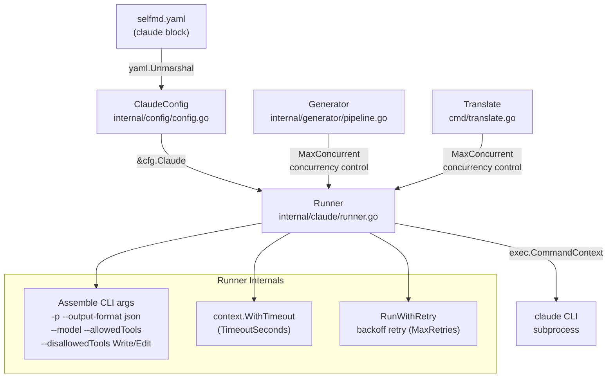
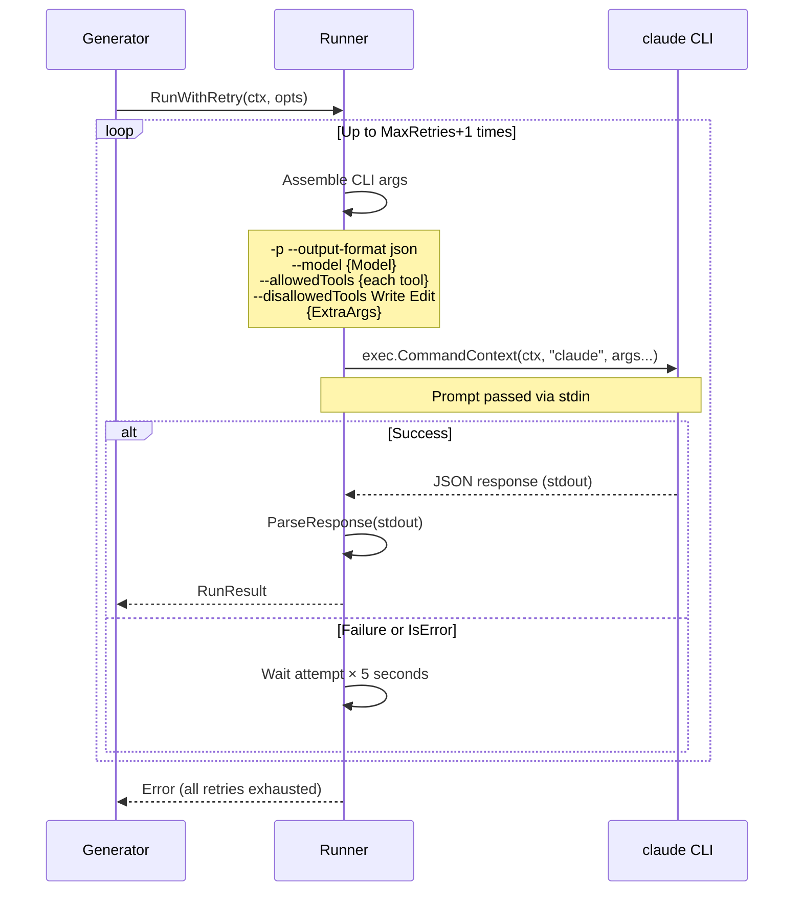

# Claude CLI Integration Settings

Controls how selfmd invokes Claude CLI subprocesses, including model selection, concurrency, timeout, retries, and tool access permissions.

## Overview

The `claude` configuration block defines all behavioral parameters for how selfmd interacts with the Claude CLI (`claude` command). selfmd calls the Claude CLI as a subprocess at each stage of the documentation generation pipeline — directory generation, content page generation, and translation — and all of these calls are governed by this configuration.

**Core responsibilities:**
- Specify the Claude model version to use
- Limit the number of concurrent Claude subprocesses per run to avoid exceeding API rate limits
- Set the maximum wait time (timeout) for each call
- Control the number of automatic retries and backoff intervals after failures
- Restrict which tools Claude can access to ensure safe boundaries for documentation analysis
- Inject custom additional CLI arguments

## Configuration Structure

The `claude` block in `selfmd.yaml` maps to the `ClaudeConfig` struct:

```go
type ClaudeConfig struct {
    Model          string   `yaml:"model"`
    MaxConcurrent  int      `yaml:"max_concurrent"`
    TimeoutSeconds int      `yaml:"timeout_seconds"`
    MaxRetries     int      `yaml:"max_retries"`
    AllowedTools   []string `yaml:"allowed_tools"`
    ExtraArgs      []string `yaml:"extra_args"`
}
```

> Source: internal/config/config.go#L82-L89

### Full Default Values

```go
Claude: ClaudeConfig{
    Model:          "sonnet",
    MaxConcurrent:  3,
    TimeoutSeconds: 300,
    MaxRetries:     2,
    AllowedTools:   []string{"Read", "Glob", "Grep"},
    ExtraArgs:      []string{},
},
```

> Source: internal/config/config.go#L116-L123

## Field Reference

### `model`

**Type:** `string`　**Default:** `"sonnet"`

Specifies the Claude model to use. This value is passed directly to the `claude --model` flag. If left empty, the `--model` flag is not passed and the Claude CLI uses its own default.

```yaml
claude:
  model: sonnet       # Use Claude Sonnet (faster, more cost-efficient)
  # model: opus       # Use Claude Opus (more capable, more expensive)
```

### `max_concurrent`

**Type:** `int`　**Default:** `3`　**Minimum:** `1`

Sets the maximum number of concurrent Claude CLI subprocesses. This value controls the parallelism for both the content page generation and translation stages.

- Setting this too high may trigger Anthropic API rate limits
- The `selfmd generate --concurrency` flag can temporarily override this value at runtime
- Validation logic ensures this value is never less than `1`

### `timeout_seconds`

**Type:** `int`　**Default:** `300`　**Minimum:** `30`

The timeout in seconds for each Claude CLI call. After this duration, the Runner cancels the subprocess and reports a timeout error.

- If documents are large or prompts are complex, consider increasing this value
- Validation logic ensures this value is never less than `30` seconds

### `max_retries`

**Type:** `int`　**Default:** `2`　**Minimum:** `0`

The maximum number of automatic retries when a Claude CLI call fails. Retries use a backoff strategy: before the Nth retry, the runner waits `N × 5` seconds.

- Set to `0` to disable retries
- Validation logic ensures this value is never less than `0`

### `allowed_tools`

**Type:** `[]string`　**Default:** `["Read", "Glob", "Grep"]`

Specifies the list of tools Claude is allowed to use when analyzing source code. Corresponds to the `claude --allowedTools` flag, passed once per tool.

**Note:** Regardless of this setting, the `Write` and `Edit` tools are always blocked (via `--disallowedTools Write --disallowedTools Edit`) to prevent Claude from directly modifying source code.

```yaml
claude:
  allowed_tools:
    - Read    # Read file contents
    - Glob    # Search files by pattern
    - Grep    # Search text within files
```

### `extra_args`

**Type:** `[]string`　**Default:** `[]`

Additional CLI arguments injected into every `claude` command, appended after the automatically generated arguments. Useful for passing Claude CLI flags not directly supported by selfmd.

```yaml
claude:
  extra_args:
    - "--verbose"
```

## Architecture



## Core Flow

### Runner Invocation Flow



### Timeout Handling

```go
timeout := opts.Timeout
if timeout == 0 {
    timeout = time.Duration(r.config.TimeoutSeconds) * time.Second
}

ctx, cancel := context.WithTimeout(ctx, timeout)
defer cancel()
```

> Source: internal/claude/runner.go#L61-L67

### Retry Backoff Logic

```go
for attempt := 0; attempt <= maxRetries; attempt++ {
    if attempt > 0 {
        backoff := time.Duration(attempt) * 5 * time.Second
        r.logger.Info("Retrying", "attempt", attempt+1, "backoff", backoff)
        select {
        case <-ctx.Done():
            return nil, ctx.Err()
        case <-time.After(backoff):
        }
    }
    // ...
}
```

> Source: internal/claude/runner.go#L117-L127

## Usage Examples

### Full `claude` Block in `selfmd.yaml`

```yaml
claude:
  model: sonnet
  max_concurrent: 3
  timeout_seconds: 300
  max_retries: 2
  allowed_tools:
    - Read
    - Glob
    - Grep
  extra_args: []
```

### High-Throughput Configuration (Large Projects)

```yaml
claude:
  model: sonnet
  max_concurrent: 5      # Increase concurrency
  timeout_seconds: 600   # Extend timeout to 10 minutes
  max_retries: 3
  allowed_tools:
    - Read
    - Glob
    - Grep
```

### Validation Logic

```go
func (c *Config) validate() error {
    if c.Claude.MaxConcurrent < 1 {
        c.Claude.MaxConcurrent = 1
    }
    if c.Claude.TimeoutSeconds < 30 {
        c.Claude.TimeoutSeconds = 30
    }
    if c.Claude.MaxRetries < 0 {
        c.Claude.MaxRetries = 0
    }
    return nil
}
```

> Source: internal/config/config.go#L157-L174

## Tool Restriction Design

selfmd uses a dual strategy of "allowlist + enforced blocklist" for tool access:

| Mechanism | Configuration Source | Description |
|-----------|----------------------|-------------|
| `--allowedTools` | `allowed_tools` field | Tools Claude is permitted to use (read-only analysis tools) |
| `--disallowedTools Write` | Hardcoded in Runner | Write is always blocked regardless of configuration |
| `--disallowedTools Edit` | Hardcoded in Runner | Edit is always blocked regardless of configuration |

This design ensures Claude can only "read" source code for documentation analysis and cannot modify any files. Related implementation:

```go
// Explicitly block Write/Edit to prevent content from being lost in denied tool calls
args = append(args, "--disallowedTools", "Write", "--disallowedTools", "Edit")
```

> Source: internal/claude/runner.go#L55-L56

## Related Links

- [Configuration Reference](../index.md)
- [selfmd.yaml Structure Overview](../config-overview/index.md)
- [Output and Multilingual Settings](../output-language/index.md)
- [Git Integration Settings](../git-config/index.md)
- [Claude CLI Runner](../../core-modules/claude-runner/index.md)
- [Documentation Generation Pipeline](../../core-modules/generator/index.md)
- [Translation Phase](../../core-modules/generator/translate-phase/index.md)

## Reference Files

| File Path | Description |
|-----------|-------------|
| `internal/config/config.go` | `ClaudeConfig` struct definition, default values, and validation logic |
| `internal/claude/runner.go` | `Runner` implementation responsible for assembling CLI arguments and executing subprocesses |
| `internal/claude/types.go` | Type definitions for `RunOptions`, `RunResult`, and `CLIResponse` |
| `internal/claude/parser.go` | Claude CLI JSON response parsing logic |
| `internal/generator/pipeline.go` | `MaxConcurrent` used to control content generation concurrency |
| `cmd/translate.go` | `MaxConcurrent` used to control translation concurrency |