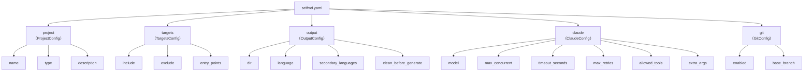
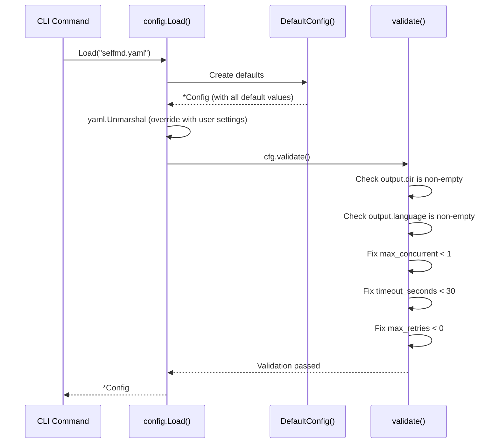

# selfmd.yaml Structure Overview

`selfmd.yaml` is the core configuration file for selfmd, containing five top-level sections that control everything from project scanning to Claude CLI invocation.

## Overview

`selfmd.yaml` uses YAML format and is parsed into the `Config` struct defined in `internal/config/config.go`. Before any selfmd command runs, the system loads and validates this configuration file.

Each of the five top-level sections is responsible for a different functional area:

| Section | Go Type | Description |
|---------|---------|-------------|
| `project` | `ProjectConfig` | Basic project information (name, type, description) |
| `targets` | `TargetsConfig` | Scan target paths (include, exclude, entry points) |
| `output` | `OutputConfig` | Output directory and multi-language settings |
| `claude` | `ClaudeConfig` | Claude CLI execution parameters |
| `git` | `GitConfig` | Git integration and incremental update settings |

When you run `selfmd init`, the system automatically detects the project type, applies defaults, and generates a complete `selfmd.yaml` template. The configuration file path defaults to `selfmd.yaml` and can be overridden with the `--config` flag.

## Architecture



## Full Structure Reference

### `project` — Basic Project Information

```yaml
project:
  name: myproject         # Project name, used in doc titles and browser tabs
  type: backend           # Project type: backend / frontend / fullstack / library
  description: ""         # Project description (optional)
```

> Source: `internal/config/config.go#L19-L23`

The `type` field influences the context description Claude uses when generating documentation. `selfmd init` detects this automatically based on indicator files such as `go.mod` and `package.json`.

---

### `targets` — Scan Target Configuration

```yaml
targets:
  include:
    - src/**
    - pkg/**
    - cmd/**
    - internal/**
    - lib/**
    - app/**
  exclude:
    - vendor/**
    - node_modules/**
    - .git/**
    - .doc-build/**
    - "**/*.pb.go"
    - "**/generated/**"
    - dist/**
    - build/**
  entry_points:
    - main.go
    - cmd/root.go
```

> Source: `internal/config/config.go#L25-L29`, defaults: `internal/config/config.go#L102-L109`

- `include`: Specifies directories to scan using glob patterns; supports `**` wildcards
- `exclude`: Excludes noisy paths such as auto-generated code, dependencies, and build artifacts
- `entry_points`: Marks core entry files to guide Claude in understanding the project architecture first

---

### `output` — Output and Language Settings

```yaml
output:
  dir: .doc-build               # Documentation output directory
  language: zh-TW               # Primary documentation language (master lang)
  secondary_languages:          # List of secondary languages (for translation)
    - en-US
  clean_before_generate: false  # Whether to clear the output directory before each generation
```

> Source: `internal/config/config.go#L31-L36`

**Language codes**: `language` and `secondary_languages` use BCP 47 format. The system has built-in support for the following language codes:

| Code | Language Name |
|------|--------------|
| `zh-TW` | 繁體中文 |
| `zh-CN` | 简体中文 |
| `en-US` | English |
| `ja-JP` | 日本語 |
| `ko-KR` | 한국어 |
| `fr-FR` | Français |
| `de-DE` | Deutsch |
| `es-ES` | Español |
| `pt-BR` | Português |
| `th-TH` | ไทย |
| `vi-VN` | Tiếng Việt |

> Source: `internal/config/config.go#L39-L51`

`clean_before_generate` can be overridden by the CLI flags `--clean` or `--no-clean`.

---

### `claude` — Claude CLI Integration Settings

```yaml
claude:
  model: sonnet           # Claude model identifier
  max_concurrent: 3       # Maximum number of concurrent requests
  timeout_seconds: 300    # Per-request timeout (seconds), minimum 30
  max_retries: 2          # Number of retry attempts on failure, minimum 0
  allowed_tools:          # List of tools Claude is allowed to use
    - Read
    - Glob
    - Grep
  extra_args: []          # Additional flags to pass to the claude CLI
```

> Source: `internal/config/config.go#L82-L89`, defaults: `internal/config/config.go#L116-L123`

`max_concurrent` controls how many Claude CLI calls run simultaneously and can be overridden at runtime with `selfmd generate --concurrency <N>`.

---

### `git` — Git Integration Settings

```yaml
git:
  enabled: true           # Whether to enable Git integration (incremental updates)
  base_branch: main       # Base branch used for diffing
```

> Source: `internal/config/config.go#L91-L94`

When Git integration is enabled, the `selfmd update` command diffs `base_branch` against the current working tree and regenerates only the documentation pages affected by the changes.

## Load and Validation Flow



`Load()` follows a "defaults first, user overrides" strategy: it starts by building a complete default `Config`, then overlays the YAML content on top. Any fields left unset automatically retain their default values.

```go
func Load(path string) (*Config, error) {
    data, err := os.ReadFile(path)
    if err != nil {
        return nil, fmt.Errorf("無法讀取設定檔 %s: %w", path, err)
    }

    cfg := DefaultConfig()
    if err := yaml.Unmarshal(data, cfg); err != nil {
        return nil, fmt.Errorf("設定檔格式錯誤: %w", err)
    }

    if err := cfg.validate(); err != nil {
        return nil, err
    }

    return cfg, nil
}
```

> Source: `internal/config/config.go#L131-L147`

## Prompt Template Language Selection Logic

`output.language` controls not only the documentation output language but also which prompt template is selected. Currently, built-in templates only support `zh-TW` and `en-US`; other language codes fall back to the `en-US` template, with an explicit language output instruction injected into the prompt.

```go
// GetEffectiveTemplateLang returns which template folder to load.
func (o *OutputConfig) GetEffectiveTemplateLang() string {
    for _, lang := range SupportedTemplateLangs {
        if o.Language == lang {
            return o.Language
        }
    }
    return "en-US"
}

// NeedsLanguageOverride returns true when the template language differs from Language.
func (o *OutputConfig) NeedsLanguageOverride() bool {
    return o.GetEffectiveTemplateLang() != o.Language
}
```

> Source: `internal/config/config.go#L58-L71`

## Related Links

- [Configuration Overview](../index.md) — Configuration section overview
- [Project and Scan Target Settings](../project-targets/index.md) — Detailed reference for the `project` and `targets` sections
- [Output and Multi-Language Settings](../output-language/index.md) — The `output` section and language mechanism
- [Claude CLI Integration Settings](../claude-config/index.md) — Detailed reference for the `claude` section
- [Git Integration Settings](../git-config/index.md) — Detailed reference for the `git` section
- [selfmd init](../../cli/cmd-init/index.md) — Command for auto-generating the configuration file
- [Multi-Language Support](../../i18n/index.md) — Language codes and translation workflow

## Reference Files

| File Path | Description |
|-----------|-------------|
| `internal/config/config.go` | `Config` struct definition, defaults, load and validation logic |
| `cmd/init.go` | `selfmd init` implementation, including project type auto-detection and config file generation |
| `cmd/root.go` | Root command definition, including the `--config` flag declaration |
| `cmd/generate.go` | `selfmd generate` implementation, showing how the config is passed to the Generator |
| `internal/generator/pipeline.go` | How the Generator uses Config fields to drive the documentation generation pipeline |