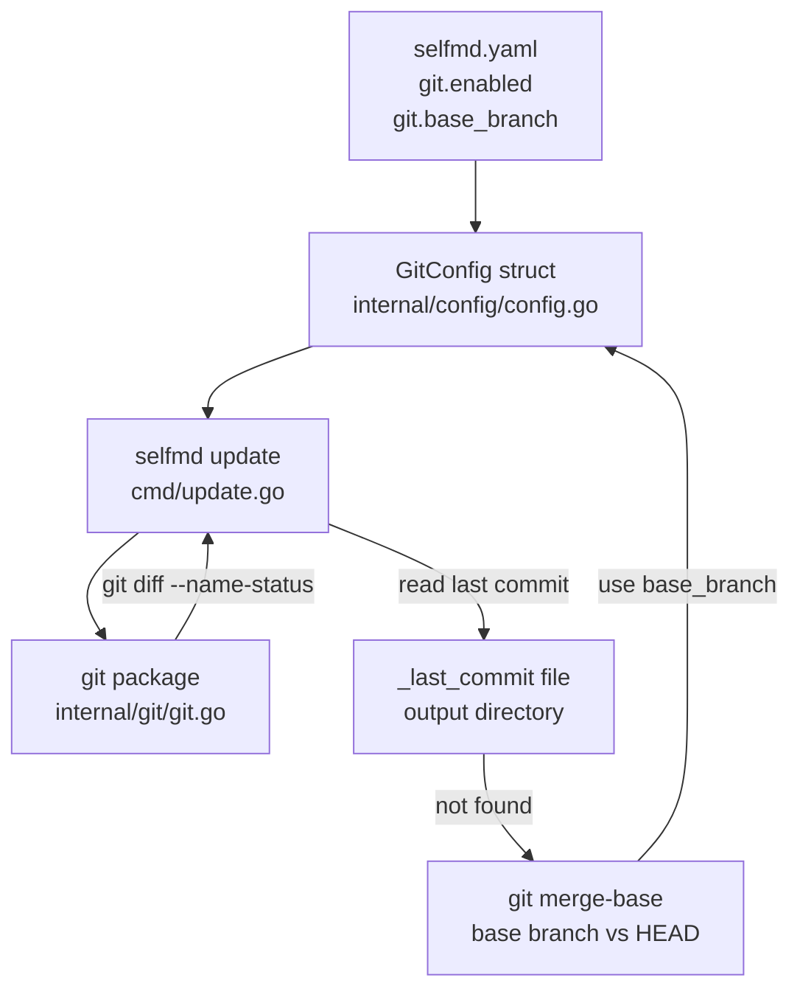
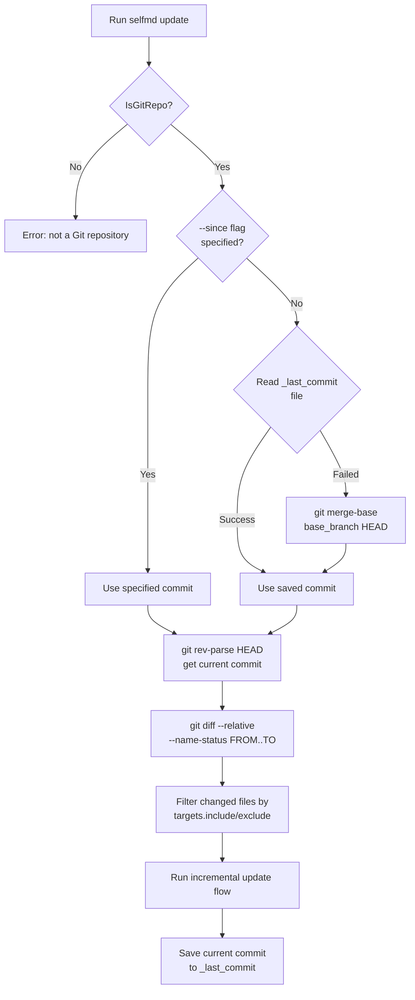

# Git Integration Configuration

Configure how selfmd uses Git history to track source code changes for incremental documentation updates.

## Overview

selfmd's Git integration configuration is located in the `git` block of `selfmd.yaml`. This configuration determines how the `selfmd update` command compares Git commits to detect affected source files during incremental updates.

Core concepts of Git integration:

- **Base Branch**: The branch used as the starting point for comparison. When no previous run record is found, the system uses the merge-base of this branch and `HEAD` as the comparison starting point.
- **Enabled**: Controls whether the Git diff feature is active. This field is read by the system, though `selfmd update` itself already requires the current directory to be a Git repository.
- **Commit Record Persistence**: After each `generate` or `update` run, the system saves the current commit hash to a `_last_commit` file in the output directory for use in the next incremental update.

## Architecture



## Configuration Fields

The `GitConfig` struct is defined in `internal/config/config.go`:

```go
type GitConfig struct {
	Enabled    bool   `yaml:"enabled"`
	BaseBranch string `yaml:"base_branch"`
}
```

> Source: internal/config/config.go#L91-L94

### `git.enabled`

| Property | Value |
|----------|-------|
| Type | `bool` |
| Default | `true` |
| Required | No |

Controls whether Git integration is enabled.

### `git.base_branch`

| Property | Value |
|----------|-------|
| Type | `string` |
| Default | `"main"` |
| Required | No |

The base branch name. When no previous commit record is found (the `_last_commit` file does not exist), the system uses this branch as the reference and runs `git merge-base <base_branch> HEAD` to calculate the comparison starting point.

## Default Values

Git configuration defaults in `DefaultConfig()`:

```go
Git: GitConfig{
    Enabled:    true,
    BaseBranch: "main",
},
```

> Source: internal/config/config.go#L124-L127

## selfmd.yaml Configuration Example

```yaml
git:
  enabled: true
  base_branch: main
```

If your main branch is named `master`, change `base_branch` to:

```yaml
git:
  enabled: true
  base_branch: master
```

## Core Flow

The following shows how the `selfmd update` command uses Git configuration to determine the comparison range:



## Usage Examples

### Basic Incremental Update

When running `selfmd update`, the system will:

1. Read `git.base_branch` from `selfmd.yaml`
2. Attempt to read the previously saved commit (the `_last_commit` file)
3. If no record exists, call `git merge-base` with `base_branch` to calculate the starting point

```go
// Comparison starting point determination logic in cmd/update.go
previousCommit := sinceCommit
if previousCommit == "" {
    saved, readErr := gen.Writer.ReadLastCommit()
    if readErr == nil && saved != "" {
        previousCommit = saved
    } else {
        base, err := git.GetMergeBase(rootDir, cfg.Git.BaseBranch)
        // ...
        previousCommit = base
    }
}
```

> Source: cmd/update.go#L69-L86

### Specifying a Comparison Starting Point with `--since`

You can also directly specify a commit hash as the comparison starting point, bypassing the automatic detection logic:

```bash
selfmd update --since abc1234
```

### Parsing `git diff` Output

The `ParseChangedFiles` function in `internal/git/git.go` parses the output of `git diff --name-status`:

```go
// ChangedFile represents a single file from git diff --name-status output.
type ChangedFile struct {
	Status string // "M", "A", "D", "R"
	Path   string
}

// ParseChangedFiles parses git diff --name-status output into structured ChangedFile list.
func ParseChangedFiles(changedFiles string) []ChangedFile {
	var result []ChangedFile
	for _, line := range strings.Split(changedFiles, "\n") {
		line = strings.TrimSpace(line)
		if line == "" {
			continue
		}
		parts := strings.SplitN(line, "\t", 3)
		if len(parts) < 2 {
			continue
		}
		status := string(parts[0][0]) // "M", "A", "D", or "R" (R100 → R)
		path := parts[len(parts)-1]   // for renames, use destination path
		result = append(result, ChangedFile{Status: status, Path: path})
	}
	return result
}
```

> Source: internal/git/git.go#L47-L70

### Filtering Changed Files

After obtaining the Git diff results, the system also filters them according to `targets.include` and `targets.exclude` configuration to exclude irrelevant files (such as `vendor/**`, `.git/**`):

```go
changedFiles = git.FilterChangedFiles(changedFiles, cfg.Targets.Include, cfg.Targets.Exclude)
```

> Source: cmd/update.go#L98

## Notes

- Before running `selfmd update`, confirm that the current directory is a Git repository; otherwise the command will immediately report an error
- Before using incremental updates for the first time, you must run `selfmd generate` to build the initial documentation. If no `_last_commit` record is found, the system will attempt to calculate the merge-base using `base_branch`
- The `git.enabled` field currently exists in the configuration, but `selfmd update` itself already requires a Git environment regardless of this value

## Related Links

- [Configuration Overview](../index.md)
- [selfmd.yaml Structure Overview](../config-overview/index.md)
- [Claude CLI Integration Configuration](../claude-config/index.md)
- [selfmd update](../../cli/cmd-update/index.md)
- [Git Diff Change Detection](../../git-integration/change-detection/index.md)
- [Affected Pages Determination Logic](../../git-integration/affected-pages/index.md)
- [Incremental Update](../../core-modules/incremental-update/index.md)

## Reference Files

| File Path | Description |
|-----------|-------------|
| `internal/config/config.go` | `GitConfig` struct definition, default values, and overall `Config` structure |
| `internal/git/git.go` | Git operation function implementations, including diff parsing, filtering, and commit queries |
| `cmd/update.go` | `selfmd update` command implementation, using Git configuration to determine comparison range |
| `internal/generator/updater.go` | Incremental update logic, calls the Git package for change comparison and documentation regeneration |
| `internal/output/writer.go` | Read/write implementation for the `_last_commit` file |