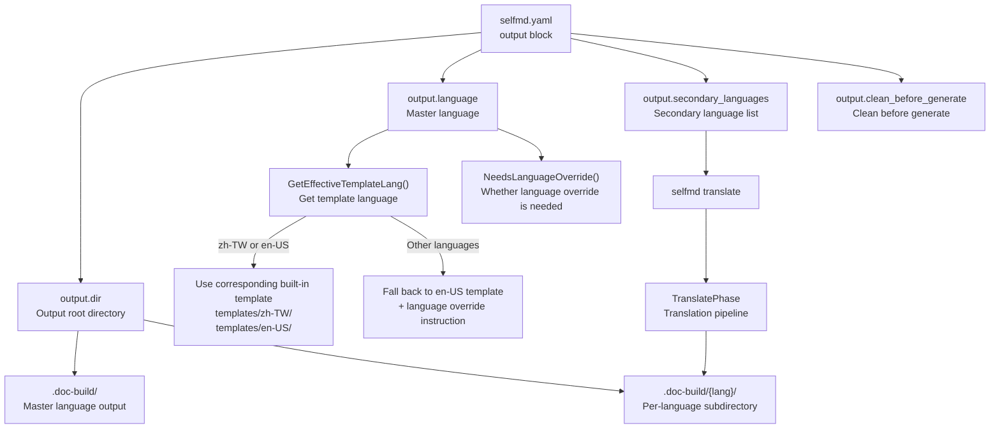
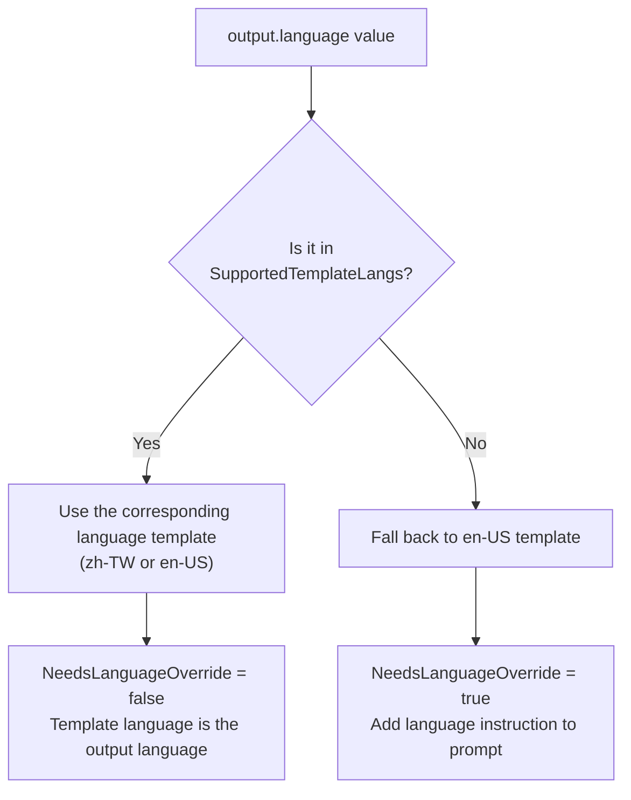

# Output & Multilingual Configuration

This page describes all fields in the `output` block of `selfmd.yaml`, and how selfmd supports primary-language document generation and automatic secondary-language translation.

## Overview

The `output` block controls two categories of behavior:

1. **Output directory settings**: Specifies where documents are generated and whether to clear existing files before generation.
2. **Multilingual settings**: Defines the master language and a list of secondary languages. The master language determines the writing language of the documents and the template selection logic; secondary languages are used by the `selfmd translate` command to batch-translate primary-language documents into the specified languages.

selfmd's multilingual system follows a "generate first, translate second" two-phase strategy: first, all technical documents are fully generated in the master language; then, Claude translates each page into the secondary languages. Translation results are stored in `.doc-build/{lang-code}/` subdirectories.

---

## Architecture



---

## Configuration Field Reference

The complete structure definition of the `output` block is as follows:

```go
type OutputConfig struct {
    Dir                 string   `yaml:"dir"`
    Language            string   `yaml:"language"`
    SecondaryLanguages  []string `yaml:"secondary_languages"`
    CleanBeforeGenerate bool     `yaml:"clean_before_generate"`
}
```

> Source: internal/config/config.go#L31-L36

### `output.dir`

| Field | Description |
|-------|-------------|
| Type | `string` |
| Default | `.doc-build` |
| Description | The output root directory for all documents. Primary-language documents are placed directly in this directory; secondary-language documents are placed in `{dir}/{lang}/` subdirectories. |

### `output.language`

| Field | Description |
|-------|-------------|
| Type | `string` |
| Default | `zh-TW` |
| Validation | Must not be an empty string |
| Description | The primary language code (BCP 47 format). Determines which Claude prompt template is selected and the output language of the generated documents. |

### `output.secondary_languages`

| Field | Description |
|-------|-------------|
| Type | `[]string` |
| Default | `[]` (empty list) |
| Description | List of secondary language codes. When `selfmd translate` is run, it translates the primary-language documents into each of these languages in turn. If this field is empty, the `translate` command returns an error. |

### `output.clean_before_generate`

| Field | Description |
|-------|-------------|
| Type | `bool` |
| Default | `false` |
| Description | When set to `true`, the output directory is deleted and recreated before each `selfmd generate` run. Equivalent to running `generate --clean` every time. |

---

## Full Configuration Example

The following is a typical configuration with multilingual support enabled:

```yaml
output:
  dir: .doc-build
  language: zh-TW
  secondary_languages:
    - en-US
    - ja-JP
  clean_before_generate: false
```

> Source: internal/config/config.go#L110-L115 (DefaultConfig function)

---

## Supported Language Codes

selfmd has the following language codes and their corresponding native names built in. When these codes are used, the language names are automatically displayed in the document navigation and translation pipeline output:

```go
var KnownLanguages = map[string]string{
    "zh-TW": "繁體中文",
    "zh-CN": "简体中文",
    "en-US": "English",
    "ja-JP": "日本語",
    "ko-KR": "한국어",
    "fr-FR": "Français",
    "de-DE": "Deutsch",
    "es-ES": "Español",
    "pt-BR": "Português",
    "th-TH": "ไทย",
    "vi-VN": "Tiếng Việt",
}
```

> Source: internal/config/config.go#L39-L51

Using a language code not in `KnownLanguages` (e.g., `it-IT`) will still work, but the language name will be displayed as the code itself (e.g., `it-IT`).

---

## Prompt Template Language & Language Override Mechanism

selfmd provides built-in prompt templates for only the following two languages:

```go
var SupportedTemplateLangs = []string{"zh-TW", "en-US"}
```

> Source: internal/config/config.go#L54

When `output.language` is set to a language outside of `SupportedTemplateLangs`, the system automatically falls back to the `en-US` template and adds an explicit language override instruction to the prompt, directing Claude to output documents in the specified language.

This logic is implemented by the following two methods:

```go
// GetEffectiveTemplateLang returns which template folder to load.
// If Language has a built-in template set, returns it; otherwise falls back to "en-US".
func (o *OutputConfig) GetEffectiveTemplateLang() string {
    for _, lang := range SupportedTemplateLangs {
        if o.Language == lang {
            return o.Language
        }
    }
    return "en-US"
}

// NeedsLanguageOverride returns true when the template language differs from Language,
// meaning the prompt needs an explicit instruction to output in the configured language.
func (o *OutputConfig) NeedsLanguageOverride() bool {
    return o.GetEffectiveTemplateLang() != o.Language
}
```

> Source: internal/config/config.go#L58-L71

### Template Language Selection Logic



During `Generator` initialization, `GetEffectiveTemplateLang()` is called to select the correct template folder:

```go
func NewGenerator(cfg *config.Config, rootDir string, logger *slog.Logger) (*Generator, error) {
    templateLang := cfg.Output.GetEffectiveTemplateLang()
    engine, err := prompt.NewEngine(templateLang)
    if err != nil {
        return nil, err
    }
    // ...
}
```

> Source: internal/generator/pipeline.go#L34-L38

---

## Multilingual Output Directory Structure

When secondary languages are enabled, the output directory structure is as follows:

```
.doc-build/                    ← Master language (output.language)
├── index.html                 ← Static browser
├── _catalog.json              ← Master language catalog data
├── index.md
├── _sidebar.md
└── {section}/
    └── {page}/
        └── index.md

.doc-build/en-US/              ← Secondary language (secondary_languages[0])
├── _catalog.json
├── index.md
├── _sidebar.md
└── {section}/
    └── {page}/
        └── index.md

.doc-build/ja-JP/              ← Secondary language (secondary_languages[1])
└── ...
```

The `Writer.ForLanguage()` method creates a new `Writer` instance pointing to the language subdirectory:

```go
// ForLanguage returns a new Writer that writes to a language-specific subdirectory.
func (w *Writer) ForLanguage(lang string) *Writer {
    return &Writer{
        BaseDir: filepath.Join(w.BaseDir, lang),
    }
}
```

> Source: internal/output/writer.go#L139-L143

---

## Language Metadata for the Document Browser

After running `selfmd generate` or `selfmd translate`, the system generates a `DocMeta` object that records all available language information for use by the static document browser:

```go
func (g *Generator) buildDocMeta() *output.DocMeta {
    meta := &output.DocMeta{
        DefaultLanguage: g.Config.Output.Language,
        AvailableLanguages: []output.LangInfo{
            {
                Code:       g.Config.Output.Language,
                NativeName: config.GetLangNativeName(g.Config.Output.Language),
                IsDefault:  true,
            },
        },
    }
    for _, lang := range g.Config.Output.SecondaryLanguages {
        meta.AvailableLanguages = append(meta.AvailableLanguages, output.LangInfo{
            Code:       lang,
            NativeName: config.GetLangNativeName(lang),
            IsDefault:  false,
        })
    }
    return meta
}
```

> Source: internal/generator/pipeline.go#L184-L203

---

## Translate Command Integration

The `secondary_languages` configuration determines the translation targets for `selfmd translate`. The following is the validation logic at the CLI layer:

```go
if len(cfg.Output.SecondaryLanguages) == 0 {
    return fmt.Errorf("設定檔中未定義 secondary_languages，無法翻譯")
}

// Determine target languages
targetLangs := cfg.Output.SecondaryLanguages
if len(translateLangs) > 0 {
    // Validate specified languages are in the config
    validLangs := make(map[string]bool)
    for _, l := range cfg.Output.SecondaryLanguages {
        validLangs[l] = true
    }
    for _, l := range translateLangs {
        if !validLangs[l] {
            return fmt.Errorf("語言 %s 不在 secondary_languages 列表中（可用：%s）", l, strings.Join(cfg.Output.SecondaryLanguages, ", "))
        }
    }
    targetLangs = translateLangs
}
```

> Source: cmd/translate.go#L49-L67

The `--lang` flag can be used to translate only a subset of languages, but the specified languages must already be defined in `secondary_languages`; otherwise a validation error is returned.

---

## Language Localization for Navigation Pages

UI strings in navigation pages such as `output.md`, `index.md`, and `_sidebar.md` also support multiple languages. Currently, `zh-TW` and `en-US` UI string sets are built in; other languages automatically fall back to `en-US`:

```go
var UIStrings = map[string]map[string]string{
    "zh-TW": {
        "techDocs":        "技術文件",
        "catalog":         "目錄",
        "home":            "首頁",
        "sectionContains": "本章節包含以下內容：",
        "autoGenerated":   "本文件由 [selfmd](https://github.com/monkenwu/selfmd) 自動產生",
    },
    "en-US": {
        "techDocs":        "Technical Documentation",
        "catalog":         "Table of Contents",
        "home":            "Home",
        "sectionContains": "This section contains the following:",
        "autoGenerated":   "This documentation was automatically generated by [selfmd](https://github.com/monkenwu/selfmd)",
    },
}
```

> Source: internal/output/navigation.go#L12-L27

---

## Related Links

- [selfmd.yaml Structure Overview](../config-overview/index.md)
- [Project & Scan Target Configuration](../project-targets/index.md)
- [Claude CLI Integration Configuration](../claude-config/index.md)
- [selfmd translate Command](../../cli/cmd-translate/index.md)
- [Supported Languages & Templates](../../i18n/supported-languages/index.md)
- [Translation Workflow](../../i18n/translation-workflow/index.md)
- [Translation Phase](../../core-modules/generator/translate-phase/index.md)
- [Prompt Template Engine](../../core-modules/prompt-engine/index.md)

---

## Reference Files

| File Path | Description |
|-----------|-------------|
| `internal/config/config.go` | `OutputConfig` struct definition, `KnownLanguages`, `SupportedTemplateLangs`, `GetEffectiveTemplateLang()`, `NeedsLanguageOverride()`, `GetLangNativeName()` |
| `internal/generator/pipeline.go` | `Generator` initialization (template language selection), `buildDocMeta()` (multilingual metadata) |
| `internal/generator/translate_phase.go` | Translation pipeline main logic, `translatePages()`, `buildTranslatedCatalog()` |
| `internal/output/writer.go` | `DocMeta`, `LangInfo` definitions, `ForLanguage()` method |
| `internal/output/navigation.go` | `UIStrings` multilingual UI strings, `GenerateIndex()`, `GenerateSidebar()` |
| `internal/prompt/engine.go` | `TranslatePromptData` definition, `RenderTranslate()` method |
| `internal/prompt/templates/translate.tmpl` | Translation prompt template (shared, language-agnostic) |
| `cmd/translate.go` | `translate` command implementation, `secondary_languages` validation logic |
| `cmd/init.go` | `init` command implementation (demonstrates default output settings) |