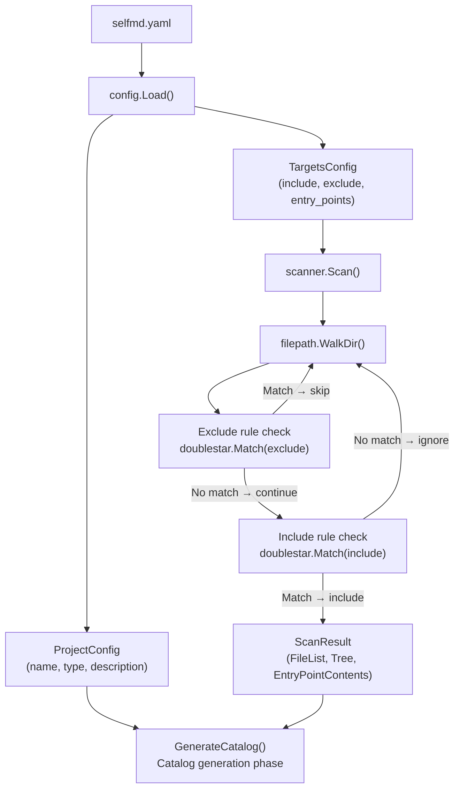
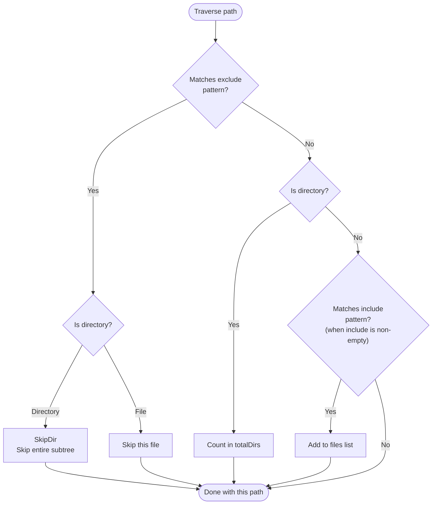

# Project and Scan Target Configuration

The `project` and `targets` top-level sections in `selfmd.yaml` define the basic information and scan scope for the documentation target. These two configuration sections are the core basis for selfmd to understand "which files in which project" to generate documentation for.

## Overview

When selfmd executes the `generate` or `update` command, it first reads the configuration file, then delegates to the Scanner to traverse directories according to the `include` and `exclude` rules in `targets`, filtering out the source code files that need to be analyzed. The `project` section provides metadata such as the project name and type, serving as important context for Claude when generating documentation.

Key concepts:
- **Glob pattern**: A path-matching syntax using `**` wildcards to match multiple directory levels, implemented under the hood by the `doublestar` library.
- **Entry points**: Specific files that are read in full and passed entirely to Claude, typically program entry points such as `main.go` or `cmd/root.go`.
- **Exclude takes priority**: Exclude rules take precedence over include rules. If a path matches both, the exclusion wins.

The `selfmd init` command automatically detects the project type and generates a configuration file with sensible defaults. Users typically only need to fine-tune `include`/`exclude`.

## Architecture



## The `project` Section

The `project` section provides basic descriptive information about the current project. This information is injected directly into Claude's prompt to help the AI understand the project context.

```yaml
project:
  name: selfmd
  type: backend
  description: ""
```

### Field Reference

| Field | Type | Required | Default | Description |
|-------|------|----------|---------|-------------|
| `name` | string | No | Current directory name | Project name, displayed in document titles and the static browser |
| `type` | string | No | `backend` | Project type, hints to Claude about the documentation structure style |
| `description` | string | No | Empty string | Additional project description (optional) |

### Available `type` Values

The auto-detection logic in `selfmd init` determines the project type based on specific indicator files:

```go
checks := []struct {
    file       string
    pType      string
    entries    []string
}{
    {"go.mod", "backend", []string{"main.go", "cmd/root.go"}},
    {"Cargo.toml", "backend", []string{"src/main.rs", "src/lib.rs"}},
    {"package.json", "frontend", []string{"src/index.ts", "src/index.js", "src/main.ts", "src/App.tsx"}},
    {"pom.xml", "backend", []string{"src/main/java"}},
    {"build.gradle", "backend", []string{"src/main/java"}},
    {"requirements.txt", "backend", []string{"main.py", "app.py", "src/main.py"}},
    {"pyproject.toml", "backend", []string{"src/main.py", "main.py"}},
    {"composer.json", "backend", []string{"public/index.php", "src/Kernel.php"}},
    {"Gemfile", "backend", []string{"config/application.rb", "app/"}},
}
```

> Source: `cmd/init.go#L61-L75`

| `type` Value | Meaning |
|--------------|---------|
| `backend` | Backend services, APIs, CLI tools |
| `frontend` | Frontend applications (SPA, Web App) |
| `fullstack` | Full-stack projects containing both frontend and backend |
| `library` | Libraries or projects where no indicator file is detected |

If both `package.json` and `go.mod` (or a `server/` directory) exist simultaneously, the project is automatically classified as `fullstack`.

## The `targets` Section

The `targets` section controls which files the scanner should analyze, and is the most critical configuration affecting documentation coverage.

```yaml
targets:
  include:
    - src/**
    - pkg/**
    - cmd/**
    - internal/**
    - lib/**
    - app/**
  exclude:
    - vendor/**
    - node_modules/**
    - .git/**
    - .doc-build/**
    - "**/*.pb.go"
    - "**/generated/**"
    - dist/**
    - build/**
  entry_points:
    - main.go
    - cmd/root.go
```

### Field Reference

| Field | Type | Required | Default | Description |
|-------|------|----------|---------|-------------|
| `include` | []string | No | See below | Path patterns (glob) to scan; an empty array means all files are included |
| `exclude` | []string | No | See below | Path patterns (glob) to exclude; takes priority over include |
| `entry_points` | []string | No | `[]` | Paths to important files that are read in full and injected into the prompt |

### Default `include` Patterns

```go
Include: []string{"src/**", "pkg/**", "cmd/**", "internal/**", "lib/**", "app/**"},
```

> Source: `internal/config/config.go#L103`

### Default `exclude` Patterns

```go
Exclude: []string{
    "vendor/**", "node_modules/**", ".git/**", ".doc-build/**",
    "**/*.pb.go", "**/generated/**", "dist/**", "build/**",
},
```

> Source: `internal/config/config.go#L104-L108`

## Scan Rule Execution Order

When the scanner traverses directories, exclude rules take higher priority than include rules. When a directory is matched by an exclude rule during traversal, the entire subdirectory tree is skipped immediately (`filepath.SkipDir`), significantly improving performance.

```go
// check excludes
for _, pattern := range cfg.Targets.Exclude {
    matched, _ := doublestar.Match(pattern, rel)
    if matched {
        if d.IsDir() {
            return filepath.SkipDir
        }
        return nil
    }
}

// ...（directories themselves are not filtered by include rules）

// check includes
if len(cfg.Targets.Include) > 0 {
    included := false
    for _, pattern := range cfg.Targets.Include {
        matched, _ := doublestar.Match(pattern, rel)
        if matched {
            included = true
            break
        }
    }
    if !included {
        return nil
    }
}
```

> Source: `internal/scanner/scanner.go#L33-L61`

### Filtering Flow



## The Role of Entry Points

Files specified in `entry_points` are read after scanning is complete. Their full contents are formatted and injected into Claude's catalog generation prompt (`CatalogPromptData.EntryPoints`). This allows Claude to read the most core program logic directly when understanding the project structure.

```go
// read entry points
entryPointContents := make(map[string]string)
for _, ep := range cfg.Targets.EntryPoints {
    content := readFileIfExists(rootDir, ep)
    if content != "" {
        entryPointContents[ep] = content
    }
}
```

> Source: `internal/scanner/scanner.go#L83-L91`

Entry point files are truncated to 10,000 characters to avoid exceeding context limits, and are passed as Markdown code blocks:

```go
func (s *ScanResult) EntryPointsFormatted() string {
    if len(s.EntryPointContents) == 0 {
        return "(no entry points specified)"
    }

    var sb strings.Builder
    for path, content := range s.EntryPointContents {
        sb.WriteString("### " + path + "\n```\n")
        // truncate large files
        if len(content) > 10000 {
            content = content[:10000] + "\n... (truncated)"
        }
        sb.WriteString(content)
        sb.WriteString("\n```\n\n")
    }
    return sb.String()
}
```

> Source: `internal/scanner/scanner.go#L143-L160`

## Common Configuration Examples

### Go Backend Project (Default)

```yaml
project:
  name: my-service
  type: backend

targets:
  include:
    - cmd/**
    - internal/**
    - pkg/**
  exclude:
    - vendor/**
    - .doc-build/**
    - "**/*.pb.go"
  entry_points:
    - main.go
    - cmd/root.go
```

### Node.js Frontend Project

```yaml
project:
  name: my-frontend
  type: frontend

targets:
  include:
    - src/**
    - components/**
    - pages/**
  exclude:
    - node_modules/**
    - dist/**
    - "**/*.test.ts"
  entry_points:
    - src/main.ts
    - src/App.tsx
```

### Excluding Specific Directories and File Types

```yaml
targets:
  include:
    - src/**
  exclude:
    - src/vendor/**
    - "**/*.generated.go"
    - "**/testdata/**"
    - "**/*_test.go"
```

## Related Links

- [selfmd.yaml Structure Overview](../config-overview/index.md)
- [Output and Language Configuration](../output-language/index.md)
- [Claude CLI Integration Configuration](../claude-config/index.md)
- [Git Integration Configuration](../git-config/index.md)
- [Project Scanner](../../core-modules/scanner/index.md)
- [selfmd init Command](../../cli/cmd-init/index.md)

## Reference Files

| File Path | Description |
|-----------|-------------|
| `internal/config/config.go` | `Config`, `ProjectConfig`, `TargetsConfig` struct definitions, defaults, loading and validation logic |
| `internal/scanner/scanner.go` | `Scan()` implementation: directory traversal, include/exclude filtering, entry point reading |
| `internal/scanner/filetree.go` | `ScanResult`, `FileNode` struct definitions; `BuildTree()`, `RenderTree()` implementation |
| `cmd/init.go` | `init` command implementation; `detectProject()` auto-detection of project type and entry points |
| `internal/prompt/engine.go` | `CatalogPromptData` struct, showing how `ProjectType`, `EntryPoints`, and `FileTree` are injected into the prompt |
| `internal/generator/catalog_phase.go` | Catalog generation phase, showing how `ProjectConfig` and `ScanResult` are combined into a prompt |
| `internal/generator/pipeline.go` | Full pipeline flow, showing when and in what context `scanner.Scan()` is called |