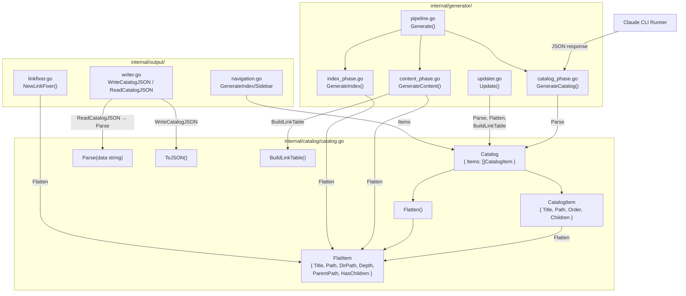
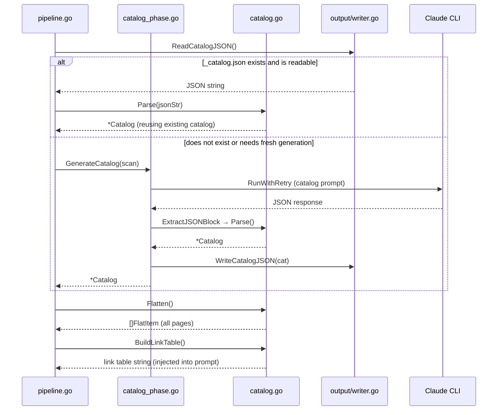
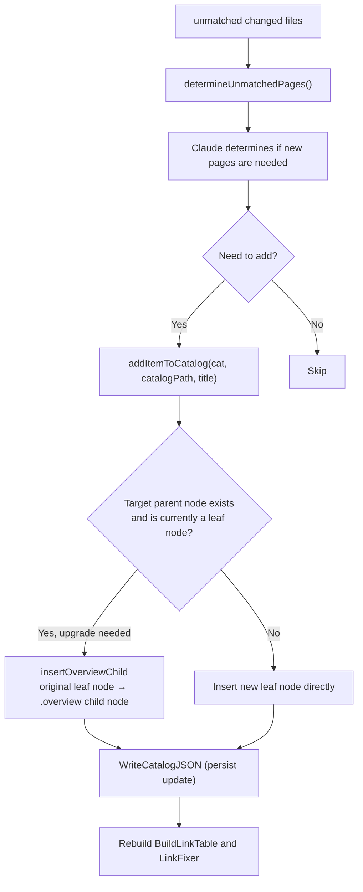

# Documentation Catalog Management

The `catalog` module is the core data structure layer of selfmd, responsible for defining, parsing, flattening, and serializing the full documentation tree, and providing a unified data access interface for downstream content generation, navigation output, and incremental updates.

## Overview

The documentation catalog (Catalog) is the backbone of selfmd's entire generation pipeline. It is generated once by Claude based on the project source code structure, persisted in JSON format in the output directory, and repeatedly read and used across all subsequent phases (content generation, navigation output, incremental updates).

Core concepts:

- **Catalog**: The root node of the catalog, holding a set of `CatalogItem` entries as top-level sections
- **CatalogItem**: A tree node that can recursively contain child nodes, representing a documentation section
- **FlatItem**: A flattened linear node containing full path information computed via depth-first traversal, used by downstream modules
- **dot-notation path**: e.g., `core-modules.authentication`, used as the unique identifier for a catalog entry
- **filesystem path**: e.g., `core-modules/authentication`, corresponding to the actual output directory structure

The catalog management module solves the full conversion chain from "tree structure → linear iterable list → filesystem directories", while being compatible with the two path formats returned by Claude (relative path Format A and full path with parent Format B).

## Architecture



## Data Structures

### Catalog and CatalogItem

```go
// Catalog represents the documentation catalog structure.
type Catalog struct {
	Items []CatalogItem `json:"items"`
}

// CatalogItem represents a single item in the catalog tree.
type CatalogItem struct {
	Title    string        `json:"title"`
	Path     string        `json:"path"`
	Order    int           `json:"order"`
	Children []CatalogItem `json:"children"`
}
```

> Source: `internal/catalog/catalog.go#L9-L20`

`CatalogItem.Path` stores either a **path segment relative to the parent node** (e.g., `authentication`) or a **full filesystem path** (e.g., `core-modules/authentication`), depending on the format returned by Claude. The `flattenItem` function normalizes both to dot-notation.

### FlatItem

```go
// FlatItem represents a flattened catalog item with computed paths.
type FlatItem struct {
	Title      string
	Path       string // dot-notation path, e.g., "core-modules.authentication"
	DirPath    string // filesystem path, e.g., "core-modules/authentication"
	Depth      int
	ParentPath string
	HasChildren bool
}
```

> Source: `internal/catalog/catalog.go#L22-L30`

`FlatItem` is the primary consumption interface for downstream modules. `DirPath` directly corresponds to the subdirectory structure under `.doc-build/`.

## Core Methods

### Parse — Parse JSON Catalog

```go
// Parse parses a JSON string into a Catalog.
func Parse(data string) (*Catalog, error) {
	var cat Catalog
	if err := json.Unmarshal([]byte(data), &cat); err != nil {
		return nil, fmt.Errorf("目錄 JSON 解析失敗: %w", err)
	}

	if len(cat.Items) == 0 {
		return nil, fmt.Errorf("目錄不可為空")
	}

	return &cat, nil
}
```

> Source: `internal/catalog/catalog.go#L32-L44`

`Parse` is the entry point for the catalog, called in two scenarios:
1. Immediately after `GenerateCatalog()` receives the JSON response from Claude
2. When `Generate()` in `pipeline.go` attempts to load an existing `_catalog.json`

### Flatten — Depth-First Flattening

```go
// Flatten returns all catalog items in depth-first order.
func (c *Catalog) Flatten() []FlatItem {
	var items []FlatItem
	for _, item := range c.Items {
		flattenItem(&items, item, "", 0)
	}
	return items
}
```

> Source: `internal/catalog/catalog.go#L46-L53`

`Flatten` traverses the entire tree in depth-first order (DFS), outputting a linear `[]FlatItem`. Its core logic is implemented recursively by `flattenItem`, compatible with both path formats:

```go
func flattenItem(items *[]FlatItem, item CatalogItem, parentPath string, depth int) {
	// Handle both formats:
	// Format A: child.Path = "introduction" (relative, needs parent prefix)
	// Format B: child.Path = "overview/introduction" (already includes parent)
	path := item.Path
	dirPath := strings.ReplaceAll(path, ".", "/")

	if parentPath != "" {
		parentDir := strings.ReplaceAll(parentPath, ".", "/")
		if !strings.HasPrefix(dirPath, parentDir+"/") {
			path = parentPath + "." + item.Path
			dirPath = strings.ReplaceAll(path, ".", "/")
		} else {
			path = strings.ReplaceAll(dirPath, "/", ".")
		}
	}
	// ...
}
```

> Source: `internal/catalog/catalog.go#L55-L87`

### BuildLinkTable — Build Prompt Link Table

```go
// BuildLinkTable returns a formatted string showing all catalog items
// and their corresponding directory paths, for use in prompts.
func (c *Catalog) BuildLinkTable() string {
	items := c.Flatten()
	var sb strings.Builder
	for _, item := range items {
		indent := strings.Repeat("  ", item.Depth)
		sb.WriteString(fmt.Sprintf("%s- 「%s」 → %s/index.md\n", indent, item.Title, item.DirPath))
	}
	return sb.String()
}
```

> Source: `internal/catalog/catalog.go#L103-L113`

The string produced by this method is embedded into the content.tmpl prompt, allowing Claude to correctly reference other pages' paths when writing the "Related Links" section of each page.

### ToJSON — Serialize to JSON

```go
// ToJSON serializes the catalog to indented JSON.
func (c *Catalog) ToJSON() (string, error) {
	data, err := json.MarshalIndent(c, "", "  ")
	if err != nil {
		return "", err
	}
	return string(data), nil
}
```

> Source: `internal/catalog/catalog.go#L89-L96`

`ToJSON` works together with `output.Writer.WriteCatalogJSON()` to persist the catalog to `.doc-build/_catalog.json` for subsequent incremental updates (`selfmd update`) to re-read.

## Core Flows

### Catalog Lifecycle



### Catalog Expansion During Incremental Updates

When `selfmd update` detects changed files not covered by existing documentation, it dynamically adds entries to the catalog:



> Source: `internal/generator/updater.go#L369-L430`

## Usage Examples

### Get All Pages in the Generator

```go
// In content_phase.go, get the linear list of the catalog and generate each page concurrently
items := cat.Flatten()
catalogTable := cat.BuildLinkTable()
linkFixer := output.NewLinkFixer(cat)

for _, item := range items {
    // Each item is a FlatItem; use item.DirPath directly to write files
    err := g.generateSinglePage(ctx, scan, item, catalogTable, linkFixer, "")
}
```

> Source: `internal/generator/content_phase.go#L22-L55`

### Persist Catalog with WriteCatalogJSON

```go
// In pipeline.go, persist the catalog immediately after generation
if err := g.Writer.WriteCatalogJSON(cat); err != nil {
    g.Logger.Warn("保存目錄 JSON 失敗", "error", err)
}
```

> Source: `internal/generator/pipeline.go#L124-L126`

### Read Existing Catalog (Incremental Update)

```go
// In updater.go, read the catalog from the previous generation
existingCatalogJSON, err := g.Writer.ReadCatalogJSON()
if err != nil {
    return fmt.Errorf("讀取現有目錄失敗（請先執行 selfmd generate）: %w", err)
}
cat, err := catalog.Parse(existingCatalogJSON)
```

> Source: `internal/generator/updater.go#L33-L40`

### BuildLinkTable Output Example

The string format produced by `BuildLinkTable()` looks like this (using this project's catalog as an example):

```
- 「概述」 → overview/index.md
  - 「專案介紹與功能特色」 → overview/introduction/index.md
  - 「技術棧與相依套件」 → overview/tech-stack/index.md
- 「核心模組」 → core-modules/index.md
  - 「文件目錄管理」 → core-modules/catalog/index.md
```

> Source: `internal/catalog/catalog.go#L103-L113`

## Related Links

- [Documentation Generation Pipeline](../generator/index.md) — The complete usage flow of the catalog across the four-phase pipeline
- [Catalog Generation Phase](../generator/catalog-phase/index.md) — Detailed implementation of calling Claude to generate the initial catalog
- [Prompt Template Engine](../prompt-engine/index.md) — Rendering mechanism for `CatalogPromptData` and `catalog.tmpl`
- [Claude CLI Runner](../claude-runner/index.md) — Implementation details for `RunWithRetry` and `ExtractJSONBlock`
- [Incremental Updates](../incremental-update/index.md) — The dynamic catalog expansion flow of `addItemToCatalog`
- [Output Writer and Link Fixer](../output-writer/index.md) — Usage of `WriteCatalogJSON`, `ReadCatalogJSON`, and `LinkFixer`
- [Overall Flow and Four-Phase Pipeline](../../architecture/pipeline/index.md) — The role of the catalog in the overall architecture

## Reference Files

| File Path | Description |
|-----------|-------------|
| `internal/catalog/catalog.go` | Structure definitions for `Catalog`, `CatalogItem`, and `FlatItem`, plus core method implementations: `Parse`, `Flatten`, `ToJSON`, and `BuildLinkTable` |
| `internal/generator/catalog_phase.go` | `GenerateCatalog()`: calls Claude and parses the response using `catalog.Parse` |
| `internal/generator/pipeline.go` | Main four-phase pipeline flow, including catalog cache reading and persistence logic |
| `internal/generator/content_phase.go` | `GenerateContent()`: uses `cat.Flatten()` and `cat.BuildLinkTable()` to generate pages concurrently |
| `internal/generator/index_phase.go` | `GenerateIndex()`: uses `cat.Flatten()` to generate category index pages |
| `internal/generator/updater.go` | `Update()`, `addItemToCatalog()`: incremental update flow and dynamic catalog expansion |
| `internal/output/writer.go` | `WriteCatalogJSON()`, `ReadCatalogJSON()`: JSON persistence read/write for the catalog |
| `internal/output/navigation.go` | `GenerateIndex()`, `GenerateSidebar()`: uses `cat.Items` to generate navigation files |
| `internal/prompt/engine.go` | `CatalogPromptData` definition and `RenderCatalog()` rendering method |