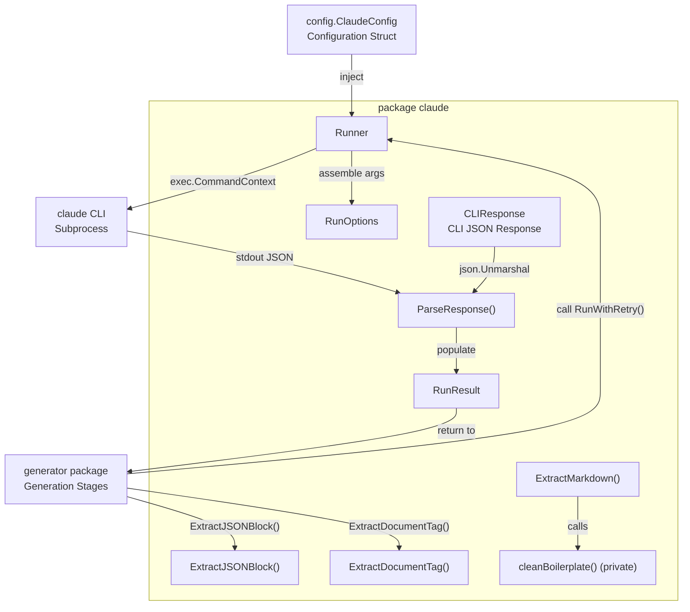
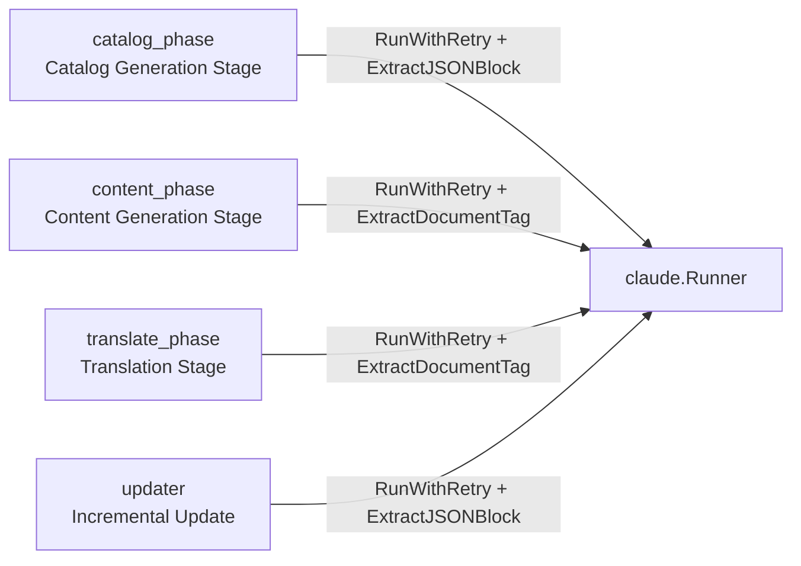

# Claude CLI Runner

The `claude` package encapsulates all calls to the Claude CLI subprocess, providing a unified execution interface, retry logic, timeout control, and response parsing.

## Overview

The Claude CLI Runner (`internal/claude`) is the sole entry point for selfmd's interaction with the AI model. It is responsible for:

- **Subprocess management**: Launches `claude -p --output-format json` subprocesses via `os/exec`, passing the prompt through stdin
- **Argument assembly**: Dynamically assembles CLI arguments based on `ClaudeConfig` and per-call `RunOptions`
- **Safety restrictions**: Explicitly disables Claude's `Write` and `Edit` tools to prevent subprocesses from modifying local files
- **Retry logic**: Automatically retries with linear backoff when a call fails or Claude itself reports an error
- **Response parsing**: Converts JSON-formatted CLI output into Go structs, and provides helper functions for extracting specific formats from Claude responses

All stages of the generation pipeline (`internal/generator`) share a single `Runner` instance, which is held and passed by the `Generator` struct.

## Architecture

### Module Structure



### Dependencies



## Core Types

### RunOptions — Execution Options

The set of parameters passed to each Claude CLI invocation:

```go
// RunOptions configures a single Claude CLI invocation.
type RunOptions struct {
	Prompt       string
	WorkDir      string        // CWD for the claude process
	AllowedTools []string      // tool restrictions
	Model        string        // model override
	Timeout      time.Duration // per-invocation timeout
	ExtraArgs    []string      // additional CLI arguments
}
```

> Source: internal/claude/types.go#L6-L13

| Field | Description |
|-------|-------------|
| `Prompt` | The full prompt text passed to Claude via stdin |
| `WorkDir` | Working directory for the subprocess, used by Claude to access project files |
| `AllowedTools` | Overrides `allowed_tools` from config; uses config value if empty |
| `Model` | Overrides `model` from config; uses config value if empty |
| `Timeout` | Overrides `timeout_seconds` from config; uses config value if zero |
| `ExtraArgs` | Additional CLI arguments appended after config's `extra_args` |

### RunResult — Execution Result

```go
// RunResult holds the parsed result from a Claude CLI invocation.
type RunResult struct {
	Content    string  // the text result from Claude
	IsError    bool    // whether Claude reported an error
	DurationMs int64   // execution time in milliseconds
	CostUSD    float64 // cost of this invocation
	SessionID  string  // Claude session ID
}
```

> Source: internal/claude/types.go#L16-L23

### CLIResponse — Raw CLI JSON Response

The JSON structure corresponding to the output of `claude -p --output-format json`:

```go
// CLIResponse represents the JSON response from `claude -p --output-format json`.
type CLIResponse struct {
	Type       string  `json:"type"`
	Subtype    string  `json:"subtype"`
	IsError    bool    `json:"is_error"`
	Result     string  `json:"result"`
	DurationMs int64   `json:"duration_ms"`
	TotalCost  float64 `json:"total_cost_usd"`
	SessionID  string  `json:"session_id"`
}
```

> Source: internal/claude/types.go#L25-L33

## Execution Methods

### Run() — Single Invocation

`Run()` executes a single Claude CLI call: assembles arguments, creates the subprocess, pipes the prompt, waits for the result, and parses the response:

```go
// Run executes a single Claude CLI invocation.
func (r *Runner) Run(ctx context.Context, opts RunOptions) (*RunResult, error) {
	// build command args
	args := []string{
		"-p",
		"--output-format", "json",
	}

	model := opts.Model
	if model == "" {
		model = r.config.Model
	}
	if model != "" {
		args = append(args, "--model", model)
	}

	// ...（tool list assembly omitted）

	// Explicitly block Write/Edit to prevent content from being lost in denied tool calls
	args = append(args, "--disallowedTools", "Write", "--disallowedTools", "Edit")

	// ...（timeout and subprocess creation omitted）

	// pipe prompt via stdin
	cmd.Stdin = strings.NewReader(opts.Prompt)
```

> Source: internal/claude/runner.go#L30-L75

**Argument assembly precedence:**

1. Fixed arguments: `-p`, `--output-format json`
2. Model: `opts.Model` > `config.Model` (omitted if both are empty)
3. AllowedTools: `opts.AllowedTools` > `config.AllowedTools`
4. Forced disallow: `--disallowedTools Write --disallowedTools Edit`
5. Extra arguments: `config.ExtraArgs` + `opts.ExtraArgs`

### RunWithRetry() — Invocation with Retry

`RunWithRetry()` wraps `Run()` with linear backoff retry. The number of retries is controlled by `config.MaxRetries`, with each retry waiting `attempt * 5` seconds:

```go
// RunWithRetry executes a Claude CLI invocation with retry logic.
func (r *Runner) RunWithRetry(ctx context.Context, opts RunOptions) (*RunResult, error) {
	maxRetries := r.config.MaxRetries
	var lastErr error

	for attempt := 0; attempt <= maxRetries; attempt++ {
		if attempt > 0 {
			backoff := time.Duration(attempt) * 5 * time.Second
			r.logger.Info("重試中", "attempt", attempt+1, "backoff", backoff)
			select {
			case <-ctx.Done():
				return nil, ctx.Err()
			case <-time.After(backoff):
			}
		}

		result, err := r.Run(ctx, opts)
		if err == nil && !result.IsError {
			return result, nil
		}
		// ...
	}
	return nil, fmt.Errorf("所有 %d 次嘗試均失敗: %w", maxRetries+1, lastErr)
}
```

> Source: internal/claude/runner.go#L113-L143

**Failure conditions (any one triggers a retry):**
- `Run()` returns `err != nil` (subprocess error, timeout, etc.)
- `result.IsError == true` (Claude itself reported an error)

### CheckAvailable() — Environment Check

```go
// CheckAvailable verifies that the claude CLI is installed and accessible.
func CheckAvailable() error {
	_, err := exec.LookPath("claude")
	if err != nil {
		return fmt.Errorf("找不到 claude CLI。請先安裝 Claude Code：https://docs.anthropic.com/en/docs/claude-code")
	}
	return nil
}
```

> Source: internal/claude/runner.go#L146-L152

## Response Parsing Functions

`parser.go` provides four public functions used by each stage of the generation pipeline to extract content in the required format from Claude responses.

### ParseResponse() — Parse CLI JSON

Converts the raw JSON output of `claude -p --output-format json` into a `RunResult`:

```go
func ParseResponse(data []byte) (*RunResult, error) {
	var resp CLIResponse
	if err := json.Unmarshal(data, &resp); err != nil {
		return nil, fmt.Errorf("JSON 解析失敗: %w", err)
	}

	return &RunResult{
		Content:    resp.Result,
		IsError:    resp.IsError,
		DurationMs: resp.DurationMs,
		CostUSD:    resp.TotalCost,
		SessionID:  resp.SessionID,
	}, nil
}
```

> Source: internal/claude/parser.go#L11-L24

### ExtractJSONBlock() — Extract JSON Block

Extracts the first JSON object from Claude's Markdown response, attempting three strategies in order:

```go
func ExtractJSONBlock(text string) (string, error) {
	// try fenced code block first
	re := regexp.MustCompile("(?s)```json\\s*\n(.*?)```")
	// ...
	// try without language tag
	re = regexp.MustCompile("(?s)```\\s*\n(\\{.*?\\})\\s*```")
	// ...
	// try to find raw JSON object
	start := strings.Index(text, "{")
	// ...
}
```

> Source: internal/claude/parser.go#L28-L61

**Three-stage extraction strategy:**
1. ` ```json ... ``` ` fenced code block
2. ` ``` ... ``` ` fenced block without language tag (containing a JSON object)
3. Find a `{...}` matched JSON object directly in raw text

**Usage**: `catalog_phase` (catalog generation) and `updater` (incremental update decision) call this function to parse JSON results returned by Claude.

### ExtractDocumentTag() — Extract `<document>` Tag

Extracts `<document>...` from Claude responses.