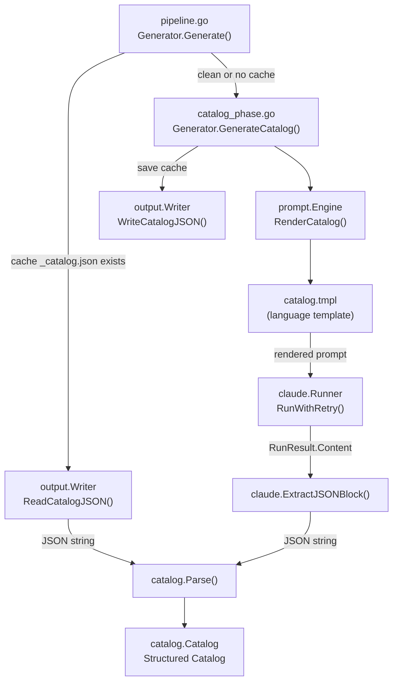
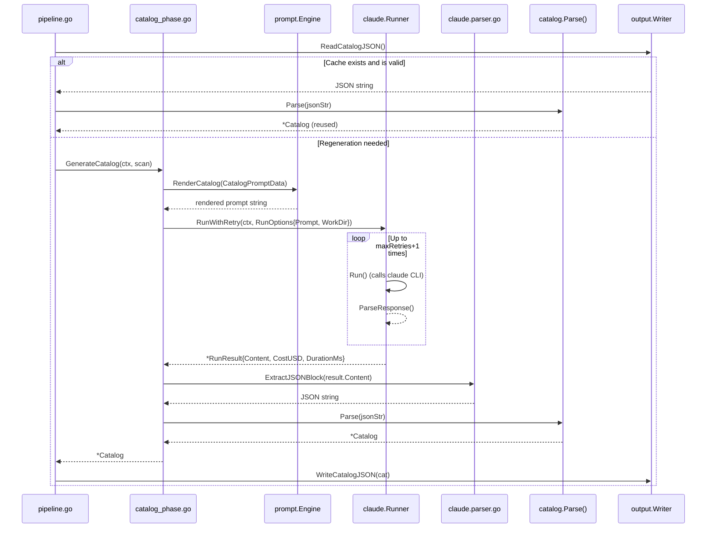

# Catalog Generation Phase

The Catalog Generation Phase is the second stage of the entire documentation generation pipeline. It is responsible for analyzing the project structure via the Claude CLI and automatically generating a structured documentation catalog tree.

## Overview

In selfmd's four-stage pipeline, the Catalog Generation Phase (Pipeline Stage 2) plays a central hub role: it receives project structure data from the scanner, assembles prompts via the Prompt Template Engine, calls the Claude CLI for AI analysis, and ultimately outputs a structured `Catalog` object for use by the subsequent content page generation phase.

Key design decisions for this phase include:

- **AI-driven**: Lets Claude understand code semantics rather than simply analyzing file structure, producing a catalog that better reflects business logic
- **Cache reuse**: If `_catalog.json` already exists in the output directory, it is loaded directly and this phase is skipped, saving API costs
- **Retry mechanism**: Uses `RunWithRetry` to handle transient Claude CLI failures
- **Structured output**: Forces Claude to output JSON format, then parses it into a strongly-typed `Catalog` structure

## Architecture



## Entry Method

`GenerateCatalog` is defined in `internal/generator/catalog_phase.go` and is the only public method of this phase:

```go
func (g *Generator) GenerateCatalog(ctx context.Context, scan *scanner.ScanResult) (*catalog.Catalog, error) {
	langName := config.GetLangNativeName(g.Config.Output.Language)
	data := prompt.CatalogPromptData{
		RepositoryName:       g.Config.Project.Name,
		ProjectType:          g.Config.Project.Type,
		Language:             g.Config.Output.Language,
		LanguageName:         langName,
		LanguageOverride:     g.Config.Output.NeedsLanguageOverride(),
		LanguageOverrideName: langName,
		KeyFiles:             scan.KeyFiles(),
		EntryPoints:          scan.EntryPointsFormatted(),
		FileTree:             scanner.RenderTree(scan.Tree, 4),
		ReadmeContent:        scan.ReadmeContent,
	}

	rendered, err := g.Engine.RenderCatalog(data)
	if err != nil {
		return nil, err
	}
	// ...
}
```

> Source: internal/generator/catalog_phase.go#L16-L34

### CatalogPromptData Field Descriptions

The `prompt.CatalogPromptData` struct aggregates all context data used to drive Claude's analysis:

| Field | Source | Description |
|------|------|------|
| `RepositoryName` | `config.Project.Name` | Project name |
| `ProjectType` | `config.Project.Type` | Project type (e.g., `go-cli`) |
| `Language` | `config.Output.Language` | Target output language code (e.g., `zh-TW`) |
| `LanguageName` | `GetLangNativeName()` | Native name of the language (e.g., "Traditional Chinese") |
| `LanguageOverride` | `Output.NeedsLanguageOverride()` | Whether the template language differs from the output language |
| `KeyFiles` | `scan.KeyFiles()` | List of important files (main.go, go.mod, etc.) |
| `EntryPoints` | `scan.EntryPointsFormatted()` | Formatted content of entry point files |
| `FileTree` | `scanner.RenderTree(scan.Tree, 4)` | File tree text limited to 4 levels deep |
| `ReadmeContent` | `scan.ReadmeContent` | README content (up to 50,000 characters) |

> Source: internal/prompt/engine.go#L39-L51

## Cache Reuse Mechanism

In the `Generate()` method of `pipeline.go`, catalog generation includes smart cache logic:

```go
var cat *catalog.Catalog
if !clean {
	// Try to reuse existing catalog
	catJSON, readErr := g.Writer.ReadCatalogJSON()
	if readErr == nil {
		cat, err = catalog.Parse(catJSON)
	}
	if cat != nil {
		items := cat.Flatten()
		fmt.Printf(ui.T("[2/4] 載入已存目錄（%d 個章節，%d 個項目）\n", ...), len(cat.Items), len(items))
	}
}
if cat == nil {
	fmt.Println(ui.T("[2/4] 產生文件目錄...", ...))
	cat, err = g.GenerateCatalog(ctx, scan)
	// ...
	if err := g.Writer.WriteCatalogJSON(cat); err != nil {
		g.Logger.Warn(...)
	}
}
```

> Source: internal/generator/pipeline.go#L103-L128

The cache is stored as a `_catalog.json` file in the output directory (`.doc-build/`). Claude will be called again to regenerate the catalog in the following situations:

- The user specifies the `--clean` flag
- The configuration has `output.clean_before_generate: true`
- The `_catalog.json` file does not exist or cannot be read
- The `_catalog.json` file fails to parse

## Core Flow



## Catalog Data Structure

Claude must output the catalog in JSON format, which is then parsed by `catalog.Parse()` into a strongly-typed structure:

```go
// Catalog represents the documentation catalog structure.
type Catalog struct {
	Items []CatalogItem `json:"items"`
}

// CatalogItem represents a single item in the catalog tree.
type CatalogItem struct {
	Title    string        `json:"title"`
	Path     string        `json:"path"`
	Order    int           `json:"order"`
	Children []CatalogItem `json:"children"`
}
```

> Source: internal/catalog/catalog.go#L9-L20

Example of the raw JSON format output by Claude:

```json
{
  "items": [
    {
      "title": "Overview",
      "path": "overview",
      "order": 0,
      "children": [
        {
          "title": "Project Introduction and Features",
          "path": "introduction",
          "order": 0,
          "children": []
        }
      ]
    }
  ]
}
```

## JSON Extraction Logic

Claude's response may contain explanatory text in Markdown format. `ExtractJSONBlock` uses a three-stage fallback strategy to extract JSON from it:

```go
func ExtractJSONBlock(text string) (string, error) {
	// Strategy 1: Find ```json ... ``` fenced code blocks
	re := regexp.MustCompile("(?s)```json\\s*\n(.*?)```")
	matches := re.FindStringSubmatch(text)
	if len(matches) > 1 {
		return strings.TrimSpace(matches[1]), nil
	}

	// Strategy 2: Find ``` ... ``` fenced blocks without a language tag
	re = regexp.MustCompile("(?s)```\\s*\n(\\{.*?\\})\\s*```")
	// ...

	// Strategy 3: Find raw JSON objects in plain text (bracket-balance scan)
	start := strings.Index(text, "{")
	// ...
}
```

> Source: internal/claude/parser.go#L26-L61

## Statistics Tracking

After each successful Claude call, the cost is accumulated into `Generator.TotalCost`:

```go
g.TotalCost += result.CostUSD
fmt.Printf(ui.T(" 完成（%.1fs，$%.4f）\n", " Done (%.1fs, $%.4f)\n"),
    float64(result.DurationMs)/1000, result.CostUSD)
```

> Source: internal/generator/catalog_phase.go#L47-L48

## Prompt Template

The prompt template used for catalog generation is located at `internal/prompt/templates/<lang>/catalog.tmpl`. The template instructs Claude to:

1. Use tools (Glob, Read, Grep) to actually explore the project source code
2. Design the catalog based on business functionality rather than file structure
3. Output only a single ` ```json ` code block with no additional explanatory text

> Source: internal/prompt/templates/zh-TW/catalog.tmpl#L1-L121

## Related Links

- [Documentation Generation Pipeline](../index.md) — Understand this phase's full position in the four-stage pipeline
- [Content Page Generation Phase](../content-phase/index.md) — The next phase that receives the Catalog output from this phase
- [Documentation Catalog Management](../../catalog/index.md) — Detailed explanation of `Catalog`, `CatalogItem`, and `FlatItem` data structures
- [Prompt Template Engine](../../prompt-engine/index.md) — `Engine.RenderCatalog()` and the template system
- [Claude CLI Runner](../../claude-runner/index.md) — Detailed explanation of `Runner.RunWithRetry()` retry mechanism
- [Project Scanner](../../scanner/index.md) — The `ScanResult` that provides input data for this phase
- [Overall Flow and Four-Stage Pipeline](../../../architecture/pipeline/index.md) — System architecture overview

## Reference Files

| File Path | Description |
|----------|------|
| `internal/generator/catalog_phase.go` | Main implementation of `GenerateCatalog()` |
| `internal/generator/pipeline.go` | Pipeline orchestration, cache reuse logic, and cost tracking |
| `internal/catalog/catalog.go` | `Catalog`, `CatalogItem`, `FlatItem` data structures and parsing logic |
| `internal/prompt/engine.go` | `CatalogPromptData` definition and `RenderCatalog()` |
| `internal/prompt/templates/zh-TW/catalog.tmpl` | Traditional Chinese catalog generation prompt template |
| `internal/claude/runner.go` | `Runner.Run()` and `RunWithRetry()` implementation |
| `internal/claude/types.go` | `RunOptions`, `RunResult`, `CLIResponse` struct definitions |
| `internal/claude/parser.go` | `ExtractJSONBlock()` JSON extraction logic |
| `internal/scanner/scanner.go` | `ScanResult.KeyFiles()` and `EntryPointsFormatted()` |
| `internal/output/writer.go` | `WriteCatalogJSON()` and `ReadCatalogJSON()` cache operations |