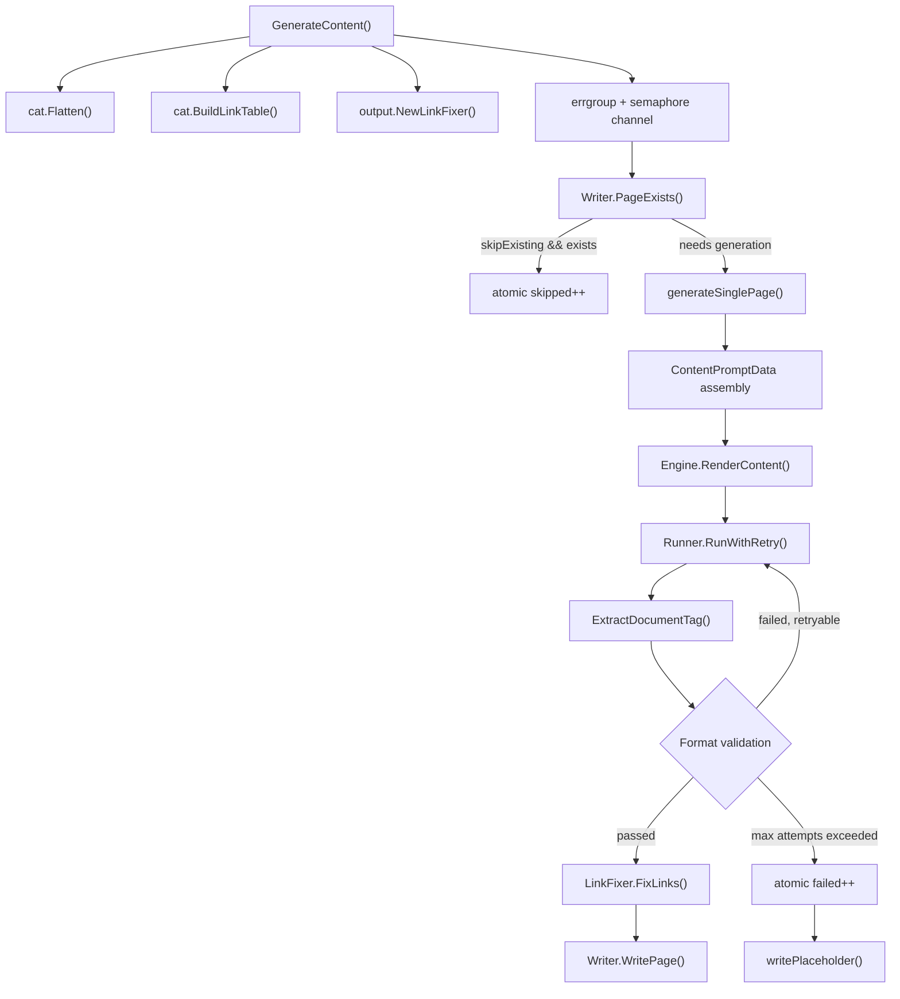
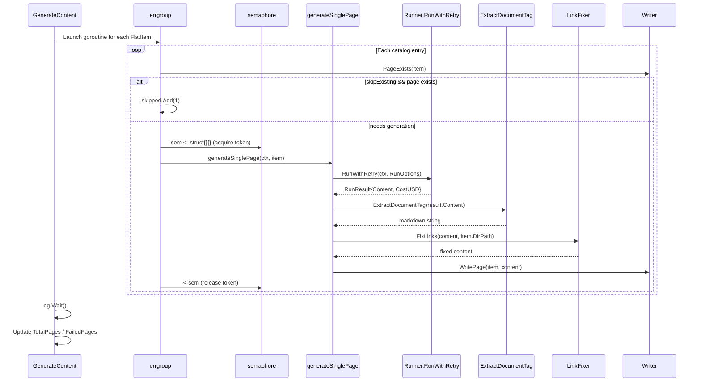

# Content Page Generation Phase

The content page generation phase (Phase 3) is the core of the selfmd four-stage pipeline, responsible for converting each entry in the catalog into a complete Markdown document page in parallel.

## Overview

Once the Catalog is built, the content generation phase takes over, calling the Claude CLI for each `FlatItem` (flattened catalog entry) in the catalog, requesting it to generate the corresponding documentation based on the project source code.

The primary responsibilities of this phase include:

- **Concurrency control**: Configurable parallelism via `errgroup` and semaphore to protect system resources
- **Skip existing pages**: In non-clean mode, pages that already exist and are valid will be skipped to save API costs
- **Retry and format validation**: Ensures Claude output meets format requirements (must have `<document>` tags and contain a Markdown heading)
- **Link fix post-processing**: Automatically repairs relative path links within pages after generation
- **Failure degradation**: Writes a placeholder page when page generation fails, without interrupting the overall process

The core implementation is in `internal/generator/content_phase.go`, with the main entry point being `Generator.GenerateContent()`.

## Architecture



## Key Components and Data Structures

### Generator Struct

`Generator` is the coordinator of the entire pipeline, defined in `pipeline.go`:

```go
type Generator struct {
    Config  *config.Config
    Runner  *claude.Runner
    Engine  *prompt.Engine
    Writer  *output.Writer
    Logger  *slog.Logger
    RootDir string

    TotalCost   float64
    TotalPages  int
    FailedPages int
}
```

> Source: internal/generator/pipeline.go#L19-L31

### ContentPromptData Data Model

`generateSinglePage()` assembles the following prompt data structure for each page:

```go
data := prompt.ContentPromptData{
    RepositoryName:       g.Config.Project.Name,
    Language:             g.Config.Output.Language,
    LanguageName:         langName,
    LanguageOverride:     g.Config.Output.NeedsLanguageOverride(),
    LanguageOverrideName: langName,
    CatalogPath:          item.Path,
    CatalogTitle:         item.Title,
    CatalogDirPath:       item.DirPath,
    ProjectDir:           g.RootDir,
    FileTree:             scanner.RenderTree(scan.Tree, 3),
    CatalogTable:         catalogTable,
    ExistingContent:      existingContent,
}
```

> Source: internal/generator/content_phase.go#L91-L104

`ExistingContent` is an empty string during fresh generation; in incremental update scenarios (`updater.go`), it is populated with the existing page content so Claude can modify rather than fully rewrite it.

## Core Flow

### Parallel Generation Flow



### Concurrency Control

Concurrency is implemented via a semaphore channel, with the size determined by `claude.max_concurrent` in the config file (overridable via the CLI `--concurrency` flag):

```go
sem := make(chan struct{}, concurrency)

for _, item := range items {
    item := item
    eg.Go(func() error {
        // ...skipExisting check...

        sem <- struct{}{}
        defer func() { <-sem }()

        // execute generateSinglePage
    })
}
```

> Source: internal/generator/content_phase.go#L37-L73

### Format Validation and Retry Mechanism

`generateSinglePage()` has a built-in maximum of 2 attempts (`maxAttempts = 2`), retrying for two types of format errors:

```go
maxAttempts := 2
for attempt := 1; attempt <= maxAttempts; attempt++ {
    result, err := g.Runner.RunWithRetry(ctx, claude.RunOptions{...})

    // Attempt to extract content from <document> tags
    content, extractErr := claude.ExtractDocumentTag(result.Content)
    if extractErr != nil {
        if attempt < maxAttempts {
            fmt.Printf(" Format error, retrying...\n      ")
            continue
        }
        return lastErr
    }

    // Validate that a valid Markdown heading exists
    content = strings.TrimSpace(content)
    if content == "" || !strings.HasPrefix(content, "#") {
        if attempt < maxAttempts {
            fmt.Printf(" Invalid content, retrying...\n      ")
            continue
        }
        return lastErr
    }

    // Post-process and write
    content = linkFixer.FixLinks(content, item.DirPath)
    return g.Writer.WritePage(item, content)
}
```

> Source: internal/generator/content_phase.go#L111-L156

**Validation conditions:**
1. `claude.ExtractDocumentTag()` must be able to find `<document>...` in the response