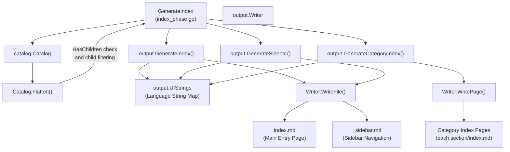
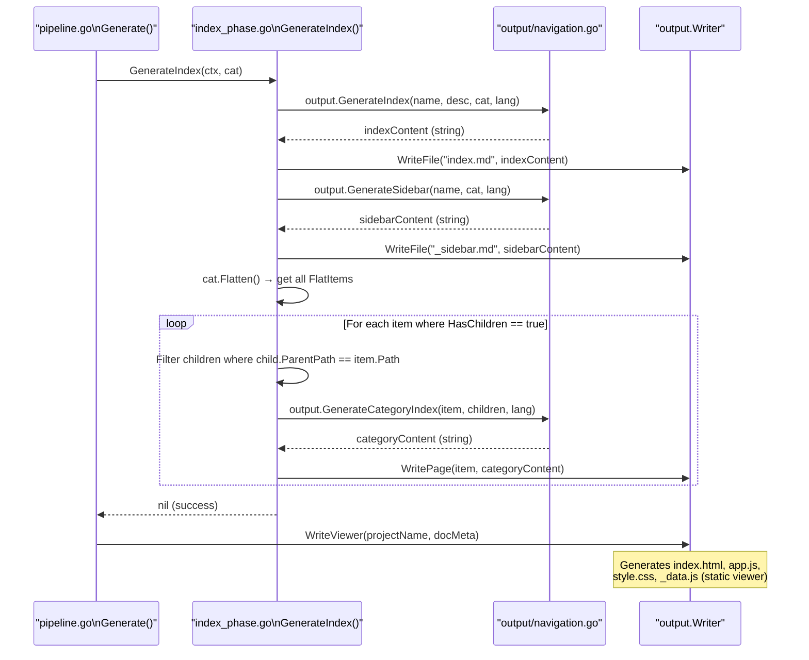

# Index and Navigation Generation Phase

The Index and Navigation Generation Phase (Index Phase) is the fourth stage of the overall documentation generation pipeline. It is responsible for automatically generating the main index page, sidebar navigation file, and sub-category index pages based on the established directory structure (`Catalog`), providing the documentation with a navigable skeleton.

## Overview

After the first three phases (scan, catalog generation, content generation) are complete, all document content has been written to the output directory, but a unified entry point and navigation structure is still missing. The core responsibilities of the Index and Navigation Generation Phase are:

- **Generate `index.md`**: The main entry page for the documentation, listing all sections in a tree-structured table of contents
- **Generate `_sidebar.md`**: A sidebar navigation file for use with static documentation browsers such as Docsify
- **Generate category index pages**: For all "parent nodes with children," generate independent category index pages (`<section>/index.md`) listing links to their direct child items

This phase operates entirely on the established `catalog.Catalog` structure and does not require calling the Claude CLI — it is purely local content generation. Multilingual support is implemented via a `UIStrings` string mapping table, currently supporting `zh-TW` and `en-US` interface languages.

## Architecture



## Output File Descriptions

### Main Index Page `index.md`

Generated by `output.GenerateIndex()`, it contains:

1. A top-level heading: `{Project Name} {techDocs language string}`
2. Project description (if configured)
3. A horizontal divider
4. A second-level heading "Table of Contents" (language-dependent)
5. All catalog items displayed as an indented nested list, each with a relative path link

```go
func GenerateIndex(projectName, projectDesc string, cat *catalog.Catalog, lang string) string {
	ui := getUIStrings(lang)
	var sb strings.Builder

	sb.WriteString(fmt.Sprintf("# %s %s\n\n", projectName, ui["techDocs"]))

	if projectDesc != "" {
		sb.WriteString(projectDesc + "\n\n")
	}

	sb.WriteString("---\n\n")
	sb.WriteString(fmt.Sprintf("## %s\n\n", ui["catalog"]))

	for _, item := range cat.Items {
		writeIndexItem(&sb, item, "", 0)
	}

	sb.WriteString("\n---\n\n")
	sb.WriteString(fmt.Sprintf("*%s*\n", ui["autoGenerated"]))

	return sb.String()
}
```

> Source: internal/output/navigation.go#L38-L59

Each catalog item link is built recursively by `writeIndexItem`, using the `resolveDirPath` function to handle both Format A (relative path) and Format B (already includes parent path):

```go
func writeIndexItem(sb *strings.Builder, item catalog.CatalogItem, parentDir string, depth int) {
	indent := strings.Repeat("  ", depth)
	dirPath := resolveDirPath(item.Path, parentDir)

	link := fmt.Sprintf("./%s/index.md", dirPath)
	sb.WriteString(fmt.Sprintf("%s- [%s](%s)\n", indent, item.Title, link))

	for _, child := range item.Children {
		writeIndexItem(sb, child, dirPath, depth+1)
	}
}
```

> Source: internal/output/navigation.go#L61-L71

---

### Sidebar Navigation `_sidebar.md`

Generated by `output.GenerateSidebar()`, the format is similar to the main index page, except:

- The heading is the plain project name (without an appended language string)
- A "Home" link (pointing to `./index.md`) is always inserted at the top

```go
func GenerateSidebar(projectName string, cat *catalog.Catalog, lang string) string {
	ui := getUIStrings(lang)
	var sb strings.Builder

	sb.WriteString(fmt.Sprintf("# %s\n\n", projectName))
	sb.WriteString(fmt.Sprintf("- [%s](./index.md)\n", ui["home"]))

	for _, item := range cat.Items {
		writeSidebarItem(&sb, item, "", 0)
	}

	return sb.String()
}
```

> Source: internal/output/navigation.go#L74-L86

---

### Category Index Pages

For all catalog items where `HasChildren == true`, `GenerateIndex` additionally generates a corresponding `<DirPath>/index.md` whose content is a link list of its **direct child items**.

The child filtering logic is implemented in `index_phase.go`:

```go
items := cat.Flatten()
for _, item := range items {
    if !item.HasChildren {
        continue
    }

    // find direct children
    var children []catalog.FlatItem
    for _, child := range items {
        if child.ParentPath == item.Path && child.Path != item.Path {
            children = append(children, child)
        }
    }

    if len(children) > 0 {
        categoryContent := output.GenerateCategoryIndex(item, children, lang)
        if err := g.Writer.WritePage(item, categoryContent); err != nil {
            g.Logger.Warn("failed to write category index", "path", item.Path, "error", err)
        }
    }
}
```

> Source: internal/generator/index_phase.go#L32-L52

`output.GenerateCategoryIndex` uses `computeRelativePath` (based on `filepath.Rel`) to calculate the correct relative path for each child item:

```go
func GenerateCategoryIndex(item catalog.FlatItem, children []catalog.FlatItem, lang string) string {
	ui := getUIStrings(lang)
	var sb strings.Builder

	sb.WriteString(fmt.Sprintf("# %s\n\n", item.Title))
	sb.WriteString(ui["sectionContains"] + "\n\n")

	for _, child := range children {
		relPath := computeRelativePath(item.DirPath, child.DirPath)
		sb.WriteString(fmt.Sprintf("- [%s](%s/index.md)\n", child.Title, relPath))
	}

	return sb.String()
}
```

> Source: internal/output/navigation.go#L101-L114

## Multilingual String Mapping

`navigation.go` defines the `UIStrings` mapping table, keyed by language code:

```go
var UIStrings = map[string]map[string]string{
	"zh-TW": {
		"techDocs":        "技術文件",
		"catalog":         "目錄",
		"home":            "首頁",
		"sectionContains": "本章節包含以下內容：",
		"autoGenerated":   "本文件由 [selfmd](https://github.com/monkenwu/selfmd) 自動產生",
	},
	"en-US": {
		"techDocs":        "Technical Documentation",
		"catalog":         "Table of Contents",
		"home":            "Home",
		"sectionContains": "This section contains the following:",
		"autoGenerated":   "This documentation was automatically generated by [selfmd](https://github.com/monkenwu/selfmd)",
	},
}
```

> Source: internal/output/navigation.go#L12-L27

The `getUIStrings` function automatically falls back to `en-US` when the requested language is not found:

```go
func getUIStrings(lang string) map[string]string {
	if s, ok := UIStrings[lang]; ok {
		return s
	}
	return UIStrings["en-US"]
}
```

> Source: internal/output/navigation.go#L30-L35

The language code is read from `g.Config.Output.Language` at the entry point of `GenerateIndex`:

```go
func (g *Generator) GenerateIndex(_ context.Context, cat *catalog.Catalog) error {
	lang := g.Config.Output.Language
	// ...
}
```

> Source: internal/generator/index_phase.go#L11-L12

## Core Flow



## Path Resolution Logic

### `resolveDirPath`

`resolveDirPath` in `navigation.go` handles two formats for catalog item paths:

- **Format A**: `item.Path` is a relative path (e.g., `"init"`), which needs to be joined with the parent path → outputs `"cli/init"`
- **Format B**: `item.Path` already contains the parent path prefix (e.g., `"cli/init"`), used directly

```go
func resolveDirPath(itemPath, parentDir string) string {
	if parentDir == "" {
		return itemPath
	}
	if strings.HasPrefix(itemPath, parentDir+"/") {
		return itemPath
	}
	return parentDir + "/" + itemPath
}
```

> Source: internal/output/navigation.go#L118-L126

### `computeRelativePath`

Links to child items in category index pages use `computeRelativePath` to compute relative paths, which internally relies on the standard library's `filepath.Rel`:

```go
func computeRelativePath(fromDir, toDir string) string {
	rel, err := filepath.Rel(fromDir, toDir)
	if err != nil {
		return "./" + toDir
	}
	return filepath.ToSlash(rel)
}
```

> Source: internal/output/navigation.go#L129-L135

## Position in the Pipeline

`GenerateIndex` is called by the `Generate()` method in `pipeline.go` as **Phase 4**, immediately after content page generation (Phase 3):

```go
// Phase 4: Generate Index & Navigation
fmt.Println("[4/4] Generating navigation and index...")
if err := g.GenerateIndex(ctx, cat); err != nil {
    return fmt.Errorf("failed to generate index: %w", err)
}
```

> Source: internal/generator/pipeline.go#L139-L143

After `GenerateIndex` completes, the pipeline continues by calling `g.Writer.WriteViewer()` to generate the static HTML viewer (`index.html`, `app.js`, `style.css`, `_data.js`). This is the responsibility of `output.Writer` and is outside the scope of `index_phase.go`.

## Related Links

- [Documentation Generation Pipeline](../index.md)
- [Catalog Generation Phase](../catalog-phase/index.md)
- [Content Page Generation Phase](../content-phase/index.md)
- [Translation Phase](../translate-phase/index.md)
- [Document Catalog Management](../../catalog/index.md)
- [Output Writing and Link Repair](../../output-writer/index.md)
- [Static Documentation Viewer](../../static-viewer/index.md)
- [Multilingual Support](../../../i18n/index.md)
- [Overall Flow and Four-Phase Pipeline](../../../architecture/pipeline/index.md)

## Reference Files

| File Path | Description |
|----------|------|
| `internal/generator/index_phase.go` | `GenerateIndex` main function, category index page filtering logic |
| `internal/generator/pipeline.go` | `Generator` struct definition, pipeline flow, Phase 4 call site |
| `internal/output/navigation.go` | `GenerateIndex`, `GenerateSidebar`, `GenerateCategoryIndex`, and path resolution helper functions |
| `internal/output/writer.go` | `Writer.WriteFile`, `Writer.WritePage`, `DocMeta`, `LangInfo` struct definitions |
| `internal/output/viewer.go` | `WriteViewer`, `bundleData`, static viewer asset generation |
| `internal/catalog/catalog.go` | `Catalog`, `CatalogItem`, `FlatItem` struct definitions, `Flatten()` method |