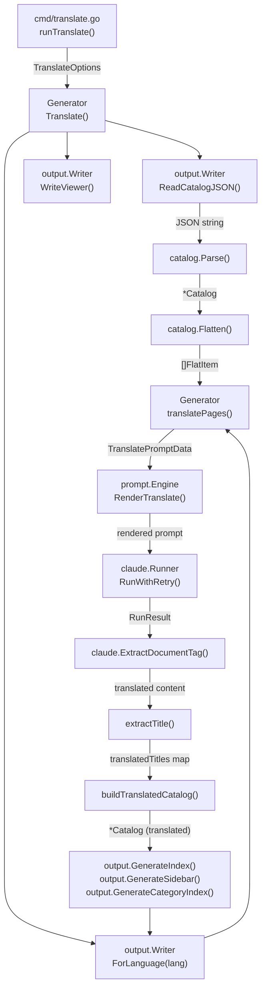
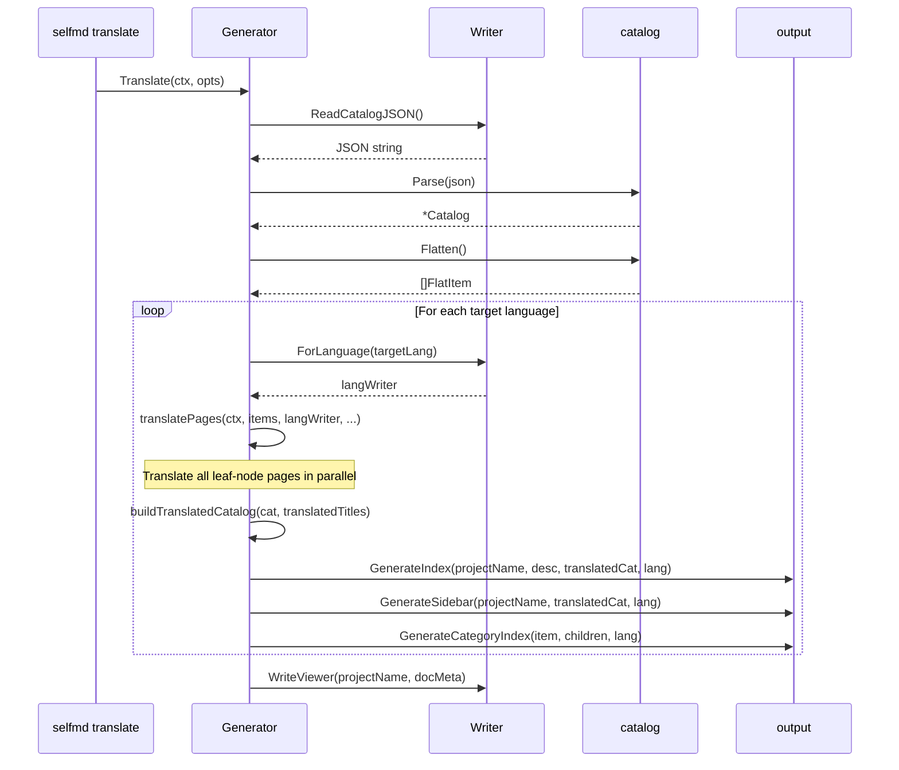

# Translation Phase

The translation phase is responsible for batch-translating documents generated in the primary language into the secondary languages defined in `selfmd.yaml` configuration, using the Claude CLI, and producing a complete navigation structure in the corresponding language subdirectories.

## Overview

The translation phase is a supplementary process independent of the four-phase document generation pipeline, triggered by the `selfmd translate` command. Its core design principles are:

- **Incremental translation**: Skips existing translated pages by default, only translating new or missing pages
- **Parallel processing**: Uses `errgroup` and a semaphore to control concurrency, accelerating translation of large documentation sets
- **Catalog rebuild**: Automatically rebuilds the translated language's document catalog after translation, keeping titles and catalog structure consistent
- **Leaf-node-only translation**: Category index pages (`HasChildren = true`) are generated automatically by the system and do not require Claude translation

Translation phase output is placed in the `.doc-build/{language-code}/` subdirectory, stored alongside the primary language output.

### Key Terms

| Term | Description |
|------|------|
| Source language | The language configured in `output.language` — the language of the original documents |
| Secondary languages | The list of target translation languages configured in `output.secondary_languages` |
| Leaf item | A terminal page in the catalog with no child items — an actual document content page |
| `langWriter` | An `output.Writer` pointing to a language subdirectory, created via `ForLanguage()` |

## Architecture



## Core Data Structures

### TranslateOptions

Configuration options for translation execution, passed in from the CLI command:

```go
type TranslateOptions struct {
    TargetLanguages []string
    Force           bool
    Concurrency     int
}
```

> Source: internal/generator/translate_phase.go#L21-L25

### TranslatePromptData

Data passed to the translation prompt template:

```go
type TranslatePromptData struct {
    SourceLanguage     string // e.g., "zh-TW"
    SourceLanguageName string // e.g., "繁體中文"
    TargetLanguage     string // e.g., "en-US"
    TargetLanguageName string // e.g., "English"
    SourceContent      string // the full markdown content to translate
}
```

> Source: internal/prompt/engine.go#L98-L104

## Core Flow

### Translate() — Main Flow



### translatePages() — Parallel Translation

`translatePages()` processes only leaf-node pages (`HasChildren == false`), using `errgroup` and a semaphore for concurrency control:

```go
eg, ctx := errgroup.WithContext(ctx)
sem := make(chan struct{}, opts.Concurrency)

for _, item := range leafItems {
    item := item
    eg.Go(func() error {
        // Skip if already translated and not forcing
        if !opts.Force && langWriter.PageExists(item) {
            skipped.Add(1)
            // ...
            return nil
        }

        sem <- struct{}{}
        defer func() { <-sem }()

        // Read source content
        sourceContent, err := g.Writer.ReadPage(item)
        // ...

        // Render translate prompt
        data := prompt.TranslatePromptData{ /* ... */ }
        rendered, err := g.Engine.RenderTranslate(data)

        // Call Claude
        result, err := g.Runner.RunWithRetry(ctx, claude.RunOptions{
            Prompt:  rendered,
            WorkDir: g.RootDir,
        })

        // Extract translated content
        content, err := claude.ExtractDocumentTag(result.Content)
        // ...

        // Write translated page
        langWriter.WritePage(item, content)
        return nil
    })
}
eg.Wait()
```

> Source: internal/generator/translate_phase.go#L150-L249

### Translation Skip Logic

When `--force` is not specified, a page is skipped if the corresponding translated file already exists in the target language directory. When skipping, the system still attempts to extract the title from the existing translation to ensure catalog completeness:

```go
if !opts.Force && langWriter.PageExists(item) {
    skipped.Add(1)
    // Try to extract title from existing translation
    if content, err := langWriter.ReadPage(item); err == nil {
        if title := extractTitle(content); title != "" {
            titlesMu.Lock()
            translatedTitles[item.Path] = title
            titlesMu.Unlock()
        }
    }
    fmt.Printf("      [skip] %s (already exists)\n", item.Title)
    return nil
}
```

> Source: internal/generator/translate_phase.go#L157-L169

## Translated Catalog Rebuild

After translation completes, the system rebuilds the translated language's `Catalog` using the collected translated titles (`translatedTitles` map), then uses this catalog to generate the navigation structure:

```go
// buildTranslatedCatalog creates a copy of the catalog with translated titles.
func buildTranslatedCatalog(original *catalog.Catalog, translatedTitles map[string]string) *catalog.Catalog {
    translated := &catalog.Catalog{
        Items: translateCatalogItems(original.Items, translatedTitles, ""),
    }
    return translated
}
```

> Source: internal/generator/translate_phase.go#L276-L282

`translateCatalogItems()` recursively traverses all catalog items. If a `dotPath` (e.g., `core-modules.scanner`) has a corresponding translated title in `translatedTitles`, the translated title is used:

```go
// Use translated title if available
if translatedTitle, ok := titles[dotPath]; ok {
    result[i].Title = translatedTitle
}
```

> Source: internal/generator/translate_phase.go#L298-L300

## Translation Prompt Template

Translation uses a shared template (`templates/translate.tmpl`) rather than language-specific subfolders, ensuring the translation command is language-agnostic:

```
You are a professional technical documentation translator. Your task is to translate
the following documentation page from {{.SourceLanguageName}} ({{.SourceLanguage}})
to {{.TargetLanguageName}} ({{.TargetLanguage}}).

## Translation Rules
1. Preserve all Markdown formatting
2. Do not translate code — code identifiers, file paths remain as-is
3. Translate section headings
4. Preserve relative links — only translate display text
5. Preserve Mermaid diagrams — translate labels but keep syntax correct
6. Preserve source annotations
7. Natural translation — produce fluent {{.TargetLanguageName}}
8. Preserve reference file tables — translate headers but keep paths
```

> Source: internal/prompt/templates/translate.tmpl#L1-L35

`Engine.RenderTranslate()` uses `renderShared()` rather than `render()`, so the template is executed from the shared `sharedTemplates` rather than language-specific `templates`:

```go
func (e *Engine) RenderTranslate(data TranslatePromptData) (string, error) {
    return e.renderShared("translate.tmpl", data)
}
```

> Source: internal/prompt/engine.go#L132-L134

## Output Structure

After translation, each secondary language's output is placed under `.doc-build/{lang}/`:

```
.doc-build/
├── index.md            # Primary language homepage
├── _sidebar.md         # Primary language sidebar
├── _catalog.json       # Primary language catalog JSON
├── en-US/              # Secondary language directory (example)
│   ├── index.md        # Translated homepage
│   ├── _sidebar.md     # Translated sidebar
│   ├── _catalog.json   # Translated catalog JSON (with translated titles)
│   └── {section}/
│       └── {page}/
│           └── index.md   # Translated page
└── index.html          # Browser entry point (contains all language data)
```

The `ForLanguage()` method creates a Writer pointing to the language subdirectory:

```go
func (w *Writer) ForLanguage(lang string) *Writer {
    return &Writer{
        BaseDir: filepath.Join(w.BaseDir, lang),
    }
}
```

> Source: internal/output/writer.go#L139-L143

## Localization of Navigation Components

The `index.md`, `_sidebar.md`, and category index pages generated after translation use language-specific UI strings provided by `output.UIStrings`:

```go
var UIStrings = map[string]map[string]string{
    "zh-TW": {
        "techDocs":        "技術文件",
        "sectionContains": "本章節包含以下內容：",
        // ...
    },
    "en-US": {
        "techDocs":        "Technical Documentation",
        "sectionContains": "This section contains the following:",
        // ...
    },
}
```

> Source: internal/output/navigation.go#L12-L27

## Title Extraction Helper

`extractTitle()` uses a regular expression to extract the first `#` heading from a Markdown document, used to collect translated page titles and rebuild the translated catalog:

```go
func extractTitle(content string) string {
    re := regexp.MustCompile(`(?m)^#\s+(.+)$`)
    match := re.FindStringSubmatch(content)
    if len(match) >= 2 {
        return strings.TrimSpace(match[1])
    }
    return ""
}
```

> Source: internal/generator/translate_phase.go#L267-L274

## CLI Usage Examples

The translation phase is triggered via the `selfmd translate` command:

```go
var translateCmd = &cobra.Command{
    Use:   "translate",
    Short: "Translate primary language documents into secondary languages",
    Long: `Using the generated primary language documents as the source, translate them
into the secondary languages defined in the configuration file.
Translation output is placed in .doc-build/{language-code}/ subdirectories.`,
    RunE: runTranslate,
}
```

> Source: cmd/translate.go#L24-L30

Available flags:

| Flag | Description |
|------|------|
| `--lang <code,...>` | Translate only the specified languages (default: all secondary languages) |
| `--force` | Force re-translation of existing files |
| `--concurrency <n>` | Concurrency level (overrides `max_concurrent` in the config file) |

**Prerequisite**: `selfmd generate` must be run first to generate primary language documents. The translation phase depends on `.doc-build/_catalog.json` and the original page content.

## Related Links

- [selfmd translate](../../../cli/cmd-translate/index.md)
- [Document Generation Pipeline](../index.md)
- [Index and Navigation Generation Phase](../index-phase/index.md)
- [Multilingual Support](../../../i18n/index.md)
- [Translation Workflow](../../../i18n/translation-workflow/index.md)
- [Supported Languages and Templates](../../../i18n/supported-languages/index.md)
- [Prompt Template Engine](../../prompt-engine/index.md)
- [Claude CLI Runner](../../claude-runner/index.md)
- [Output Writer and Link Fixing](../../output-writer/index.md)

## Reference Files

| File Path | Description |
|----------|------|
| `internal/generator/translate_phase.go` | Translation phase core implementation: `Translate()`, `translatePages()`, `buildTranslatedCatalog()`, `extractTitle()` |
| `internal/generator/pipeline.go` | `Generator` struct definition, `NewGenerator()`, `buildDocMeta()` |
| `internal/prompt/engine.go` | `TranslatePromptData` struct, `RenderTranslate()` method |
| `internal/prompt/templates/translate.tmpl` | Shared translation prompt template |
| `internal/output/writer.go` | `Writer`, `ForLanguage()`, `PageExists()`, `ReadPage()`, `WritePage()` |
| `internal/output/navigation.go` | `UIStrings`, `GenerateIndex()`, `GenerateSidebar()`, `GenerateCategoryIndex()` |
| `internal/catalog/catalog.go` | `Catalog`, `FlatItem`, `Flatten()`, `CatalogItem` |
| `internal/config/config.go` | `OutputConfig`, `GetLangNativeName()`, `KnownLanguages` |
| `cmd/translate.go` | `translate` CLI command implementation |