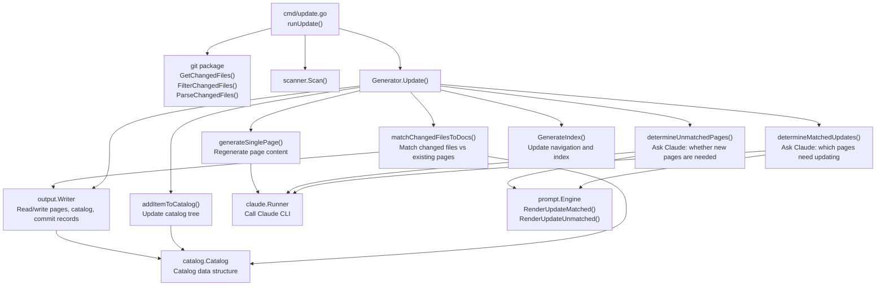
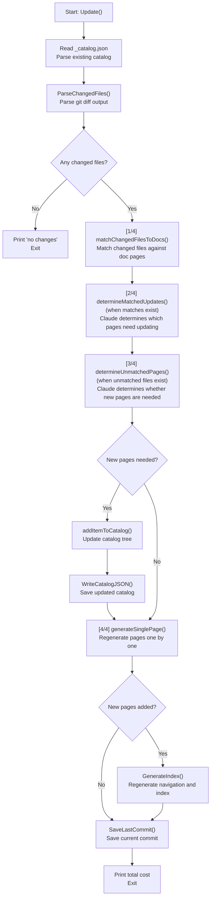
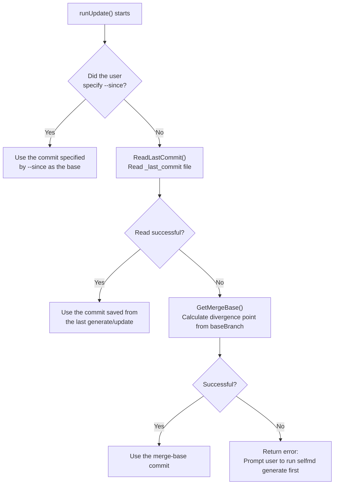

# Incremental Update

The Incremental Update module enables selfmd to regenerate only the affected documentation pages after git changes, avoiding the time-consuming full `generate` process every time and significantly reducing both time and API costs.

## Overview

The core idea behind incremental updates is: **only update pages that need updating**. When code changes occur, the system will:

1. Retrieve the list of changed source files from the git diff
2. Match which existing documentation pages reference those changed files (called "matches")
3. For new files that don't yet have corresponding documentation, determine whether new pages need to be created
4. Regenerate only the pages that actually need updating

The system tracks the last-updated commit by persisting a `_last_commit` file in the output directory, allowing each `selfmd update` run to precisely calculate what needs to be regenerated.

**Key Terms:**

| Term | Description |
|------|-------------|
| Matched pages (matched) | Existing documentation pages whose content contains paths of changed files |
| Unmatched files (unmatched) | Changed files not referenced by any documentation page |
| Leaf promotion | When an existing leaf node in the documentation tree needs to become a parent node, its original content is automatically moved to an `overview` child page |
| Base commit (previousCommit) | The starting commit used as the basis for diff comparison against the current HEAD |

## Architecture



## Data Structures

### Core Types

```go
// UpdateMatchedResult represents a page that Claude determined needs regeneration.
type UpdateMatchedResult struct {
	CatalogPath string `json:"catalogPath"`
	Title       string `json:"title"`
	Reason      string `json:"reason"`
}

// UpdateUnmatchedResult represents a new page that Claude determined should be created.
type UpdateUnmatchedResult struct {
	CatalogPath string `json:"catalogPath"`
	Title       string `json:"title"`
	Reason      string `json:"reason"`
}
```

> Source: internal/generator/updater.go#L17-L29

```go
// matchResult holds the mapping between changed files and the doc pages that reference them.
type matchResult struct {
	// changedFile is the source file path that changed
	changedFile string
	// pages are the doc pages that reference this file
	pages []catalog.FlatItem
}
```

> Source: internal/generator/updater.go#L168-L174

```go
// promotedLeaf records when a leaf node was promoted to a parent by adding an "overview" child.
type promotedLeaf struct {
	// OriginalPath is the dot-notation path of the original leaf (e.g. "core-modules.mcp-integration")
	OriginalPath string
	// OverviewPath is the dot-notation path of the new overview child (e.g. "core-modules.mcp-integration.overview")
	OverviewPath string
	// OriginalTitle is the title of the original leaf
	OriginalTitle string
}
```

> Source: internal/generator/updater.go#L359-L367

### Prompt Data Structures

Incremental update uses two prompt data structures, corresponding to the two Claude calls for "matched page determination" and "unmatched page determination":

```go
// UpdateMatchedPromptData holds data for deciding which existing pages need regeneration.
type UpdateMatchedPromptData struct {
	RepositoryName string
	Language       string
	ChangedFiles   string // list of changed source files
	AffectedPages  string // pages that reference these files (path + title + summary)
}

// UpdateUnmatchedPromptData holds data for deciding whether new pages are needed.
type UpdateUnmatchedPromptData struct {
	RepositoryName  string
	Language        string
	UnmatchedFiles  string // changed files not referenced in any existing doc
	ExistingCatalog string // existing catalog JSON
	CatalogTable    string // formatted link table of all pages
}
```

> Source: internal/prompt/engine.go#L80-L95

## Core Flow

### The Four Steps of Update()



### Matching Logic

`matchChangedFilesToDocs()` uses a **string search** strategy: it reads all documentation page contents at once, then checks whether each changed file's path appears in the text of any page.

```go
// For each changed file, find which pages reference it
for _, f := range files {
    var matchedPages []catalog.FlatItem
    for _, item := range items {
        content, ok := pageContents[item.Path]
        if !ok {
            continue
        }
        if strings.Contains(content, f.Path) {
            matchedPages = append(matchedPages, item)
        }
    }
    // ...
}
```

> Source: internal/generator/updater.go#L191-L213

### Leaf Promotion

When Claude decides to add a child page under an existing leaf node (e.g., adding `core-modules.scanner.advanced` under `core-modules.scanner`), the system automatically promotes the original leaf node to a parent node and moves its original content to an `overview` child page:

```go
if len(item.Children) == 0 {
    // This is a leaf node that needs to become a parent.
    // Add an "overview" child to preserve the original content.
    (*children)[i].Children = append((*children)[i].Children, catalog.CatalogItem{
        Title: item.Title,
        Path:  "overview",
        Order: 0,
    })
    *promoted = &promotedLeaf{
        OriginalPath:  currentDotPath,
        OverviewPath:  currentDotPath + ".overview",
        OriginalTitle: item.Title,
    }
}
```

> Source: internal/generator/updater.go#L402-L414

## Commit Tracking Mechanism

Incremental updates rely on a "base commit" (previousCommit) to calculate the git diff range. The system uses the following priority order:



> Source: cmd/update.go#L67-L81

After each successful `update` run, the system saves the current HEAD commit to the `_last_commit` file for use in the next incremental update:

```go
// Save current commit for next incremental update
if err := g.Writer.SaveLastCommit(currentCommit); err != nil {
    g.Logger.Warn("Failed to save commit record", "error", err)
}
```

> Source: internal/generator/updater.go#L159-L162

`_last_commit` is also written after `generate` completes, ensuring `update` can be used immediately after the first run:

```go
// Save current commit for incremental updates
if git.IsGitRepo(g.RootDir) {
    if commit, err := git.GetCurrentCommit(g.RootDir); err == nil {
        if err := g.Writer.SaveLastCommit(commit); err != nil {
            g.Logger.Warn("Failed to save commit record", "error", err)
        }
    }
}
```

> Source: internal/generator/pipeline.go#L157-L164

## Usage Examples

### Basic Incremental Update

```bash
# Automatically detect all changes since the last generate/update
selfmd update
```

### Specifying a Base Commit

```bash
# Compare against a specific commit
selfmd update --since abc1234

# Compare against a tag or branch
selfmd update --since v1.0.0
selfmd update --since main
```

> Source: cmd/update.go#L19-L31

### CLI Command Definition

```go
var updateCmd = &cobra.Command{
    Use:   "update",
    Short: "Incrementally update documentation based on git changes",
    Long: `Analyze git changes and incrementally update affected documentation pages.
Requires selfmd generate to have been run first to produce the initial documentation.`,
    RunE: runUpdate,
}

func init() {
    updateCmd.Flags().StringVar(&sinceCommit, "since", "", "Compare against the specified commit (defaults to the commit from the last generate/update)")
    rootCmd.AddCommand(updateCmd)
}
```

> Source: cmd/update.go#L21-L32

### Example Output

The system displays progress across four steps during execution:

```
Diff range: abc12345..def67890
Changed files:
M   internal/scanner/scanner.go
A   internal/scanner/filetree.go

[1/4] Searching for affected documentation pages...
      2 changed files matched to existing docs, 0 unmatched
[2/4] Calling Claude to determine which pages need updating...
      → Project Scanner: core logic in scanner.go has changed
      Done (1 page needs updating)
[3/4] All changed files already have corresponding docs, skipping
[4/4] Regenerating 1 page...
      [1/1] Project Scanner (core-modules.scanner)... Done (12.3s, $0.0024)

Update complete! Total cost: $0.0024 USD
```

## Prerequisites

Running `selfmd update` requires the following conditions to be met:

1. **Must be a git repository**: The system checks `git.IsGitRepo(rootDir)` at startup and returns an error immediately if not in a git repository
2. **Must have run `selfmd generate` first**: The system needs to read `_catalog.json` to understand the existing documentation structure; if the catalog doesn't exist, it will prompt you to run `generate` first
3. **Claude CLI must be available**: Same as `generate`, requires Claude CLI to be functioning properly

```go
if !git.IsGitRepo(rootDir) {
    return fmt.Errorf("current directory is not a git repository, cannot perform incremental update")
}
```

> Source: cmd/update.go#L49-L51

## Related Links

- [Git Diff Change Detection](../../git-integration/change-detection/index.md)
- [Affected Page Determination Logic](../../git-integration/affected-pages/index.md)
- [Documentation Catalog Management](../catalog/index.md)
- [Documentation Generation Pipeline](../generator/index.md)
- [Content Page Generation Phase](../generator/content-phase/index.md)
- [Prompt Template Engine](../prompt-engine/index.md)
- [selfmd update Command](../../cli/cmd-update/index.md)

## Reference Files

| File Path | Description |
|-----------|-------------|
| `internal/generator/updater.go` | Core incremental update logic: `Update()`, `matchChangedFilesToDocs()`, `determineMatchedUpdates()`, `determineUnmatchedPages()`, `addItemToCatalog()` |
| `internal/generator/pipeline.go` | `Generator` struct definition, full `Generate()` pipeline (including commit saving) |
| `internal/generator/content_phase.go` | `generateSinglePage()` implementation, reused by the updater to regenerate pages |
| `internal/git/git.go` | Git operation wrappers: `GetChangedFiles()`, `FilterChangedFiles()`, `ParseChangedFiles()`, `GetCurrentCommit()` |
| `internal/catalog/catalog.go` | `Catalog`, `CatalogItem`, `FlatItem` data structures and the `Flatten()` method |
| `internal/output/writer.go` | `ReadPage()`, `WritePage()`, `SaveLastCommit()`, `ReadLastCommit()`, `WriteCatalogJSON()` |
| `internal/prompt/engine.go` | `UpdateMatchedPromptData`, `UpdateUnmatchedPromptData` data structures and `RenderUpdateMatched()`, `RenderUpdateUnmatched()` |
| `cmd/update.go` | `selfmd update` command definition and `runUpdate()` execution logic |