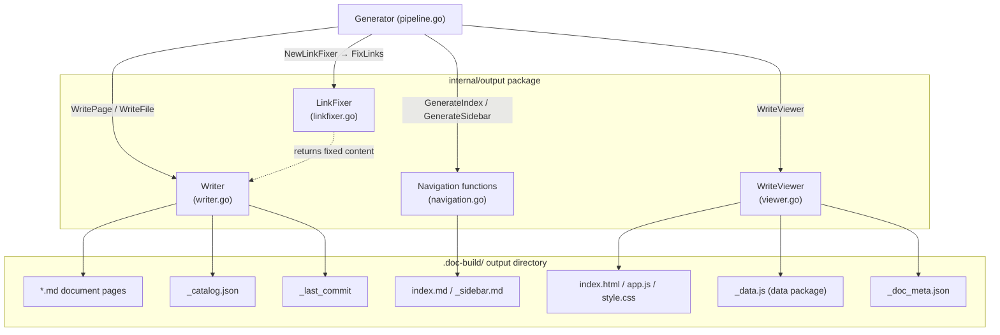
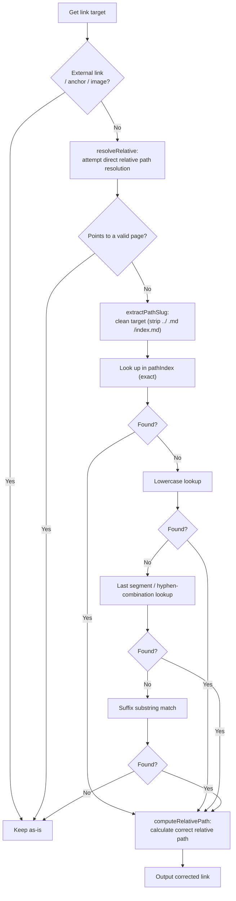
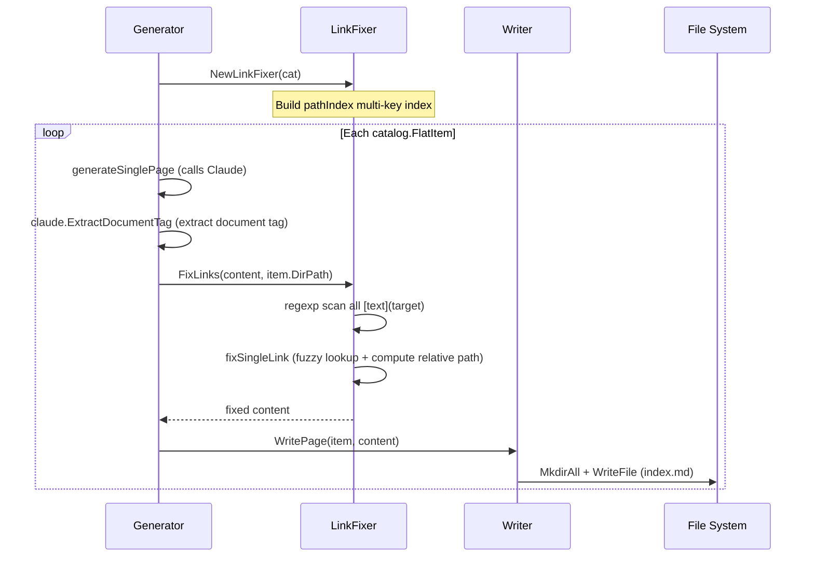
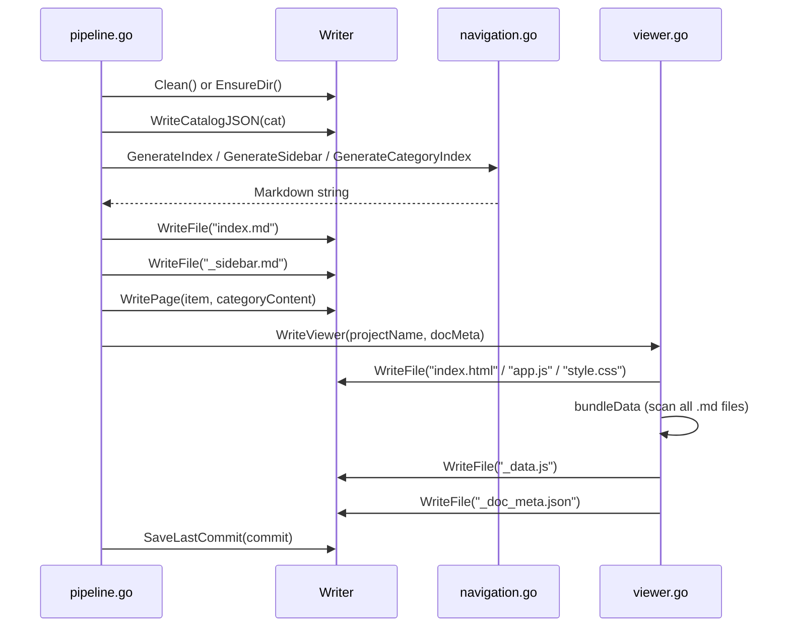

# Output Writing & Link Fixing

The `internal/output` package is responsible for writing generated Markdown files to disk, fixing relative links within documents, generating navigation structures, and bundling static browser assets.

## Overview

After the Claude CLI completes content generation, the system needs to persist results to the `.doc-build/` output directory and ensure that internal links between pages are valid and navigable. The `output` package consists of four cooperating components:

| Component | File | Responsibility |
|-----------|------|----------------|
| `Writer` | `writer.go` | Low-level file I/O, unified management of all write operations |
| `LinkFixer` | `linkfixer.go` | Detects and fixes broken relative links |
| Navigation functions | `navigation.go` | Generates `index.md`, `_sidebar.md`, and category index pages |
| `WriteViewer` | `viewer.go` | Bundles static HTML/JS/CSS and the `_data.js` data package |

Within the pipeline, the `output` package is invoked in both phase 3 (content page generation) and phase 4 (navigation and static browser generation).

## Architecture



## Writer — File Writer

`Writer` is the unified entry point for all disk operations. It holds the absolute path `BaseDir` of the output directory (defaulting to `.doc-build/`).

### Struct Definition

```go
// Writer handles writing documentation files to the output directory.
type Writer struct {
	BaseDir string // absolute path to .doc-build/
}

// NewWriter creates a new output writer.
func NewWriter(baseDir string) *Writer {
	return &Writer{BaseDir: baseDir}
}
```

> Source: internal/output/writer.go#L26-L33

### Core Methods

#### Directory & Lifecycle

```go
// Clean removes the output directory and recreates it.
func (w *Writer) Clean() error {
	if err := os.RemoveAll(w.BaseDir); err != nil {
		return fmt.Errorf("清除輸出目錄失敗: %w", err)
	}
	return os.MkdirAll(w.BaseDir, 0755)
}

// EnsureDir ensures the output directory exists.
func (w *Writer) EnsureDir() error {
	return os.MkdirAll(w.BaseDir, 0755)
}
```

> Source: internal/output/writer.go#L36-L46

#### Page Writing & Reading

```go
// WritePage writes a documentation page for a catalog item.
func (w *Writer) WritePage(item catalog.FlatItem, content string) error {
	dir := filepath.Join(w.BaseDir, item.DirPath)
	if err := os.MkdirAll(dir, 0755); err != nil {
		return fmt.Errorf("建立目錄 %s 失敗: %w", dir, err)
	}

	path := filepath.Join(dir, "index.md")
	if err := os.WriteFile(path, []byte(content), 0644); err != nil {
		return fmt.Errorf("寫入 %s 失敗: %w", path, err)
	}
	return nil
}
```

> Source: internal/output/writer.go#L48-L60

`WritePage` accepts a `catalog.FlatItem` (the flattened representation of a catalog entry) and automatically creates `index.md` under the corresponding `DirPath`.

#### Page Existence Check

```go
// PageExists checks if a documentation page exists and has valid content.
func (w *Writer) PageExists(item catalog.FlatItem) bool {
	path := filepath.Join(w.BaseDir, item.DirPath, "index.md")
	data, err := os.ReadFile(path)
	if err != nil {
		return false
	}
	content := strings.TrimSpace(string(data))
	if content == "" {
		return false
	}
	if strings.Contains(content, "此頁面產生失敗") {
		return false
	}
	return true
}
```

> Source: internal/output/writer.go#L95-L111

`PageExists` does more than check if a file exists — it also excludes blank pages and failed placeholder pages (those containing the failure marker), ensuring that incremental updates correctly identify which pages need to be regenerated.

#### Multi-Language Support

```go
// ForLanguage returns a new Writer that writes to a language-specific subdirectory.
func (w *Writer) ForLanguage(lang string) *Writer {
	return &Writer{
		BaseDir: filepath.Join(w.BaseDir, lang),
	}
}
```

> Source: internal/output/writer.go#L138-L143

Translated content for each language is written to a `.doc-build/{lang}/` subdirectory. `ForLanguage` creates a `Writer` instance pointing to that subdirectory.

#### Persistence Helper Files

| Method | File | Purpose |
|--------|------|---------|
| `WriteCatalogJSON` | `_catalog.json` | Saves the catalog structure for reuse during incremental updates |
| `ReadCatalogJSON` | `_catalog.json` | Reads back the catalog structure |
| `SaveLastCommit` | `_last_commit` | Saves the Git commit hash |
| `ReadLastCommit` | `_last_commit` | Reads the last commit for diff computation |

## LinkFixer — Link Fixer

`LinkFixer` validates and repairs all internal links in Markdown before content is written to disk, handling cases where Claude generates incorrectly formatted links (e.g., dot-notation, missing path segments).

### Initialization

```go
// LinkFixer validates and fixes relative links in generated markdown content.
type LinkFixer struct {
	allItems  []catalog.FlatItem
	dirPaths  map[string]bool   // set of all valid dirPaths
	pathIndex map[string]string // various lookup keys → dirPath
}

// NewLinkFixer creates a link fixer from a catalog.
func NewLinkFixer(cat *catalog.Catalog) *LinkFixer {
	items := cat.Flatten()
	dirPaths := make(map[string]bool)
	pathIndex := make(map[string]string)

	for _, item := range items {
		dirPaths[item.DirPath] = true

		// index by multiple keys for fuzzy matching
		pathIndex[item.DirPath] = item.DirPath
		pathIndex[item.Path] = item.DirPath                          // dot-notation
		pathIndex[strings.ReplaceAll(item.Path, ".", "/")] = item.DirPath // explicit slash conversion

		// index by last segment (e.g., "scanner" → "core-modules/scanner")
		parts := strings.Split(item.DirPath, "/")
		lastSeg := parts[len(parts)-1]
		if _, exists := pathIndex[lastSeg]; !exists {
			pathIndex[lastSeg] = item.DirPath
		}
	}

	return &LinkFixer{
		allItems:  items,
		dirPaths:  dirPaths,
		pathIndex: pathIndex,
	}
}
```

> Source: internal/output/linkfixer.go#L11-L48

`pathIndex` builds a multi-key index for flexible fuzzy lookup:
- `dirPath` (e.g., `core-modules/scanner`)
- `dot-notation path` (e.g., `core-modules.scanner`)
- last path segment (e.g., `scanner`)
- lowercase variants

### Link Fixing Flow

```go
// FixLinks scans markdown content for relative links and fixes broken ones.
func (lf *LinkFixer) FixLinks(content string, currentDirPath string) string {
	// match markdown links: [text](target)
	linkRe := regexp.MustCompile(`\[([^\]]+)\]\(([^)]+)\)`)

	return linkRe.ReplaceAllStringFunc(content, func(match string) string {
		// ...skip external links, anchors, images...
		fixed := lf.fixSingleLink(target, currentDirPath)
		if fixed != "" && fixed != target {
			return "[" + text + "](" + fixed + ")"
		}
		return match
	})
}
```

> Source: internal/output/linkfixer.go#L50-L82

The repair strategy proceeds in order:



### Relative Path Computation

```go
// computeRelativePath computes the relative path from one catalog item to another.
func (lf *LinkFixer) computeRelativePath(fromDirPath, toDirPath string) string {
	rel, err := filepath.Rel(fromDirPath, toDirPath)
	if err != nil {
		return ""
	}
	rel = filepath.ToSlash(rel)
	return rel + "/index.md"
}
```

> Source: internal/output/linkfixer.go#L174-L182

All fixed links are normalized to the `{relative-path}/index.md` format.

## Navigation — Navigation Generation

`navigation.go` provides three pure functions that generate the documentation's navigation structure with no external state dependencies.

### Multi-Language UI Strings

```go
var UIStrings = map[string]map[string]string{
	"zh-TW": {
		"techDocs":        "技術文件",
		"catalog":         "目錄",
		"home":            "首頁",
		"sectionContains": "本章節包含以下內容：",
		"autoGenerated":   "本文件由 [selfmd](https://github.com/monkenwu/selfmd) 自動產生",
	},
	"en-US": {
		"techDocs":        "Technical Documentation",
		// ...
	},
}
```

> Source: internal/output/navigation.go#L12-L27

### Three Navigation Generation Functions

| Function | Output Target | Description |
|----------|--------------|-------------|
| `GenerateIndex` | `index.md` | Home page listing the complete catalog with links |
| `GenerateSidebar` | `_sidebar.md` | Sidebar navigation for use by the static browser |
| `GenerateCategoryIndex` | `index.md` for each parent node | Category index page listing child sections |

```go
// GenerateIndex generates the main index.md landing page.
func GenerateIndex(projectName, projectDesc string, cat *catalog.Catalog, lang string) string {
	ui := getUIStrings(lang)
	var sb strings.Builder
	sb.WriteString(fmt.Sprintf("# %s %s\n\n", projectName, ui["techDocs"]))
	// ...
	for _, item := range cat.Items {
		writeIndexItem(&sb, item, "", 0)
	}
	// ...
}
```

> Source: internal/output/navigation.go#L37-L59

## WriteViewer — Static Browser Bundler

`viewer.go` uses Go's `//go:embed` directive to embed static browser assets directly into the binary, writing them out at generation time without requiring any external network resources.

### Embedded Assets

```go
//go:embed viewer/index.html
var viewerHTML string

//go:embed viewer/app.js
var viewerJS string

//go:embed viewer/style.css
var viewerCSS string
```

> Source: internal/output/viewer.go#L12-L19

### Data Bundling (`_data.js`)

```go
// bundleData walks the output directory, collects all .md files and _catalog.json,
// and writes them as a single _data.js file for client-side rendering.
func (w *Writer) bundleData(projectName string, docMeta *DocMeta) error {
	// ...
	// Build data object
	data := map[string]interface{}{
		"catalog": catalogObj,
		"pages":   pages,
	}
	// ...
	content := "window.DOC_DATA = " + string(jsonBytes) + ";\n"
	return w.WriteFile("_data.js", content)
}
```

> Source: internal/output/viewer.go#L61-L193

`_data.js` serializes all Markdown page content and the catalog structure as JSON, injected as the `window.DOC_DATA` global variable, allowing the browser-side `app.js` to render documentation without starting a server.

In multi-language mode, pages for secondary languages are also collected and placed under `data["languages"][langCode]`:

```go
languages := make(map[string]interface{})
for _, lang := range docMeta.AvailableLanguages {
    if lang.IsDefault {
        continue
    }
    // Read lang-specific catalog and pages from .doc-build/{lang}/
    langEntry["catalog"] = catObj
    langEntry["pages"] = langPages
    languages[lang.Code] = langEntry
}
```

> Source: internal/output/viewer.go#L135-L185

### DocMeta — Language Metadata

```go
// DocMeta holds metadata about the documentation build, including language info.
type DocMeta struct {
	DefaultLanguage    string     `json:"default_language"`
	AvailableLanguages []LangInfo `json:"available_languages"`
}

// LangInfo describes a single available language.
type LangInfo struct {
	Code       string `json:"code"`
	NativeName string `json:"native_name"`
	IsDefault  bool   `json:"is_default"`
}
```

> Source: internal/output/writer.go#L12-L23

## Core Flows

### Content Page Write Sequence



### Role in the Full Pipeline



## Usage Examples

### Writer Initialization (from Generator)

```go
absOutDir := cfg.Output.Dir
if absOutDir == "" {
    absOutDir = ".doc-build"
}

writer := output.NewWriter(absOutDir)
```

> Source: internal/generator/pipeline.go#L43-L48

### Using LinkFixer During Content Generation

```go
// Build the link fixer once for all pages
linkFixer := output.NewLinkFixer(cat)

// ...(after generating each page in parallel)

// Post-process: fix broken links
content = linkFixer.FixLinks(content, item.DirPath)

return g.Writer.WritePage(item, content)
```

> Source: internal/generator/content_phase.go#L29-L153

### Multi-Language Writer

```go
// ForLanguage returns a new Writer that writes to a language-specific subdirectory.
func (w *Writer) ForLanguage(lang string) *Writer {
    return &Writer{
        BaseDir: filepath.Join(w.BaseDir, lang),
    }
}
```

> Source: internal/output/writer.go#L138-L143

Calling `w.ForLanguage("en-US")` during the translation phase returns a Writer pointing to `.doc-build/en-US/`. Translated pages written through it are also collected by `bundleData` into `_data.js`.

## Related Links

- [Documentation Generation Pipeline](../generator/index.md) — How the pipeline calls `Writer` and `LinkFixer`
- [Content Page Generation Phase](../generator/content-phase/index.md) — When `LinkFixer.FixLinks` is used
- [Index & Navigation Generation Phase](../generator/index-phase/index.md) — Callers of the Navigation functions
- [Static Documentation Browser](../static-viewer/index.md) — Consumer of `_data.js`
- [Document Catalog Management](../catalog/index.md) — Definitions of `catalog.FlatItem` and `catalog.Catalog`
- [Incremental Updates](../incremental-update/index.md) — Usage contexts for `PageExists` and `ReadLastCommit`
- [Translation Phase](../generator/translate-phase/index.md) — Usage context for `ForLanguage`

## Reference Files

| File Path | Description |
|-----------|-------------|
| `internal/output/writer.go` | `Writer` struct definition, page writing, persistence helper methods, `DocMeta` definition |
| `internal/output/linkfixer.go` | `LinkFixer` struct, multi-key index construction, link scanning and repair logic |
| `internal/output/navigation.go` | `GenerateIndex`, `GenerateSidebar`, `GenerateCategoryIndex`, and multi-language UI strings |
| `internal/output/viewer.go` | `WriteViewer`, `bundleData`, embedded static asset output |
| `internal/catalog/catalog.go` | `Catalog`, `CatalogItem`, `FlatItem` definitions and `Flatten` method |
| `internal/generator/pipeline.go` | `Generator` struct, four-phase pipeline main flow, `buildDocMeta` |
| `internal/generator/content_phase.go` | `GenerateContent`, `generateSinglePage`, `LinkFixer` usage |
| `internal/generator/index_phase.go` | Implementation of `GenerateIndex` calling Navigation functions |