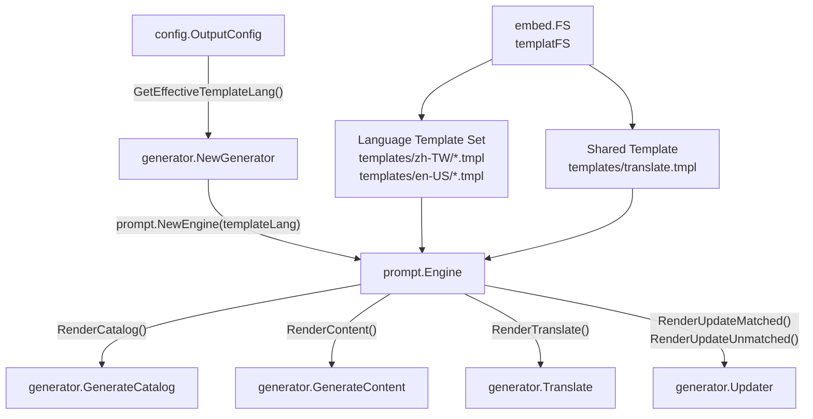
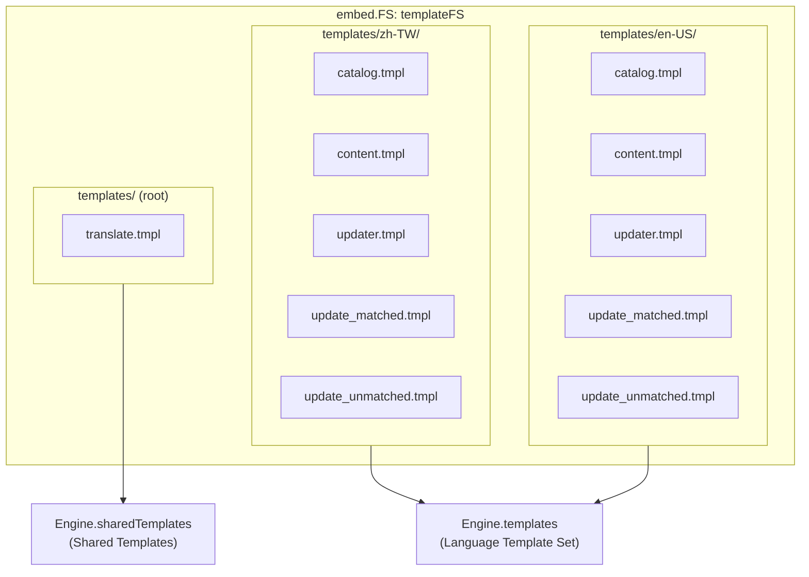
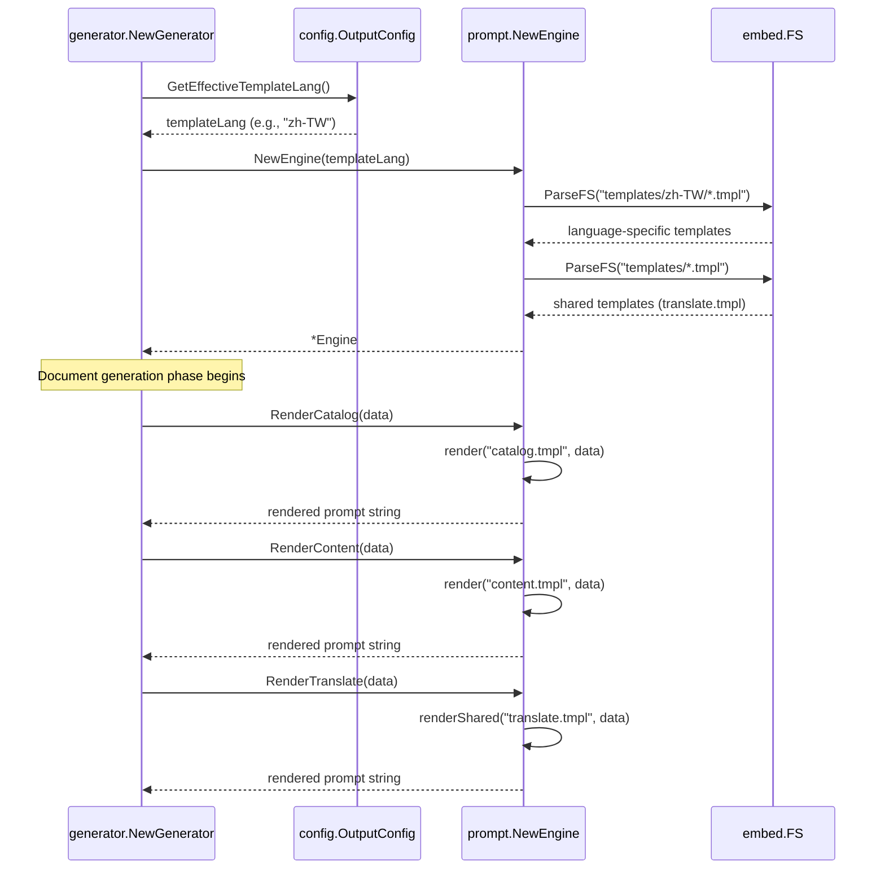
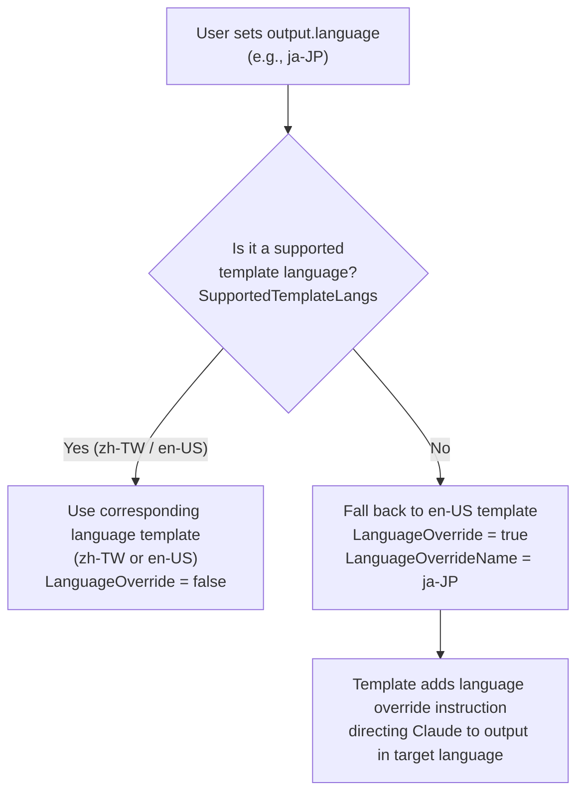

# Prompt Template Engine

`prompt.Engine` is selfmd's prompt template engine, responsible for combining structured data with predefined templates to generate the complete prompts passed to the Claude CLI.

## Overview

The prompt template engine resides in the `internal/prompt/` package with three core responsibilities:

1. **Template loading**: Uses Go's `embed.FS` mechanism to embed all `.tmpl` files under the `templates/` directory into the binary at compile time, ensuring no additional template files are needed at deployment.
2. **Language routing**: Determines which language subfolder (`zh-TW` or `en-US`) to load based on `OutputConfig.GetEffectiveTemplateLang()`. The shared template (`translate.tmpl`) is managed independently, outside any language subfolder.
3. **Data rendering**: Provides six high-level rendering methods, each corresponding to a specific stage of the document generation pipeline, accepting strongly-typed data structs and returning rendered strings.

In the overall architecture, `Engine` is one of `Generator`'s core dependencies, working alongside `claude.Runner`: `Engine` is responsible for "converting data into prompt text," while `Runner` is responsible for "sending prompt text to Claude and retrieving the response."

### Key Terms

- **Template Language**: Determines which language folder's `.tmpl` files to use. Currently supports `zh-TW` and `en-US`.
- **Language Override**: When the user-configured output language has no corresponding template (e.g., `ja-JP`), the engine falls back to the English template (`en-US`) and adds an explicit instruction in the prompt, directing Claude to output in the target language.
- **Shared Template**: `translate.tmpl` does not depend on a specific language and can translate any language combination, so it is loaded independently outside the language subfolders.

## Architecture

### Component Dependencies



### Template File Organization



## Core Data Structures

`Engine` defines six data structs corresponding to different rendering scenarios:

### CatalogPromptData

Used in the **catalog generation phase**, providing the complete project scan results for Claude to analyze and design the documentation catalog.

```go
type CatalogPromptData struct {
	RepositoryName       string
	ProjectType          string
	Language             string
	LanguageName         string // native display name (e.g., "繁體中文")
	LanguageOverride     bool   // true when template lang != output lang
	LanguageOverrideName string // native name of the desired output language
	KeyFiles             string
	EntryPoints          string
	FileTree             string
	ReadmeContent        string
}
```

> Source: internal/prompt/engine.go#L40-L51

### ContentPromptData

Used in the **content page generation phase**, specifying the target page's position in the catalog, the list of linkable pages, and existing content in update scenarios.

```go
type ContentPromptData struct {
	RepositoryName       string
	Language             string
	LanguageName         string
	LanguageOverride     bool
	LanguageOverrideName string
	CatalogPath          string
	CatalogTitle         string
	CatalogDirPath       string // filesystem dir path of THIS item, e.g., "configuration/claude-config"
	ProjectDir           string
	FileTree             string
	CatalogTable         string // formatted table of all catalog items with their dir paths
	ExistingContent      string // existing page content for update context (empty for new pages)
}
```

> Source: internal/prompt/engine.go#L54-L67

### UpdateMatchedPromptData and UpdateUnmatchedPromptData

Used in the **incremental update phase**, handling two subtasks: "determining which existing pages need to be regenerated" and "determining whether new pages need to be added."

```go
type UpdateMatchedPromptData struct {
	RepositoryName string
	Language       string
	ChangedFiles   string // list of changed source files
	AffectedPages  string // pages that reference these files (path + title + summary)
}

type UpdateUnmatchedPromptData struct {
	RepositoryName  string
	Language        string
	UnmatchedFiles  string // changed files not referenced in any existing doc
	ExistingCatalog string // existing catalog JSON
	CatalogTable    string // formatted link table of all pages
}
```

> Source: internal/prompt/engine.go#L81-L95

### TranslatePromptData

Used in the **translation phase**, specifying the source language, target language, and the complete Markdown content to translate.

```go
type TranslatePromptData struct {
	SourceLanguage     string // e.g., "zh-TW"
	SourceLanguageName string // e.g., "繁體中文"
	TargetLanguage     string // e.g., "en-US"
	TargetLanguageName string // e.g., "English"
	SourceContent      string // the full markdown content to translate
}
```

> Source: internal/prompt/engine.go#L98-L104

## Template Language Selection Logic

The engine's language selection is controlled by two methods in `config.OutputConfig`:

```go
// SupportedTemplateLangs lists language codes that have built-in prompt template folders.
var SupportedTemplateLangs = []string{"zh-TW", "en-US"}

// GetEffectiveTemplateLang returns which template folder to load.
// If Language has a built-in template set, returns it; otherwise falls back to "en-US".
func (o *OutputConfig) GetEffectiveTemplateLang() string {
	for _, lang := range SupportedTemplateLangs {
		if o.Language == lang {
			return o.Language
		}
	}
	return "en-US"
}

// NeedsLanguageOverride returns true when the template language differs from Language,
// meaning the prompt needs an explicit instruction to output in the configured language.
func (o *OutputConfig) NeedsLanguageOverride() bool {
	return o.GetEffectiveTemplateLang() != o.Language
}
```

> Source: internal/config/config.go#L53-L71

When `LanguageOverride` is `true`, the template adds an explicit language instruction to the prompt, directing Claude to output in the specified language even if the template itself is written in English.

## Core Flows

### Engine Initialization and Rendering Flow



### Language Override Decision Flow



## Usage Examples

### Initializing the Engine

```go
// NewGenerator creates a new Generator.
func NewGenerator(cfg *config.Config, rootDir string, logger *slog.Logger) (*Generator, error) {
	templateLang := cfg.Output.GetEffectiveTemplateLang()
	engine, err := prompt.NewEngine(templateLang)
	if err != nil {
		return nil, err
	}
	// ...
	return &Generator{
		// ...
		Engine: engine,
	}, nil
}
```

> Source: internal/generator/pipeline.go#L35-L59

### Rendering a Catalog Prompt

```go
func (g *Generator) GenerateCatalog(ctx context.Context, scan *scanner.ScanResult) (*catalog.Catalog, error) {
	langName := config.GetLangNativeName(g.Config.Output.Language)
	data := prompt.CatalogPromptData{
		RepositoryName:       g.Config.Project.Name,
		ProjectType:          g.Config.Project.Type,
		Language:             g.Config.Output.Language,
		LanguageName:         langName,
		LanguageOverride:     g.Config.Output.NeedsLanguageOverride(),
		LanguageOverrideName: langName,
		KeyFiles:             scan.KeyFiles(),
		EntryPoints:          scan.EntryPointsFormatted(),
		FileTree:             scanner.RenderTree(scan.Tree, 4),
		ReadmeContent:        scan.ReadmeContent,
	}

	rendered, err := g.Engine.RenderCatalog(data)
	if err != nil {
		return nil, err
	}
	// rendered is the complete prompt string, passed to claude.Runner
}
```

> Source: internal/generator/catalog_phase.go#L16-L62

### Rendering a Translation Prompt

```go
rendered, err := g.Engine.RenderTranslate(data)
```

> Source: internal/generator/translate_phase.go#L195

## Related Links

- [Document Generation Pipeline](../generator/index.md) — How `Engine` is used in the four-phase pipeline
- [Catalog Generation Phase](../generator/catalog-phase/index.md) — Detailed flow using `RenderCatalog`
- [Content Page Generation Phase](../generator/content-phase/index.md) — Detailed flow using `RenderContent`
- [Translation Phase](../generator/translate-phase/index.md) — Detailed flow using `RenderTranslate`
- [Incremental Update](../incremental-update/index.md) — Scenarios using `RenderUpdateMatched` and `RenderUpdateUnmatched`
- [Claude CLI Runner](../claude-runner/index.md) — The downstream component that receives `Engine`'s rendered output
- [Multilingual Support](../../i18n/index.md) — User-side configuration for the language override mechanism

## Reference Files

| File Path | Description |
|-----------|-------------|
| `internal/prompt/engine.go` | `Engine` struct, data type definitions, and rendering methods |
| `internal/prompt/templates/zh-TW/catalog.tmpl` | Traditional Chinese catalog generation prompt template |
| `internal/prompt/templates/zh-TW/content.tmpl` | Traditional Chinese content page generation prompt template |
| `internal/prompt/templates/zh-TW/updater.tmpl` | Traditional Chinese incremental update (legacy) prompt template |
| `internal/prompt/templates/zh-TW/update_matched.tmpl` | Traditional Chinese: prompt template for determining which existing pages need regeneration |
| `internal/prompt/templates/zh-TW/update_unmatched.tmpl` | Traditional Chinese: prompt template for determining whether new pages need to be added |
| `internal/prompt/templates/translate.tmpl` | Shared translation prompt template (language-agnostic) |
| `internal/prompt/templates/en-US/catalog.tmpl` | English catalog generation prompt template |
| `internal/config/config.go` | `OutputConfig.GetEffectiveTemplateLang()`, `NeedsLanguageOverride()`, and `SupportedTemplateLangs` definitions |
| `internal/generator/pipeline.go` | `Generator` struct definition and `NewGenerator` initialization logic |
| `internal/generator/catalog_phase.go` | `GenerateCatalog`: example usage of `RenderCatalog` |