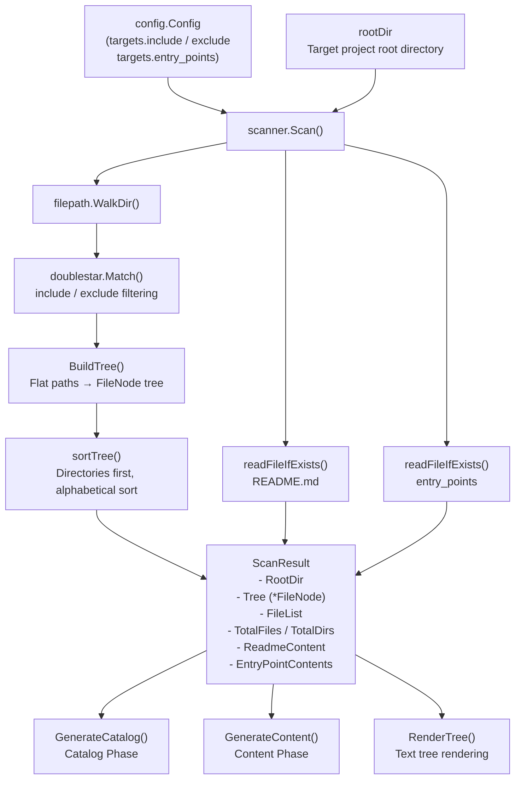
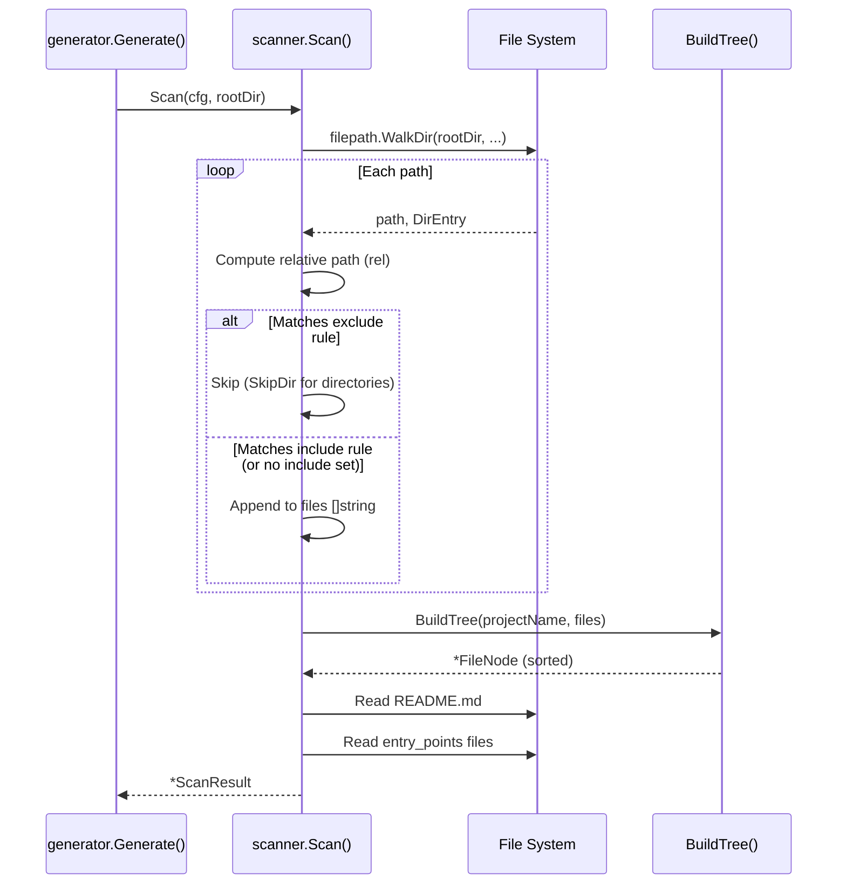

# Project Scanner

The project scanner (`scanner` package) traverses the target project's directory structure, collects a file list, builds a tree structure, reads the README and entry point files, and packages the results into a `ScanResult` for use by the downstream documentation generation pipeline.

## Overview

In selfmd's four-phase pipeline, the scanner is the first core module to execute (Phase 1). Its responsibilities are:

- **Collecting matching files**: Filters source files that need documentation based on `include` and `exclude` glob rules defined in `selfmd.yaml` under `targets`
- **Building a File Tree**: Converts a flat list of file paths into a hierarchical `FileNode` tree structure, which can then be rendered into a human-readable directory format
- **Reading key context**: Automatically reads `README.md` and the entry point files specified in the configuration, providing background context for Claude when generating the catalog

The scan result (`ScanResult`) is the starting point for the entire pipeline: both the Catalog Phase and Content Phase depend on it for the file tree, KEY files list, and entry point contents.

### Core Concepts

| Term | Description |
|------|------|
| `ScanResult` | The complete result object after a scan, containing the tree structure, file list, README, and more |
| `FileNode` | Represents a single node in the file tree; can be either a directory or a file |
| `BuildTree` | A function that converts a flat list of paths into a `FileNode` tree |
| `RenderTree` | Renders a `FileNode` tree into UNIX `tree`-command-style text for injection into prompts |
| Entry Points | Important files specified in the configuration (e.g., `main.go`) whose contents are fully read for Claude's reference |

## Architecture



## Data Structures

### FileNode

`FileNode` is the basic unit of the file tree, representing a directory or file:

```go
type FileNode struct {
    Name     string
    Path     string // relative path from project root
    IsDir    bool
    Children []*FileNode
}
```

> Source: `internal/scanner/filetree.go#L11-L16`

### ScanResult

`ScanResult` encapsulates all output from a complete scan:

```go
type ScanResult struct {
    RootDir            string
    Tree               *FileNode
    FileList           []string
    TotalFiles         int
    TotalDirs          int
    ReadmeContent      string
    EntryPointContents map[string]string
}
```

> Source: `internal/scanner/filetree.go#L19-L27`

## Core Flow

### Scan — Main Scan Process



### File Filtering Logic

Scanning uses a two-layer "exclude first, then include" filtering strategy:

1. **Exclude takes priority**: If a path matches any `exclude` glob pattern, directories call `filepath.SkipDir` to skip the entire subtree, and files are skipped individually
2. **Include filtering**: If an `include` list is configured, only files matching at least one pattern are added to the results

```go
// check excludes
for _, pattern := range cfg.Targets.Exclude {
    matched, _ := doublestar.Match(pattern, rel)
    if matched {
        if d.IsDir() {
            return filepath.SkipDir
        }
        return nil
    }
}

// check includes
if len(cfg.Targets.Include) > 0 {
    included := false
    for _, pattern := range cfg.Targets.Include {
        matched, _ := doublestar.Match(pattern, rel)
        if matched {
            included = true
            break
        }
    }
    if !included {
        return nil
    }
}
```

> Source: `internal/scanner/scanner.go#L33-L61`

Glob matching uses the `doublestar` package, which supports the `**` wildcard (e.g., `vendor/**`, `internal/**`).

### BuildTree — Tree Structure Construction

`BuildTree` takes a flat list of relative paths and incrementally builds a `FileNode` tree:

```go
func BuildTree(rootName string, paths []string) *FileNode {
    root := &FileNode{
        Name:  rootName,
        Path:  "",
        IsDir: true,
    }

    for _, p := range paths {
        parts := strings.Split(filepath.ToSlash(p), "/")
        current := root
        for i, part := range parts {
            isLast := i == len(parts)-1
            child := findChild(current, part)
            if child == nil {
                child = &FileNode{
                    Name:  part,
                    Path:  strings.Join(parts[:i+1], "/"),
                    IsDir: !isLast,
                }
                current.Children = append(current.Children, child)
            }
            if !isLast {
                child.IsDir = true
            }
            current = child
        }
    }

    sortTree(root)
    return root
}
```

> Source: `internal/scanner/filetree.go#L30-L60`

After construction, `sortTree` sorts each level of nodes: **directory nodes come first, and nodes of the same type are sorted alphabetically**.

### RenderTree — Text Tree Rendering

`RenderTree` converts a `FileNode` tree into text output similar to the UNIX `tree` command, for injection into Claude prompts:

```go
func RenderTree(node *FileNode, maxDepth int) string {
    var sb strings.Builder
    sb.WriteString(node.Name + "/\n")
    renderChildren(&sb, node, "", maxDepth, 0)
    return sb.String()
}
```

> Source: `internal/scanner/filetree.go#L87-L92`

The rendering includes two safeguards:
- `maxDepth`: Limits the maximum expansion depth (Catalog Phase uses 4 levels, Content Phase uses 3)
- Each level renders at most 30 child nodes; beyond that, `... (N more items)` is displayed

## Helper Methods

### KeyFiles()

The scan result provides a `KeyFiles()` method that filters well-known important files (such as `main.go`, `Dockerfile`, `go.mod`, etc.) from `FileList` and returns them as a comma-separated string for use as supplementary information in the Catalog Prompt:

```go
func (s *ScanResult) KeyFiles() string {
    notable := []string{}
    patterns := []string{
        "main.go", "main.py", "main.rs", "main.ts", "main.js",
        "index.ts", "index.js", "app.go", "app.py", "app.ts",
        "Makefile", "Dockerfile", "docker-compose.yml", "compose.yaml",
        "package.json", "go.mod", "Cargo.toml", "pom.xml",
        "README.md", "CHANGELOG.md",
    }
    // ...
    if len(notable) > 20 {
        notable = notable[:20]
    }
    return strings.Join(notable, ", ")
}
```

> Source: `internal/scanner/scanner.go#L117-L141`

### EntryPointsFormatted()

Formats the contents of entry point files specified in the configuration as Markdown code blocks. Each entry point is limited to 10,000 characters and truncated if exceeded:

```go
func (s *ScanResult) EntryPointsFormatted() string {
    if len(s.EntryPointContents) == 0 {
        return "(no entry points specified)"
    }

    var sb strings.Builder
    for path, content := range s.EntryPointContents {
        sb.WriteString("### " + path + "\n```\n")
        if len(content) > 10000 {
            content = content[:10000] + "\n... (truncated)"
        }
        sb.WriteString(content)
        sb.WriteString("\n```\n\n")
    }
    return sb.String()
}
```

> Source: `internal/scanner/scanner.go#L144-L160`

### readFileIfExists()

A private helper function that reads file contents and automatically truncates them if they exceed 50,000 characters:

```go
func readFileIfExists(rootDir, relPath string) string {
    data, err := os.ReadFile(filepath.Join(rootDir, relPath))
    if err != nil {
        return ""
    }
    content := string(data)
    if len(content) > 50000 {
        content = content[:50000] + "\n... (truncated)"
    }
    return content
}
```

> Source: `internal/scanner/scanner.go#L103-L114`

## Usage Examples

### Calling the Scanner in the Pipeline

The following is the actual code in `generator.Generate()` that invokes the scanner:

```go
// Phase 1: Scan
fmt.Println(ui.T("[1/4] 掃描專案結構...", "[1/4] Scanning project structure..."))
scan, err := scanner.Scan(g.Config, g.RootDir)
if err != nil {
    return fmt.Errorf(ui.T("掃描專案失敗: %w", "failed to scan project: %w"), err)
}
fmt.Printf(ui.T("      找到 %d 個檔案，分布於 %d 個目錄\n", "      Found %d files in %d directories\n"), scan.TotalFiles, scan.TotalDirs)
```

> Source: `internal/generator/pipeline.go#L88-L94`

### Using the Scan Result in the Catalog Phase

```go
data := prompt.CatalogPromptData{
    // ...
    KeyFiles:      scan.KeyFiles(),
    EntryPoints:   scan.EntryPointsFormatted(),
    FileTree:      scanner.RenderTree(scan.Tree, 4),
    ReadmeContent: scan.ReadmeContent,
}
```

> Source: `internal/generator/catalog_phase.go#L18-L29`

### Using the Scan Result in the Content Phase

```go
data := prompt.ContentPromptData{
    // ...
    FileTree: scanner.RenderTree(scan.Tree, 3),
}
```

> Source: `internal/generator/content_phase.go#L102-L103`

## Related Links

- [Documentation Generation Pipeline](../generator/index.md) — The scanner's position in the four-phase pipeline and when it is invoked
- [Catalog Generation Phase](../generator/catalog-phase/index.md) — The first downstream phase that directly consumes `ScanResult`
- [Content Page Generation Phase](../generator/content-phase/index.md) — Uses `RenderTree` to inject the file tree into prompts
- [Project and Scan Target Configuration](../../configuration/project-targets/index.md) — How to configure `include`, `exclude`, and `entry_points`
- [Core Modules](../index.md) — Return to the core modules overview

## Reference Files

| File Path | Description |
|----------|------|
| `internal/scanner/scanner.go` | `Scan()` main function, `KeyFiles()`, `EntryPointsFormatted()`, `readFileIfExists()` |
| `internal/scanner/filetree.go` | `FileNode` and `ScanResult` data structure definitions; `BuildTree()`, `RenderTree()`, `sortTree()` |
| `internal/generator/pipeline.go` | Pipeline main flow, showing when the scanner is called and how its results are used |
| `internal/generator/catalog_phase.go` | How `ScanResult` methods are consumed in the Catalog Phase |
| `internal/generator/content_phase.go` | How `RenderTree` is used in the Content Phase |
| `internal/config/config.go` | `TargetsConfig` struct definition (`Include`, `Exclude`, `EntryPoints`) |