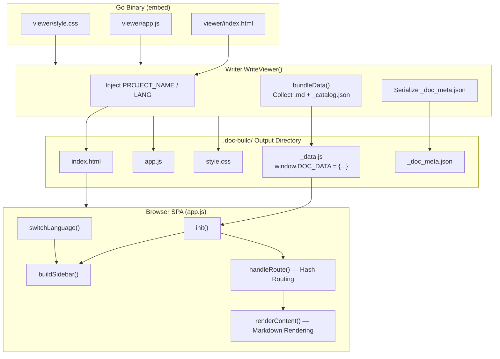
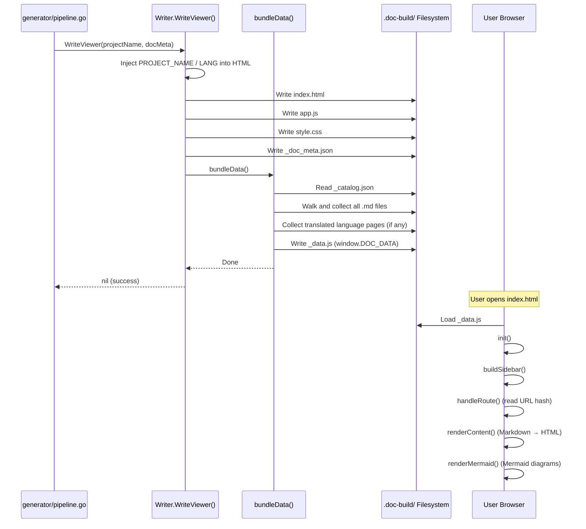

# Static Document Viewer

The static document viewer is the final output interface of selfmd, delivered as a zero-dependency single-page application (SPA). Simply open `index.html` in a browser to browse all documentation — no server or network service required.

## Overview

After each documentation generation run, selfmd automatically creates a set of static web files under the `.doc-build/` directory. Users can open `.doc-build/index.html` in any browser to view all generated documents via a sidebar, live Markdown rendering, and Mermaid diagram support.

The core design principles of the static viewer are:

- **Serverless**: All Markdown content and catalog structure are pre-bundled into `_data.js` and injected as a JavaScript global variable — no backend API dependency
- **Binary Embed**: The three static assets (HTML, JavaScript, CSS) are compiled into the selfmd binary at build time using Go's `//go:embed` directive, requiring no extra files at distribution
- **Single Entry Point**: `index.html` is the sole entry point, with client-side routing implemented via URL hash (`#path/to/page.md`)
- **Multilingual Support**: When translated versions of documents exist, a language switcher appears at the top of the sidebar; switching languages dynamically replaces page content and the catalog

Output files involved in the viewer:

| File | Description |
|------|-------------|
| `index.html` | HTML shell with project name and language code injected |
| `app.js` | Frontend SPA logic (routing, rendering, interaction) |
| `style.css` | Layout and visual styles |
| `_data.js` | Data bundle containing all Markdown content and the catalog |
| `_doc_meta.json` | Language metadata (optional) |

## Architecture



> Source: `internal/output/viewer.go`, `internal/output/viewer/app.js`

## Static Asset Embedding

The three static asset files are embedded directly into the binary at compile time via Go's `embed` package, requiring no corresponding file paths to exist in the runtime environment.

```go
//go:embed viewer/index.html
var viewerHTML string

//go:embed viewer/app.js
var viewerJS string

//go:embed viewer/style.css
var viewerCSS string
```

> Source: `internal/output/viewer.go#L12-L19`

Before writing `index.html`, `WriteViewer` performs string substitution on the template to inject the project name (`{{PROJECT_NAME}}`) and language code (`{{LANG}}`) into the HTML:

```go
func (w *Writer) WriteViewer(projectName string, docMeta *DocMeta) error {
    html := strings.ReplaceAll(viewerHTML, "{{PROJECT_NAME}}", projectName)
    lang := "zh-TW"
    if docMeta != nil {
        lang = docMeta.DefaultLanguage
    }
    html = strings.ReplaceAll(html, "{{LANG}}", lang)

    if err := w.WriteFile("index.html", html); err != nil {
        return fmt.Errorf("寫入 index.html 失敗: %w", err)
    }
    // ...
}
```

> Source: `internal/output/viewer.go#L23-L43`

## Data Bundling (bundleData)

The `bundleData` function scans the `.doc-build/` directory, bundling all Markdown pages and the catalog structure into a single `_data.js` file.

### Bundling Process

1. Read `_catalog.json` as the catalog structure
2. Use `filepath.Walk` to traverse the output directory and collect all `.md` files (excluding files prefixed with `_`)
3. If multilingual configuration is present, skip primary-language pages inside language subdirectories (`en-US/`, `ja-JP/`, etc.)
4. If translated languages exist, separately collect the catalog and pages from each language subdirectory
5. Serialize all data to JSON and write to `_data.js`

```go
func (w *Writer) bundleData(projectName string, docMeta *DocMeta) error {
    // Read catalog
    catalogPath := filepath.Join(w.BaseDir, "_catalog.json")
    catalogBytes, err := os.ReadFile(catalogPath)
    // ...

    // Collect all master-language .md files (skip language subdirectories)
    pages := make(map[string]string)
    // ...
    err = filepath.Walk(w.BaseDir, func(path string, info os.FileInfo, err error) error {
        // Skip files starting with _
        if strings.HasPrefix(filepath.Base(relPath), "_") {
            return nil
        }
        // Skip files inside language subdirectories
        topDir := strings.SplitN(relPath, "/", 2)[0]
        if langDirs[topDir] {
            return nil
        }
        // ...
    })
    // ...
    content := "window.DOC_DATA = " + string(jsonBytes) + ";\n"
    return w.WriteFile("_data.js", content)
}
```

> Source: `internal/output/viewer.go#L61-L193`

### `_data.js` Data Structure

The resulting `window.DOC_DATA` global object has the following structure:

```javascript
window.DOC_DATA = {
  "catalog": { /* contents of _catalog.json */ },
  "pages": {
    "overview/index.md": "# Overview\n...",
    "core-modules/scanner/index.md": "# Scanner\n..."
    // all primary-language .md files
  },
  "meta": {
    "default_language": "zh-TW",
    "available_languages": [
      { "code": "zh-TW", "native_name": "繁體中文", "is_default": true },
      { "code": "en-US", "native_name": "English", "is_default": false }
    ]
  },
  "languages": {
    "en-US": {
      "catalog": { /* English catalog */ },
      "pages": { "overview/index.md": "# Overview\n..." }
    }
  }
};
```

> Source: `internal/output/viewer.go#L126-L192`

## Frontend Application (app.js)

`app.js` is a SPA written in vanilla JavaScript (ES5-compatible), wrapped in an immediately invoked function expression (IIFE), with no dependency on any frontend framework.

### Module Function Overview

| Function Group | Key Functions | Description |
|---------------|---------------|-------------|
| Initialization | `init()` | Load data, configure Marked, initialize routing |
| Sidebar | `buildSidebar()` / `renderSidebarSection()` | Recursively build a collapsible sidebar from the catalog |
| Routing | `handleRoute()` / `loadPage()` | URL hash-based client-side routing |
| Content Rendering | `renderContent()` / `fixLinks()` | Markdown rendering and relative path conversion |
| Mermaid | `renderMermaid()` | Detect mermaid code blocks and call `mermaid.run()` |
| Language Switching | `buildLangSwitcher()` / `switchLanguage()` | Multilingual `<select>` component and data switching |
| Toolbar | `buildPageToolbar()` | Per-page "Copy Path" and "Download Markdown" buttons |
| Fullscreen | `enterMindmapFullscreen()` / `exitMindmapFullscreen()` | Fullscreen zoom and pan for Mermaid diagrams |
| Mobile | `setupMobileMenu()` | Hamburger menu and sidebar overlay |

### Routing Mechanism

Routing is implemented via URL hash: the value of `location.hash` is the relative path of the page (e.g., `#core-modules/scanner/index.md`). When navigating between pages, `loadPage(path)` is called to retrieve the Markdown string from `window.DOC_DATA.pages` and render it.

```javascript
function handleRoute() {
    var path = location.hash.slice(1) || "index.md";
    loadPage(path);
}

function loadPage(path) {
    var md = pages[path];
    if (!md) {
        document.getElementById("article").innerHTML =
            "<h1>頁面未找到</h1><p>找不到 <code>" + escapeHtml(path) + "</code></p>";
        return;
    }
    renderContent(md, path);
    updateActiveLink(path);
    updateTitle(path);
    document.getElementById("content").scrollTop = 0;
    document.getElementById("sidebar").classList.remove("open");
}
```

> Source: `internal/output/viewer/app.js#L172-L196`

### Relative Link Resolution

Relative links in Markdown (e.g., `../other-section/index.md`) must be converted to hash links (`#other-section/index.md`) within the SPA. `fixLinks()` iterates over all `<a>` elements after rendering to perform this conversion:

```javascript
function fixLinks(container, currentPath) {
    var baseDir = currentPath.replace(/[^/]*$/, "");
    var links = container.querySelectorAll("a[href]");
    for (var i = 0; i < links.length; i++) {
        var href = links[i].getAttribute("href");
        if (href.indexOf("://") !== -1 || href.charAt(0) === "#" || href.indexOf("mailto:") === 0) continue;
        var resolved = resolvePath(baseDir, href);
        links[i].setAttribute("href", "#" + resolved);
    }
}
```

> Source: `internal/output/viewer/app.js#L280-L293`

### Mermaid Diagram Fullscreen

Each Mermaid diagram has a fullscreen button (`⛶`). Clicking it enters fullscreen mode, with support for scroll-wheel zoom (0.8× to 2.0×) and mouse-drag panning:

```javascript
function onMmWheel(e) {
    e.preventDefault();
    var delta = e.deltaY > 0 ? 0.95 : 1.05;
    var newScale = mmState.scale * delta;
    if (newScale < 0.8) newScale = 0.8;
    if (newScale > 2.0) newScale = 2.0;
    mmState.scale = newScale;
    applyMmTransform();
}
```

> Source: `internal/output/viewer/app.js#L526-L534`

## Visual Styles (style.css)

`style.css` defines the design system using CSS custom properties (CSS Variables), presenting a dark-themed sidebar alongside a light main content area:

```css
:root {
    --sidebar-width: 280px;
    --sidebar-bg: #1a1b26;
    --sidebar-text: #a9b1d6;
    --sidebar-active-bg: rgba(122, 162, 247, 0.12);
    --sidebar-active-text: #7aa2f7;
    --content-bg: #ffffff;
    --text-color: #2e3440;
    /* ... */
}
```

> Source: `internal/output/viewer/style.css#L1-L19`

Responsive design uses a `@media (max-width: 860px)` breakpoint to hide the sidebar and show the hamburger menu on narrow screens:

```css
@media (max-width: 860px) {
    #menu-toggle { display: block; }
    #sidebar {
        position: fixed;
        transform: translateX(-100%);
        transition: transform 0.25s ease;
    }
    #sidebar.open { transform: translateX(0); }
}
```

> Source: `internal/output/viewer/style.css#L521-L551`

## Core Flow



## External Library Dependencies

Three third-party libraries are loaded via CDN in the browser, each included via a `<script>` tag in `index.html`:

```html
<script src="https://cdn.jsdelivr.net/npm/marked/marked.min.js"></script>
<script src="https://cdn.jsdelivr.net/npm/highlight.js@11/highlight.min.js"></script>
<script src="https://cdn.jsdelivr.net/npm/mermaid/dist/mermaid.min.js"></script>
```

> Source: `internal/output/viewer/index.html#L26-L28`

| Library | Purpose |
|---------|---------|
| [marked](https://marked.js.org/) | Markdown-to-HTML rendering (GFM support) |
| [highlight.js](https://highlightjs.org/) | Code syntax highlighting |
| [mermaid](https://mermaid.js.org/) | Mermaid diagram rendering (flowcharts, sequence diagrams, etc.) |

> **Note**: Due to the CDN dependency, text content remains visible in offline environments, but code highlighting and Mermaid diagrams require a network connection to render correctly.

## When WriteViewer Is Called

`WriteViewer` is invoked at two points:

1. **After `selfmd generate` completes**: Called immediately after the fourth pipeline stage (index and navigation) finishes
2. **After `selfmd translate` completes**: Called again to re-bundle `_data.js` with multilingual data

```go
// In pipeline.go (after generate completes)
if err := g.Writer.WriteViewer(g.Config.Project.Name, docMeta); err != nil {
    g.Logger.Warn("產生瀏覽器失敗", "error", err)
} else {
    fmt.Println("      完成，開啟 .doc-build/index.html 即可瀏覽")
}
```

> Source: `internal/generator/pipeline.go#L149-L155`

## Related Links

- [Output Writer and Link Fixing](../output-writer/index.md) — The `Writer` struct and base write functions like `WriteFile`
- [Document Generation Pipeline](../generator/index.md) — The four-stage pipeline that triggers `WriteViewer`
- [Index and Navigation Generation Phase](../generator/index-phase/index.md) — Pipeline stage four, after which `WriteViewer` is called
- [Translation Phase](../generator/translate-phase/index.md) — `WriteViewer` is called again after translation completes
- [Multilingual Support](../../i18n/index.md) — Language switcher and multilingual data bundling
- [Output Structure](../../overview/output-structure/index.md) — Description of all output files under `.doc-build/`

## Reference Files

| File Path | Description |
|-----------|-------------|
| `internal/output/viewer.go` | `WriteViewer()`, `bundleData()`, and Go embed declarations |
| `internal/output/viewer/index.html` | HTML shell template with `{{PROJECT_NAME}}` and `{{LANG}}` placeholders |
| `internal/output/viewer/app.js` | Complete frontend SPA logic (routing, rendering, language switching, Mermaid fullscreen) |
| `internal/output/viewer/style.css` | CSS styles including CSS variables, responsive design, and print mode |
| `internal/output/writer.go` | `Writer` struct definition and base write functions like `WriteFile` |
| `internal/output/navigation.go` | Navigation page generation functions such as `GenerateIndex` and `GenerateSidebar` |
| `internal/generator/pipeline.go` | Main pipeline flow that calls `WriteViewer` |
| `internal/generator/translate_phase.go` | Calls `WriteViewer` again after translation completes |