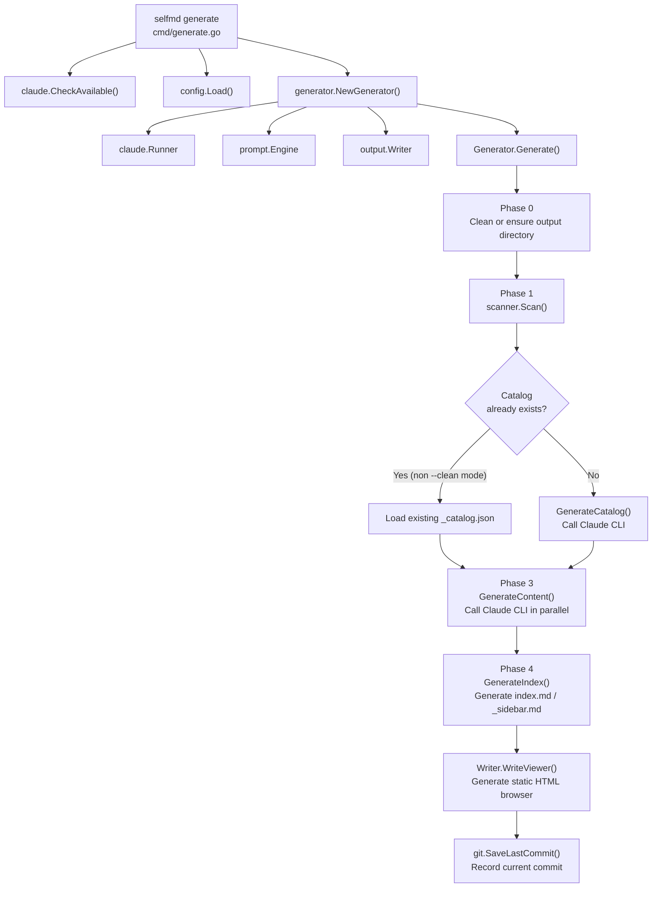

# Generating Your First Document

After completing the initial setup, run `selfmd generate` to launch the four-phase documentation generation pipeline, which automatically scans your project, calls Claude CLI to write documentation, and outputs a static website.

## Overview

`selfmd generate` is the core command of selfmd. It reads the configuration from `selfmd.yaml` and executes the following steps in order:

1. **Scan** the project directory structure and source code
2. **Call Claude CLI** to generate the documentation catalog
3. **Call Claude CLI in parallel** to generate each documentation page
4. **Generate** the index, sidebar, and static browser

The entire process is fully automated. When complete, the full documentation website can be found in the output directory (default: `.doc-build/`), ready to browse by opening `index.html`.

---

## Prerequisites

Before running `generate`, confirm the following:

| Condition | Description |
|-----------|-------------|
| `selfmd.yaml` exists | Created by running `selfmd init`, or created manually |
| Claude CLI is installed and callable | The program automatically calls `claude.CheckAvailable()` on startup to verify |
| Current directory is the project root | selfmd uses the working directory as `rootDir` |

---

## Quick Start

```bash
# Basic usage
selfmd generate

# Force-clean the output directory before regenerating
selfmd generate --clean

# Preview which files will be scanned without actually calling Claude
selfmd generate --dry-run

# Increase concurrency to speed up generation
selfmd generate --concurrency 5
```

---

## Architecture



---

## The Four Phases in Detail

### Phase 0: Initialize Output Directory

The program first determines whether the output directory needs to be cleaned:

```go
clean := opts.Clean || g.Config.Output.CleanBeforeGenerate
if clean {
    fmt.Println(ui.T("[0/4] 清除輸出目錄...", "[0/4] Cleaning output directory..."))
    if !opts.DryRun {
        if err := g.Writer.Clean(); err != nil {
            return err
        }
    }
} else {
    if err := g.Writer.EnsureDir(); err != nil {
        return err
    }
}
```

> Source: `internal/generator/pipeline.go#L73-L85`

The `--clean` flag or `clean_before_generate: true` in the config file will trigger the clean behavior; otherwise, the program only ensures the directory exists.

---

### Phase 1: Scan Project Structure

Calls `scanner.Scan()` to traverse the project directory:

```go
fmt.Println(ui.T("[1/4] 掃描專案結構...", "[1/4] Scanning project structure..."))
scan, err := scanner.Scan(g.Config, g.RootDir)
```

> Source: `internal/generator/pipeline.go#L88-L93`

The scanner filters files according to `targets.include` and `targets.exclude` in `selfmd.yaml`, and also reads:
- `README.md` (used as background context for Claude)
- The contents of entry files specified in `entry_points`

When using `--dry-run`, the program prints the file tree at this stage and exits without calling Claude.

---

### Phase 2: Generate the Documentation Catalog

This is when Claude CLI is called for the first time. If `_catalog.json` already exists in the output directory (i.e., not in `--clean` mode), selfmd will load the existing catalog first to save costs:

```go
if !clean {
    catJSON, readErr := g.Writer.ReadCatalogJSON()
    if readErr == nil {
        cat, err = catalog.Parse(catJSON)
    }
    if cat != nil {
        items := cat.Flatten()
        fmt.Printf(ui.T("[2/4] 載入已存目錄（%d 個章節，%d 個項目）\n", ...))
    }
}
if cat == nil {
    fmt.Println(ui.T("[2/4] 產生文件目錄...", "[2/4] Generating catalog..."))
    cat, err = g.GenerateCatalog(ctx, scan)
    // ...
    if err := g.Writer.WriteCatalogJSON(cat); err != nil { ... }
}
```

> Source: `internal/generator/pipeline.go#L103-L128`

The generated catalog JSON is saved to `.doc-build/_catalog.json` for use in subsequent incremental updates.

---

### Phase 3: Generate Content Pages in Parallel

This is the most time-consuming phase. selfmd uses `errgroup` and a semaphore to control concurrency:

```go
concurrency := g.Config.Claude.MaxConcurrent
if opts.Concurrency > 0 {
    concurrency = opts.Concurrency
}
fmt.Printf(ui.T("[3/4] 產生內容頁面（並行度：%d）...\n", ...), concurrency)
if err := g.GenerateContent(ctx, scan, cat, concurrency, !clean); err != nil {
    g.Logger.Warn(ui.T("部分頁面產生失敗", "some pages failed to generate"), "error", err)
}
```

> Source: `internal/generator/pipeline.go#L131-L138`

Each documentation page corresponds to one Claude CLI call. If a page already exists (non `--clean` mode), it is automatically skipped:

```go
if skipExisting && g.Writer.PageExists(item) {
    skipped.Add(1)
    fmt.Printf(ui.T("      [跳過] %s（已存在）\n", ...), item.Title)
    return nil
}
```

> Source: `internal/generator/content_phase.go#L44-L48`

If a page fails to generate, selfmd **does not abort the entire process** — instead it writes a placeholder page and continues with the remaining pages.

---

### Phase 4: Generate Index and Navigation

The final phase produces three types of output:

```go
// Main index page
indexContent := output.GenerateIndex(...)
g.Writer.WriteFile("index.md", indexContent)

// Sidebar navigation
sidebarContent := output.GenerateSidebar(...)
g.Writer.WriteFile("_sidebar.md", sidebarContent)

// Category indexes for sections with child pages
for _, item := range items {
    if !item.HasChildren { continue }
    categoryContent := output.GenerateCategoryIndex(item, children, lang)
    g.Writer.WritePage(item, categoryContent)
}
```

> Source: `internal/generator/index_phase.go#L14-L53`

---

## Command Flags

| Flag | Default | Description |
|------|---------|-------------|
| `--clean` | `false` | Force-clean the output directory before regenerating |
| `--no-clean` | `false` | Ignore `clean_before_generate` in the config file and preserve existing documents |
| `--dry-run` | `false` | Scan and print the file tree only, without calling Claude |
| `--concurrency N` | `0` (uses config value) | Override `claude.max_concurrent` with a specific concurrency level |

```go
generateCmd.Flags().BoolVar(&cleanFlag, "clean", false, "強制清除輸出目錄")
generateCmd.Flags().BoolVar(&noCleanFlag, "no-clean", false, "不清除輸出目錄")
generateCmd.Flags().BoolVar(&dryRun, "dry-run", false, "只顯示計畫，不實際執行")
generateCmd.Flags().IntVar(&concurrencyNum, "concurrency", 0, "並行度（覆蓋設定檔）")
```

> Source: `cmd/generate.go#L34-L39`

---

## Output Structure

When complete, the `.doc-build/` directory has the following structure:

```
.doc-build/
├── index.md              ← Main index (Phase 4)
├── index.html            ← Static HTML browser entry point
├── _sidebar.md           ← Sidebar navigation (Phase 4)
├── _catalog.json         ← Documentation catalog cache (used for incremental updates)
├── _last_commit          ← Git commit record (used for incremental updates)
├── _data.js              ← Data bundle for the static browser
├── <section>/
│   └── <page>/
│       └── index.md      ← Individual documentation pages (Phase 3)
└── ...
```

---

## Completion Summary

After a successful generation, the terminal displays a summary similar to the following:

```
========================================
Documentation generation complete!
  Output directory: .doc-build
  Pages generated: 42 succeeded
  Total time: 3m25s
  Total cost: $0.1234 USD
========================================
```

> Source: `internal/generator/pipeline.go#L168-L180`

Open `.doc-build/index.html` in your browser to view the complete documentation.

---

## FAQ

**Q: Some pages show "This page failed to generate" after running**

This is a normal protective mechanism — failed pages are written with placeholder content. Re-run `selfmd generate` (without `--clean`) and the program will automatically skip completed pages, regenerating only the ones that failed.

**Q: I want to completely regenerate all pages**

Run `selfmd generate --clean` to clear the output directory and regenerate everything from scratch.

**Q: How do I speed up generation?**

Increasing the `--concurrency` value (e.g., `--concurrency 8`) raises the concurrency level, but be mindful of Claude CLI's API rate limits.

---

## Related Links

- [Installation and Build](../installation/index.md)
- [Initial Setup](../init/index.md)
- [selfmd generate Command Reference](../../cli/cmd-generate/index.md)
- [selfmd.yaml Configuration Overview](../../configuration/config-overview/index.md)
- [Overall Pipeline and Four Phases](../../architecture/pipeline/index.md)
- [Output Structure](../../overview/output-structure/index.md)
- [Incremental Updates](../../core-modules/incremental-update/index.md)

---

## Reference Files

| File Path | Description |
|-----------|-------------|
| `cmd/generate.go` | `generate` command definition, flag declarations, `runGenerate` entry point |
| `internal/generator/pipeline.go` | `Generator` struct, `Generate()` four-phase main pipeline |
| `internal/generator/catalog_phase.go` | Phase 2: calls Claude to generate the documentation catalog |
| `internal/generator/content_phase.go` | Phase 3: generates content pages in parallel |
| `internal/generator/index_phase.go` | Phase 4: generates the index, sidebar, and category indexes |
| `internal/config/config.go` | `Config` struct definition, defaults, and `Load()` logic |
| `internal/scanner/scanner.go` | Project directory scanning logic |
| `internal/output/writer.go` | `Writer` struct, page writing, and state persistence |
| `cmd/init.go` | `init` command, for understanding prerequisites |