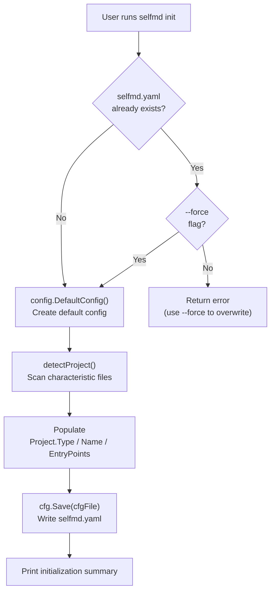
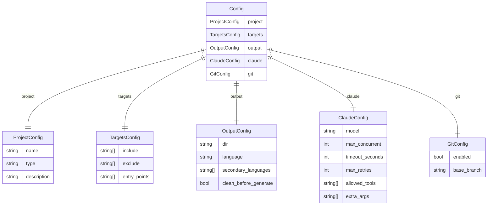
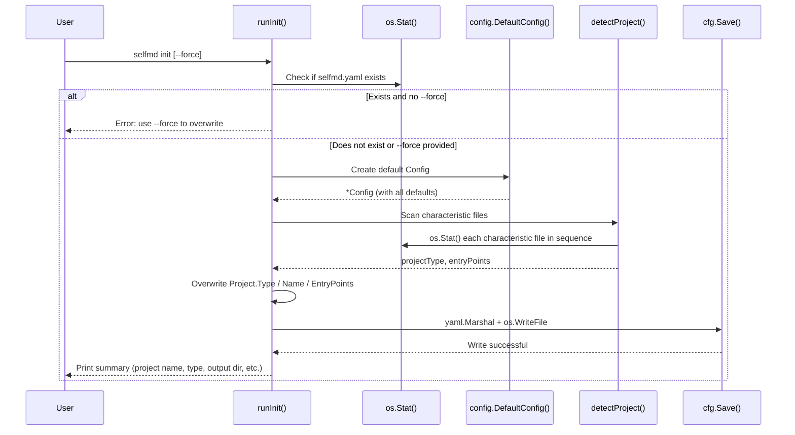

# Initialization Setup

Running the `selfmd init` command automatically scans the current directory, detects the project type, and generates a `selfmd.yaml` configuration file, establishing the foundation for subsequent documentation generation.

## Overview

`selfmd init` is the first step when using selfmd. It automatically determines the project type by analyzing characteristic files in the directory (such as `go.mod`, `package.json`, `requirements.txt`, etc.) and generates a `selfmd.yaml` configuration file pre-filled with sensible defaults.

After initialization, users only need to fine-tune the configuration file as needed before running `selfmd generate` to start generating documentation.

**Core responsibilities:**
- Detect project type (`backend`, `frontend`, `fullstack`, `library`)
- Infer common entry point file paths
- Populate the complete `Config` struct with default values and serialize to YAML

## Architecture



## Project Type Detection

The `detectProject()` function sequentially checks whether the following characteristic files exist in the directory, mapping each to a project type and a list of suggested entry points:

| Characteristic File | Project Type | Suggested Entry Points |
|---------------------|--------------|------------------------|
| `go.mod` | `backend` | `main.go`, `cmd/root.go` |
| `Cargo.toml` | `backend` | `src/main.rs`, `src/lib.rs` |
| `package.json` | `frontend` | `src/index.ts`, `src/index.js`, `src/main.ts`, `src/App.tsx` |
| `pom.xml` | `backend` | `src/main/java` |
| `build.gradle` | `backend` | `src/main/java` |
| `requirements.txt` | `backend` | `main.py`, `app.py`, `src/main.py` |
| `pyproject.toml` | `backend` | `src/main.py`, `main.py` |
| `composer.json` | `backend` | `public/index.php`, `src/Kernel.php` |
| `Gemfile` | `backend` | `config/application.rb`, `app/` |
| (no match) | `library` | (empty) |

**fullstack special case:** If `package.json` (frontend) is detected but `go.mod` or a `server/` directory also exists, the type is automatically upgraded to `fullstack`.

```go
// check if frontend project also has backend
if c.pType == "frontend" {
    if _, err := os.Stat("go.mod"); err == nil {
        return "fullstack", found
    }
    if _, err := os.Stat("server"); err == nil {
        return "fullstack", found
    }
}
```

> Source: cmd/init.go#L87-L94

After a characteristic file is detected, the function retains only entry point files that **actually exist on disk** — paths that do not exist are not written to the config.

## Default Configuration Values

The initial configuration generated by `config.DefaultConfig()` includes the following defaults:

```go
func DefaultConfig() *Config {
    return &Config{
        Project: ProjectConfig{
            Name: filepath.Base(mustGetwd()),
            Type: "backend",
        },
        Targets: TargetsConfig{
            Include: []string{"src/**", "pkg/**", "cmd/**", "internal/**", "lib/**", "app/**"},
            Exclude: []string{
                "vendor/**", "node_modules/**", ".git/**", ".doc-build/**",
                "**/*.pb.go", "**/generated/**", "dist/**", "build/**",
            },
            EntryPoints: []string{},
        },
        Output: OutputConfig{
            Dir:                 ".doc-build",
            Language:            "zh-TW",
            SecondaryLanguages:  []string{},
            CleanBeforeGenerate: false,
        },
        Claude: ClaudeConfig{
            Model:          "sonnet",
            MaxConcurrent:  3,
            TimeoutSeconds: 300,
            MaxRetries:     2,
            AllowedTools:   []string{"Read", "Glob", "Grep"},
            ExtraArgs:      []string{},
        },
        Git: GitConfig{
            Enabled:    true,
            BaseBranch: "main",
        },
    }
}
```

> Source: internal/config/config.go#L96-L129

## Configuration File Structure

`selfmd.yaml` consists of five top-level blocks corresponding to the fields of the `Config` struct:



## Core Flow



## Command Usage

### Basic Initialization

```bash
selfmd init
```

Generates `selfmd.yaml` in the current directory. If the file already exists, the command aborts with an error message.

### Force Overwrite

```bash
selfmd init --force
```

Use the `--force` flag to overwrite an existing configuration file.

> Source: cmd/init.go#L23-L26

### Specify Configuration File Path

```bash
selfmd init --config path/to/custom.yaml
```

Use the global `--config` (or `-c`) flag to specify an output path. Defaults to `selfmd.yaml`.

> Source: cmd/root.go#L33

## Post-Initialization Configuration Adjustments

The generated `selfmd.yaml` contains sensible defaults. Common settings that may need adjustment include:

| Setting | Default | Description |
|---------|---------|-------------|
| `project.description` | (empty) | Add a project description to improve AI documentation quality |
| `targets.include` | Common directory globs | Adjust the scan scope to match the actual project structure |
| `output.language` | `zh-TW` | Primary documentation language |
| `output.secondary_languages` | `[]` | Add multi-language output, e.g. `["en-US"]` |
| `claude.max_concurrent` | `3` | Tune concurrency to balance speed and resource usage |
| `git.base_branch` | `main` | Adjust to match the project's actual main branch name |

For configuration details, see [selfmd.yaml Structure Overview](../../configuration/config-overview/index.md).

## Configuration Validation Rules

When loading the configuration, the `validate()` function enforces the following rules:

```go
func (c *Config) validate() error {
    if c.Output.Dir == "" {
        return fmt.Errorf("output.dir 不可為空")
    }
    if c.Output.Language == "" {
        return fmt.Errorf("output.language 不可為空")
    }
    if c.Claude.MaxConcurrent < 1 {
        c.Claude.MaxConcurrent = 1
    }
    if c.Claude.TimeoutSeconds < 30 {
        c.Claude.TimeoutSeconds = 30
    }
    if c.Claude.MaxRetries < 0 {
        c.Claude.MaxRetries = 0
    }
    return nil
}
```

> Source: internal/config/config.go#L157-L174

- `output.dir` and `output.language` are required fields
- `claude.max_concurrent` has a minimum value of `1`
- `claude.timeout_seconds` has a minimum value of `30`
- `claude.max_retries` must not be negative

## Related Links

- [Installation & Build](../installation/index.md) — Installation steps before running `selfmd init`
- [Generating Your First Document](../first-run/index.md) — Next steps after initialization
- [selfmd init Command Reference](../../cli/cmd-init/index.md) — Full command parameter reference
- [selfmd.yaml Structure Overview](../../configuration/config-overview/index.md) — Detailed description of each configuration field
- [Project & Scan Target Configuration](../../configuration/project-targets/index.md) — Advanced configuration for the `targets` block
- [Output & Multi-language Configuration](../../configuration/output-language/index.md) — Language settings for the `output` block

## Reference Files

| File Path | Description |
|-----------|-------------|
| `cmd/init.go` | `selfmd init` command implementation, including `runInit()` and `detectProject()` functions |
| `cmd/root.go` | Root command definition, global flag declarations (`--config`, `--force`, etc.) |
| `internal/config/config.go` | `Config` struct definition, `DefaultConfig()`, `Load()`, `Save()`, and `validate()` implementations |