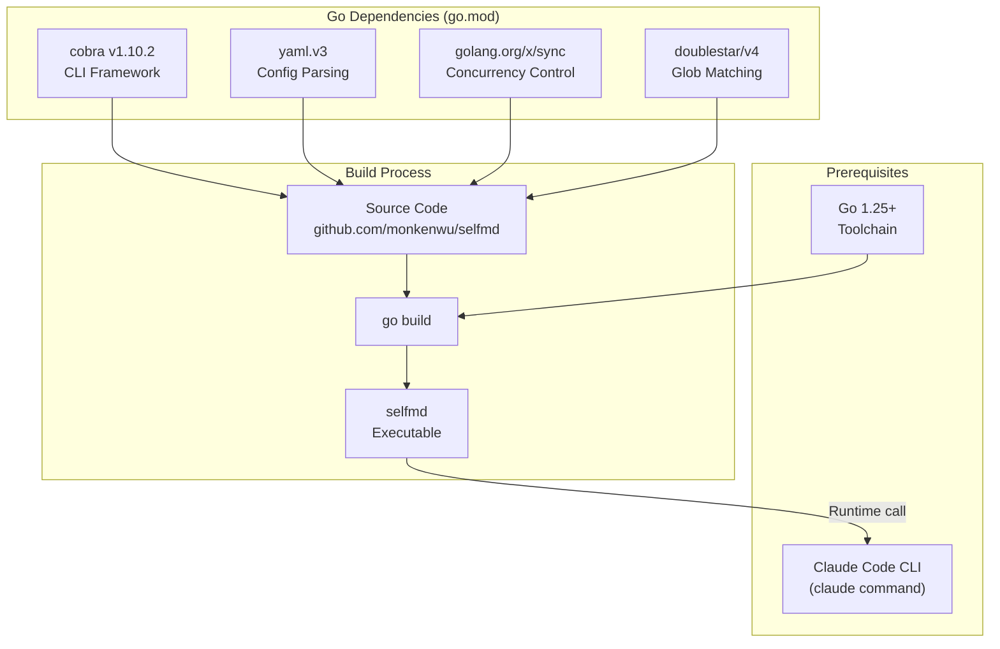
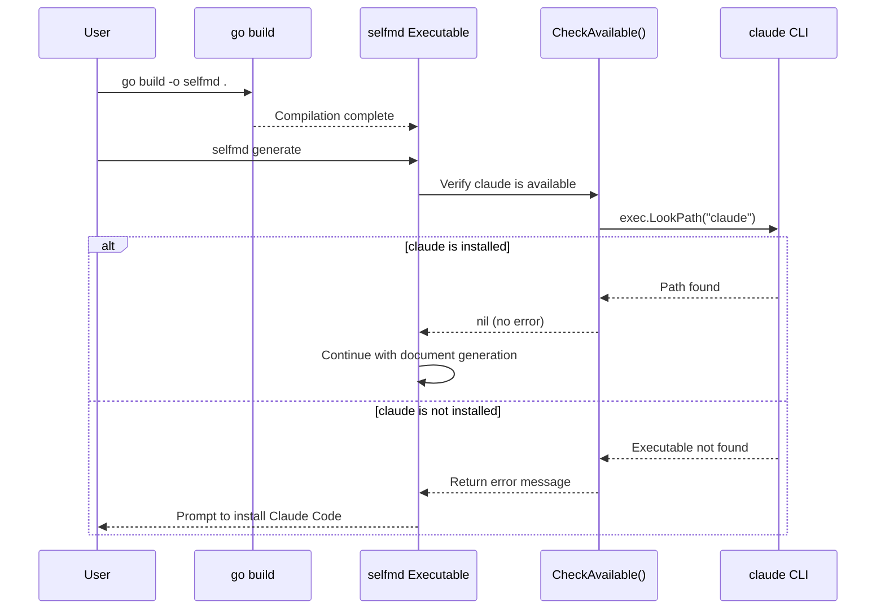

# Installation & Build

This page explains how to obtain the selfmd source code, compile the executable, and verify the prerequisites needed to run it.

## Overview

selfmd is a CLI tool written in Go that must be compiled locally before use. Since selfmd uses the local Claude Code CLI as its AI backend, **both the Go toolchain and Claude Code CLI** are required prerequisites for it to function correctly.

Key terminology:
- **Claude Code CLI**: Anthropic's official local AI agent; selfmd invokes its `claude` command via a subprocess
- **Cross-compilation**: Compiling a binary on one platform that can run on another platform

## Prerequisites

| Requirement | Minimum Version | Description |
|-------------|----------------|-------------|
| Go toolchain | 1.25+ | Used to compile the selfmd source code |
| Claude Code CLI | Latest | selfmd calls the `claude` command at runtime |

### Claude Code CLI Verification

Each time selfmd runs commands such as `generate`, `update`, or `translate`, it first calls `CheckAvailable()` to confirm that `claude` is installed and accessible on the `PATH`:

```go
// CheckAvailable verifies that the claude CLI is installed and accessible.
func CheckAvailable() error {
	_, err := exec.LookPath("claude")
	if err != nil {
		return fmt.Errorf("找不到 claude CLI。請先安裝 Claude Code：https://docs.anthropic.com/en/docs/claude-code")
	}
	return nil
}
```

> Source: `internal/claude/runner.go#L146-L152`

## Architecture

The diagram below illustrates selfmd's installation components and their dependencies:



## Go Dependencies

selfmd's dependencies are defined in `go.mod` with four direct dependencies:

```
module github.com/monkenwu/selfmd

go 1.25.7

require (
	github.com/bmatcuk/doublestar/v4 v4.10.0
	github.com/spf13/cobra v1.10.2
	golang.org/x/sync v0.19.0
	gopkg.in/yaml.v3 v3.0.1
)
```

> Source: `go.mod#L1-L10`

| Package | Version | Purpose |
|---------|---------|---------|
| `github.com/spf13/cobra` | v1.10.2 | CLI command framework managing all subcommands (init, generate, update, translate) |
| `gopkg.in/yaml.v3` | v3.0.1 | Parsing and writing the `selfmd.yaml` configuration file |
| `golang.org/x/sync` | v0.19.0 | Goroutine synchronization during concurrent document generation |
| `github.com/bmatcuk/doublestar/v4` | v4.10.0 | Glob path matching with `**` wildcard support, used for scanning target configuration |

## Build Steps

### Get the Source Code

```bash
git clone https://github.com/monkenwu/selfmd.git
cd selfmd
```

### Build for Current Platform

```bash
go build -o selfmd .
```

> Source: `README.md#L18-L19`

### Cross-Compilation

selfmd supports cross-compilation to multiple platforms by setting the `GOOS` and `GOARCH` environment variables:

```bash
# Linux arm64
GOOS=linux GOARCH=arm64 go build -o ./bin/selfmd-linux-arm64

# Linux amd64
GOOS=linux GOARCH=amd64 go build -o ./bin/selfmd-linux-amd64

# macOS arm64 (Apple Silicon)
GOOS=darwin GOARCH=arm64 go build -o ./bin/selfmd-macos-arm64

# macOS amd64 (Intel)
GOOS=darwin GOARCH=amd64 go build -o ./bin/selfmd-macos-amd64

# Windows amd64
GOOS=windows GOARCH=amd64 go build -o ./bin/selfmd-windows-amd64.exe

# Windows arm64
GOOS=windows GOARCH=arm64 go build -o ./bin/selfmd-windows-arm64.exe
```

> Source: `README.md#L21-L31`

## Core Flow



## Usage Examples

### Verify Installation

After compiling, use the following command to confirm selfmd is working correctly:

```bash
./selfmd --help
```

The output should display:

```
selfmd — 專案文件自動產生器

selfmd 是一個 CLI 工具，透過本地 Claude Code CLI 作為 AI 後端，
自動掃描專案目錄並產生結構化的 Wiki 風格繁體中文技術文件。
...
```

> Source: `cmd/root.go#L17-L25`

### Global Flags

selfmd provides three global flags that can be used with any subcommand:

```go
rootCmd.PersistentFlags().StringVarP(&cfgFile, "config", "c", "selfmd.yaml", "設定檔路徑")
rootCmd.PersistentFlags().BoolVarP(&verbose, "verbose", "v", false, "顯示詳細輸出")
rootCmd.PersistentFlags().BoolVarP(&quiet, "quiet", "q", false, "僅顯示錯誤訊息")
```

> Source: `cmd/root.go#L33-L35`

| Flag | Shorthand | Default | Description |
|------|-----------|---------|-------------|
| `--config` | `-c` | `selfmd.yaml` | Specify the configuration file path |
| `--verbose` | `-v` | `false` | Show detailed debug output |
| `--quiet` | `-q` | `false` | Show only error messages, suppress normal output |

## Entry Point

selfmd's entry point is `main.go` in the root directory, which delegates directly to `cmd.Execute()`:

```go
package main

import (
	"os"

	"github.com/monkenwu/selfmd/cmd"
)

func main() {
	if err := cmd.Execute(); err != nil {
		os.Exit(1)
	}
}
```

> Source: `main.go#L1-L13`

## Related Links

- [Quick Start](../index.md) — Quick start overview
- [Initialization](../init/index.md) — Steps to run `selfmd init` and create a configuration file after building
- [Generating Your First Document](../first-run/index.md) — Complete workflow for generating your first document after installation
- [selfmd init Command Reference](../../cli/cmd-init/index.md) — Complete flags and behavior for the init command
- [selfmd generate Command Reference](../../cli/cmd-generate/index.md) — Complete flags and behavior for the generate command
- [selfmd.yaml Configuration Overview](../../configuration/config-overview/index.md) — Detailed description of each configuration file field
- [Claude CLI Integration Settings](../../configuration/claude-config/index.md) — Configure Claude model, concurrency, timeout, and other parameters

## Reference Files

| File Path | Description |
|-----------|-------------|
| `main.go` | Entry point, delegates to `cmd.Execute()` |
| `go.mod` | Go module definition and dependency versions |
| `README.md` | Project documentation including installation and build instructions |
| `cmd/root.go` | Root command definition, global flags, and the `Execute()` function |
| `cmd/init.go` | `init` subcommand implementation, including project type detection logic |
| `cmd/generate.go` | `generate` subcommand implementation, calls `CheckAvailable()` to verify Claude CLI |
| `internal/claude/runner.go` | `CheckAvailable()` function that verifies `claude` command exists on PATH |
| `internal/config/config.go` | `Config` struct definition, default values, and `Load()`/`Save()` functions |