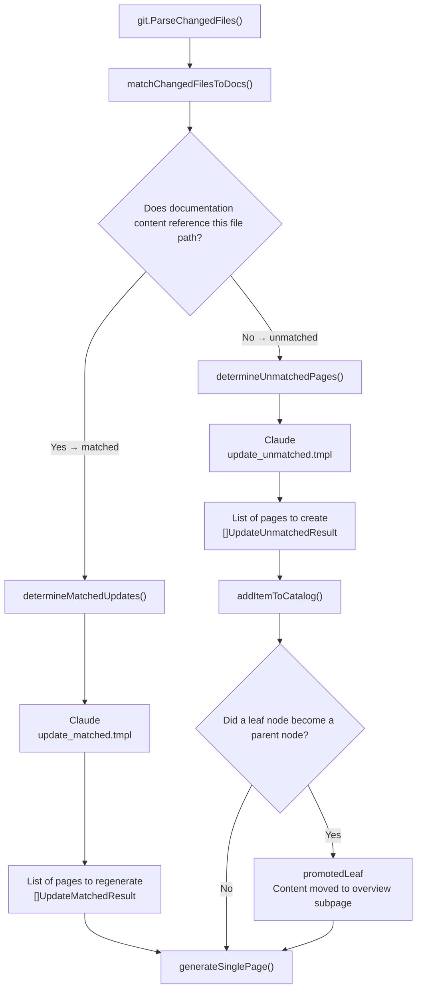
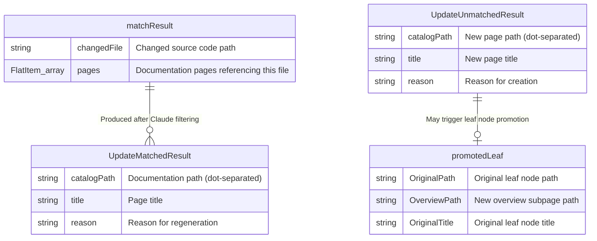
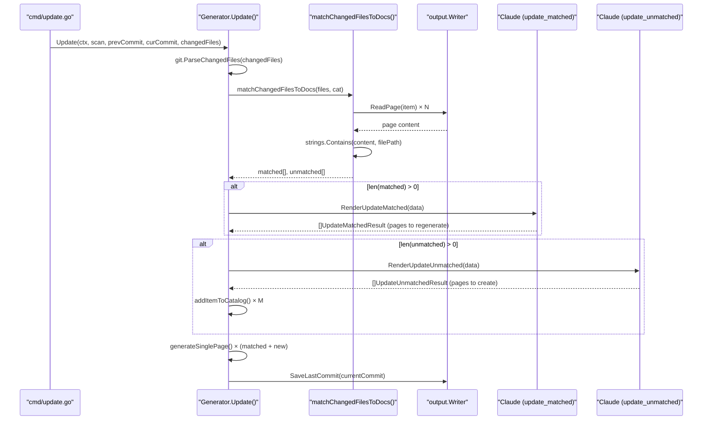

# Affected Page Determination Logic

During `selfmd update` execution, the system needs to determine which documentation pages should be updated and which new pages need to be created, using two separate paths. This page explains the implementation and flow of this determination logic.

## Overview

After git diff returns a set of changed files, the `Update()` function does not blindly regenerate all documentation. Instead, it employs a **two-phase determination strategy**:

1. **Text matching (exact match)**: First searches existing documentation content to see if changed source file paths are directly referenced, classifying changed files into "matched" and "unmatched" categories.
2. **Claude AI semantic judgment**: Calls Claude separately for both categories, having the AI read the actual changes and make final decisions — which matched pages truly need updating? Which unmatched files need new pages created?

The core principle of this design is "conservative updates": regeneration is only triggered when code changes genuinely affect the behavior, architecture, or API described in the documentation.

---

## Architecture

### Overall Determination Flow



### Data Type Relationships



---

## Phase 1: Text Matching (matchChangedFilesToDocs)

`matchChangedFilesToDocs()` performs initial filtering by searching whether existing documentation page content contains the path string of each changed file.

```go
// For each changed file, find which pages reference it
for _, f := range files {
    var matchedPages []catalog.FlatItem
    for _, item := range items {
        content, ok := pageContents[item.Path]
        if !ok {
            continue
        }
        if strings.Contains(content, f.Path) {
            matchedPages = append(matchedPages, item)
        }
    }

    if len(matchedPages) > 0 {
        matched = append(matched, matchResult{
            changedFile: f.Path,
            pages:       matchedPages,
        })
    } else {
        unmatched = append(unmatched, f.Path)
    }
}
```

> Source: internal/generator/updater.go#L191-L213

**Key design decisions**:

- Uses `strings.Contains(content, f.Path)` for string matching rather than glob or regex — simple and reliable
- Pre-reads all page content into a `pageContents` map to avoid repeated I/O
- A single changed file can match multiple documentation pages; the same page can also be matched by multiple changed files (deduplicated later)

---

## Phase 2A: Determining Whether Matched Pages Need Updating (determineMatchedUpdates)

For "matched" files, `determineMatchedUpdates()` constructs a prompt containing the list of changed files and summaries of affected pages, then passes it to Claude for judgment.

### Prompt Data Assembly

```go
data := prompt.UpdateMatchedPromptData{
    RepositoryName: g.Config.Project.Name,
    Language:       g.Config.Output.Language,
    ChangedFiles:   changedFilesList.String(),
    AffectedPages:  affectedPagesInfo.String(),
}

rendered, err := g.Engine.RenderUpdateMatched(data)
```

> Source: internal/generator/updater.go#L257-L265

`AffectedPages` contains the title, catalogPath, and a 500-character content preview (`content[:500] + "..."`) for each potentially affected page, helping Claude understand the current scope of the documentation.

### Claude's Judgment Criteria

`update_matched.tmpl` explicitly instructs Claude with the following rules:

| Needs Regeneration | Does Not Need Regeneration |
|-------------------|---------------------------|
| Function signature or API interface changes | Pure code style adjustments |
| Addition or removal of significant features | Internal refactoring that doesn't affect external behavior |
| Architecture or flow changes | Bug fixes with no behavior change |
| Configuration format or option changes | Comment or docstring changes |

> Source: internal/prompt/templates/zh-TW/update_matched.tmpl#L40-L46

### Claude Response Format

Claude returns the pages that need regeneration as a JSON array:

```go
type UpdateMatchedResult struct {
    CatalogPath string `json:"catalogPath"`
    Title       string `json:"title"`
    Reason      string `json:"reason"`
}
```

> Source: internal/generator/updater.go#L18-L22

The system then maps `CatalogPath` back to a `catalog.FlatItem`. If Claude returns a path that does not exist, a warning is logged and the entry is skipped:

```go
for _, r := range results {
    if item, ok := itemMap[r.CatalogPath]; ok {
        fmt.Printf("      → %s：%s\n", item.Title, r.Reason)
        pagesToRegen = append(pagesToRegen, item)
    } else {
        g.Logger.Warn("Claude returned a catalogPath that does not exist", "path", r.CatalogPath)
    }
}
```

> Source: internal/generator/updater.go#L296-L303

---

## Phase 2B: Determining Whether Unmatched Files Need New Pages (determineUnmatchedPages)

For "unmatched" changed files (not referenced in any existing documentation), `determineUnmatchedPages()` asks Claude: do these added or modified files represent functionality that warrants creating new documentation pages?

### Prompt Data Assembly

```go
data := prompt.UpdateUnmatchedPromptData{
    RepositoryName:  g.Config.Project.Name,
    Language:        g.Config.Output.Language,
    UnmatchedFiles:  fileList.String(),
    ExistingCatalog: existingCatalog,
    CatalogTable:    cat.BuildLinkTable(),
}
```

> Source: internal/generator/updater.go#L320-L327

`ExistingCatalog` is the full catalog JSON, and `CatalogTable` is a formatted page list (for display in the prompt), allowing Claude to understand the existing documentation structure when deciding where to place new pages.

### Claude's Judgment Criteria

| Needs a New Page | Does Not Need a New Page |
|-----------------|-------------------------|
| Implements an entirely new feature module or subsystem | Helper or utility files for existing modules |
| Adds a significant group of API endpoints | Test files |
| Introduces a new architectural component or design pattern | Minor bug fixes |
| Adds significant configuration or deployment mechanisms | Changes that logically belong within an existing page's scope |

> Source: internal/prompt/templates/zh-TW/update_unmatched.tmpl#L41-L51

---

## Leaf Node Promotion

When Claude decides to add a subpage under an existing leaf node (a documentation node with no children), the original leaf node must be converted into a parent node. The system handles this through `addItemToCatalog()`.

### Promotion Logic

```go
if len(item.Children) == 0 {
    // This is a leaf node that needs to become a parent.
    // Add an "overview" child to preserve the original content.
    (*children)[i].Children = append((*children)[i].Children, catalog.CatalogItem{
        Title: item.Title,
        Path:  "overview",
        Order: 0,
    })
    *promoted = &promotedLeaf{
        OriginalPath:  currentDotPath,
        OverviewPath:  currentDotPath + ".overview",
        OriginalTitle: item.Title,
    }
}
```

> Source: internal/generator/updater.go#L402-L415

After promotion, the existing content of the original leaf node is moved to the newly created `overview` subpage:

```go
if content, err := g.Writer.ReadPage(origItem); err == nil && content != "" {
    if err := g.Writer.WritePage(overviewItem, content); err != nil {
        g.Logger.Warn("Failed to move page to overview", "from", promoted.OriginalPath, "error", err)
    } else {
        fmt.Printf("      → Page promoted: %s original content moved to %s\n", promoted.OriginalPath, promoted.OverviewPath)
    }
}
```

> Source: internal/generator/updater.go#L109-L116

---

## Core Flow



---

## Usage Examples

### Running the Update Command

```bash
# Use the commit recorded from the last generate/update as the baseline
selfmd update

# Specify a starting commit
selfmd update --since abc1234
```

### Commit Baseline Selection Logic

```go
previousCommit := sinceCommit
if previousCommit == "" {
    // Try reading saved commit from last generate/update
    saved, readErr := gen.Writer.ReadLastCommit()
    if readErr == nil && saved != "" {
        previousCommit = saved
    } else {
        // Fallback to merge-base
        base, err := git.GetMergeBase(rootDir, cfg.Git.BaseBranch)
        // ...
        previousCommit = base
    }
}
```

> Source: cmd/update.go#L68-L82

Priority order: `--since` flag → commit saved from last generate/update → merge-base

### Changed File Filtering

```go
changedFiles = git.FilterChangedFiles(changedFiles, cfg.Targets.Include, cfg.Targets.Exclude)
```

> Source: cmd/update.go#L94

`FilterChangedFiles()` uses doublestar glob patterns to apply include/exclude filtering on the git diff output, ensuring only target files specified in the configuration trigger documentation updates.

---

## Related Links

- [Git Diff Change Detection](../change-detection/index.md)
- [Git Integration and Incremental Updates](../index.md)
- [Incremental Updates](../../core-modules/incremental-update/index.md)
- [Documentation Generation Pipeline](../../core-modules/generator/index.md)
- [Git Integration Configuration](../../configuration/git-config/index.md)
- [Prompt Template Engine](../../core-modules/prompt-engine/index.md)

---

## Reference Files

| File Path | Description |
|-----------|-------------|
| `internal/generator/updater.go` | Core logic for affected page determination (`matchChangedFilesToDocs`, `determineMatchedUpdates`, `determineUnmatchedPages`, `addItemToCatalog`) |
| `internal/git/git.go` | Git operation wrappers, including `ParseChangedFiles` and `FilterChangedFiles` |
| `cmd/update.go` | `selfmd update` command implementation, responsible for commit baseline selection and calling `Generator.Update()` |
| `internal/catalog/catalog.go` | Data structure definitions for `Catalog`, `FlatItem`, and `CatalogItem` |
| `internal/prompt/engine.go` | `UpdateMatchedPromptData`, `UpdateUnmatchedPromptData` data structures and `RenderUpdateMatched`, `RenderUpdateUnmatched` functions |
| `internal/prompt/templates/zh-TW/update_matched.tmpl` | Claude prompt template for determining "whether matched pages need regeneration" |
| `internal/prompt/templates/zh-TW/update_unmatched.tmpl` | Claude prompt template for determining "whether unmatched files need new pages" |