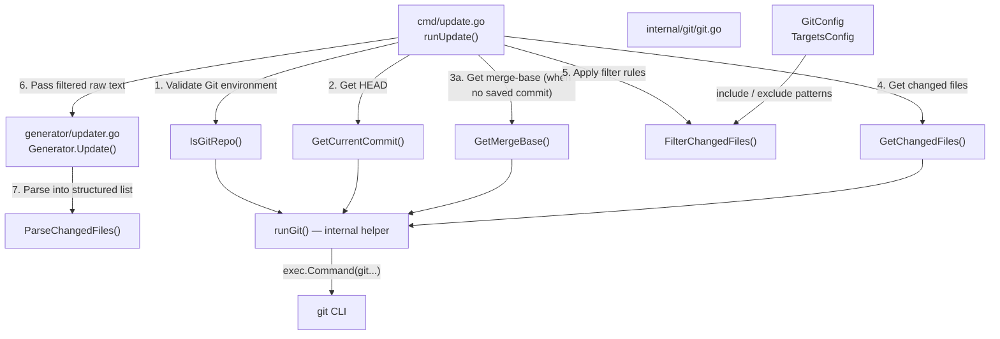
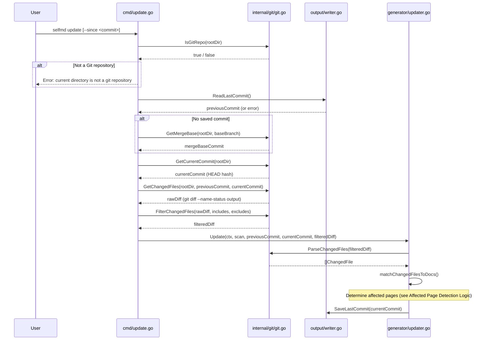
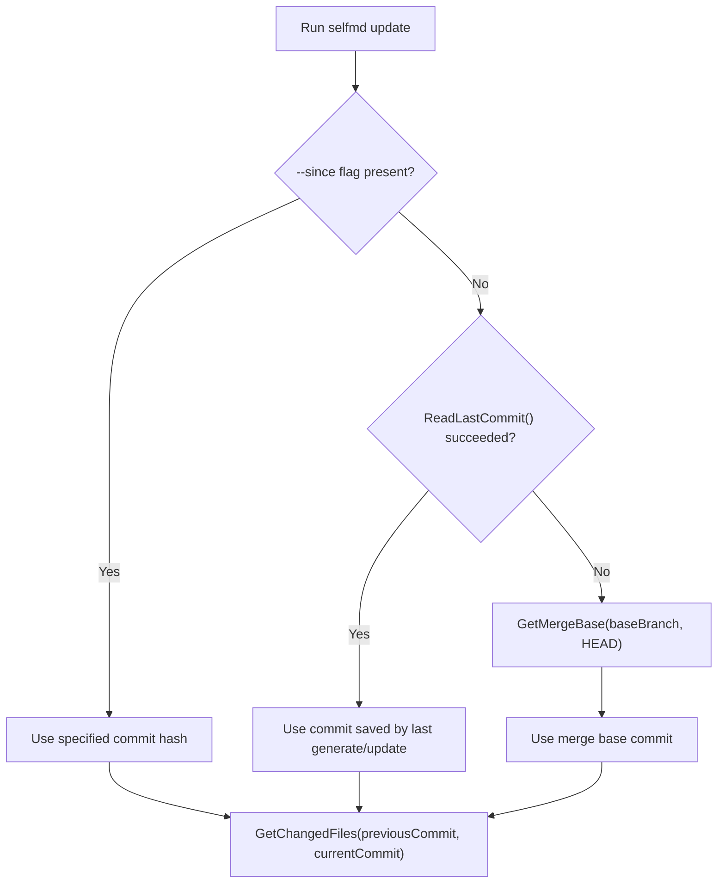

# Git Diff Change Detection

The `internal/git` package provides low-level functionality for interacting with the Git version control system. It is responsible for detecting file changes between two commits, and for parsing and filtering raw `git diff` output into structured data for use by the incremental update workflow.

## Overview

When `selfmd update` is executed, the system needs to know which source files have changed since the last documentation generation. The `internal/git` package handles this entirely:

- **Detect Git environment**: Confirm whether the current directory is a valid Git repository
- **Compare commit ranges**: Retrieve the list of changed files between two commits
- **Parse raw output**: Convert the text output of `git diff --name-status` into a structured `ChangedFile` list
- **Apply filter rules**: Filter out irrelevant files based on the `targets.include` and `targets.exclude` glob patterns from the config file
- **Provide commit queries**: Retrieve version information such as the HEAD commit hash and merge base

This package is intentionally kept pure — it only wraps Git CLI calls and contains no documentation generation logic. All complex logic for determining which documentation pages are affected is handled by the upper-layer `generator` package (`updater.go`).

---

## Architecture



---

## Core Data Structures

### `ChangedFile`

Represents a single file change record from `git diff --name-status` output.

```go
// ChangedFile represents a single file from git diff --name-status output.
type ChangedFile struct {
	Status string // "M", "A", "D", "R"
	Path   string
}
```

> Source: internal/git/git.go#L47-L51

| Field | Description |
|-------|-------------|
| `Status` | Change status. `M` = Modified, `A` = Added, `D` = Deleted, `R` = Renamed |
| `Path` | File path relative to the working directory; for renames, this is the **destination path** |

---

## Public Function Reference

### `IsGitRepo(dir string) bool`

Confirms whether the specified directory is inside a Git repository. Runs `git rev-parse --is-inside-work-tree` and uses the command's success or failure as the result.

```go
func IsGitRepo(dir string) bool {
	cmd := exec.Command("git", "rev-parse", "--is-inside-work-tree")
	cmd.Dir = dir
	err := cmd.Run()
	return err == nil
}
```

> Source: internal/git/git.go#L13-L18

---

### `GetCurrentCommit(dir string) (string, error)`

Returns the full commit hash (40 hexadecimal characters) of the current `HEAD`.

```go
func GetCurrentCommit(dir string) (string, error) {
	return runGit(dir, "rev-parse", "HEAD")
}
```

> Source: internal/git/git.go#L21-L23

---

### `GetMergeBase(dir, baseBranch string) (string, error)`

Finds the most recent common ancestor commit between the current branch and the specified base branch (`baseBranch`). Used as a fallback starting point for comparison when no previously saved commit is available.

```go
func GetMergeBase(dir, baseBranch string) (string, error) {
	return runGit(dir, "merge-base", baseBranch, "HEAD")
}
```

> Source: internal/git/git.go#L26-L28

---

### `GetChangedFiles(dir, fromCommit, toCommit string) (string, error)`

Retrieves the raw text output of all changed files between two commits (`git diff --relative --name-status fromCommit..toCommit`).

The `--relative` flag ensures paths are relative to the working directory rather than the Git repository root, which is especially important in subdirectory projects.

```go
func GetChangedFiles(dir, fromCommit, toCommit string) (string, error) {
	return runGit(dir, "diff", "--relative", "--name-status", fromCommit+".."+toCommit)
}
```

> Source: internal/git/git.go#L32-L34

**Example output:**

```
M	internal/git/git.go
A	internal/scanner/scanner.go
D	cmd/old.go
R100	cmd/old_name.go	cmd/new_name.go
```

---

### `GetChangedFilesSince(dir, sinceCommit string) (string, error)`

Retrieves all changes from the specified commit to `HEAD`. A convenience wrapper around `GetChangedFiles` that fixes `HEAD` as the end point.

```go
func GetChangedFilesSince(dir, sinceCommit string) (string, error) {
	return runGit(dir, "diff", "--relative", "--name-status", sinceCommit+"..HEAD")
}
```

> Source: internal/git/git.go#L38-L40

---

### `ParseChangedFiles(changedFiles string) []ChangedFile`

Parses the raw text output of `git diff --name-status` into a structured `[]ChangedFile` list.

```go
func ParseChangedFiles(changedFiles string) []ChangedFile {
	var result []ChangedFile
	for _, line := range strings.Split(changedFiles, "\n") {
		line = strings.TrimSpace(line)
		if line == "" {
			continue
		}
		parts := strings.SplitN(line, "\t", 3)
		if len(parts) < 2 {
			continue
		}
		status := string(parts[0][0]) // "M", "A", "D", or "R" (R100 → R)
		path := parts[len(parts)-1]   // for renames, use destination path
		result = append(result, ChangedFile{Status: status, Path: path})
	}
	return result
}
```

> Source: internal/git/git.go#L54-L70

**Parsing rules:**

- Each line is tab (`\t`) delimited and split into at most 3 parts (to handle the rename format `R100\told\tnew`)
- The status code uses only the first character (`R100` → `R`)
- The path uses the last field (the destination path for renames)

---

### `FilterChangedFiles(changedFiles string, includes, excludes []string) string`

Filters the raw text output of `git diff --name-status` according to the glob patterns defined in `targets.include` and `targets.exclude`, returning the matching raw text in the same format.

```go
func FilterChangedFiles(changedFiles string, includes, excludes []string) string {
	lines := strings.Split(changedFiles, "\n")
	var filtered []string

	for _, line := range lines {
		// ...
		// Check excludes
		excluded := false
		for _, pattern := range excludes {
			if matched, _ := doublestar.Match(pattern, filePath); matched {
				excluded = true
				break
			}
		}
		// Check includes (if configured)
		if len(includes) > 0 {
			included := false
			for _, pattern := range includes {
				if matched, _ := doublestar.Match(pattern, filePath); matched {
					included = true
					break
				}
			}
			if !included {
				continue
			}
		}
		filtered = append(filtered, line)
	}
	return strings.Join(filtered, "\n")
}
```

> Source: internal/git/git.go#L73-L122

**Filter priority:**

1. `excludes` are applied first: a file matching any exclude pattern is excluded
2. `includes` are applied next: if configured, a file not matching any include pattern is excluded
3. If `includes` is empty, no restriction is applied (all non-excluded files are allowed)

Glob pattern matching uses the [`doublestar`](https://github.com/bmatcuk/doublestar) package, which supports `**` double-star wildcards.

---

## Core Workflow

The following is the complete operational sequence of Git change detection when `selfmd update` runs:



---

## Comparison Starting Point Selection Logic

The incremental comparison starting point for `selfmd update` is determined by the following priority order:



| Scenario | Source of comparison starting point |
|----------|-------------------------------------|
| First update, `generate` has been run before | Commit saved in `.doc-build/.last-commit` |
| Using the `--since` flag | User-specified commit hash |
| No saved record (fallback) | `git merge-base <baseBranch> HEAD` |

---

## Configuration Parameters

The behavior of Git change detection is controlled by the following sections in `selfmd.yaml`:

```yaml
git:
  enabled: true
  base_branch: main   # Base branch name for GetMergeBase()

targets:
  include:
    - "src/**"
    - "internal/**"
  exclude:
    - "vendor/**"
    - "**/*.pb.go"
    - ".doc-build/**"
```

Corresponding Go struct:

```go
type GitConfig struct {
	Enabled    bool   `yaml:"enabled"`
	BaseBranch string `yaml:"base_branch"`
}
```

> Source: internal/config/config.go#L91-L94

---

## Usage Example

The following is a complete excerpt from `cmd/update.go` showing the full Git detection workflow call:

```go
if !git.IsGitRepo(rootDir) {
    return fmt.Errorf("當前目錄不是 git 倉庫，無法執行增量更新")
}

// Determine comparison commit
previousCommit := sinceCommit
if previousCommit == "" {
    saved, readErr := gen.Writer.ReadLastCommit()
    if readErr == nil && saved != "" {
        previousCommit = saved
    } else {
        base, err := git.GetMergeBase(rootDir, cfg.Git.BaseBranch)
        if err != nil {
            return fmt.Errorf("無法取得基準 commit: %w\n提示：先執行 selfmd generate 或使用 --since 指定 commit", err)
        }
        previousCommit = base
    }
}

currentCommit, err := git.GetCurrentCommit(rootDir)
// ...

changedFiles, err := git.GetChangedFiles(rootDir, previousCommit, currentCommit)
// ...

changedFiles = git.FilterChangedFiles(changedFiles, cfg.Targets.Include, cfg.Targets.Exclude)
```

> Source: cmd/update.go#L49-L99

---

## Related Links

- [Git Integration and Incremental Updates](../index.md)
- [Affected Page Detection Logic](../affected-pages/index.md)
- [Incremental Updates](../../core-modules/incremental-update/index.md)
- [selfmd update Command](../../cli/cmd-update/index.md)
- [Git Integration Configuration](../../configuration/git-config/index.md)

---

## Reference Files

| File Path | Description |
|-----------|-------------|
| `internal/git/git.go` | Complete implementation of the Git package: IsGitRepo, GetCurrentCommit, GetMergeBase, GetChangedFiles, GetChangedFilesSince, ParseChangedFiles, FilterChangedFiles, runGit |
| `cmd/update.go` | Implementation of the `selfmd update` command, demonstrating the complete Git package call flow |
| `internal/config/config.go` | `GitConfig` and `TargetsConfig` struct definitions; configuration parameters that control change detection behavior |
| `internal/generator/updater.go` | Consumer of `Generator.Update()` and `ParseChangedFiles()`; responsible for converting the changed file list into affected documentation pages |