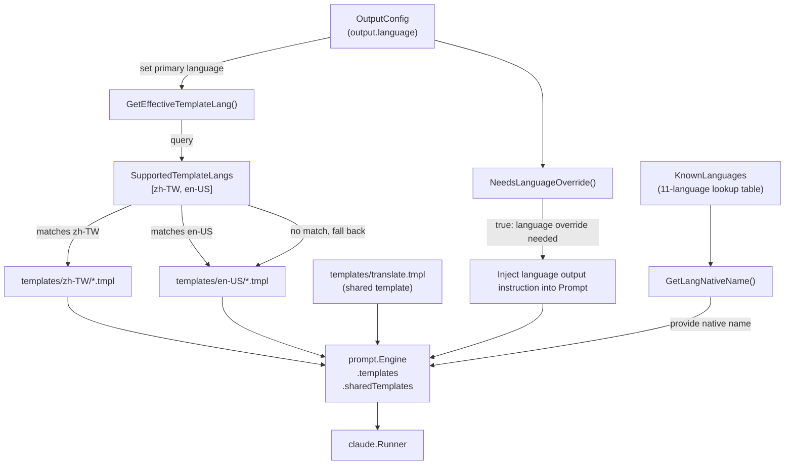
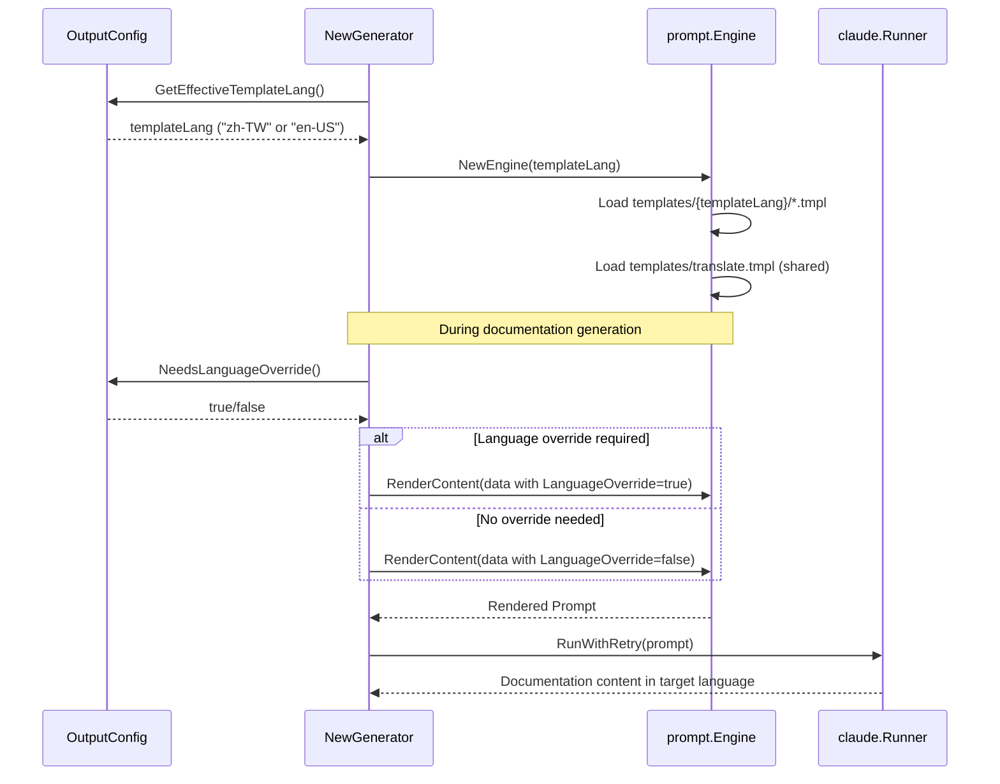

# Supported Languages and Templates

selfmd supports multilingual documentation generation through a two-layer language architecture: **output language** (11 languages) determines the language of the documentation content, and **template language** (2 languages) determines the language used in Prompt instructions.

## Overview

selfmd's multilingual support operates at two levels:

- **Output Language**: The language in which the final documentation is presented. Configured via `output.language` (primary language) and `output.secondary_languages` (list of secondary languages) in `selfmd.yaml`. The system currently defines 11 known languages.
- **Template Language**: The language used in Prompt instructions received by the Claude CLI. Only `zh-TW` and `en-US` have built-in template folders; all other languages automatically fall back to the `en-US` template and inject explicit language output instructions into the Prompt via the **LanguageOverride** mechanism.

This design allows selfmd to support far more output languages than the number of available templates, without requiring a complete set of Prompt templates for every language.

## Architecture



## Known Language List

The system defines 11 language codes and their native names in the `KnownLanguages` lookup table:

```go
var KnownLanguages = map[string]string{
    "zh-TW": "繁體中文",
    "zh-CN": "简体中文",
    "en-US": "English",
    "ja-JP": "日本語",
    "ko-KR": "한국어",
    "fr-FR": "Français",
    "de-DE": "Deutsch",
    "es-ES": "Español",
    "pt-BR": "Português",
    "th-TH": "ไทย",
    "vi-VN": "Tiếng Việt",
}
```

> Source: internal/config/config.go#L39-L51

| Language Code | Native Name | Built-in Template | Notes |
|--------------|-------------|-------------------|-------|
| `zh-TW` | 繁體中文 | ✅ | Default primary language |
| `en-US` | English | ✅ | Template fallback language |
| `zh-CN` | 简体中文 | ❌ | Uses en-US template + LanguageOverride |
| `ja-JP` | 日本語 | ❌ | Uses en-US template + LanguageOverride |
| `ko-KR` | 한국어 | ❌ | Uses en-US template + LanguageOverride |
| `fr-FR` | Français | ❌ | Uses en-US template + LanguageOverride |
| `de-DE` | Deutsch | ❌ | Uses en-US template + LanguageOverride |
| `es-ES` | Español | ❌ | Uses en-US template + LanguageOverride |
| `pt-BR` | Português | ❌ | Uses en-US template + LanguageOverride |
| `th-TH` | ไทย | ❌ | Uses en-US template + LanguageOverride |
| `vi-VN` | Tiếng Việt | ❌ | Uses en-US template + LanguageOverride |

## Built-in Template Folders

Currently only `zh-TW` and `en-US` have complete template folders:

```go
var SupportedTemplateLangs = []string{"zh-TW", "en-US"}
```

> Source: internal/config/config.go#L54

Each language folder contains the following template files:

```
internal/prompt/templates/
├── zh-TW/
│   ├── catalog.tmpl          # Documentation catalog generation Prompt
│   ├── content.tmpl          # Content page generation Prompt
│   ├── updater.tmpl          # Incremental update Prompt (legacy)
│   ├── update_matched.tmpl   # Affected page detection Prompt
│   └── update_unmatched.tmpl # New page addition detection Prompt
├── en-US/
│   ├── catalog.tmpl
│   ├── content.tmpl
│   ├── updater.tmpl
│   ├── update_matched.tmpl
│   └── update_unmatched.tmpl
└── translate.tmpl            # Translation Prompt (shared across all languages)
```

### Template Purpose Reference

| Template File | Corresponding Method | Purpose |
|--------------|---------------------|---------|
| `catalog.tmpl` | `Engine.RenderCatalog()` | Instructs Claude to analyze the project and generate the documentation catalog structure |
| `content.tmpl` | `Engine.RenderContent()` | Instructs Claude to write a Wiki page for a specific catalog entry |
| `updater.tmpl` | `Engine.RenderUpdater()` | Incremental update (legacy, kept for reference) |
| `update_matched.tmpl` | `Engine.RenderUpdateMatched()` | Determines which existing pages need to be regenerated due to code changes |
| `update_unmatched.tmpl` | `Engine.RenderUpdateUnmatched()` | Determines whether changed files not covered by existing documentation need new pages |
| `translate.tmpl` | `Engine.RenderTranslate()` | Translates documentation pages (shared across all languages, regardless of template language) |

### Shared Template: translate.tmpl

The translation template is the only shared template (not tied to any language folder). It is written in English and dynamically injects source and target language information via `TranslatePromptData`:

```go
type TranslatePromptData struct {
    SourceLanguage     string // e.g., "zh-TW"
    SourceLanguageName string // e.g., "繁體中文"
    TargetLanguage     string // e.g., "en-US"
    TargetLanguageName string // e.g., "English"
    SourceContent      string // full Markdown content to translate
}
```

> Source: internal/prompt/engine.go#L97-L104

## Template Language Selection Mechanism

### GetEffectiveTemplateLang()

When the system initializes `prompt.Engine`, this method is called to determine which language folder's templates to load. If the configured primary language has a corresponding template, that language is used; otherwise it falls back to `en-US`:

```go
func (o *OutputConfig) GetEffectiveTemplateLang() string {
    for _, lang := range SupportedTemplateLangs {
        if o.Language == lang {
            return o.Language
        }
    }
    return "en-US"
}
```

> Source: internal/config/config.go#L58-L65

### NeedsLanguageOverride()

When the template language (`en-US`) does not match the actual configured output language (e.g., `ja-JP`), this method returns `true` and the system injects explicit language output instructions into the Prompt:

```go
func (o *OutputConfig) NeedsLanguageOverride() bool {
    return o.GetEffectiveTemplateLang() != o.Language
}
```

> Source: internal/config/config.go#L69-L71

### Effect of LanguageOverride in the Prompt

Using `content.tmpl` (en-US version) as an example, when `LanguageOverride` is `true`, the template appends a forced language instruction to the project information section:

```
{{- if .LanguageOverride}}
- **Document Language**: {{.LanguageOverrideName}} ({{.Language}})
- **IMPORTANT**: All documentation content MUST be written in **{{.LanguageOverrideName}}** ({{.Language}}).
{{- else}}
- **Document Language**: {{.LanguageName}} ({{.Language}})
{{- end}}
```

> Source: internal/prompt/templates/en-US/content.tmpl#L20-L27

## Navigation Page Localization

In addition to Prompt templates, when the system generates navigation pages (home page, sidebar, category index), it displays UI strings corresponding to the language. Currently `UIStrings` directly supports `zh-TW` and `en-US`; all other languages fall back to `en-US`:

```go
var UIStrings = map[string]map[string]string{
    "zh-TW": {
        "techDocs":        "技術文件",
        "catalog":         "目錄",
        "home":            "首頁",
        "sectionContains": "本章節包含以下內容：",
        "autoGenerated":   "本文件由 [selfmd](https://github.com/monkenwu/selfmd) 自動產生",
    },
    "en-US": {
        "techDocs":        "Technical Documentation",
        "catalog":         "Table of Contents",
        "home":            "Home",
        "sectionContains": "This section contains the following:",
        "autoGenerated":   "This documentation was automatically generated by [selfmd](https://github.com/monkenwu/selfmd)",
    },
}
```

> Source: internal/output/navigation.go#L12-L27

## Core Flow



## Usage Examples

### Setting Primary Language to Japanese (No Built-in Template)

```yaml
output:
  language: ja-JP
  secondary_languages:
    - en-US
    - zh-TW
```

System behavior:
1. `GetEffectiveTemplateLang()` returns `"en-US"` (fallback)
2. `NeedsLanguageOverride()` returns `true`
3. Injected into Prompt: "All documentation content must be written in 日本語 (ja-JP)"
4. `GetLangNativeName("ja-JP")` returns `"日本語"` for use in the Prompt

### Getting a Language's Native Name

```go
func GetLangNativeName(code string) string {
    if name, ok := KnownLanguages[code]; ok {
        return name
    }
    return code
}
```

> Source: internal/config/config.go#L75-L80

If an unknown language code (e.g., `"ru-RU"`) is passed in, the function returns the code itself (`"ru-RU"`) without error.

### Translation Command Usage Example

```go
data := prompt.TranslatePromptData{
    SourceLanguage:     sourceLang,
    SourceLanguageName: sourceLangName,
    TargetLanguage:     targetLang,
    TargetLanguageName: targetLangName,
    SourceContent:      sourceContent,
}
rendered, err := g.Engine.RenderTranslate(data)
```

> Source: internal/generator/translate_phase.go#L186-L194

## Related Links

- [Multilingual Support (Overview)](../index.md)
- [Translation Workflow](../translation-workflow/index.md)
- [Output and Multilingual Configuration](../../configuration/output-language/index.md)
- [selfmd translate Command](../../cli/cmd-translate/index.md)
- [Prompt Template Engine](../../core-modules/prompt-engine/index.md)
- [Translation Phase](../../core-modules/generator/translate-phase/index.md)

## Reference Files

| File Path | Description |
|-----------|-------------|
| `internal/config/config.go` | Definitions for `KnownLanguages`, `SupportedTemplateLangs`, `GetEffectiveTemplateLang()`, `NeedsLanguageOverride()`, and `GetLangNativeName()` |
| `internal/prompt/engine.go` | `Engine` struct, `NewEngine()`, all `Render*()` methods, and `TranslatePromptData` definition |
| `internal/prompt/templates/zh-TW/catalog.tmpl` | Traditional Chinese catalog generation Prompt template |
| `internal/prompt/templates/zh-TW/content.tmpl` | Traditional Chinese content page generation Prompt template |
| `internal/prompt/templates/zh-TW/update_matched.tmpl` | Traditional Chinese affected page detection Prompt template |
| `internal/prompt/templates/zh-TW/update_unmatched.tmpl` | Traditional Chinese new page addition detection Prompt template |
| `internal/prompt/templates/zh-TW/updater.tmpl` | Traditional Chinese incremental update Prompt template (legacy) |
| `internal/prompt/templates/en-US/catalog.tmpl` | English catalog generation Prompt template |
| `internal/prompt/templates/en-US/content.tmpl` | English content page generation Prompt template (includes LanguageOverride logic) |
| `internal/prompt/templates/translate.tmpl` | Shared translation Prompt template (all languages) |
| `internal/output/navigation.go` | `UIStrings` navigation page localization strings and `getUIStrings()` fallback logic |
| `internal/generator/pipeline.go` | `GetEffectiveTemplateLang()` call within `NewGenerator()` |
| `internal/generator/translate_phase.go` | Translation pipeline, `TranslateOptions`, and `translatePages()` |
| `cmd/translate.go` | `selfmd translate` command implementation and target language validation logic |